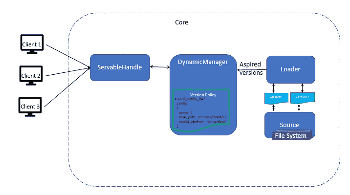
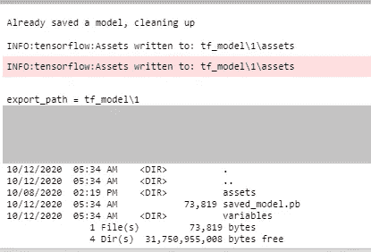
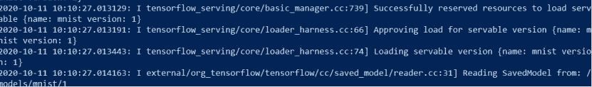
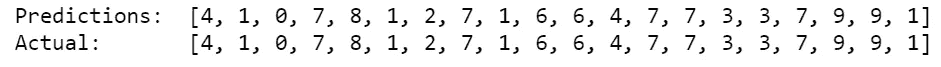

# 轻松将 TensorFlow 模型部署到生产环境中。

> 原文：<https://towardsdatascience.com/deploying-a-tensorflow-model-to-production-made-easy-4736b2437103?source=collection_archive---------11----------------------->

## 使用 TensorFlow 服务将深度学习模型部署到生产中。

***学习使用 TensorFlow 服务将 TensorFlow 模型逐步部署到生产中。***

您使用 Tensorflow 创建了一个深度学习模型，对模型进行了微调以获得更好的准确性和精确度，现在想要将您的模型部署到生产中，供用户使用它来进行预测。

***将您的模型投入生产的最佳方式是什么？***

> 快速、灵活地部署 TensorFlow 深度学习模型的方法是使用高性能和高度可扩展的服务系统——tensor flow 服务

TensorFlow 服务使您能够

*   **轻松管理您的模型的多个版本，如实验版或稳定版。**
*   **保持您的服务器架构和 API 不变**
*   **动态发现 TensorFlow 流模型的新版本，并使用一致的 API 结构**[**gRPC**](https://www.grpc.io/)**(远程过程协议)为其服务**。
*   **所有客户通过集中模型位置进行推理的一致体验**

***tensor flow 服务的哪些组件使部署到生产变得容易？***



张量流服务架构

TF 服务的主要组成部分包括

*   **Servables**:**Servable 是一个底层对象，客户端使用它来执行计算或推理**。TensorFlow 服务将深度学习模型表示为一个或多个服务对象。
*   **加载器** : **管理服务程序的生命周期**，因为服务程序不能管理自己的生命周期。加载器**标准化用于加载和卸载服务的 API，**独立于特定的学习算法。
*   **Source** : **寻找并提供 servable，然后为 servable 的每个版本提供一个 Loader 实例。**
*   **管理者** : **管理服务对象的整个生命周期:加载服务对象，服务服务对象，卸载服务对象**。
*   **TensorFlow Core:通过将加载程序和可服务程序作为不透明对象来管理可服务程序的生命周期和指标**

假设您有一个模型的两个不同版本，版本 1 和版本 2。

*   客户端通过显式地指定模型的版本或者仅仅请求模型的最新版本来进行 API 调用。
*   管理器监听源代码，并跟踪 Servable 的所有版本；然后，它应用已配置的版本策略来确定应该加载或卸载哪个版本的模型，然后让我们加载适当的版本。
*   加载器包含加载 Servable 的所有元数据。
*   源插件将为 Servable 的每个版本创建一个 Loader 实例。
*   源对管理器进行回调，通知加载器的期望版本被加载，并将其提供给客户端。
*   每当源检测到 Servable 的新版本时，它会创建一个加载器，指向磁盘上的 Servable。

***如何在 Windows 10 上部署使用 Tensorflow 服务的深度学习模型？***

对于 Windows 10，我们将使用 TensorFlow 服务图像。

## 第一步:[安装 Docker App](https://docs.docker.com/docker-for-windows/install-windows-home/)

## 步骤 2:提取 TensorFlow 服务图像

```
**docker pull tensorflow/serving**
```

一旦你有了张量流服务图像

*   端口 8500 对 gRPC 开放
*   端口 8501 是为 REST API 公开的
*   可选环境变量`**MODEL_NAME**`(默认为`model`)
*   可选环境变量`**MODEL_BASE_PATH**`(默认为`/models`)

## 步骤 3:创建并训练模型

这里，我从张量流数据集中提取了 MNIST 数据集

```
#Importing required libraries
**import os
import json
import tempfile
import requests
import numpy as np
import tensorflow as tf
import tensorflow_datasets as tfds**#Loading MNIST train and test dataset
#as_supervised=True, will return tuple instead of a dictionary for image and label
**(ds_train, ds_test), ds_info = tfds.load("mnist", split=['train','test'], with_info=True, as_supervised=True)**#to select the 'image' and 'label' using indexing coverting train and test dataset to a numpy array
**array = np.vstack(tfds.as_numpy(ds_train))
X_train = np.array(list(map(lambda x: x[0], array)))
y_train = np.array(list(map(lambda x: x[1], array)))
X_test = np.array(list(map(lambda x: x[0], array)))
y_test = np.array(list(map(lambda x: x[1], array)))**#setting batch_size and epochs
**epoch=10
batch_size=128**#Creating input data pipeline for train and test dataset
# Function to normalize the images**def normalize_image(image, label):
  #Normalizes images from uint8` to float32
  return tf.cast(image, tf.float32) / 255., label**# Input data pipeline for test dataset
#Normalize the image using map function then cache and shuffle the #train dataset 
# Create a batch of the training dataset and then prefecth for #overlapiing image preprocessing(producer) and model execution work #(consumer)**ds_train = ds_train.map(
    normalize_img, num_parallel_calls=tf.data.experimental.AUTOTUNE)
ds_train = ds_train.cache()
ds_train = ds_train.shuffle(ds_info.splits['train'].num_examples)
ds_train = ds_train.batch(batch_size)
ds_train = ds_train.prefetch(tf.data.experimental.AUTOTUNE)**# Input data pipeline for test dataset (No need to shuffle the test #dataset)
**ds_test = ds_test.map(
    normalize_image, num_parallel_calls=tf.data.experimental.AUTOTUNE)
ds_test = ds_test.batch(batch_size)
ds_test = ds_test.cache()
ds_test = ds_test.prefetch(tf.data.experimental.AUTOTUNE)**# Build the model
**model = tf.keras.models.Sequential([
  tf.keras.layers.Flatten(input_shape=(28, 28, 1)),
  tf.keras.layers.Dense(128,activation='relu'),
  tf.keras.layers.Dense(196, activation='softmax')
])**#Compile the model
**model.compile(
    loss='sparse_categorical_crossentropy',
    optimizer=tf.keras.optimizers.Adam(0.001),
    metrics=['accuracy'],)**#Fit the model
**model.fit(
    ds_train,
    epochs=epoch,
    validation_data=ds_test,
    verbose=2)**
```

## **第四步:保存模型**

通过将 save_format 指定为“tf”将模型保存到协议缓冲文件中。

```
**MODEL_DIR='tf_model'
version = "1"
export_path = os.path.join(MODEL_DIR, str(version))**#Save the model 
**model.save(export_path, save_format="tf")
print('\nexport_path = {}'.format(export_path))
!dir {export_path}**
```



当我们保存模型的一个版本时，我们可以看到包含文件的以下目录:

*   **Saved_model.pb** :包含一个或多个模型的序列化图形定义，以及作为 MetaGraphDef 协议缓冲区的模型元数据。权重和变量存储在单独的检查点文件中。
*   **变量**:保存标准训练检查点的文件

您可以使用***saved _ model _ CLI***命令检查模型。

```
**!saved_model_cli show --dir {export_path} --all**
```

## 步骤 5:使用 Tensorflow 服务为模型提供服务

打开 Windows Powershell 并执行以下命令来启动 TensorFlow 服务容器，以便使用 REST API 端口为 TensorFlow 模型提供服务。

```
**docker run -p 8501:8501 --mount type=bind,source=C:\TF_serving\tf_model,target=/models/mnist/ -e MODEL_NAME=mnist -t tensorflow/serving** 
```

用 Docker 成功服务 TensorFlow 模型。

*   使用-p 打开端口 8501 为模型提供服务
*   Mount 将绑定模型基路径，该路径应该是保存模型的容器位置的绝对路径。
*   通过指定 MODEL_NAME，客户端将用来调用的模型的名称
*   使用-t 选项分配一个伪终端“tensorflow/serving”



docker run 命令的输出

## 步骤 6:请求模型预测一个 REST

我们将创建一个 JSON 对象来传递预测数据。

```
#Create JSON Object
**data = json.dumps({“signature_name”: “serving_default”, “instances”: X_test[:20].tolist()})**
```

请求模型的 predict 方法作为对服务器的 REST 端点的 POST。

```
**headers = {"content-type": "application/json"}
json_response = requests.post('**[**http://localhost:8501/v1/models/mnist:predict'**](http://localhost:8501/v1/models/mnist:predict')**, data=data, headers=headers)****predictions = json.loads(json_response.text)['predictions']**
```

检验预测的准确性

```
**pred=[ np.argmax(predictions[p]) for p in range(len(predictions)) ]
print("Predictions: ",pred)
print("Actual:      ",y_test[:20].tolist())**
```



在下一篇文章中，我们将探索不同的模型服务器配置。

## 结论:

TensorFlow 服务是一种快速、灵活、高度可扩展且易于使用的方式，使用一致的 gRPC 或 REST APIs 为您的生产模型提供服务。

## 参考资料:

[](https://www.tensorflow.org/tfx/guide/serving) [## 服务模型| TFX | TensorFlow

### TensorFlow 服务是一个灵活、高性能的机器学习模型服务系统，专为生产…

www.tensorflow.org](https://www.tensorflow.org/tfx/guide/serving) 

[https://www . tensor flow . org/tfx/tutorials/serving/rest _ simple # make _ rest _ requests](https://www.tensorflow.org/tfx/tutorials/serving/rest_simple#make_rest_requests)