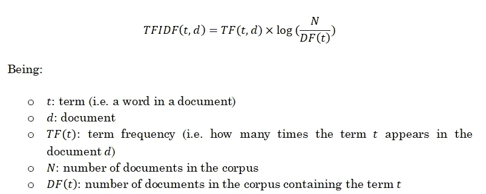

# 在 Python 中部署文本分类模型

> 原文：<https://towardsdatascience.com/deploying-a-text-classification-model-7ad2d23a556d?source=collection_archive---------18----------------------->


[来源](https://blog.kolide.com/kolide-launcher-making-it-easier-to-deploy-osquery-439cf814425c)

## [一个端到端的机器学习项目](https://towardsdatascience.com/tagged/an-end-to-end-ml-project)

## 学习使用 Dash 和 Heroku 部署基于机器学习的应用程序

本文是我介绍开发一个机器学习项目的整个过程**的系列文章的最后一篇。如果你还没有看过前面两篇文章，我强烈建议你在这里做[，在这里](/text-classification-in-python-dd95d264c802)[做](/web-scraping-news-articles-in-python-9dd605799558)。**

该项目包括创建一个实时 web 应用程序**,该应用程序从几家报纸收集数据，并显示新闻文章中讨论的不同主题的摘要。**

这是通过监督机器学习**分类模型**实现的，该模型能够预测给定新闻文章的类别，通过 **web 抓取方法**从报纸上获取最新新闻，通过交互式 **web 应用**向用户显示获取的结果。

正如我在本系列的第[篇](/text-classification-in-python-dd95d264c802)文章中解释的那样，我写这些文章的原因是因为我注意到，大多数时候，互联网、书籍或文献上发布的关于数据科学的内容都集中在以下方面:我们有一个带标签的数据集，我们训练模型以获得性能指标。这意味着数据标签或模型部署等关键概念被**忽略**。

然而，事实证明，机器学习和数据科学旨在**解决问题**和**提供有用的信息**。所以，拥有一个 99%准确率的模型却不知道如何利用它，会让我们意识到我们已经**失去了时间**。

这就是为什么在这一系列帖子中，我试图从头到尾涵盖**从头构建一个对最终用户有用的机器学习应用程序的所有必要步骤**，并为他们提供**有价值的见解或信息**。

所以，这个项目的整个开发过程被分成了三个不同的岗位:

*   分类模型训练([环节](/text-classification-in-python-dd95d264c802))
*   新闻文章网页抓取([链接](/web-scraping-news-articles-in-python-9dd605799558))
*   应用程序创建和部署(这篇文章)

GitHub 回购可以在[这里](https://github.com/miguelfzafra/Latest-News-Classifier)找到。它包括所有的代码和一个完整的报告。

在[第一篇](/text-classification-in-python-dd95d264c802)文章中，我们用 Python 开发了**文本分类模型**，它允许我们获得某篇新闻文章文本，并以整体良好的准确性预测其类别。

在第二篇文章中，我们创建了一个脚本，**从不同的报纸上搜集**最新的新闻文章并存储文本。

在这篇文章中，我们将把所有的部分放在一起，并部署我们的机器学习模型，以便它可以为最终用户提供**有用的**、**方便的**和**实时洞察**。我们将遵循以下步骤:

*   部署前的考虑事项
*   Dash web 应用程序的创建
*   与 Heroku 一起部署
*   最后的想法

# 部署前的考虑事项

## 数据

此时，我们已经使用包含 2004 年至 2005 年新闻文章的数据集训练了一个机器学习模型。我们现在的目的是将该模型应用于**实时**、**当前**数据。

很容易理解，这可能是我们的 web 应用程序的第一个限制,我们将通过一个简单的例子来了解它:假设我们运行我们的 web 应用程序，并尝试对一篇谈论 iPhone 11 新发布的文章进行分类，并关注其令人惊叹的最先进的功能，如视网膜显示屏、5G 网络支持等…


[来源](https://www.xataka.com/analisis/iphone-11-analisis-caracteristicas-precio-especificaciones)

如果我们回顾 2004 年，最畅销的手机之一是这个:


[来源](https://www.xatakamovil.com/xatakamovil/cinco-moviles-que-marcaron-el-ano-2004)

因此，我们在当前数据中发现的许多术语很可能在 2004 年甚至还不存在，因此也不存在于我们的数据集中。

例如，这是我们样本中一篇文章的摘录:

> 成千上万的人排了几个小时的队，只为买到运送给零售商的 20 万台 PSP 中的一台。这款掌上游戏机可以玩游戏、听音乐和看电影，明年将在欧洲和北美上市。尽管需求旺盛，索尼表示不会增加计划在年底前发货的 50 万台 PSP 的库存。

你们中的一些人甚至不会记得这个便携式游戏机！

我希望这能让下面的陈述变得简单明了:**我们用于训练的数据和我们将在部署后输入模型的数据越相似，就越好**。

如果两个阶段的数据不相似，我们将解决所谓的**数据不匹配问题**。而且，虽然我知道这听起来可能太明显了，但在实践中，我见过很多没有考虑这个问题的模型，这可能导致实时数据的性能非常差，即使我们有一个非常好的训练数据，并因此导致一个**无用的应用**。

我们如何解决这个问题？在训练我们的模型时，我们应该通过花费大量时间创建特征或者通过超参数调整来获得更高的精度吗？你猜对了:**没有**。解决这个问题的唯一方法是使用更新的语料库来训练模型。这里没有神奇的机器学习可以提供。

## **特性**

为了将我们的原始文本文章转换为可以输入到机器学习模型中的数字，我们首先通过几个步骤清理文本:删除停用词、词条分类等。之后，我们应用了一个 *TF-IDF* 矢量化功能将文本转换为数字特征。

因此，当我们部署了我们的应用程序并从报纸上获取了新的文本时，我们将需要转换原始文本**，就像我们转换**一样。

例如，我们使用了 NLTK 中预先构建的停用词向量。这意味着当我们运行我们的 web 应用程序时，我们将需要以某种方式获得这个向量，以便可以删除这些单词。

关于 *TF-IDF* 矢量化，我们在这里有一个重要的观点:正如我们在[第一篇](/text-classification-in-python-dd95d264c802)文章中看到的，这个矢量化工具为文档 *d、*中的术语 *t* 计算该术语在该文档中的频率以及逆文档频率，这表示该术语是否在语料库中出现了很多(因此它是一个常用术语)或者没有出现(并且它是一个不常用术语，因此它有点“重要”)。



来源:自己创作

需要注意的是，我们所指的这个语料库是**训练语料库**。这意味着，当从 web 抓取过程中获取一篇新闻文章时，将只在该文章中计算术语频率，但将在训练语料库中计算逆文档频率。

因此，正如与最新 iPhone 相关的现代单词所发生的那样，如果我们从我们的实时数据中获得一个不在训练语料库中的单词，**我们将无法**计算 TF-IDF 分数。它将被忽略。我们再次看到了**数据不匹配问题**的重要性。

## **环境**

我们一会儿会谈到它，但基本上我们的 web 应用程序将包含一个 python 脚本，它将被执行并向我们提供结果。因此，正如 NLTK 停用词向量所发生的那样，我们将需要创建一个环境，在这个环境中，脚本可以被执行，并且拥有**所有可用的必要依赖项**:从基本库(sklearn、numpy 等等)到训练模型、TF-IDF 向量器等等…

## **用户体验**

最后，我们需要关注用户体验。因此，举个例子，如果我们花了 2 分钟从某份报纸上抓取最新的 5 篇文章，我们可能不应该把它作为用户的一个选项。

一旦我们总结了部署模型时需要考虑的所有事情，很明显，只关注在训练集中获得良好的准确性而不考虑所有这些因素会导致我们成为无用的 web 应用程序。

讨论完这些问题后，我们将看看如何用 **Dash** 创建应用程序，并用 **Heroku** 部署它。Dash 和 Heroku 有非常好的文档，所以我不会在这里花太多时间讨论技术细节。任何人都可以在几个小时内学会这两种方法，我认为我们一直在讨论的方法学问题更有价值。

# **Dash web 应用程序的创建**

Dash 是一个用于构建 web 应用程序的高效 Python 框架。它是基于 Flask、Plotly.js 和 React.js 编写的，使用起来非常简单，但效果惊人。在 Dash 网页上有一个非常好的[教程](https://dash.plot.ly/)，它涵盖了从零开始创建一个 web 应用程序，解释了每一个步骤:安装、**布局**(定义了我们的应用程序的外观)、**回调**(定义了“发生的事情”)以及一些高级概念，这些概念将让我们按照我们想要的那样构建应用程序。

为了创建 web 应用程序的代码，我们可以在本地执行它，应用程序将显示在浏览器中。通过这种方式，我们可以在部署应用程序之前进行简单的更改并构建我们想要的应用程序。

我的 web 应用程序下的代码可以在这里找到[。](/text-classification-in-python-dd95d264c802)

在我们准备好代码之后，最后一步是**部署**应用程序。

# **与 Heroku 一起部署**

有许多平台允许我们部署 web 应用程序。两个好的是 Dash Enterprise 和 Heroku。我使用 Heroku 是因为你可以免费部署一个应用程序(有一些限制)，花很少的钱你就可以得到一个全功能的服务器。

同样，Heroku 有一个非常好的教程，可以在这里找到。它一步一步地涵盖了部署应用程序所需的所有内容。

对于这个项目，我通过 anaconda 在 Windows 中部署了这个应用程序。我遵循的步骤是:

```
# after signing in to Heroku and opening the anaconda prompt
# we create a new folder
$ mkdir dash-app-lnclass
$ cd dash-app-lnclass# initialize the folder with git
$ git init
```

之后，我们创建一个环境文件( *environment.yml* )，在这个文件中我们将指出我们将需要的依赖项:

```
name: dash_app_lnclass #Environment name
dependencies:
  - python=3.6
  - pip:
    - dash
    - dash-renderer
    - dash-core-components
    - dash-html-components
    - dash-table
    - plotly
    - gunicorn # for app deployment
    - nltk
    - scikit-learn
    - beautifulsoup4
    - requests
    - pandas
    - numpy
    - lxml
```

并激活环境:

```
$ conda env create
$ activate dash_app_lnclass
```

然后，我们用 *app.py，requirements.txt* 和一个 *Procfile:* 初始化这个文件夹

```
# the procfile must contain the following line of code
web: gunicorn app:server# to create the requirements.txt file, we run the following:
$ pip freeze > requirements.txt
```

最后，由于我们将使用 nltk 下载(用于停用词和其他功能)和 pickles，我们需要添加 *nltk.txt* 文件和 *Pickles* 文件夹。

最后，我们初始化 Heroku，将文件添加到 Git 并部署:

```
$ heroku create lnclass # change my-dash-app to a unique name
$ git add . # add all files to git
$ git commit -m 'Comment'
$ git push heroku master # deploy code to heroku
$ heroku ps:scale web=1  # run the app with a 1 heroku "dyno"
```

详细说明可以在[这里](https://github.com/miguelfzafra/Latest-News-Classifier/tree/master/0.%20Latest%20News%20Classifier/08.%20Annex%20-%20Deployment)找到。

一旦我们完成了所有的步骤，我们现在就可以使用我们的 web 应用程序**了！可以在这个 [**链接**](https://latestnewsclassifier.herokuapp.com/) 中找到。**

*请注意，此应用程序尚未进行定期维护，因此您可能会遇到一些错误。*

# **最终想法**

所以这一系列的文章就告一段落了。我们已经介绍了创建基于机器学习的应用程序的整个过程，从获取训练数据到创建和部署应用程序。我希望它是有用的，并且阐明了面对一个新项目时需要考虑的所有步骤和注意事项。我在这三篇文章中展示了我的想法和建议，它们可以用几个段落来概括:

永远不要忘记你正在追求的目标:机器学习模型确实很棒，但最终，如果它们不能提供一些实用性，它们就毫无价值。因此，重要的是要始终牢记我们为用户提供的是什么工具。

另外，不失去项目的**端到端视野也是极为有利的。例如，当我们处于模型训练阶段时，我们需要记住这一步之前的事情，例如当部署应用程序时，数据将如何避免数据不匹配。**

希望这些文章是有用的，如果你有任何问题，不要犹豫与我联系！