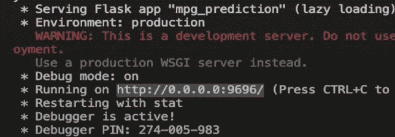
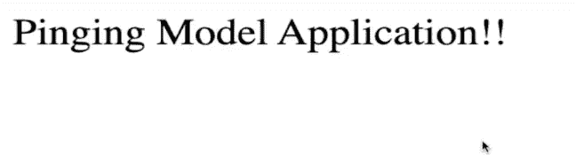
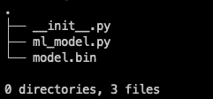
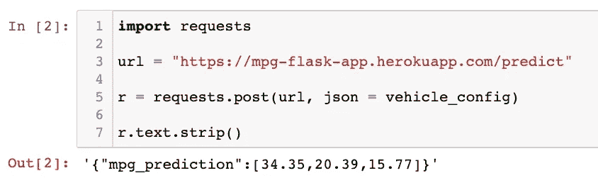

# 使用 Flask 部署已训练的 ML 模型

> 原文：<https://towardsdatascience.com/deploying-a-trained-ml-model-using-flask-541520b3cbe9?source=collection_archive---------12----------------------->

## 端到端 ML 项目教程系列的第 2 部分


[科学高清照片](https://unsplash.com/@scienceinhd?utm_source=unsplash&utm_medium=referral&utm_content=creditCopyText)在 [Unsplash](https://unsplash.com/s/photos/server?utm_source=unsplash&utm_medium=referral&utm_content=creditCopyText)

继我上一篇关于端到端机器学习项目教程的文章[之后，我们讨论了](/end-to-end-machine-learning-project-tutorial-part-1-ea6de9710c0?source=---------4------------------)[构建一个健壮的 ML 模型的主要任务](/task-cheatsheet-for-almost-every-machine-learning-project-d0946861c6d0?source=---------2------------------)，这篇文章为你提供了一个在 web 上部署 ML 模型的简单快速的解决方案。

这是我们在这里开始的[端到端 ML 油耗项目的最后一项任务。](/end-to-end-machine-learning-project-tutorial-part-1-ea6de9710c0)

# 部署应用程序需要什么？

为了部署任何经过训练的模型，您需要以下内容:

*   **准备部署的已训练模型** —将模型保存到文件中，以供 web 服务进一步加载和使用。
*   **一个 web 服务**——为你的模型在实践中的使用提供一个目的。对于我们的燃料消耗模型，它可以使用车辆配置来预测其效率。我们将使用 **Flask** 来开发这项服务。
*   **云服务提供商**——你需要特殊的云服务器来部署应用程序，为了简单起见，我们将使用 Heroku(数据工程系列将涵盖 AWS 和 GCP)来完成这一任务。

让我们从逐一查看这些流程开始。

# **保存训练好的模型**

一旦您有足够的信心将经过培训和测试的模型带入生产就绪环境，第一步就是将它保存到. h5 或。使用类似于`pickle`的库来绑定文件。

确保您的环境中安装了`pickle`。

接下来，让我们导入模块并将模型转储到一个`.bin`文件中:

```
import pickle##dump the model into a file
with open("model.bin", 'wb') as f_out:
    pickle.dump(final_model, f_out) # write final_model in .bin file
    f_out.close()  # close the file 
```

这将把您的模型保存在您当前的工作目录中，除非您指定一些其他的路径。

是时候测试我们是否能够使用该文件加载我们的模型并进行预测了，我们将使用相同的(如 prev blog 中所定义的)车辆配置:

```
##vehicle config
vehicle_config = {
    'Cylinders': [4, 6, 8],
    'Displacement': [155.0, 160.0, 165.5],
    'Horsepower': [93.0, 130.0, 98.0],
    'Weight': [2500.0, 3150.0, 2600.0],
    'Acceleration': [15.0, 14.0, 16.0],
    'Model Year': [81, 80, 78],
    'Origin': [3, 2, 1]
}
```

让我们从文件中加载模型:

```
*##loading the model from the saved file*
**with** open('model.bin', 'rb') **as** f_in:
    model = pickle.load(f_in)
```

在`vehicle_config`上做预测

```
##defined in prev_blog
predict_mpg(vehicle_config, model)##output: array([34.83333333, 18.50666667, 20.56333333])
```

输出与我们之前使用`final_model`预测的一样。

# **开发网络服务**

下一步是将这个模型打包到一个 web 服务中，当通过 POST 请求获得数据时，该服务会返回 MPG(英里/加仑)预测作为响应。

我使用的是 Flask web 框架，这是一个常用的用 Python 开发 web 服务的轻量级框架。在我看来，这可能是实现 web 服务最简单的方法。

Flask 只需要很少的代码就可以让您入门，并且您不需要担心处理 HTTP 请求和响应的复杂性。

以下是步骤:

*   为您的 flask 应用程序创建一个新目录。
*   使用 pip 设置安装了依赖项的专用环境。
*   安装以下软件包:

```
pandas
numpy
sklearn
flask
gunicorn
seaborn
```

下一步是激活这个环境，并开始开发一个简单的端点来测试应用程序:

创建一个新的文件，`main.py`，并导入烧瓶模块:

```
from flask import Flask
```

通过实例化 Flask 类来创建 Flask 应用程序:

```
##creating a flask app and naming it "app"
app = Flask('app')
```

创建一个路由和与之对应的函数，该函数将返回一个简单的字符串:

```
[@app](http://twitter.com/app).route('/test', methods=['GET'])
def test():
    return 'Pinging Model Application!!'
```

上面的代码利用了 decorator——一种高级的 python 特性。你可以在这里阅读更多关于装饰者的信息。我们不需要对装饰者有很深的理解，只需要在`test()`函数上添加一个装饰者`@app.route`就可以将 web 服务地址分配给那个函数。

现在，要运行应用程序，我们需要最后这段代码:

```
if __name__ == ‘__main__’:
    app.run(debug=True, host=’0.0.0.0', port=9696)
```

run 方法启动我们的 flask 应用程序服务。这 3 个参数指定:

*   `debug=True` —当应用程序遇到任何代码变化时，自动重启应用程序
*   `host=’0.0.0.0'` —公开 web 服务
*   `port=9696` —我们用来访问应用程序的端口

现在，在你的终端运行`main.py`

```
python main.py
```



在浏览器中打开 URL[http://0 . 0 . 0 . 0:9696/test](http://HTTP://0.0.0.0:9696/test)将在网页上打印响应字符串:



现在，应用程序正在运行，让我们来运行模型:

创建一个新目录`model_files`来存储所有与模型相关的代码。

在这个目录中，创建一个 ml_model.py 文件，该文件将包含数据准备代码和我们在这里编写的[预测函数。](https://github.com/dswh/fuel-consumption-end-to-end-ml/blob/master/auto_mpg_prediction-part3.ipynb)

复制并粘贴您在第一部分中导入的库和预处理/转换函数。该文件应该如下所示:

在同一个目录中，也放置您保存的`model.bin`文件。

现在，在`main.py`中，我们将导入 predict_mpg 函数来进行预测，但是要这样做，我们需要创建一个空的`__init__.py` 文件来告诉 Python 这个目录是一个包。



您的目录应该有这样的树:

接下来，定义将接受来自 HTTP POST 请求的`vehicle_config`并使用模型和`predict_mpg()`方法返回预测的`predict/`路由。

在您的 main.py 中，第一次导入:

```
import pickle
from flask import Flask, request, jsonify
from model_files.ml_model import predict_mpg
```

然后添加`predict`路线和相应的功能:

*   这里，我们将只接受函数的 POST 请求，因此我们在装饰器中有`methods=[‘POST’]`。
*   首先，我们使用`get_json()`方法从请求中获取数据(vehicle_config ),并将其存储在变量 vehicle 中。
*   然后，我们从`model_files`文件夹中的文件将训练好的模型加载到模型变量中。
*   现在，我们通过调用 predict_mpg 函数并传递`vehicle`和`model`来进行预测。
*   我们为预测变量中返回的数组创建一个 JSON 响应，并将这个 JSON 作为方法响应返回。

我们可以使用 Postman 或`requests`包来测试这个路由，启动运行 main.py 的服务器，然后在您的笔记本中，添加以下代码来发送带有`vehicle_config`的 POST 请求:

```
import requestsurl = “[http://localhost:9696/predict](http://localhost:9696/predict)"
r = requests.post(url, json = vehicle_config)
r.text.strip()##output: '{"mpg_predictions":[34.60333333333333,19.32333333333333,14.893333333333333]}'
```

太好了！现在，到了最后一部分，当部署在远程服务器上时，同样的功能应该工作。

# 在 Heroku 上部署应用程序


来自:[https://www.heroku.com/art](https://www.heroku.com/art)

要在 Heroku 上部署这个 flask 应用程序，您需要遵循以下非常简单的步骤:

1.  在主目录中创建一个`Procfile`——它包含在服务器上运行应用程序的命令。
2.  在 Procfile 中添加以下内容:

```
web: gunicorn wsgi:app
```

我们使用 gunicorn(之前安装的)来部署应用程序:

> Gunicorn 是一个用于 WSGI 应用程序的纯 Python HTTP 服务器。它允许您通过在一个 dyno 中运行多个 Python 进程来同时运行任何 Python 应用程序。它提供了性能、灵活性和配置简单性的完美平衡。

3.创建一个`wsgi.py`文件并添加:

```
##importing the app from main file
from main import appif __name__ == “__main__”: 
    app.run()
```

确保从`main.py`中删除运行代码。

4.将所有 python 依赖关系写入 requirements.txt:

你可以使用`pip freeze > requirements.txt`或者简单地把上面提到的包列表+你的应用程序正在使用的任何其他包。

5.使用终端，

*   初始化一个空的 git 存储库，
*   将文件添加到临时区域
*   将文件提交到本地存储库:

```
$ git init 
$ git add .
$ git commit -m "Initial Commit"
```

6.[创建 Heroku 帐户](https://signup.heroku.com/)如果您还没有，请登录 Heroku CLI:

```
heroku login
```

弹出页面时批准从浏览器登录:

7.创建烧瓶应用程序:

```
heroku create <name of your app>
```

我把它命名为`mpg-flask-app`。它将创建一个 flask 应用程序，并会给我们一个应用程序将被部署的 URL。

8.最后，将所有代码推送到 Heroku remote:

```
$ git push heroku master
```

瞧啊。您的 web 服务现在已经部署在 https://mpg-flask-app.herokuapp.com/predict 的[上了。](https://mpg-flask-app.herokuapp.com/predict)

同样，通过发送相同的车辆配置，使用`request`包测试端点:



这样，您就拥有了构建更复杂的 ML 应用程序所需的所有主要技能。

这个项目可以参考我的 GitHub 资源库:

[](https://github.com/dswh/fuel-consumption-end-to-end-ml) [## dswh/燃油消耗-端到端-毫升

### 70 年代和 80 年代车辆油耗预测的端到端机器学习项目。GitHub 是超过 50 个…

github.com](https://github.com/dswh/fuel-consumption-end-to-end-ml) 

你可以和我一起开发整个项目:

# 下一步！

这仍然是一个简单的项目，在接下来的步骤中，我建议你使用一个更复杂的数据集，也许可以选择[一个分类问题](https://archive.ics.uci.edu/ml/datasets.php?format=&task=cla&att=&area=&numAtt=&numIns=&type=&sort=nameUp&view=table)并重复[这些任务](/task-cheatsheet-for-almost-every-machine-learning-project-d0946861c6d0?source=---------2------------------)直到部署。

# [数据科学与 Harshit](https://www.youtube.com/c/DataSciencewithHarshit?sub_confirmation=1) —我的 YouTube 频道

但是如果你不想等待，这里是我的 YouTube 频道上的完整教程系列(播放列表),你可以在这个项目上跟随我。

通过这个渠道，我计划推出几个覆盖整个数据科学领域的[系列](/hitchhikers-guide-to-learning-data-science-2cc3d963b1a2?source=---------8------------------)。以下是你应该订阅[频道](https://www.youtube.com/channel/UCH-xwLTKQaABNs2QmGxK2bQ)的原因:

*   这些系列将涵盖每个主题和子主题的所有必需/要求的高质量教程，如[数据科学的 Python 基础](/python-fundamentals-for-data-science-6c7f9901e1c8?source=---------5------------------)。
*   解释了为什么我们在 ML 和深度学习中这样做的数学和推导。
*   [与谷歌、微软、亚马逊等公司的数据科学家和工程师](https://www.youtube.com/watch?v=a2pkZCleJwM&t=2s)以及大数据驱动型公司的首席执行官的播客。
*   [项目和说明](/building-covid-19-analysis-dashboard-using-python-and-voila-ee091f65dcbb?source=---------2------------------)实施到目前为止所学的主题。了解新的认证、训练营以及破解这些认证的资源，例如 Google 举办的 [**TensorFlow 开发者证书考试。**](https://youtu.be/yapSsspJzAw)