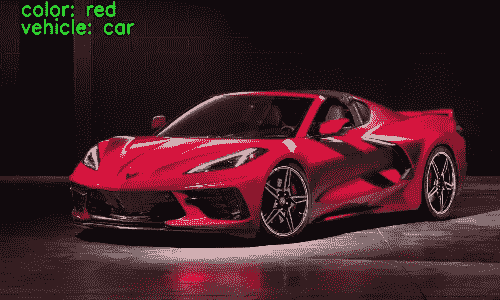
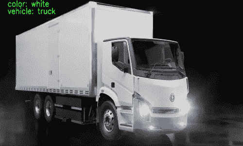

# 使用 OpenVINO 部署 AI Edge 应用程序

> 原文：<https://towardsdatascience.com/deploying-an-ai-edge-app-using-openvino-aa84e87c4577?source=collection_archive---------27----------------------->

在我之前的文章中，我已经讨论了 OpenVINO 工具包的[基础，OpenVINO 的](https://medium.com/swlh/introduction-to-intel-openvino-toolkit-5f98dbb30ffb)[模型优化器](https://medium.com/analytics-vidhya/intel-openvino-model-optimizer-e381affa458c)和[推理机](https://medium.com/analytics-vidhya/intel-openvino-inference-engine-7ba5076dc6e0)。在这篇文章中，我们将探索:-

*   计算机视觉模型的类型。
*   OpenVINO 的预训练模型。
*   下载预先训练好的模型。
*   使用预先训练的模型部署 Edge 应用程序。


图片:[来源](https://image.freepik.com/free-photo/planting-seed-grow-step-concept-garden-sunlight-agriculture-idea_34152-1873.jpg)

# 计算机视觉模型的类型

有不同类型的计算机视觉模型用于各种目的。但是三个主要的计算机视觉模型是:-

*   分类
*   目标检测
*   分割

分类模型识别给定图像或图像中对象的“类别”。分类可以是二元的，即“是”或“否”,或者成千上万的类别，如人、苹果、汽车、猫等..有几种分类模型，如 ResNet、DenseNet、Inception 等..

对象检测模型用于确定图像中存在的对象，并且经常在检测到的对象周围绘制边界框。它们还使用分类来识别边界框内对象的类别。您还可以设置边界框的阈值，以便拒绝低阈值检测。RCNN、Fast-RCNN、YOLO 等。是对象检测模型的一些例子。

分割模型在给定图像中执行逐像素分类。有两种不同类型的分段-语义分段和实例分段。在语义分割中，属于同一类的所有对象被认为是相同的，而在实例分割中，每个对象被认为是不同的，即使它属于同一类。例如，如果在一幅图像中有五个人，语义分割模型将把他们都视为相同，而在实例分割模型中，他们都将被不同地对待。优信网、DRN 等..

# OpenVINO 中的预训练模型

预训练模型，顾名思义，是已经被训练得具有高精度甚至尖端精度的模型。训练深度学习模型需要大量的时间和计算能力。虽然，创建自己的模型并通过微调超参数(隐藏层数、学习率、激活函数等)来训练它是令人兴奋的。)以达到更高的精度。但是，这需要几个小时的工作。

通过使用预先训练的模型，我们避免了大规模数据收集和长时间高成本培训的需要。了解如何预处理输入和处理网络输出后，您可以将这些内容直接插入到您自己的应用程序中。

OpenVINO 在[模型动物园](https://software.intel.com/content/www/us/en/develop/tools/openvino-toolkit/pretrained-models.html)里有很多预先训练好的模型。模型动物园有自由模型集和公共模型集，自由模型集包含已转换为中间表示的预训练模型。xml 和。bin)使用模型优化器。这些模型可以直接用于推理机。公共模型集包含预先训练的模型，但是这些模型不会被转换为中间表示。

# 下载预先训练的模型

在本文中，我将从开放模型动物园加载“车辆-属性-识别-障碍-0039”模型。

要下载预先训练的模型，请遵循以下步骤(在命令提示符/终端中键入命令):-

1.  导航到模型下载器目录

对于 Linux:-

```
cd /opt/intel/openvino/deployment_tools/open_model_zoo/tools/model_downloader
```

对于 Windows:-

```
cd C:/Program Files (x86)/IntelSWTools/openvinodeployment_tools/open_model_zoo/tools/model_downloader
```

我在上面的命令中使用了默认的安装目录，如果您的安装目录不同，那么请导航到适当的目录。

2.运行下载程序. py

下载器 Python 文件需要一些参数，您可以使用“-h”参数来查看可用的参数。

```
python downloader.py -h
```

让我们下载模型，

```
python downloader.py --name vehicle-attributes-recognition-barrier-0039 --precisions -FP32 --output_dir /home/pretrained_models
```

*   **—名称** →型号名称。
*   **—精度** →型号精度(FP16、FP32 或 INT8)。
*   **— output_dir** →保存模型的路径。

成功下载模型后，导航到下载模型的路径，您将找到。xml“和”。bin "文件的模型。

请参考[文档](https://docs.openvinotoolkit.org/latest/omz_models_intel_vehicle_attributes_recognition_barrier_0039_description_vehicle_attributes_recognition_barrier_0039.html#inputs)以了解关于该模型的更多细节(输入和输出)。

# 部署边缘应用

现在，由于我们已经下载了预训练模型，让我们在 Edge 应用程序中部署它。

让我们创建一个文件“inference.py”来定义和使用推理引擎。在我的[上一篇文章](https://medium.com/analytics-vidhya/intel-openvino-inference-engine-7ba5076dc6e0)中，关于推理引擎，我已经使用了不同的函数，但是这里我将定义一个类。

```
from openvino.inference_engine import IENetwork, IECore**class** Network:
    **def** __init__(self):
        self.plugin = None
        self.network = None
        self.input_blob = None
        self.exec_network = None
        self.infer_request = None **def** load_model(self):
        self.plugin = IECore()
        self.network = IENetwork(model='path_to_xml', weights='path_to_bin')

        ### Defining CPU Extension path
        CPU_EXT_PATH=      "/opt/intel/openvino/deployment_tools/inference_engine/lib/intel64/ libcpu_extension_sse4.so"        ### Adding CPU Extension
        plugin.add_extension(CPU_EXT_PATH,"CPU") ### Get the supported layers of the network
        supported_layers = plugin.query_network(network=network, device_name="CPU")        ### Finding unsupported layers
        unsupported_layers = [l **for** l **in** network.layers.keys() **if** l **not** **in** supported_layers]            ### Checking for unsupported layers
        **if** len(unsupported_layers) != 0:
            print("Unsupported layers found")
            print(unsupported_layers)
            exit(1) ### Loading the network
        self.exec_network =             self.plugin.load_network(self.network,"CPU") self.input_blob  = next(iter(self.network.inputs))
        print("MODEL LOADED SUCCESSFULLY!!!) **def** get_input_shape(self):
        return self.network.inputs[self.input_blob].shape **def** synchronous_inference(self,image):  
        self.exec_network.infer({self.input_blob: image}) **def** extract_output(self):
        return self.exec_network.requests[0].outputs
```

别糊涂了！我会解释每一个功能。

*   **__init__(self):**

它是类网络的构造器，在那里我初始化了类的数据成员。

*   **load_model(self):**

顾名思义，它用于加载模型(预训练)，在这个函数中我们:-

▹声明了一个 iecore 对象。

▹声明了一个 ienetwork 对象。

▹加载了模型 xml 和 bin 文件。

▹检查了不受支持的层

▹在 iecore 对象中加载 ienetwork 对象。

*   **获取 _ 输入 _ 形状(自身):**

返回模型所需的输入形状

*   **同步 _ 推论(自我，形象):**

对输入图像执行同步推理

*   **提取 _ 输出(自我):**

推理完成后返回模型的输出。

这就是“推论. py”，现在让我们创建一个文件“main.py”。

```
import cv2
import numpy as np
from inference import Network def preprocessing(image,height,width): ### Resize the Image
    image = cv2.resize(image,(width,height)) ### Add color channel first
    image = image.transpose((2,0,1)) ### Add Batch Size
    image  = np.reshape((image,(1,3,height,width))
    return image
```

1.  使用 OpenCV 的 resize()调整图像大小时，应该先给出宽度，再给出高度。
2.  根据[文档](https://docs.openvinotoolkit.org/latest/omz_models_intel_vehicle_attributes_recognition_barrier_0039_description_vehicle_attributes_recognition_barrier_0039.html#inputs)，模型首先读取通道，然后读取图像尺寸，但是 OpenCV 首先读取图像尺寸，然后读取通道，所以我使用了 transpose()，首先带来颜色通道。
3.  该模型将输入作为(batch_size，color_channels，height，width ),因此我们对图像进行整形，以给出为 1 的“batch_size”。

```
def main():
    ### Read the image
    image = cv2.imread('path_to_image') ### Declare a Network Object
    plugin = Network() ### Input shape required by model
    input_shape = plugin.get_input_shape() height = input_shape[2]
    width = input_shape[3] ### Preprocess the input    
    p_image = preprocessing(image,height,width) ### Perform Synchronous Inference
    plugin.synchronous_inference(p_image) ### Extract the output
    results = plugin.extract_output()
```

根据文档，模型的输出(结果)是一个字典，其中包含以下信息

1.  “颜色”，形状:[1，7，1，1] —七种颜色类别的 Softmax 输出[白色、灰色、黄色、红色、绿色、蓝色、黑色]
2.  “类型”，形状:[1，4，1，1] —跨四个类型类别[轿车、公共汽车、卡车、货车]的 Softmax 输出

由于它是 softmax 输出，我们需要将最大值的索引与颜色和类型进行映射。

```
 color = ['white','grey','yellow','red','green','blue','black']
    vehicle = ['car','bus','truck','van'] ### Finding out the color and type
    result_color = str(color[np.argmax(results['color'])])
    result_type = str(vehicle[np.argmax(results['type'])])### Add details to image
    font = cv2.FONT_HERSHEY_SIMPLEX
    font_scale = 1
    col = (0, 255,0) #BGR
    thickness = 2    
    color_text= 'color: '+result_color
    type_text = 'vehicle: '+result_type
    cv2.putText(image,color_text,(50,50), font, font_scale, col, thickness, cv2.LINE_AA)
    cv2.putText(image,type_text,(50,75), font, font_scale, col, thickness, cv2.LINE_AA) ### Save the image
    cv2.imwrite('path/vehicle.png',image)if __name__=="__main__":
    main()
```

我尝试了两辆车，得到了以下输出:-



来源:作者

好了，大家都到齐了。我希望现在你已经对如何使用 OpenVINO 部署 AI edge 应用程序有了正确的理解。OpenVINO 为多种应用提供了各种预训练模型。尝试实现 OpenVINO [model zoo](https://software.intel.com/content/www/us/en/develop/tools/openvino-toolkit/pretrained-models.html) 中可用的不同预训练模型，并创建自己的 edge 应用程序。非常感谢您阅读我的文章。