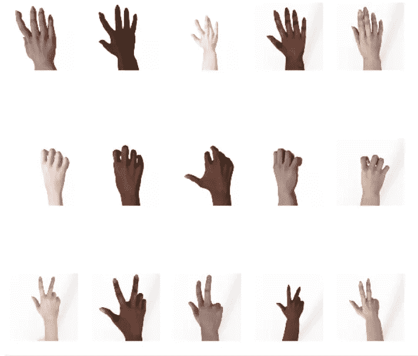
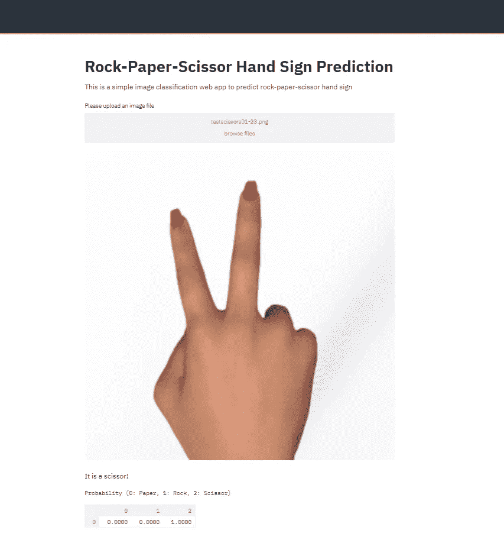
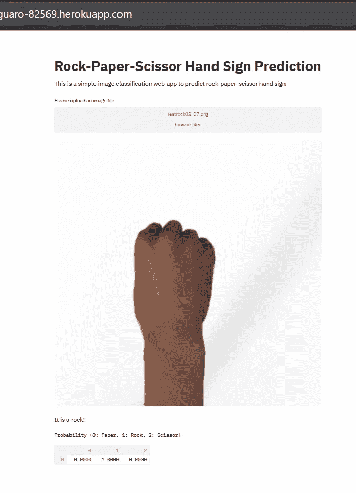

# 使用 Python 部署影像分类 Web 应用程序

> 原文：<https://towardsdatascience.com/deploying-an-image-classification-web-app-with-python-3753c46bb79?source=collection_archive---------7----------------------->

## 如何使用 Streamlit 和 Heroku 部署您的机器学习模型


图片来源: [Unsplash](https://unsplash.com/photos/Q1p7bh3SHj8)

毫无疑问，做一个数据科学和机器学习项目，从收集数据开始，处理数据，可视化关于数据的见解，并开发一个机器学习模型来完成预测任务，是一件有趣的事情。更有趣和可行的是，我们可以在本地机器上完成所有这些步骤，然后就可以完成了。

然而，如果其他人可以利用我们的机器学习模型来做有趣和酷的事情，这不是很棒吗？当我们的模型可以进入其他人的手中，他们可以从中做有用的东西时，机器学习的真正魔力就来了。

创建一个 web 应用程序是解决方案之一，这样其他人就可以利用我们的机器学习模型。幸运的是，现在创建一个 web 应用程序非常简单。

如果您正在使用 Python，您可以使用 Streamlit 库在本地机器上创建一个简单的机器学习 web 应用程序。要部署 web 应用程序，使其可供其他人访问，那么我们可以使用 Heroku 或其他云平台。在本文中，我将一步一步向您展示如何使用 Python、Streamlit 和 Heroku 创建自己的简单图像分类 web 应用程序。

如果您还没有安装 Streamlit，您可以通过在提示符下运行以下 pip 命令来安装它。

```
pip install streamlit
```

# 图像分类数据

对于这个图像分类示例，将使用 Laurence Moroney 创建的石头-纸-剪刀数据集。你可以在他的[网站](http://www.laurencemoroney.com/rock-paper-scissors-dataset/)上下载数据。总之，石头-纸-剪刀是一个合成的数据集，它包含人们形成石头、纸或剪刀形状的手。总共有 2520 幅训练图像和 372 幅测试图像。

下面是合成图像数据的预览图:



先睹为快[石头剪刀布数据集](http://laurencemoroney.com/rock-paper-scissors-dataset)的训练图像

总的来说，本文将涵盖三个步骤:

*   创建第一个 Python 文件来加载数据、构建模型并最终训练模型。
*   创建第二个 Python 文件来加载模型和构建 web 应用程序。
*   使用 Heroku 部署 web 应用程序。

# 加载数据、构建模型和训练模型

首先，下载训练集和测试集，并将其保存到您选择的目录中。接下来，您需要解压缩它们。将有两个文件夹，一个称为*‘RPS’*用于训练图像，另一个称为*‘RPS-test-set’*用于测试图像。之后创建一个名为`rps_model.py`的 Python 文件来加载数据，建立机器学习模型，训练模型。

# 加载数据

在构建模型之前，您需要首先使用`os`库指定本地机器中训练集文件夹和测试集文件夹的路径。

```
import ostrain_dir = os.path.join('directory/to/your/rps/')
test_dir = os.path.join('directory/to/your/rps-test-set/')
```

接下来，我们可以使用 TensorFlow 库中的图像生成器来生成训练集和测试集，并自动标记数据。使用 image generator 的另一个优点是，我们可以“即时”进行数据扩充，通过缩放、旋转或移动训练图像来增加训练集的数量。此外，我们可以将训练集的某一部分拆分为验证集，以比较模型的性能。

```
from tensorflow.keras.preprocessing.image import ImageDataGenerator def image_gen_w_aug(train_parent_directory, test_parent_directory):

    train_datagen = ImageDataGenerator(rescale=1/255,
                                      rotation_range = 30,  
                                      zoom_range = 0.2, 
                                      width_shift_range=0.1,  
                                      height_shift_range=0.1,
                                      validation_split = 0.15)

    test_datagen = ImageDataGenerator(rescale=1/255)

    train_generator =          train_datagen.flow_from_directory(train_parent_directory,
                                  target_size = (75,75),
                                  batch_size = 214,
                                  class_mode = 'categorical',
                                  subset='training')

    val_generator = train_datagen.flow_from_directory(train_parent_directory,
                                  target_size = (75,75),
                                  batch_size = 37,
                                  class_mode = 'categorical',
                                  subset = 'validation')

    test_generator = test_datagen.flow_from_directory(test_parent_directory,
                                 target_size=(75,75),
                                 batch_size = 37,
                                 class_mode = 'categorical') return train_generator, val_generator, test_generator
```

在创建了上面的函数之后，现在您可以调用该函数，并使用您之前定义的`train_dir`和`test_dir`变量传递参数。

```
train_generator, validation_generator, test_generator = image_gen_w_aug(train_dir, test_dir)
```

而到了这一步，就已经加载好数据了！

# 建立机器学习模型

作为一个机器学习模型，如果你愿意，你可以建立自己的 CNN 模型。但在本文中，迁移学习法将被应用。使用来自 ImageNet 的具有预训练权重的 InceptionV3 模型。

但是，由于这个模型非常深，所以使用的模型将一直到称为`mixed_5`的层，并且直到这一层的所有权重都是固定的，以加快训练时间。从该图层开始，模型将被展平以连接到密集图层，然后连接到最终的密集输出。`mixed_5` 之后的所有重量都是可训练的。

```
from tensorflow.keras.applications.inception_v3 import InceptionV3
from tensorflow.keras.layers import Flatten, Dense, Dropoutdef model_output_for_TL (pre_trained_model, last_output):        x = Flatten()(last_output)

    # Dense hidden layer
    x = Dense(512, activation='relu')(x)
    x = Dropout(0.2)(x)

    # Output neuron. 
    x = Dense(3, activation='softmax')(x)

    model = Model(pre_trained_model.input, x)

    return modelpre_trained_model = InceptionV3(input_shape = (75, 75, 3), 
                                include_top = False, 
                                weights = 'imagenet')for layer in pre_trained_model.layers:
  layer.trainable = Falselast_layer = pre_trained_model.get_layer('mixed5')
last_output = last_layer.output
model_TL = model_output_for_TL(pre_trained_model, last_output)
```

***如果您还没有导入 InceptionV3 模型，下载该模型需要几分钟时间。***

在这一步，您已经建立了模型！接下来，我们需要训练模型。

# 训练并保存机器学习模型

现在是我们训练模型的时候了。在训练模型之前，首先需要编译模型。在本文中，优化器将是 Adam，因为我们有一个分类问题，那么我们应该使用分类交叉熵作为损失。对于指标，我们将使用准确性。

编译完模型后，现在我们可以训练模型了。模型训练完成后，我们需要保存训练好的模型。然后，在与 Python 文件相同的目录中，您应该有一个名为“my_model.hdf5”的新 hdf5 文件。

```
model_TL.compile(optimizer='adam', loss='categorical_crossentropy', metrics=['accuracy'])history_TL = model_TL.fit(
      train_generator,
      steps_per_epoch=10,  
      epochs=20,
      verbose=1,
      validation_data = validation_generator)tf.keras.models.save_model(model_TL,'my_model.hdf5')
```

现在你已经完成了建模过程。您可以保存并关闭 Python 文件。

# 创建 Streamlit Web 应用程序

要用 Streamlit 创建一个 web 应用程序，我们需要做的第一件事是创建一个新的 Python 文件，姑且称之为`rps_app.py`。在这个 Python 文件中，首先我们需要加载之前保存的训练模型。

```
import tensorflow as tfmodel = tf.keras.models.load_model('my_model.hdf5')
```

下一步是编写一个标题和任何其他你想放入你的 web 应用程序的文本。要写标题，只需使用 Streamlit 的`write`属性，然后在文本前加上`#`。要写一个简单的文本，我们也可以使用`write`的方法，然后在不添加`#`的情况下继续你的文本

要让用户将自己的图像上传到您的 web 应用程序，只需使用 Streamlit 库中的`file_uploader`属性。有关 Streamlit 上其他可用选项的更多详细信息，您可以在 [**Streamlit API 文档页面**](https://docs.streamlit.io/en/stable/api.html) 查看。

```
import streamlit as stst.write("""
         # Rock-Paper-Scissor Hand Sign Prediction
         """
         )st.write("This is a simple image classification web app to predict rock-paper-scissor hand sign")file = st.file_uploader("Please upload an image file", type=["jpg", "png"])
```

下一个重要步骤是处理用户上传的图像。该处理步骤包括将图像调整到与训练和验证图像相同的大小。调整图像大小后，加载的模型应该预测该图像属于哪个类别。

```
import cv2
from PIL import Image, ImageOps
import numpy as npdef import_and_predict(image_data, model):

        size = (150,150)    
        image = ImageOps.fit(image_data, size, Image.ANTIALIAS)
        image = np.asarray(image)
        img = cv2.cvtColor(image, cv2.COLOR_BGR2RGB)
        img_resize = (cv2.resize(img, dsize=(75, 75),    interpolation=cv2.INTER_CUBIC))/255.

        img_reshape = img_resize[np.newaxis,...]

        prediction = model.predict(img_reshape)

        return predictionif file is None:
    st.text("Please upload an image file")
else:
    image = Image.open(file)
    st.image(image, use_column_width=True)
    prediction = import_and_predict(image, model)

    if np.argmax(prediction) == 0:
        st.write("It is a paper!")
    elif np.argmax(prediction) == 1:
        st.write("It is a rock!")
    else:
        st.write("It is a scissor!")

    st.text("Probability (0: Paper, 1: Rock, 2: Scissor")
    st.write(prediction)
```

之后，您需要将 Python 文件保存在与之前的 Python 文件相同的目录中。

我们现在基本上都准备好了！要检查我们的 web 应用程序的外观，请打开提示符，然后导航到 Python 文件的工作目录。在工作目录中，您可以键入以下命令:

```
streamlit run rps_app.py
```

现在，您将从提示中看到，您可以在本地主机上检查您的 web 应用程序。如果你再等一会儿，在你运行你的 Streamlit 应用程序后，一个新的窗口将会马上打开。下面是简单图像分类 web app 的截图。



# 使用 Heroku 部署您的 Web 应用程序

到目前为止，您已经在本地计算机上构建了 web 应用程序。为了让其他人能够使用你的网络应用，你可以使用 Heroku。

## 用于部署的附加文件

在部署 web 应用程序之前，除了我们为构建应用程序而创建的 Python 文件之外，我们还需要创建另外三个文件。这三个文件是:

*   **requirements.txt:** 这是我们需要创建的文本文件，用来告诉 Heroku 安装部署我们的机器学习模型所需的必要 Python 包。在本教程中，我们使用了四个 Python 库来构建应用程序:numpy、streamlit、tensorflow 和 pillow。因此，我们需要在这个文本文件中指定这些库的相关版本。

```
tensorflow==2.0.0
streamlit==0.62.0
numpy==1.16.5
pillow==6.2.0
```

*如果您不确定您正在使用的 Python 库的版本，您可以在您的 Python 环境中使用'****_ _ version _ _ '****属性，或者在 conda 提示符中键入'****conda list '****。*

*   **setup.sh:** 这个文件是处理我们在 Heroku 上的应用的服务器和端口号所必需的。

```
mkdir -p ~/.streamlit/                                               echo "\                       
[server]\n\                       
port = $PORT\n\                       
enableCORS = false\n\                       
headless = true\n\                       
\n\                       
" > ~/.streamlit/config.toml
```

*   Procfile: 这是你的配置文件，用来告诉 Heroku 如何以及执行哪些文件。

```
web: sh setup.sh && streamlit run rps_app.py
```

现在已经有了这三个文件，将它们放在与 Python 文件相同的目录中。

接下来，让我们跳到 Heroku。

## 创建您的 Heroku 帐户

如果你已经有了 Heroku 账号，可以跳过这一步。如果你还没有，那么你可以直接去 [**Heroku**](https://www.heroku.com/) 。在那里你会发现一个“*注册”*按钮，点击该按钮并填写必要的信息。之后，你需要用你的电子邮件确认你的新 Heroku 账户。

## 用 Heroku Git 部署您的 ML 模型

创建好 Heroku 账号后，接下来需要做的事情就是安装 [**Heroku CLI**](https://devcenter.heroku.com/articles/heroku-cli) (命令行界面)。接下来，打开命令提示符，键入以下命令。

```
heroku login
```

该命令将引导您使用 Heroku 帐户登录。

接下来，使用命令提示符移动到应用程序文件的目录。在应用程序文件的目录中，键入以下命令。

```
heroku create your_app_name
```

您可以根据自己的喜好更改`your_app_name`作为应用名称。接下来，您需要通过键入以下命令来启动一个空的 git 存储库。

```
git init
```

接下来，您希望将所有应用程序文件提交到刚刚创建的空存储库中。为此，您可以键入`git add .`命令，然后您需要通过键入`commit`和`push`命令来推送它们，如下所示。

```
git add .
git commit -m "your message"
git push heroku master
```

现在，您的应用程序文件将通过 Heroku Git 部署到 Heroku，在该过程完成后，您将看到您的 web 应用程序的 URL，可以通过互联网访问。您的 web 应用程序 URL 的格式类似于*your _ app _ name . heroku app . com .*

下面是一个用 Heroku 部署的简单 web 应用程序的例子。



就是这样！您的影像分类 web 应用程序已部署！

如果想看本教程中 web app 的代码或者其他必要的文件，可以在我的 [**GitHub**](https://github.com/marcellusruben/rock_paper_scissor_web_app) 上看到。