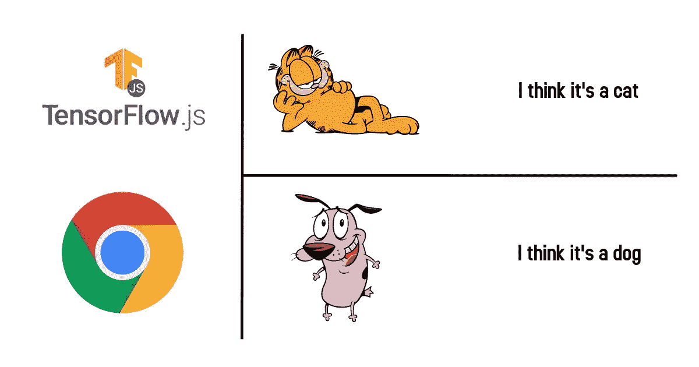
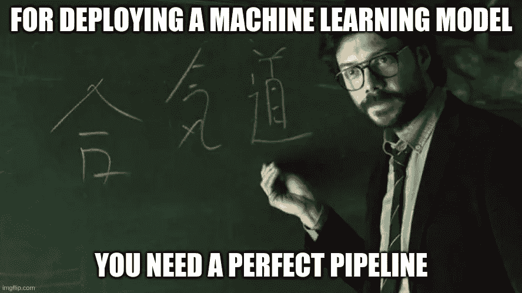
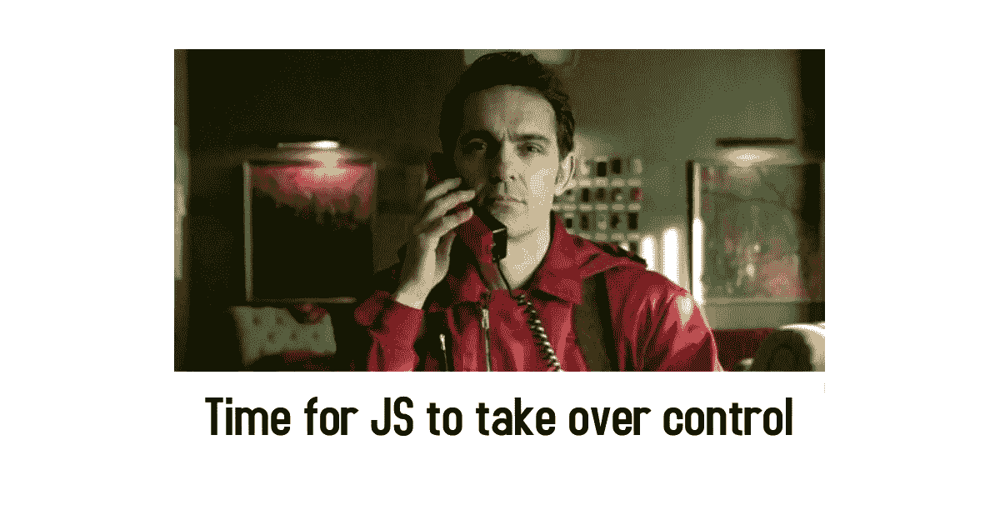
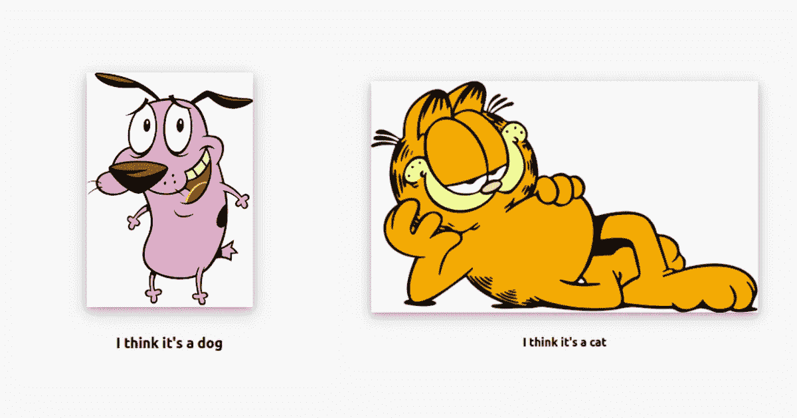

# 使用 JavaScript 部署图像分类器

> 原文：<https://towardsdatascience.com/deploying-an-image-classifier-using-javascript-84da1480b3a4?source=collection_archive---------37----------------------->

推断图像分类模型的另一种方式是通过直接部署在静态网站或节点 web 应用中来减少推断时间。



图片来源:[novasush.com](https://novasush.com/blog/images/cat_vs_dog_in_javascript.jpg)

使用机器学习模型可能会很有趣。你必须确保你已经设置了硬件和软件优化的管道，然后你的模型就可以投入生产了。但是有时用 image 对后端进行 HTTP 调用，然后在前端返回结果可能是一项单调乏味的工作。如果您使用的是重型模型，并且您的服务器配置较低，那么会有很多限制，比如后期推断。
这就是为什么他们说模型部署是数据科学领域 80%的工作。



**金钱大劫案教授说** |来源:[imgflip.com](https://imgflip.com/i/42ubrc)

## 用 JavaScript 进行机器学习

[TensorFlow.js](https://js.tensorflow.org/) ，这是一个开源库，您可以使用 Javascript 和高级层 API，完全在浏览器中定义、训练和运行机器学习模型。如果您是刚接触 ML 的 Javascript 开发人员，TensorFlow.js 是开始学习的好方法。JavaScript 是一种客户端脚本语言，在浏览器中完全在客户端运行机器学习程序会带来新的机会，如交互式 ML。

# 我们开始吧

我已经在 Keras 上训练了一个简单的猫和狗的分类器。想自己培养模特可以参考我的笔记本档案。我们将使用 tensorflowjs_converter 工具将 Keras (.h5)权重转换为 tfjs 格式。
tensorflowjs_converter 附带了 tensorflowjs python 库，我们来安装吧。

```
pip install tensorflowjs
```

使用 tensorflow.js 转换器将保存的 Keras 模型转换为 JSON 格式。(假设重量模型的名称. h5)

创建一个目录来存储转换后的权重并提及其路径(jsweights)

```
tensorflowjs_converter --input_format=keras ./model.h5 ./jsweights
```

如果你做的没错，你现在应该有一个名为`model.json`的 **JSON** 文件和各种`.bin`文件，比如`group1-shard1of10.bin`。`.bin`文件的数量将取决于您的模型的大小:您的模型越大，**的数量就越大。bin** 文件。这个`model.json`文件包含了你的模型和**的架构。bin** 文件将包含模型的重量。



来源:https://novasush.com/blog/images/js_in_action.jpg

# 让我们开始吧

我们需要创建一个 js 文件，其中包含用于加载模型和从给定图像进行推断的代码。

确保您在文件中为加载`model.json`设置了正确的位置。此外，预测函数和模型加载函数应该是异步的。

```
//classifier.js
var model;
var predResult = document.getElementById("result");
async function initialize() {
    model = await tf.loadLayersModel('/weights/catsvsdogs/model.json');
}async function predict() {
  // action for the submit buttonlet image = document.getElementById("img")  
let tensorImg =   tf.browser.fromPixels(image).resizeNearestNeighbor([150, 150]).toFloat().expandDims();
  prediction = await model.predict(tensorImg).data();if (prediction[0] === 0) {
      predResult.innerHTML = "I think it's a cat";} else if (prediction[0] === 1) {
      predResult.innerHTML = "I think it's a dog";} else {
      predResult.innerHTML = "This is Something else";
  }
}
initialize();
```

在你的 Html 文件中设置一个图片路径。把路径换成你要预测的图像就行了。你只需要给出一个相对的图像路径。

```

```

将这个文件和 tensorflowjs CDN 链接添加到您的 HTML 文件中的`</body>`标签之后。

```
<script src="[https://cdn.jsdelivr.net/npm/@tensorflow/tfjs/dist/tf.min.js](https://cdn.jsdelivr.net/npm/@tensorflow/tfjs/dist/tf.min.js)"> </script>
<script src="/classifier.js"></script>
```

一旦我们的设置完全就绪，我们就可以加载我们的 Html 页面并检查预测。

> **注意事项**

即使所有的文件都是静态的，我们的 Html 文件仍然需要一个服务器来加载 model.json 文件。就像托管网页一样。最简单的方法是使用 python HTTP 服务器模块，它可以作为静态网页的托管服务器。最好的部分是，我们不需要安装任何额外的库来加载 HTTP 模块。另外，你也可以使用 apache 或 Nginx 这样的托管服务器。对于 windows 用户来说，WAMP 服务器也很有用。

可以使用以下命令在 Html 文件目录中启动 Python HTTP server。

```
python3 -m http.server
```

运行上述命令后，您将获得以下输出:

```
Serving HTTP on 0.0.0.0 port 8000 ([http://0.0.0.0:8000/](http://0.0.0.0:8000/)) ...
```

在浏览器中打开 URL，查看通过 js 权重预测的图像输出。

这里是我的模型的输出



来源:[novasush.com](https://novasush.com/blog/images/courage_garfield.jpg)

# 亲自尝试

这是我这个项目的 GitHub 回购链接。尝试训练和转换重量，然后自己在网站上部署。

[](https://github.com/novasush/image-classifier-in-javascript) [## javascript 中的图像分类器

### JavaScript 中的猫狗分类器训练一个 Keras 分类器并保存其权重安装 tensorflowjs python 库使用…

github.com](https://github.com/novasush/image-classifier-in-javascript) 

# 这是所有的乡亲


再见| novasush.com

# 参考

[1] [Tensorflow.js](https://www.tensorflow.org/js)

[2] [转换器工具的 Tensorflowjs python 库](https://pypi.org/project/tensorflowjs/)

[3] [猫狗图像分类教程](https://www.tensorflow.org/tutorials/images/classification)来自 TensorFlow 官方网站

【4】[加菲猫](https://upload.wikimedia.org/wikipedia/en/thumb/b/bc/Garfield_the_Cat.svg/1200px-Garfield_the_Cat.svg.png)人物参考为猫。

[勇敢懦弱的狗](https://vignette.wikia.nocookie.net/courage/images/f/f6/Courage3.png/revision/latest?cb=20181025040719)(我的最爱)

[5] [金钱大劫案](https://www.netflix.com/in/title/80192098)人物

和几杯咖啡😉