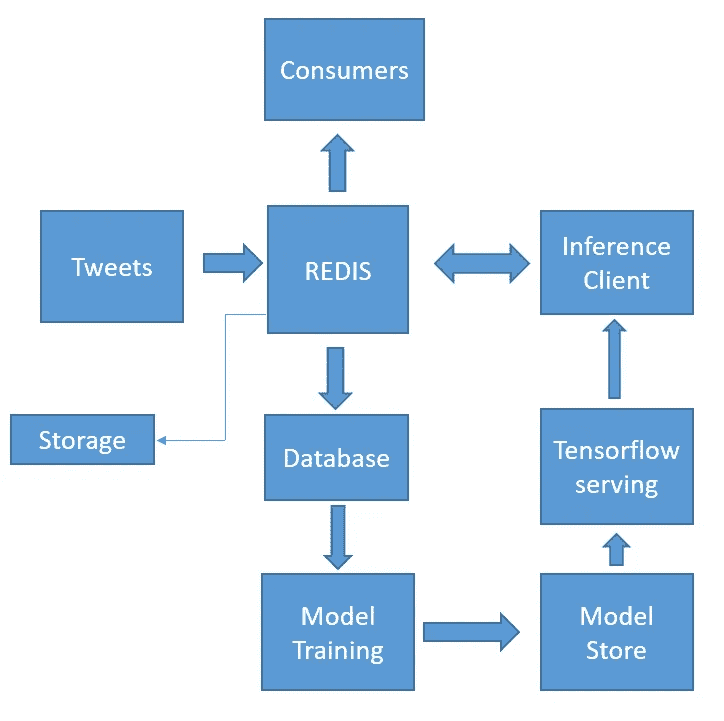

# 使用 Kubernetes 部署 BERT

> 原文：<https://towardsdatascience.com/deploying-bert-using-kubernetes-6ddca23caec5?source=collection_archive---------24----------------------->

## 谷歌云平台，Docker，微服务，NLP


伯特:[形象信用](https://www.propellermediaworks.com/blog/seo-bert-google-update/)

**简介 **

BERT 是 Google 广泛使用的 NLP 模型。2019 年被认为是 BERT 年，取代了大多数生产系统。BERT 使用基于自我关注的方法，该模型本身由变压器块组成，变压器块是一系列自我关注层。与基于 RNN 的序列对序列模型相比，BERT 证明了自我注意的使用导致了更优越的性能，特别是在 Stanford 问答数据集(SQUAD)上。我们已经跳过了所有的理论细节，如 RNN，LSTM 模型，自我关注，因为它们在吴恩达课程和[博客文章](https://jalammar.github.io/visualizing-neural-machine-translation-mechanics-of-seq2seq-models-with-attention/)s here[here](http://jalammar.github.io/illustrated-bert/)(作者 Jay Alammar)的课程中会讲到。另一个很棒的[帖子](/2019-year-of-bert-and-transformer-f200b53d05b9)提供了基于 BERT 的主要模型。请注意，注意力机制最初被应用于改善基于 RNN 的序列对序列模型的性能。Lilian Weng 也发表了一篇关于注意力机制的概述，她在其中解释了 transformer 架构。特别是键、值和查询概念，其中键和值相当于编码器输出，即存储器，而查询是解码器输出，然而，作为原始论文，它们是位抽象的，并且作用于所有字。ukasz Kaiser 解释了为什么它们更有效和高效的原因

从实现的角度来看，BERT 是一个拥有 1.1 亿或更多参数的大型模型，从头开始训练非常具有挑战性，正如 Google 的博客中所强调的。它需要有效的计算能力，模型结构必须仔细编程以避免错误。因此，为了使 BERT 模型易于使用，谷歌开源了它的[实现](https://ai.googleblog.com/2018/11/open-sourcing-bert-state-of-art-pre.html)，它可以在大约 30 分钟内微调到各种任务。一个例子是情绪分析任务，正如这里的[所解释的](https://colab.research.google.com/github/tensorflow/tpu/blob/master/tools/colab/bert_finetuning_with_cloud_tpus.ipynb)。限制参数数量的研究工作正在进行中。然而，微调 BERT 也是广泛使用的方法。

***目标***

这篇文章的目标是部署一个经过训练的 BERT 模型，作为一个微服务，对流媒体 tweets 进行情感分析。这个简单的例子揭示了为 ML 开发微服务的关键挑战。目标是涵盖强调训练和部署 ML 模型的高级工具需求的关键概念。这篇文章中涉及的主要任务是

1.  流数据(tweets)的数据预处理:就 ETL 而言，真实世界的系统要复杂得多
2.  使用经过训练(微调)的 BERT 模型进行推理

训练模型需要额外的考虑，以供审查和保留。这些将在另一篇文章中讨论。

我们的架构如下



采用的技术有(通过相关的 python API)

1.  伯特，张量流，张量流服务，雷迪斯，
2.  容器:Docker 容器和用于编排的 kubernetes

*Docker 和 kubernetes 的背景信息*

我们将开发微服务，使用容器部署它们，并使用 K8S 来管理这些容器。简而言之，容器是将代码和依赖项打包在一起独立运行的抽象。如果你不熟悉容器，请查看 docker [网站](https://www.docker.com/resources/what-container)获取更多信息和教程。Kubernetes (K8S)由 Google 开发，用于管理多个容器，它可以在本地计算集群或云上运行。所有主要的云提供商都支持 Kubernetes。这篇文章需要的主要 Kubernetes 概念如下

1.  基本 kubernetes 组件和 it [架构](https://kubernetes.io/docs/concepts/)。视频[这里](https://www.youtube.com/watch?v=8C_SCDbUJTg)
2.  pod 和部署
3.  持久性卷和持久性卷声明
4.  Kubenetes 服务公司
5.  [Kubectl](https://kubernetes.io/docs/reference/kubectl/overview/) :用来创建资源的命令。我们通过 yaml [文件](https://www.youtube.com/watch?v=o9pT9cWzbnI)创建各种资源

```
#Create deployment/pods
kubectl create -f tensorflowServing.yaml #Delete deployment/pods
kubectl delete -f tensorflowServing.yaml#Check pods and service
kubectl get pods
kubectl get svc#Check persistance volume and persistance volume cliam
kubectl get pv
kubectl get pvc
```

这里的[和这里的](https://medium.com/google-cloud/kubernetes-101-pods-nodes-containers-and-clusters-c1509e409e16)[提供了对这些概念的快速概述，而 youtube 的](https://medium.com/google-cloud/kubernetes-110-your-first-deployment-bf123c1d3f8?)[播放列表](https://www.youtube.com/playlist?list=PLF3s2WICJlqOiymMaTLjwwHz-MSVbtJPQ)提供了对这些概念的更详细的阐述。微软也开发了好的资源来开始 K8S。谷歌提供的资源是广泛的，最初可能有点令人不知所措。一旦你对 K8S 的概念有了概念，并尝试“你好世界”这里。它涵盖了流程，我们需要遵循相同的流程，几次！！！

文档中提到的过程如下

1.  将您的应用程序打包成 Docker 映像
2.  在您的机器上本地运行容器(可选)
3.  将图像上传到注册表
4.  创建一个容器集群
5.  将您的应用部署到集群
6.  通过服务向集群外部公开您的应用
7.  扩展您的部署

**回到我们的微服务**

1.  我们的第一个微服务使用 tensorflow-serving 和经过训练的保存模型运行 BERT，允许我们使用客户端执行推理
2.  第二个微服务使用 [gRPC](https://grpc.io/docs/tutorials/basic/python/) 客户端通过“请求”BERT 来执行情感分析，并将其发布到 Redis 发布/订阅频道

如果你正在使用 GCP，我们假设你已经在你的机器上安装了 *gcloud，kubectl* 并连接到名为“kubernetes”的项目，更多信息请参见[这里](https://cloud.google.com/deployment-manager/docs/step-by-step-guide/installation-and-setup)。对于其他设置，我们假设存在等效性。

我们首先通过命令行创建并连接到 GCP 的 kubernetes 集群

***创建***

```
**gcloud** beta container — project “kubernetes” clusters create “standard-cluster-1” — zone “us-central1-a” — no-enable-basic-auth — cluster-version “1.13.11-gke.14” — machine-type “n1-standard-1” — image-type “COS” — disk-type “pd-standard” — disk-size “100” — scopes “https://www.googleapis.com/auth/devstorage.read_only","https://www.googleapis.com/auth/logging.write","https://www.googleapis.com/auth/monitoring","https://www.googleapis.com/auth/servicecontrol","https://www.googleapis.com/auth/service.management.readonly","https://www.googleapis.com/auth/trace.append" — num-nodes “3” — enable-cloud-logging — enable-cloud-monitoring — enable-ip-alias — network “projects/kubernetes/global/networks/default” — subnetwork “projects/kubernetes/regions/us-central1/subnetworks/default” — default-max-pods-per-node “110” — addons HorizontalPodAutoscaling,HttpLoadBalancing — enable-autoupgrade — enable-autorepair
```

***连接***

```
**gcloud** container clusters get-credentials standard-cluster-1 — zone us-central1-a — project kubernetes
```

对于数据存储，我们使用谷歌云[磁盘](https://cloud.google.com/sdk/gcloud/reference/compute/disks/create)，模型是存储在一个单独的位置

```
**gcloud** beta compute disks create redis-disk-gce — project=kubernetes — type=pd-standard — size=100GB — zone=us-central1-a — physical-block-size=4096
```

*我们在这个设置中使用 redis 在微服务之间进行通信。Redis 被用作发布/订阅消息传递。有必要在集群上运行健壮的 redis 微服务。我们可能面临的一个问题是万一 redis 崩溃。Kubernetes 能够检测崩溃并创建一个新的容器，即 redis 实例来维护服务。然而，当重新创建容器时，新容器可能具有不同的状态。因此，为了避免这种情况，我们使用了持久性磁盘(一个专用的存储磁盘)，它通过使用持久性卷声明将这个存储链接到我们的 Redis 容器。这是一个非常简单的设置，在企业级别，要实现扩展，我们需要使用有状态集合。关于它的详细讨论可以在[这里](https://www.youtube.com/watch?v=FserPvxKvTA&t=3050s)找到，而示例 redis 配置可以在[这里](https://estl.tech/deploying-redis-with-persistence-on-google-kubernetes-engine-c1d60f70a043)找到。*

*在我们的设置中，有一个 redis 实例，我们使用 google 云盘通过 yaml 文件创建一个持久性卷和持久性卷声明。我们通过 redis 容器中的持久性卷声明的方式在 make use storage 中使用这些，如 ymal 文件中所概述的。我们还通过 kubernetes 服务向外部世界公开 redis。*

***服务张量流模型***

*通过使用 tensorflow 服务 API，在 kubernetes 中服务 tensorflow 模型非常简单。这些步骤如下*

1.  *从张量流图中收集输入(“sinputs”)和输出(“soutput”)变量的列表*
2.  *在保存模型之前创建预测签名*
3.  *使用保存模型[格式](https://www.tensorflow.org/guide/saved_model)保存模型*

*我们将训练好的模型复制到 tensorflow 服务 docker 映像，使用我们的模型创建新的 docker 映像，并上传到容器注册表，使用此处列出的[流程。我们的 docker 映像是 gcr.io/kubernetes-258108/bert.的**我们通过 kubenetes 部署来部署这个映像。我们还创建了 kubernetes 服务。**](https://www.tensorflow.org/tfx/serving/serving_kubernetes)*

***注意:使用通过“kubectl”获得的服务 IP 地址，让我们的集群之外的客户端发出请求。为了避免使用 IP 地址，需要使用 kube-dns 发现服务，这是有据可查的，这里有一个 python 示例。因为我们已经为 bert 推断客户端配置了服务，并且可以使用服务名“bertservice:8500 ”,所以 8500 是端口，因为我们是在集群中发出请求的。***

***在客户端发出请求的关键代码组件如下，它们基于 google client [示例](https://github.com/tensorflow/serving/blob/master/tensorflow_serving/example/resnet_client_grpc.py)。***

***推理客户端可用的完整示例如下。它由 [**Tweepy**](https://tweepy.readthedocs.io/en/latest/streaming_how_to.html#step-1-creating-a-streamlistener) **流监听器**组成，用于订阅 tweets 主题和 redis sub/pub 消息服务***

******Bert 推理客户端使用 gRPC 请求客户端******

***我们使用一个[docker 文件](https://docs.docker.com/get-started/part2/)将这个客户端打包在 docker 容器中，并部署在我们的 kubernetes 集群上***

***要为 python 容器创建的 docker 文件***

***现在，我们可以通过连接到 redis pods 或使用 python 订阅者，通过 kubectl 来观察带有情感的流推文***

```
***kubectl exec -it redis-pod-name redis-cli
127.0.0.1:6379> SUBSCRIBE STREAM***
```

***注意:我们不使用 GPU 进行推理，因此标准 N1 计算资源上的 gRPC 请求需要大约 12 秒(对于 20 个批处理大小)***

******关闭思绪******

***我们能够在 GCP 集群上部署此设置 3 天，没有发生任何事件。这展示了 ML 的容器和简单应用程序的威力，并且可以很快部署。然而，在现实世界中，情况完全不同。例如，ETL 可能是一项非常复杂的任务，可能需要 rabbit-MQ、Kafka 或 Apache beam 等高级技术来集成来自其他来源的数据。我们可能需要重新培训和重新部署 ML 模型。这些在另一篇博文中有所涉及。结合起来，这些应该提供开发微服务的介绍，并强调对其他技术的需求，如 Kubeflow、Apache Airflow、Seldon、helm charts，用于使用 kubernetes 基础设施开发 ML 应用程序。我们还没有讨论如何使用 Kubernetes 扩展我们的微服务。一种方法是利用复制集，但根据我们需要的任务和规模，可能会有一些考虑。例如，OpenAI 在最近的博客[帖子](https://openai.com/blog/scaling-kubernetes-to-2500-nodes/)中记录了将 kubernetes 扩展到 2500 个节点的挑战。***

***git 回购:这项工作可以在[这里](https://github.com/JP-MRPhys/BERT-sentiment-analysis)找到***