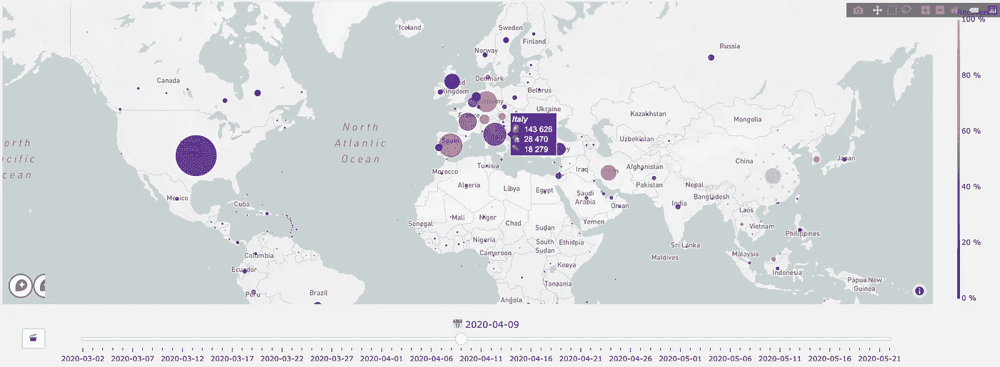
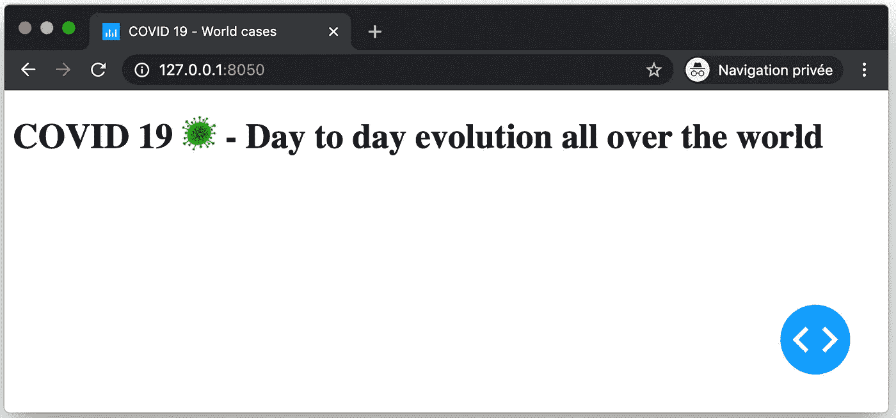
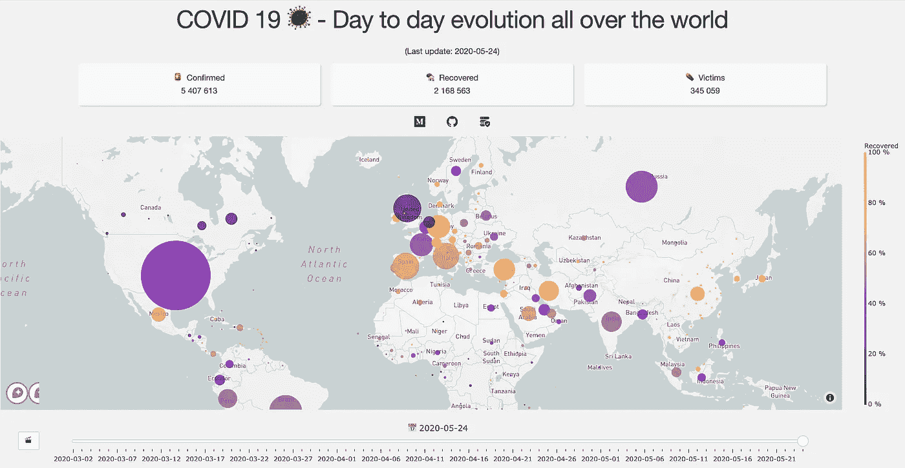
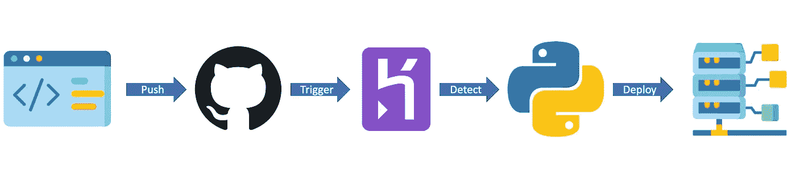
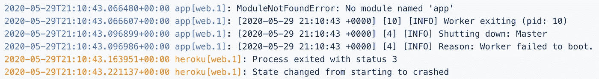
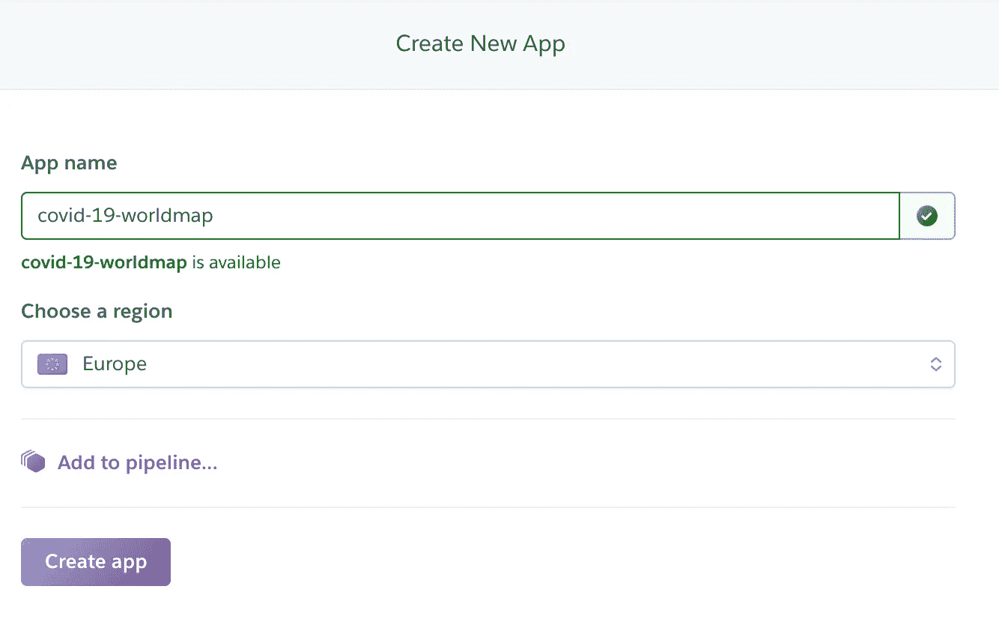
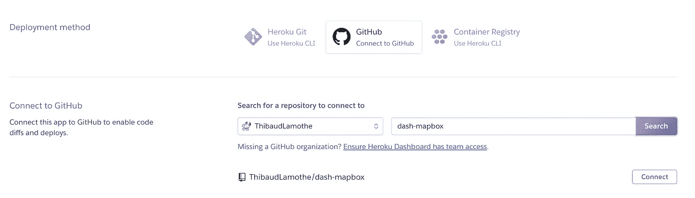
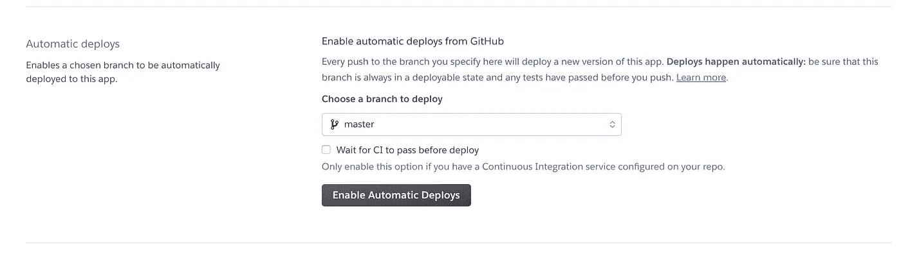

# 在 Heroku 上部署 Dash 或 Flask web 应用程序。简易 CI/CD。

> 原文：<https://towardsdatascience.com/deploying-dash-or-flask-web-application-on-heroku-easy-ci-cd-4111da3170b8?source=collection_archive---------37----------------------->

[图片](https://pixabay.com/fr/photos/bateau-en-papier-l-eau-flotteurs-2270314/)由[星舰](https://pixabay.com/fr/users/starflames-5196428/)在[皮克斯贝](https://pixabay.com/)拍摄

## 在笔记本电脑上开发 python web 应用非常棒。让每个人都能接触到它更令人满意。今天，我们将了解如何在 GitHub 的 Heroku 平台上轻松部署 python web 应用程序。

首先，我们将把我上一篇文章中构建的动画散点图[转换成一个基本的 Dash 应用程序，然后我们将评估 CI/CD 概念，最后，我们将从这个](/how-to-create-animated-scatter-maps-with-plotly-and-dash-f10bb82d357a) [GitHub repo](https://github.com/ThibaudLamothe/dash-mapbox) 在 Heroku 上部署应用程序。

情节动画散点图

# 构建应用程序

Dash 是构建在 Flask 和 Plotly 之上的 Python 框架，旨在制作数据驱动的 web 应用。多亏了 plotly，它提供了一些基本的图表，如直方图和饼状图，它还附带了许多高度可参数化的控件，如下拉菜单、复选框、日期滑块等等。

让我们从创建一个只有一个标题的非常基本的应用程序并运行它开始。

Dash 的“Hello World”脚本

把标题改成“你好，世界！”，我们会在这里找到最基本的 dash 应用程序。对于了解 Flask 的人来说，直到现在看起来都很像。

基本 Dash 应用程序—渲染界面

让我们用散点图来填充空白页。由于本文的目的是 Heroku 部署，我们将假设数据准备已经完成，并使用`pickle`模块存储在`dictionnary`中。如果你对此感到好奇，这里有一些有用的资源:

*   [如何为地图和指标准备数据](/how-to-create-animated-scatter-maps-with-plotly-and-dash-f10bb82d357a)
*   [数据准备脚本](https://github.com/ThibaudLamothe/dash-mapbox/blob/master/scripts/create_world_fig.py)和[关联的 CSS 文件](https://github.com/ThibaudLamothe/dash-mapbox/blob/master/assets/styles.css)

App 的基本结构

现在我们有了一个漂亮的标题，关于疫情的指标，以及生动的散点图。

仪表板应用

> 注意:这个应用程序并不旨在展示 Dash 及其回调函数的强大功能。这是一个非常基本的应用程序，主要用于演示如何在 GitHub 的 Heroku 上进行部署。

既然我们已经准备好了应用程序，我们就可以部署它了。为了做到这一点，我们将使用 Heroku 平台，但是让我们从发现集成和持续部署的概念开始。

# CI/CD

这是什么意思？您可能听说过 GitLab CI/CD、Circle CI、Travis CI 或任何其他包含这些字母的工具。但这意味着什么呢？

**CI/CD** ，或**持续集成/交付**和**持续部署**，专注于小增量变更的快速发布和整个开发过程中自动化的使用。在 DevOps 的核心，CI/CD 工具是其成功的关键。以下是这些概念的一些定义。

使用 Github 和 Heroku 的 CI 管道

**持续集成:**使用 CI，开发人员尽可能频繁地将他们的代码变更合并到回购的主分支中。一旦变更得到验证，就会运行自动化的构建和测试流程来验证变更的准确性。在开发周期中尽可能早地发现缺陷。测试自动化是持续集成的关键，以确保在集成到主分支时，新的提交不会破坏应用程序。

**连续交付**:它是 CI 的一个扩展，软件的设计、配置和参数化的方式使得它可以在任何时候自动投入生产。

**持续部署**:它比持续交付更进一步，通过每次变更自动协调应用程序向客户的部署。通过加速客户反馈循环，收益是巨大的——在软件质量、项目期限、结果和开发成本方面。

# 赫罗库

Heroku 是一个云平台即服务(PaaS)，为 web 应用部署提供服务器。它支持 Python 中的几种技术，提供 CI/CD 服务，并有一个“免费和爱好”计划，这使它成为一个非常方便的工具，可以与客户和朋友分享您的 POCs 或其他个人项目。

Heroku 运行时:从你的代码到你的最终用户(来自 Heroku 网站)

如前所述，我们将使用 CI/CD: **我们将把我们的应用部署映射到 GitHub repo 主分支上的任何推送**。这意味着小的修改应该在另一个分支上完成(例如`develop`分支)。当修改被批准后，我们将把`develop`分公司合并到`master`分公司。此操作将触发 Heroku，并根据您的新代码运行应用程序的新构建/部署。

## 先决条件

当 Heroku 检查您的回购协议时，它会自动检测使用的技术(在我们的例子中是 Python)。但是，要运行应用程序，需要遵循一些说明:

*   您需要从`app.py`文件运行您的应用程序，并且该文件需要位于 repo 的根目录下。任何其他尝试都将导致以下消息和部署崩溃。

使用 index.py 而不是 app.py 作为主文件会导致崩溃

*   你需要使用 Procfile，它会被 Heroku 查找。它是一个[单行文件](https://github.com/ThibaudLamothe/dash-mapbox/blob/master/Procfile)，必须命名为`Procfile`，包含启动网络服务器`web: gunicorn app:server.`的指令
*   如果您为您的项目使用了任何库，您应该在一个`requirements.txt`文件中指定它们。Heroku 在每次构建开始时运行一个`pip install -r requirements.txt`。如果任何使用的包不在该文件中，部署将会崩溃。为了确保您不会忘记任何包，您可以在项目的根目录下使用 Linux 命令`pip freeze > requirements.txt`，它将生成包含所有需要信息的文件。
*   重要提示:除了你的库之外，你还必须在你的需求文件中添加`gunicorn`包。
*   当然，应用程序的代码需要没有错误！

既然您已经为项目的部署做好了准备，让我们开始最终的部分部署吧！

## 首次部署

下面是实例化应用程序的持续部署并实现其首次发布的步骤。

*   注册并登录 [Heroku](https://www.heroku.com/) 。当它完成后，你将登陆到你的个人仪表盘，现在是空的。
*   点击右上角的“新建”按钮和“创建新应用程序”

*   您现在可以输入您的应用程序名称。它会自动告诉你它是否可用。由于“covid”和各种“covid19”、“新冠肺炎”或“covid_19”已经被占用，我在这里选择“新冠肺炎-世界地图”。您还可以选择您的应用程序将托管的地区:美国或欧洲。通常的选择是从你的用户中选择最接近的；)!
*   点击“创建应用程序”进入下一个屏幕，并关联您的回购。
*   无需为单个应用程序添加管道
*   是时候选择部署方法了。Heroku 提供了一个 CLI(命令行界面)工具，用于从您的终端设置部署。但是我们想从界面配置它，然后选择“连接到 GitHub”

*   由于这是第一次，您需要登录您的 GitHub 帐户。
*   然后，您可以选择 repo to 并单击 connect。几秒钟后，您将能够选择与持续部署相关联的分支。最佳实践是选择`master`分支。
*   选中“部署前等待配置项通过”选项，然后单击“启用自动部署”。

*   当更新您的分支时，它现在将运行新的构建和部署。您还可以选择要立即部署的分支。

神奇的事情发生了:几秒钟后，构建和部署就完成了。你可以[连接你的应用](https://covid-19-worldmap.herokuapp.com/)！

## 附加说明

*   现在，每当您通过推送提交或合并请求来更新您的主分支时，应用程序都会重新构建！
*   有时部署过程会失败。这并不有趣，但它确实发生了。你有两个工具来帮助你:日志**和控制台**。你可以在 Heroku 的应用程序页面点击右上角的按钮**“更多”**来访问它们。通过日志，您可以了解失败的原因和原因，但如果您仍然不明白为什么您的应用程序不能正确运行，您可以通过控制台进入虚拟机来检查您的文件。****
*   **现在，你已经订阅了 Heroku 免费计划。这足以满足我们的需求，但是有一个限制:几个小时不使用应用程序之后，服务器将关闭。这不是一个真正的问题，尽管这意味着下一个用户使用它时，他必须等待服务器启动，并且第一次加载可能会稍长一些。如果你知道你需要展示你的作品，提前几分钟查看网址是个好主意，这样可以避免这种延迟效应。**

# **结论**

**您已经在 Heroku 上部署了您的第一个 dash 应用程序，现在只要您修改了代码，只需将您的代码推送到 GitHub，您就可以让全球的任何人都可以看到它。我希望你喜欢它！现在轮到您在 Heroku 上部署基本的(甚至复杂的)web 应用程序了！**

**下一次我们将探索如何使用 Docker-Compose 通过 Docker 部署 dash 应用程序！敬请期待:)**

**提醒一下，GitHub 上有完整的代码[。此外，您可能已经注意到了 logzero 包在代码中的使用！我真的很喜欢这个软件包及其在控制台中彩色打印报表的能力。我建议你看看并阅读](https://github.com/ThibaudLamothe/dash-mapbox)[这篇文章，在这篇文章中我解释了为什么你应该在你的 DS 项目中使用它。](/why-you-should-use-logzero-as-a-logger-in-your-data-science-projects-fc06ff9b705c)**