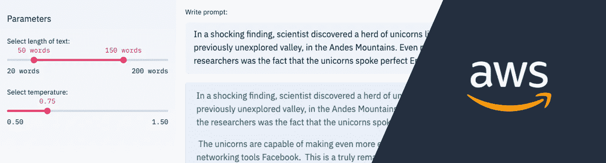
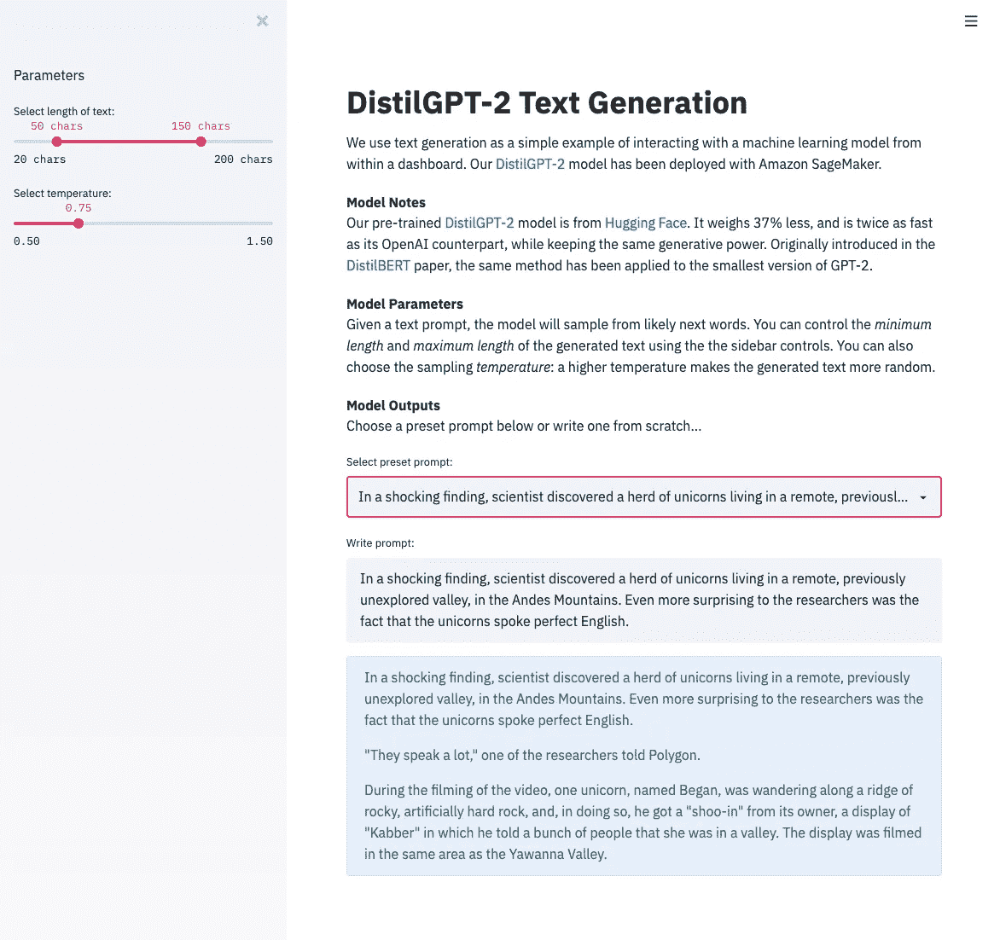
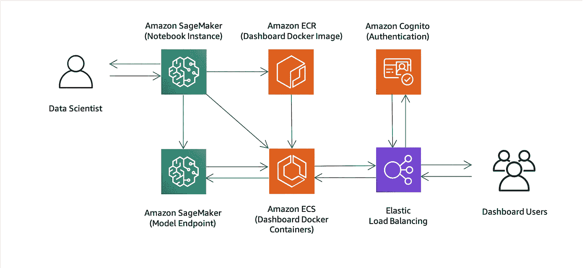
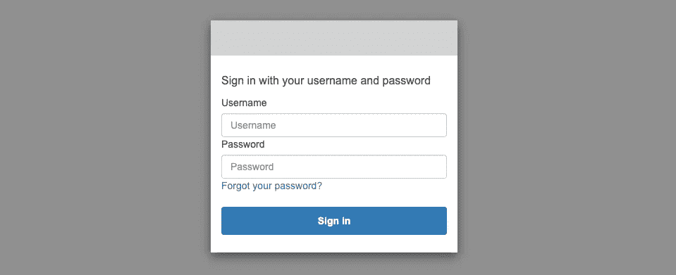

# 使用 AWS 为机器学习部署仪表板

> 原文：<https://towardsdatascience.com/deploying-dashboards-for-machine-learning-with-aws-944c9821db1c?source=collection_archive---------33----------------------->

## 包含 AWS CloudFormation 模板和代码示例。



我们都在努力开发*有用的*机器学习模型。在花费大量精力进行数据准备和模型开发之后，我们希望我们的模型能够对商业和更广阔的世界产生积极的影响。尽管成功取决于模型性能，但以清晰有效的方式传达模型预测同样重要。大多数机器学习应用程序都可以从拥有仪表板界面中受益。

## 拥有仪表板有什么好处？

仪表板是一个图形用户界面，显示与特定业务目标或流程相关的信息，这也可以包括机器学习模型预测。对于终端用户来说，使用可视内容通常要容易得多，而且根据定义，仪表板是可视的。与表格数据不同，肉眼可以快速识别出模型预测中的趋势、异常值和其他模式。一些机器学习任务本质上是可视的(例如物体检测)，而其他任务可以用图表(例如时间序列预测)和地图(例如空间-时间预测)来显示。甚至可以为简单的分类任务创建引人注目的仪表板视觉效果，只需以不同的方式汇总预测即可。有了设计良好的仪表板，最终用户可以做出更明智、更快速的决策。

让用户能够通过仪表板与模型及其预测进行交互，通常会增加对模型的信任，并导致模型的更广泛采用。除此之外，仪表板是当今企业中非常常见的使用模式，这种熟悉感鼓励了进一步的采用。即使最终产品中没有使用仪表板，它们也是在开发周期早期收集反馈的宝贵工具。



图 1:使用该解决方案部署的示例仪表板。

## 应该使用什么仪表板服务或工具？

随着仪表板的流行，有大量的服务和工具可供选择也就不足为奇了。选择合适的工作将取决于你的具体要求，但有两大类。

1.  托管仪表盘服务:如[亚马逊 QuickSight](https://aws.amazon.com/quicksight/) 和 [Kibana](https://docs.aws.amazon.com/elasticsearch-service/latest/developerguide/es-kibana.html) 。
2.  自定义仪表盘工具:如[流线型](https://www.streamlit.io/)、[面板](https://panel.holoviz.org/index.html)和[仪表盘](https://plotly.com/dash/)。

一般来说，如果您需要数据库集成、用户管理和可扩展性，并且可视化选项足以满足您的特定使用情形，您应该选择托管仪表板服务。当您需要额外的定制级别(在视觉和用户界面上)时，您应该选择定制仪表板工具。

我们的例子使用了 Streamlit，因为它简单、灵活，并与各种各样的可视化工具集成，如[牛郎星](https://altair-viz.github.io/)、[散景](https://docs.bokeh.org/en/latest/index.html)和 [Plotly](https://plotly.com/) 。不过，和往常一样，也有权衡。定制仪表板工具的部署可能比托管服务工具更复杂，因为您需要处理数据库集成、用户管理和可扩展性。

## 部署的解决方案是什么？

在这篇文章中，我们将对这个问题给出一个全面的回答，并深入探讨一些可能被忽略的重要细节。我们将首先考虑在 Amazon EC2 上部署我们的定制仪表板。添加一些额外的需求(比如安全性、身份验证和可伸缩性)，然后我们讨论一个更全面的仪表板部署架构。

不仅仅是理论，我们还包括了一个用于仪表板开发和部署的[可定制解决方案](https://github.com/awslabs/sagemaker-dashboards-for-ml)。一个 [AWS CloudFormation 模板](https://github.com/awslabs/sagemaker-dashboards-for-ml/blob/c8a8ec98f1d31a35b90aee666526b437a5d78410/cloudformation/template.yaml)被共享，这样你只需点击几下鼠标就可以在你自己的 AWS 账户中创建所有需要的资源。您可以选择部署两个示例仪表板应用程序之一:“纽约市的[优步皮卡](https://github.com/awslabs/sagemaker-dashboards-for-ml/tree/c8a8ec98f1d31a35b90aee666526b437a5d78410/examples/nyc-uber-pickups)”(一个独立的示例)和“ [DistilGPT-2 文本生成](https://github.com/awslabs/sagemaker-dashboards-for-ml/tree/c8a8ec98f1d31a35b90aee666526b437a5d78410/examples/text-generation)”(一个与机器学习模型交互的示例)。所有代码都是可定制的。我们已经采用了集装箱化的方法(使用 Docker)，因此您可以将该解决方案与一系列定制的仪表板工具一起使用。

> 🐙:[点击这里](https://github.com/awslabs/sagemaker-dashboards-for-ml)查看 GitHub 上的代码
> 
> 🚀:[点击此处](https://us-west-2.console.aws.amazon.com/cloudformation/home?region=us-west-2#/stacks/create/review?templateURL=https://sagemaker-solutions-us-west-2.s3-us-west-2.amazonaws.com/sagemaker-ml-dashboards/build/packaged.yaml&stackName=sagemaker-dashboards-for-ml&param_ResourceName=sagemaker-dashboards-for-ml&param_SageMakerNotebookGitRepository=https://github.com/awslabs/sagemaker-dashboards-for-ml)启动 AWS CloudFormation 堆栈

# 最小方法

简化 AWS 上的 it 部署的最简单的方法之一是使用[亚马逊 EC2](https://aws.amazon.com/ec2/) 。您可以在 Amazon EC2 实例(即 AWS 云中的虚拟服务器)上部署您的仪表板，并让仪表板用户连接到该实例。如果你需要为你的仪表板使用深度学习模型，你可以在 [GPU 实例](https://aws.amazon.com/ec2/instance-types/p3/)上使用 [AWS 深度学习 AMI](https://aws.amazon.com/machine-learning/amis/) 。在 Amazon EC2 上部署时，您应该问自己以下问题:

谁可以访问应用程序，如何将访问权限限制在特定的个人？敏感通信是否被 HTTPS 加密了？如果服务器崩溃会发生什么？谁将在实例上安装错误修复和安全更新？如果用户数量随着时间的推移大幅上升和下降，会发生什么情况？该实例能处理高峰流量吗？模型和应用程序的更新呢？这样的例子不胜枚举。

因此，尽管这种方法在架构上很简单，但是根据您的用例，有许多因素会使事情变得更复杂。我们现在来看一种替代方法，它使用许多其他 AWS 服务来帮助我们实现全功能部署。

# 综合方案

在这种方法中，我们有 3 个中央 AWS 服务: [Amazon SageMaker](https://aws.amazon.com/sagemaker/) 、 [Amazon ECS](https://aws.amazon.com/ecs/) 和 [Amazon Cognito](https://aws.amazon.com/cognito/) 。Amazon SageMaker 是为无缝模型训练和部署而设计的，它也非常适合仪表板开发。亚马逊 ECR 和 ECS 是集装箱部署的完美补充。Amazon Cognito 专门从事简单安全的身份验证。结合这些 AWS 服务，我们最终得到了图 2 所示的架构。然后我们将直接进入细节。



图 2:使用的 AWS 组件的架构。其中一些是可选的。

## 使用亚马逊 SageMaker

当涉及到构建、训练和部署机器学习模型时，亚马逊 SageMaker 简化了体验。几分钟之内，您就可以旋转 Jupyter 笔记本电脑，并开始在专用和完全托管的基础架构上部署模型。开箱即用，您可以访问许多预构建的 Conda 环境和 Docker 容器。在“DistilGPT-2 文本生成”示例中，预构建的 [PyTorch](https://docs.aws.amazon.com/sagemaker/latest/dg/pytorch.html) Docker 容器用于在 [ml.c5.xlarge](https://aws.amazon.com/sagemaker/pricing/instance-types/) 实例上部署来自 [transformers](https://github.com/huggingface/transformers) 的 [DistilGPT-2](https://huggingface.co/distilgpt2) 模型。Amazon SageMaker 然后提供了一个简单的 HTTP 端点来与部署的模型进行交互。我们的示例应用程序使用`[invoke_endpoint](https://boto3.amazonaws.com/v1/documentation/api/latest/reference/services/sagemaker-runtime.html?highlight=invoke_endpoint#SageMakerRuntime.Client.invoke_endpoint)`方法(来自`[boto3](https://boto3.amazonaws.com/v1/documentation/api/latest/index.html)`)来调用文本生成模型。

```
import boto3
import jsondata = {
    'text': 'In a shocking finding',
    'parameters': {
        'min_length': 100,
        'max_length': 200
    }
}sagemaker_client = boto3.client('sagemaker-runtime')response = sagemaker_client.invoke_endpoint(
    EndpointName='text-generation',
    ContentType="application/json",
    Accept="application/json",
    Body=json.dumps(data)
)body_str = response['Body'].read().decode("utf-8")
body = json.loads(body_str)print(body['text'])
# In a shocking finding, scientist discovers a herd of unicorns...
```

Amazon SageMaker 也可以用于仪表板开发。部署模型后，可以直接在笔记本实例上构建和测试仪表板。为了简化应用程序部署，采用了容器化的方法，但是在编辑文件时，您仍然可以获得实时重新加载的所有好处(由于有了[本地卷挂载](https://docs.docker.com/storage/volumes/))。当在 Amazon SageMaker 笔记本实例上运行 dashboard 容器时，您可以通过以下经过身份验证的 URL 上的 [jupyter-server-proxy](https://github.com/jupyterhub/jupyter-server-proxy) 来访问它:

```
[https://{NOTEBOOK_URL}/proxy/8501/](https://sagemaker-dashboards-for-ml2-notebook.notebook.us-west-2.sagemaker.aws/proxy/8501/)
```

当你在 Amazon SageMaker 上完成应用程序开发后，你可以将你的容器推送到[Amazon Elastic Container Registry](https://aws.amazon.com/ecr/)(ECR)。与 Docker Hub 类似，它为您的 Docker 图像提供了一个存储库，但它将图像保存在您的 AWS 帐户中，以获得额外的安全性和可靠性。

```
docker tag {IMAGE_NAME} {DASHBOARD_ECR_REPOSITORY_URL}:latest
docker push {DASHBOARD_ECR_REPOSITORY_URL}:latest
```

## 使用亚马逊 ECS

您的 dashboard Docker 图像现在在 Amazon ECR 上，但是应用程序实际上还没有运行。[亚马逊弹性容器服务](https://aws.amazon.com/ecs/) (ECS)是运行 Docker 容器的全托管服务。您不需要供应或管理服务器，您只需定义需要运行的任务并指定任务所需的资源。我们的[示例](https://github.com/awslabs/sagemaker-dashboards-for-ml/blob/c8a8ec98f1d31a35b90aee666526b437a5d78410/cloudformation/deployment/deployment.yaml#L371) [任务定义](https://docs.aws.amazon.com/AmazonECS/latest/developerguide/task_definitions.html)声明 dashboard Docker 容器应该使用单个 vCPU 和 2GB 内存运行。我们的[示例](https://github.com/awslabs/sagemaker-dashboards-for-ml/blob/c8a8ec98f1d31a35b90aee666526b437a5d78410/cloudformation/deployment/deployment.yaml#L403) [服务](https://docs.aws.amazon.com/AmazonECS/latest/developerguide/ecs_services.html)同时运行并维护任务定义的指定数量的实例。因此，为了提高可用性，您可以使用 [AWS CLI](https://aws.amazon.com/cli/) 将服务的期望任务计数设置为 2:

```
aws ecs update-service \
  --cluster {DASHBOARD_ECS_CLUSTER} \
  --service {DASHBOARD_ECR_SERVICE} \
  --desired-count 2
```

使用 Amazon ECS 服务的一个主要优点是，它不断地监控任务的健康状况，并替换由于任何原因而失败或停止的任务。亚马逊 ECS 服务还可以[自动扩展](https://docs.aws.amazon.com/AmazonECS/latest/developerguide/service-auto-scaling.html)任务数量(即自动增加或减少)，以应对高峰时期的高需求，并在低利用率期间降低成本。我们的示例解决方案还包括一个[应用负载平衡器](https://docs.aws.amazon.com/elasticloadbalancing/latest/application/introduction.html)，它在任务间分配流量，与[Amazon Certificate Manager](https://aws.amazon.com/certificate-manager/)(针对 HTTPS)集成，并通过 [Amazon Cognito](https://aws.amazon.com/cognito/) 认证流量。

## 使用亚马逊认知

当您的仪表板的内容是私有的时，Amazon Cognito 可用于限制某一组用户的访问。尽管该组件是可选的，但在解决方案中默认情况下是启用的。您可以与社交和企业身份提供商(如谷歌、脸书、[亚马逊](https://developer.amazon.com/login-with-amazon)和微软 Active Directory)集成，但该解决方案会创建自己的[用户池](https://docs.aws.amazon.com/cognito/latest/developerguide/cognito-user-identity-pools.html)，其中包含特定于应用程序的帐户。您只需要在堆栈创建过程中提供一个电子邮件地址来接收临时登录凭证。



图 3: Amazon Cognito 登录

当 Amazon Cognito 身份验证启用时，您将在首次尝试访问应用程序时看到托管登录页面。使用临时登录凭据，然后输入该帐户的新密码。成功登录后，您将能够看到您的仪表板。

# 摘要

有时，机器学习的仪表板可以直接从您的开发机器上展示。但是，当您需要与世界其他地方(或您的公司内部)共享您的仪表板时，就需要一种健壮且安全的方法。

我们走过了一个可以帮助解决这个问题的解决方案:Amazon SageMaker 用于简化机器学习模型部署，Amazon ECR 和 ECS 用于运行和维护仪表板服务器，Amazon Cognito 用于控制仪表板访问。AWS CloudFormation 可用于在您自己的 AWS 帐户中自动创建解决方案的所有 AWS 资源，然后您可以根据需要定制解决方案。

> 🐙:[点击这里](https://github.com/awslabs/sagemaker-dashboards-for-ml)查看 GitHub 上的代码
> 
> 🚀:[点击此处](https://us-west-2.console.aws.amazon.com/cloudformation/home?region=us-west-2#/stacks/create/review?templateURL=https://sagemaker-solutions-us-west-2.s3-us-west-2.amazonaws.com/sagemaker-ml-dashboards/build/packaged.yaml&stackName=sagemaker-dashboards-for-ml&param_ResourceName=sagemaker-dashboards-for-ml&param_SageMakerNotebookGitRepository=https://github.com/awslabs/sagemaker-dashboards-for-ml)启动 AWS CloudFormation 堆栈