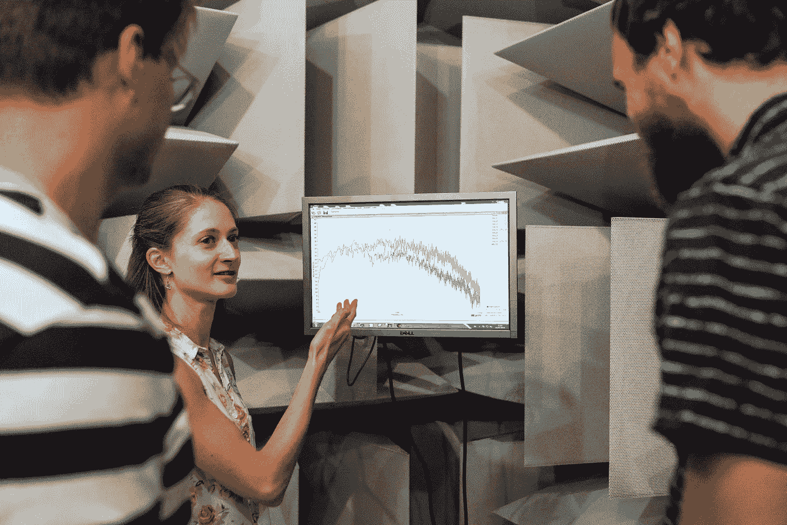
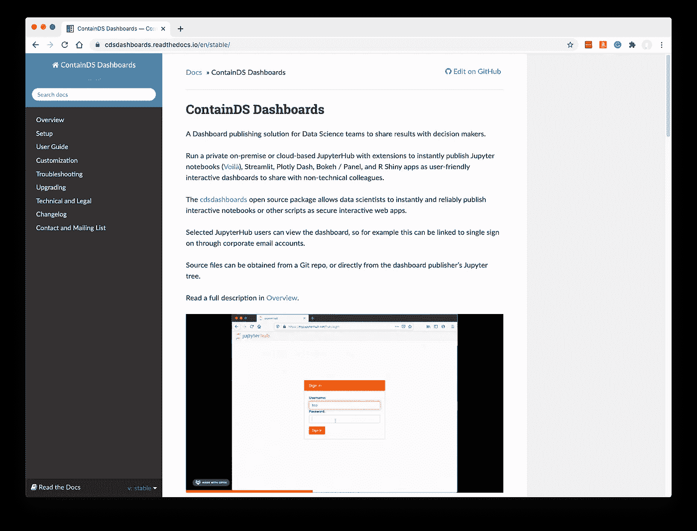
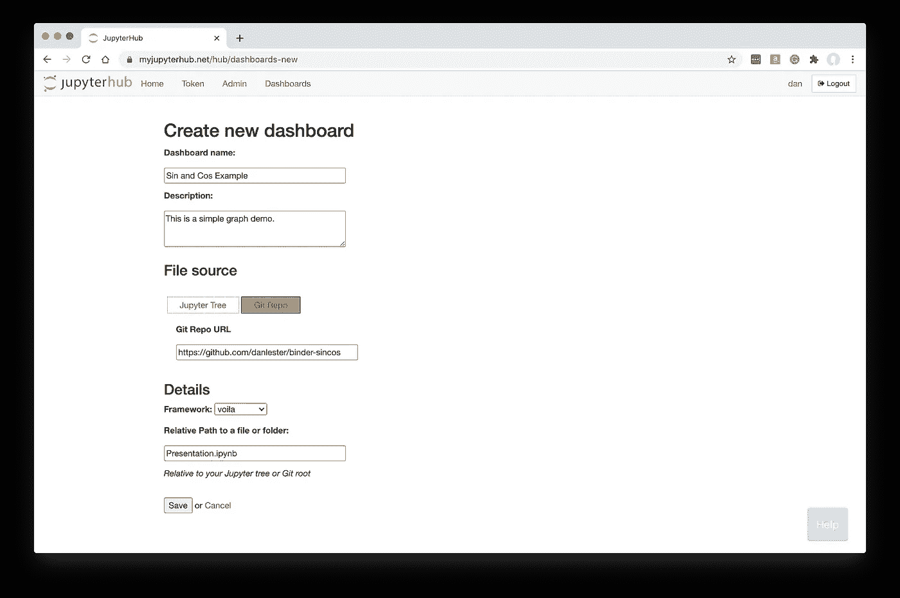
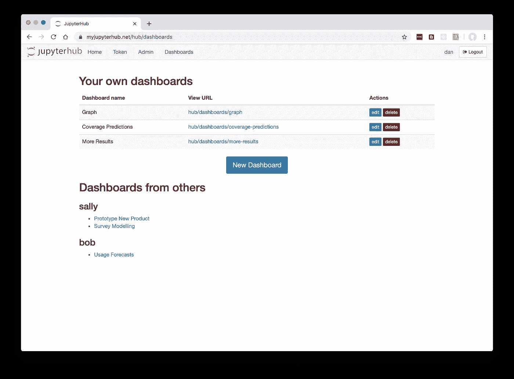
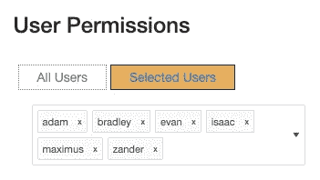
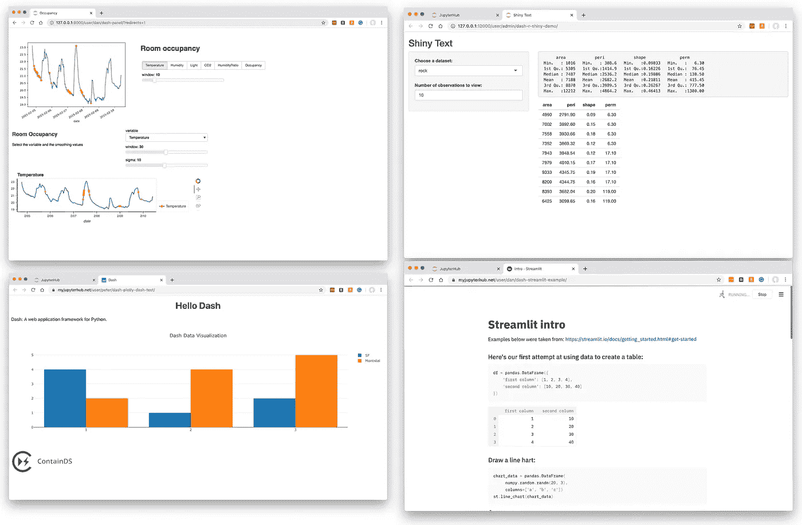

# 自动、可靠、安全地部署数据仪表板

> 原文：<https://towardsdatascience.com/deploying-data-dashboards-automatically-reliably-and-securely-372ef802ca3c?source=collection_archive---------38----------------------->

## 新的开源软件，以所有语言和框架安全地自动部署数据科学家的交互式可视化

当今的数据项目需要交互式可视化，才能脱颖而出，给客户或组织中的决策者留下深刻印象。越来越多的开源仪表板框架允许数据科学家构建用户界面，而无需学习 Javascript 或 HTML。

来自 [Pexels](https://www.pexels.com/photo/engineers-in-sound-studio-3861947/?utm_content=attributionCopyText&utm_medium=referral&utm_source=pexels) 的 [ThisIsEngineering](https://www.pexels.com/@thisisengineering?utm_content=attributionCopyText&utm_medium=referral&utm_source=pexels) 摄影

例如，Volià以其最简单的形式显示了一个 Jupyter 笔记本，作为一个用户友好的网络应用程序——代码单元被隐藏，笔记本从上到下自动运行，用户不必在其中移动和输入。基于 Python 的小部件库提供了简单的用户控件，如滑块和下拉框。

数据科学家和分析师可以通过一个简短的教程开始使用这些框架。他们显然有技术能力找到一种方法来托管由此产生的 web 应用程序，也许是暂时在他们自己的笔记本电脑上，或者通过 AWS 帐户进行部署。

但是这个简单的部署步骤最终成为组织中采用仪表板框架最常见的障碍。

虽然这个过程可能很简单，但它本身是没有回报的——当数据科学家自豪地完成他们全新的分析时，需要运行一些乏味的命令。更糟糕的是，它容易出错，并可能暴露敏感数据。

正如自动化测试和持续集成使发布新功能变得有趣，而不是传统软件开发中的琐事一样，共享数据仪表板的任何障碍都会扼杀创新，阻碍新的迭代。

将部署选择留给您的数据科学家是不明智的，因为他们在技术上无疑是精明的。他们没有时间保护服务器，可能会选择最简单的认证系统。对于安全的定期部署，您确实需要一种统一的方法来托管您的数据团队，这种方法可以得到您的信息安全部门的全面批准。

这些仪表盘在技术上是网络应用。他们不需要 IT 部门花三个月的时间来审核他们的安全性，但需要有一种经过批准的方法来部署他们，这种方法不会像数据科学家在自己的设备上使用的临时方法那样让 IT 部门感到恐惧。

您需要知道您的所有仪表板在哪里运行，以及它们是如何被认证的。否则，可能会有过时和不安全的服务器在外面运行，暴露您的网络和敏感数据。当员工离开您的组织时，您需要能够终止他们对这些仪表板的访问。如果该员工碰巧在其个人 AWS 帐户上运行了一些仪表盘，您就不需要依靠他们来记住在哪里运行了什么，以便您可以关闭它们或转移所有权！

# 容器产品套件

免费的开源 ContainDS 软件产品可以为您的数据科学家提供一个统一的部署平台，允许他们以自动化、安全和可复制的方式共享基于开源框架的仪表板。

可以使用任何开源的仪表板框架。标配支持 Voilà、Streamlit、Plotly Dash、Bokeh、Panel 和 R Shiny。这些应该是您的数据科学团队可能面临的任何项目的良好起点！

[ContainDS](https://containds.com/) 是两个主要产品和相关开源技术的集合。

包含仪表板文档(图片由作者提供)

*ContainDS Dashboards* 是一个在互联网或内部网络上托管和共享仪表板的平台，拥有指定的认证用户——可能是特定的同事或客户。

有时，即使这样也太开放了，所以如果由于缺乏互联网或合同原因无法通过网络访问数据而需要离线共享仪表板， *ContainDS Desktop* 是一款适用于 Windows 或 Mac 电脑的应用程序，允许您在本地机器上运行仪表板，并将其作为单一平面文件与其他人共享。

在这里，我们将重点介绍在线仪表板软件。

## 通过 JupyterHub 的在线仪表板

ContainDS Dashboards 是流行的 JupyterHub 软件的扩展。如果你已经有一个正在使用的 JupyterHub，这使得安装特别容易，但是第一次安装一个并不太复杂，而且无论如何都是有用的。

JupyterHub 是为整个团队集中管理 Jupyter 笔记本环境的一种方式。标准安装允许每个用户启动他们自己的 Jupyter 笔记本，ContainDS Dashboards 扩展允许他们直接启动用户友好的仪表板，与其他经过身份验证的用户共享它们。

JupyterHub 的不同“发行版”提供了不同的维护和可伸缩性方法。有许多定制选项，但两个主要路径是运行在 Kubernetes 上的 [Zero 2 JupyterHub](https://zero-to-jupyterhub.readthedocs.io/) ，允许为大量用户或项目在多台机器上无缝扩展资源；和[最小的 JupyterHub](https://tljh.jupyter.org/) 设置一个虚拟机来运行 JupyterHub(考虑到目前云提供商提供的虚拟机范围，这仍然可以支持惊人的大量使用！).

## 加载你的应用文件

选择用于部署仪表板的应用程序文件有两种主要方式:您的“文件源”可以来自您现有的 Jupyter 服务器树，也可以来自 Git repo(公共或私有)。

从 GitHub repo 创建 Voilà仪表板(图片由作者提供)

如果您已经是 Jupyter 笔记本的大量用户，并且可能只想将笔记本部署为 Voilà或 Panel 应用程序，那么使用第一个选项— Jupyter Tree 可能是有意义的。你可以像平常一样编辑你的笔记本，然后当你满意的时候，进入 JupyterHub 中的 Dashboards 菜单，输入你的笔记本的路径，看到它自动部署为一个新的仪表板。

更好的是，现在有一个配套的 Jupyter 扩展，所以你可以直接从 JupyterLab 或笔记本一键创建一个仪表板。

或者，如果您习惯于在本地机器上编辑 Streamlit、R Shiny、Plotly Dash 应用程序等，将您的代码签入 Git repo，然后指示 ContainDS Dashboards 直接从您的 repo 中提取并部署它，可能会更方便。你可以使用公共或私有 Git 回购，GitHub 集成意味着你可以通过 GitHub 帐户一键登录 JupyterHub，并在此过程中自动授予对你的回购的访问权限。

使用任何一种文件源方法，您也可以从多个 Conda 环境中进行选择，如果您已经为 JupyterHub 用户提供了这些环境的话。

从下拉列表中选择正确的“框架”也很重要，以确保使用正确的机制来服务仪表板。正如已经列出的，Voilà、Streamlit、Plotly Dash、Bokeh、Panel 和 R Shiny 目前都支持开箱即用，但很容易添加任何作为 web 应用程序工作的自定义框架。

一旦部署，仪表板实际上就像独立的 Jupyter 服务器，但它们不是运行 Jupyter notebook，而是直接运行您选择的框架的服务器软件。如果您曾经尝试过 Jupyter 笔记本中的 Voilà Preview 按钮，您会对最终结果很熟悉——但是在 ContainDS 仪表板的情况下，部署根本没有 Jupyter 前端。您的应用程序将被部署为纯 web 应用程序。这正是你要与他人分享的应用程序所需要的…最终用户不应该能够在你的服务器上运行任意代码。

## 与其他用户共享

添加到 JupyterHub 中的新仪表板菜单不仅用于注册新仪表板以进行部署，还用作与您共享的任何仪表板的内容列表。

仪表板主菜单屏幕(作者图片)

当您创建仪表板时，您可以选择是将其提供给 JupyterHub 中的所有用户，还是仅提供给选定的指定用户。JupyterHub 允许多种身份验证方法，例如，使用 LDAP 或 Google 单点登录，您的所有同事都可以通过自动为他们创建的帐户轻松访问您的仪表板。

为仪表板访问选择命名用户(按作者排序的图片)

授权用户可以点击任何与其共享的仪表板，点击确认 OAuth 同意屏幕，然后立即开始与仪表板交互。

在 ContainDS 仪表板内运行的仪表板可视化示例(图片由作者提供)

## 可扩展和可配置

关于 JupyterHub 的一切都是高度可配置的:从您托管它的位置(Kubernetes，在云 VM 上，或者在您的内部网络上)到用户登录时如何认证。

这同样适用于 ContainDS 仪表板——您可以完全控制它的行为方式，甚至可以通过编辑配置文件来插入您自己的仪表板可视化框架(例如，基于 Flask 的 web 应用程序)。

# 结论

这是对 ContainDS 仪表板的一个快速概述，解释了数据科学家部署一个新的交互式可视化来与客户或同事共享是多么容易。

您的数据科学家已经在试验新的可视化框架，这些框架在过去几年中出现在开源领域。他们的应用程序在他们的开发机器上运行得很好，但是当他们需要部署它时总是很痛苦。

通常，他们会转而导出 PDF 文件，或者只是将图表复制粘贴到电子邮件中。这是一个真正错过的机会，让决策者真正沉浸在数据模型中。

如果仪表板最终被部署，它通常不是以 it 批准的方式进行的，只有简单的身份验证步骤和托管在任意云服务器上。

对于大中型数据科学团队来说，不同的项目有不同的需求，数据科学家希望选择对他们自己的技能和项目需求有意义的开源框架。

为了克服这些问题，ContainDS Dashboards 提供了一个统一的部署和共享模型，无论数据科学团队使用何种技术来推动他们的分析，都可以由 IT 部门管理和轻松使用该模型。

有关安装详情，请参见[包含仪表板文档](https://cdsdashboards.readthedocs.io/)。

*丹·莱斯特是* [*Ideonate*](https://ideonate.com/) *的联合创始人，为数据科学家制作工具，包括*[*ContainDS*](https://containds.com/)*，这是一个为从事离散项目的团队提供的数据科学部署平台。*