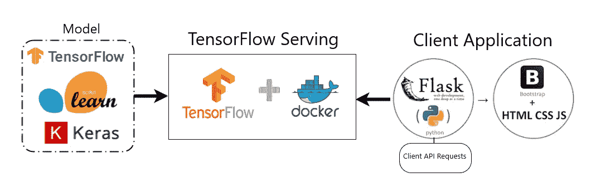
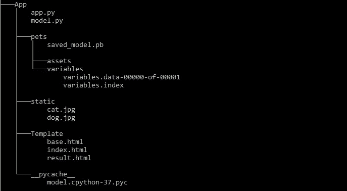
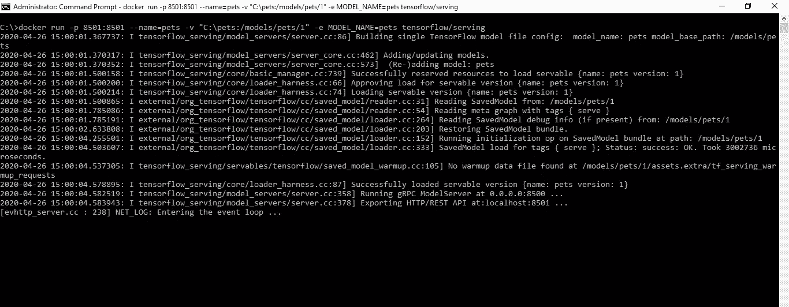
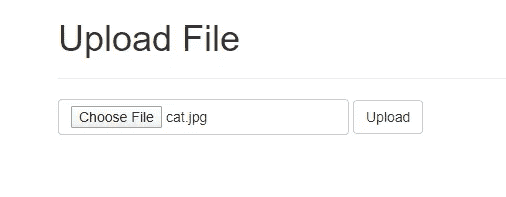
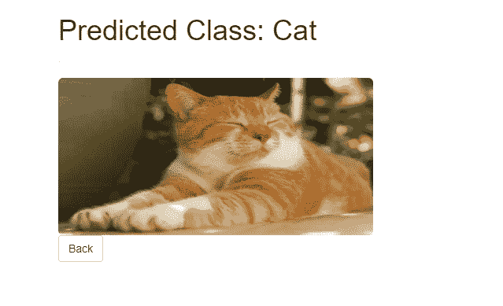

# 使用 TensorFlow 与 Docker 和 Flask 一起部署深度学习模型

> 原文：<https://towardsdatascience.com/deploying-deep-learning-models-using-tensorflow-serving-with-docker-and-flask-3b9a76ffbbda?source=collection_archive---------11----------------------->

通常，任何数据科学项目的生命周期都包括定义问题陈述、收集和预处理数据，然后是数据分析和预测建模，但任何数据科学项目最棘手的部分是模型部署，我们希望最终用户使用我们的模型。有许多部署机器学习模型的方法，但 TensorFlow serving 是一个高性能的模型部署系统，它使在生产环境中随着时间的推移维护和更新模型变得非常容易。

深度学习模型部署，TensorFlow 服务在 Docker 中运行，由 Flask App 使用

在本教程中，我们将借助 Docker 提供的 TensorFlow 部署一个预训练的 TensorFlow 模型，还将使用 Flask web framework 创建一个可视化 web 界面，该界面将用于从所提供的 TensorFlow 模型中获取预测，并使最终用户能够通过 API 调用进行消费。

TensorFlow serving 为开发人员提供了一个将人工智能融入软件系统的简单集成，并且已经被用于生产大量的谷歌产品。它可以同时服务于多个模型和同一模型的多个版本。Flask 是一个轻量级的 python web 框架，它让开发者可以轻松快速地创建 web 应用。Docker 是一个将软件组件隔离到容器中的工具，所有的软件依赖项都作为一个包安装和部署在容器中。

# **让我们把手弄脏吧！！**

本教程将假设您运行的是 python 3.7 版的 Windows

让我们看一下目录结构，以便更好地理解模型结构和 Flask web app。

*   `App.py`—flask app 的主应用文件/控制器
*   `Model.py` —将 TensorFlow 模型服务器连接到 flask web 应用程序
*   `pets` —预训练保存的猫和狗分类 ML 模型
*   `Template` —包含 flask 应用程序将提供的 html 文件
*   `static` —包含应用程序的静态内容，例如图像

# **在本地主机上设置 TensorFlow 服务服务器**

因为我们的 pets 文件夹中有一个预先训练好的模型，所以我们必须指定本地机器上的模型路径和模型将暴露到的端口，以便我们的 Flask 应用程序可以调用本地主机上的那个端口，并发送数据以获得预测。

Docker RUN 命令将安装 TensorFlow 服务的 Docker 映像，并将创建指向 pets 模型的 docker 实例。

*先决条件:*请启用 Hyper-V 功能并安装 [docker](https://docs.docker.com/docker-for-windows/install/)

> 以管理员身份运行 CMD 并执行以下命令:
> `docker run -p 8501:8501 — name=pets -v “C:\pets:/models/pets/1” -e MODEL_NAME=pets tensorflow/serving`

命令行参数的详细信息如下:

`-p 8501:8501` —指定本地主机上 TensorFlow 服务器的端口 8501，docker 公开冒号后的端口用于服务

`--name=pets` —指定 docker 实例名称

`-v “C:\pets:/models/pets/1”` —指定本地主机上的模型路径和 docker 实例
内的模型路径**注意:**在模型路径`“/models/pets/1”`中，目录名`“pets”`应该与模型名环境变量相匹配，`/1`表示模型的版本，可以使用这个版本号升级模型。

`-e MODEL_NAME=pets` —指定模型名称环境变量

`tensorflow/serving` —指定要下载的 docker 图像名称

执行该命令后，您应该会得到以下输出:

现在，我们已经在`localhost:8501`上设置了模型服务器，让我们开发可视化 web 界面，它将使用 REST API 调用来使用模型。

# **使用**引导程序对烧瓶 App 进行编码

现在，我们将遍历`app.py`文件，它将作为应用程序的控制器。这里，我们正在创建 flask app 的一个实例，并向接受 GET 和 POST 请求并将上传的图像保存在静态文件夹中的`index.html` 添加一个默认路由，然后静态文件夹调用 model.get_prediction 函数来获取预测并将其传递给`result.html`。

我们将简单地在 bootstrap 类中传递 app 实例，以便在 html 文件中使用 Bootstrap 功能。

我们可以在`index.html` 中编写一个完整的 html 代码，也可以使用 jinja 模板引擎将其分解成组件。现在，为了在我们的 html 文件中使用 bootstrap 和一些常见功能，我们将编写一个`base.html` ，它将从 Bootstrap 扩展`base.html` ，并设置应用程序的标题和定义内容块占位符。

接下来，我们编写一个`index.html` ，在其中我们扩展了 base.html，并进一步开发了上传图像的功能。

使用下面的代码在`result.html`中显示来自模型的预测和输入图像

到目前为止，TensorFlow 服务器已经启动，可视化 web 界面开发也接近完成，让我们通过在`model.py` 中编写一个小函数来连接这两个独立的实体，该函数将在 JSON 对象中加载、预处理和编码图像，并使用`MODEL_URI`向模型服务器发出 post 请求，并对模型预测执行后处理。

# **设置环境并运行应用**

为避免现有安装出现问题，建议为此应用创建一个新的虚拟环境。

*先决条件:*请[安装 anaconda](https://docs.anaconda.com/anaconda/install/windows/) 用于管理虚拟环境。

让我们创建一个[虚拟环境](https://docs.conda.io/projects/conda/en/latest/user-guide/tasks/manage-environments.html#creating-an-environment-with-commands)并通过执行以下命令[安装 flask](https://pypi.org/project/Flask/) 及其依赖项。

> `conda create –n flaskapp python=3.7`
> 
> `conda activate flaskapp`
> 
> `pip install tensorflow==2.1.0 flask flask-bootstrap requests pillow grpcio grpcio-tools`

转到保存`app.py` 的目录，使用以下命令启动 flask 应用程序，但要确保 TensorFlow 服务的 docker 实例已经启动并正在运行。

> `python app.py`

如果您获得以下输出，这意味着应用程序在本地主机上成功运行。

flask 的默认端口是 5000，因此通过键入`localhost:5000` 在浏览器中访问该应用程序，您应该会看到以下输出。

在上传猫图像并按下上传按钮后，应用程序将显示以下结果。

就是这样—模型部署从未如此简单。您刚刚学习了如何通过 docker 和 minimal flask web framework 利用 TensorFlow 服务的能力来构建一个简单的 AI 应用程序。

本教程是所有希望开发令人兴奋的人工智能应用程序的新手的快速入门。你可以在 Keras ( [这里](https://github.com/keras-team/keras-applications))找到很多预先训练好的模型，在 [Github](https://github.com/muhammadarslanidrees/Deploying-Deep-Learning-Models-using-TensorFlow-Serving-with-Docker-and-Flask) 可以找到本教程的完整代码。

请在评论中留下您的疑问、反馈或建议。敬请关注更多内容！