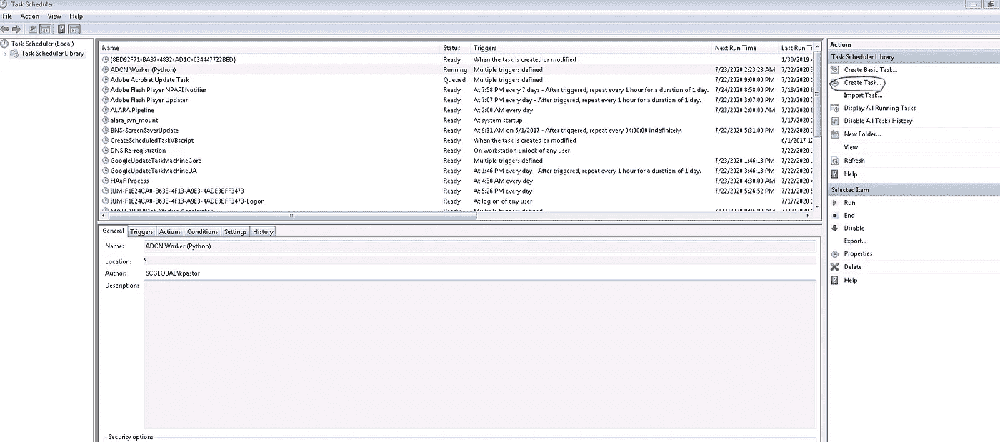
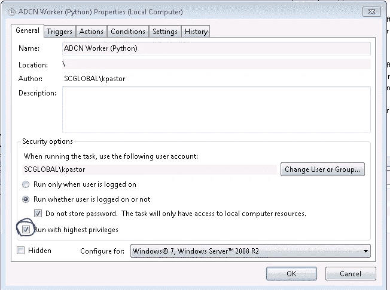
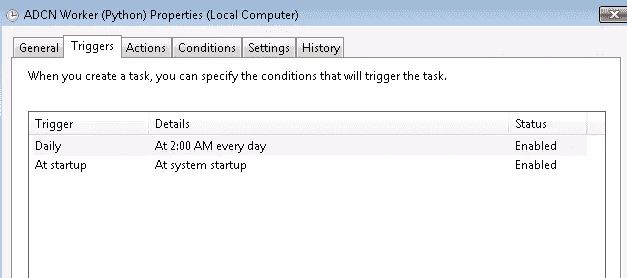
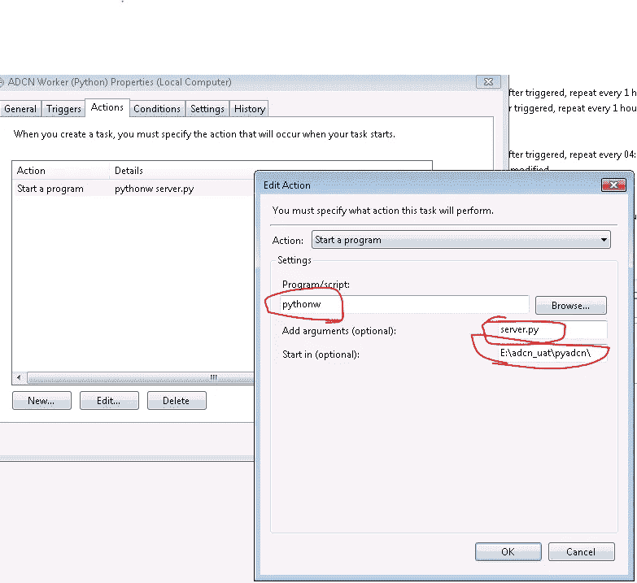

# 在 Windows 上部署 Flask

> 原文：<https://towardsdatascience.com/deploying-flask-on-windows-b2839d8148fa?source=collection_archive---------5----------------------->

## 一次悲伤痛苦的自我反省之旅。


塔达斯·萨尔在 [Unsplash](https://unsplash.com?utm_source=medium&utm_medium=referral) 上拍摄的照片

> **NB:** 如果你会用 linux 请做！我不得不在我的公司使用 Windows，因为它不会给我们 linux 系统。因此，经过一番折腾之后，我不得不弄清楚如何部署 flask API。

对于这篇短文，我不会详细介绍 flask API 的实际创建，而是更多地介绍如何部署。这里是一个超级浓缩的一步一步让一个 flask API 运行。

## **安装:**

```
pip install flask waitress
```

你会注意到我们正在安装**女服务员**，这是一个 Windows 兼容的服务器，我们可以使用它在多线程上部署我们的 flask 应用程序。这实际上是一个非常好的方法！下面是我们的 API 代码:

## **API 代码:**

```
from flask import Flask
from waitress import serveapp = Flask(__name__)
[@app](http://twitter.com/app).route('/api/v1/')
def myendpoint():
    return 'We are computering now'**serve(app, host='0.0.0.0', port=8080, threads=1) #WAITRESS!**
```

从上面可以看出，我们有一个超级复杂的 API，可以在运行时从浏览器调用:

```
python server.py
```

我们应该能够导航到[**http://myIP:8080/API/v1**](http://myIP:8080/api/v1)**并得到预期的响应。**

**这一切都很好，但现在该怎么办呢？在 Windows 上，我们如何确保它在启动时运行？任务调度器**是我如何做的。首先，确保你有管理员权限，然后打开任务调度。****

****

**创建任务时，有一些非常重要的设置:**

1.  **确保您选择了最高权限框**

****

**2.触发任务在启动时运行**

****

**3.确保你使用 **pythonw** 在后台运行(否则你将永远有一个命令提示)**

**4.使用 python 文件所在的起始目录。**

****

**嘣！这样，您应该能够点击 run 并测试您的端点。运气好的话，下次重新启动时，作业应该会触发并运行！**

**我真心希望这能在未来帮助一些可怜的灵魂。一路平安。**

## ****参考文献**:**

**很多这只是实验和快照是我自己的！**