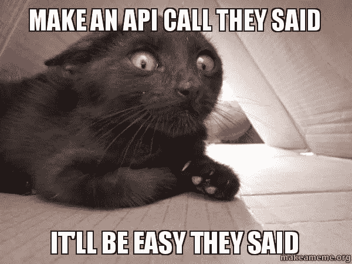
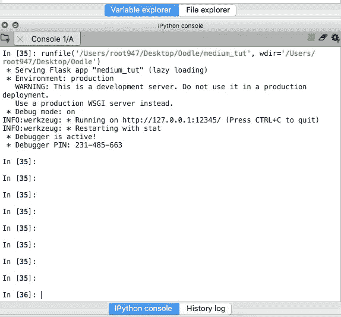
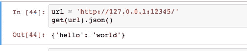
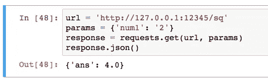
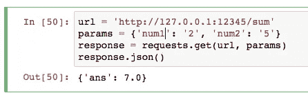
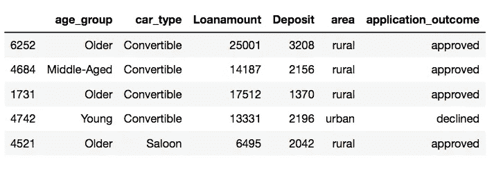
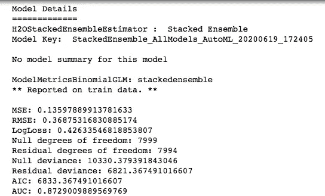
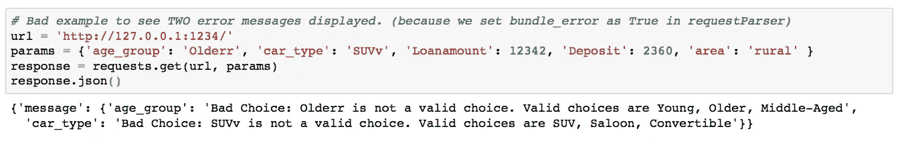
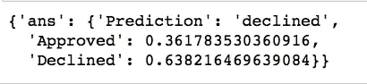

# 使用 FLASK 将 H2o 模型部署为 API 的初学者指南

> 原文：<https://towardsdatascience.com/deploying-h2o-models-as-apis-using-flask-42065a4fa567?source=collection_archive---------24----------------------->

## **模型训练、调优和创建简单 API 的端到端示例(没有技术术语)。**



我保证，如果你一直关注这篇文章，它将会是(来源:[makeameme.org](https://media.makeameme.org/created/Make-an-API.jpg))

作为一名数据科学家，我们大部分时间都花在数据预处理(或者说数据角力)、模型训练、超参数调优、模型验证等方面。然而，数据科学家戴的帽子越来越多，因此，许多行业现在开始寻找能够*将他们的 ML 模型转化为 API* 的人。

这到底是什么意思？意思是:

*   你建立了一个非常精确的 ML 模型。
*   您现在希望其他人能够利用您的模型进行预测(因为您很好，或者因为它有利可图，或者两者兼而有之)，而不需要他们看到您的整个代码。这就是 API 的用武之地..

## 什么是 API？

> API 允许我们建立一个连接，以便外部人员可以从服务器请求数据，向服务器发送新信息，更改服务器上的现有数据以及删除服务器上的现有数据。

用更简单的术语来解释(为了本文的目的)，API 是一个接口，当用户从前端请求数据时，它允许您在后端访问和操作数据(来自数据库或其他数据源)。Flask 是在后端编写数据科学 API 的最流行的 python 框架之一。

为了测试您的 API，您可以在本地运行后端服务器，默认情况下它运行在 localhost URL `(http://127.0.0.1)`上。这个 URL 后跟一个端口，比如说 5000，这样整个 URL 看起来就像`http://127.0.0.1:5000`。端口可以在 Flask 设置中更改，这样如果你想运行多个本地服务器，你可以在`http://127.0.0.1:5000`、`http://127.0.0.1:5001`等等上运行它们。

# 在本文中…

我们将使用 H2o AutoML 建立一个机器学习模型(使用非常少的代码行，但生成高性能的模型)。我们的模型将能够根据某些特征来预测贷款申请是被批准还是被拒绝。接下来，我们将创建我们的第一个 API，我们将向它发送一个关于客户年龄、汽车类型、贷款金额等的查询，它将返回申请的状态——批准或拒绝。

注:我将使用 **Jupyter 笔记本**构建和测试 H2o 模型，使用 **Spyder** 编写烧瓶代码。最后，我也将从 Jupyter 内部访问我的 API。

# 一步步走向 APIs

在我们开始为模型编写简单的 API 之前，我想简单地体验一下编写更简单的 API(不需要用户输入)的感觉。让我们开始驾驶 **Spyder** …

下面是我们将要使用的一些样板代码(稍后会对其进行修改):

```
from flask import Flask
from flask_restful import Resource, Apiapp = Flask(__name__)
api = Api(app)class HelloWorld(Resource):
    def get(self):
        return {'hello': 'world'}api.add_resource(HelloWorld, '/')if __name__ == '__main__':
    app.run(debug=True, port = 12345)
```

需要注意的几件事:

*   这里的返回属于类型`dict`，即一个键-值对(键是`hello`；值为`world`。
*   `debug = True`支持代码重载和更好的错误消息。切勿在生产环境中使用调试模式！
*   重要的是使用`api.add_resource`将您创建的任何资源(比如`HelloWorld`)添加到 API 中。
*   端口被显式指定为`port = 12345`，因为有时默认端口可能被其他应用程序使用，并可能抛出错误。

最后，将文件保存为 *medium_tut.py* ，并使用顶部的绿色运行按钮(或 Mac 上的 F5)运行它。右侧控制台窗格中的输出应该如下所示:



如您所见，API 正在本地服务器`[http://127.0.0.1:12345/](http://127.0.0.1:12345/.)`上运行。现在打开 **Jupyter Notebook** 并键入以下代码来访问我们刚刚编写的 API。

```
from requests import get
import requestsurl = '[http://127.0.0.1:12345/'](http://127.0.0.1:12345/')
get(url).json()
```



写你的第一个 API 值得称赞。:-)

如果您仔细注意，我们在`HelloWorld`中的 get 函数的返回类型是`dict`，因此我们在上面的代码中使用`.json()`来解析该字典的输出。

## 编写接受一个输入参数的 API

我们将修改我们之前在`medium_tut.py`文件中的代码，从用户端接受一个参数(更具体地说是一个数字),并将它的平方返回给用户。

```
from flask import Flask
from flask_restful import Resource, Api, **reqparse**app = Flask(__name__)
api = Api(app)***# argument parsing*
parser = reqparse.RequestParser()
parser.add_argument('num1')**class HelloWorld(Resource):
    def get(self):
        return {'hello': 'world'}**class PrintSquare(Resource):
    def get(self):
        *# use parser and find the user's input*
        args = parser.parse_args()

        user_query = float(args['num1'])
        return {'ans': user_query * user_query}**api.add_resource(HelloWorld, **'/hello'**)
**api.add_resource(PrintSquare, '/sq')**if __name__ == '__main__':
    app.run(debug=True, port = 12345)
```

评估我们所做的修改:

*   我们已经使用`parser.add_argument()`将用户输入(在我们的例子中是一个数字)添加到解析器中。
*   我们现在有了一个新的类`PrintSquare`来返回数字的平方。
*   由于我们现在有多个类，并且我们不希望在用户发出请求时混淆 API 应该运行哪个函数，我们必须通过添加`'/hello'`作为端点来更新`HelloWorld`的`add_resource`。所以现在，`HelloWorld`将运行在`[http://127.0.0.1:12345/](http://127.0.0.1:12345/.)hello`而不是`[http://127.0.0.1:12345/](http://127.0.0.1:12345/.)`上

让我们看看是否可以访问我们的 API，回到 **Jupyter 笔记本**:

```
*# note the URL has been updates, i.e. the 'sq' endpoint has been added to it*
url = '[http://127.0.0.1:12345/sq'](http://127.0.0.1:12345/sq')*# we have one input parameter 'num1'*
params = {'num1': '2'}*# outputting the response from API*
response = requests.get(url, params)
response.json()
```



## 编写采用多个输入参数的 API

更新 **Spyder** 上的`medium_tut.py`文件，以接受来自用户的两个数字作为输入，并返回其总和。

```
from flask import Flask
from flask_restful import Resource, Api, reqparseapp = Flask(__name__)
api = Api(app)*# argument parsing*
parser = reqparse.RequestParser()
parser.add_argument('num1')
**parser.add_argument('num2')**class HelloWorld(Resource):
    def get(self):
        return {'hello': 'world'}class PrintSquare(Resource):
    def get(self):
        *# use parser and find the user's input*
        args = parser.parse_args()

        user_query = float(args['num1'])
        return {'ans': user_query * user_query}**class PrintSum(Resource):
    def get(self):
        # use parser and find the user's inputs
        args = parser.parse_args()
        num1 = float(args['num1'])
        num2 = float(args['num2'])
        return {'ans': num1 + num2}**api.add_resource(HelloWorld, '/hello')
api.add_resource(PrintSquare, '/sq')
**api.add_resource(PrintSum, '/sum')**if __name__ == '__main__':
    app.run(debug=True, port = 12345)
```

最后检查 API 是否在 **Jupyter Notebook** 中工作:

```
url = '[http://127.0.0.1:12345/sum'](http://127.0.0.1:12345/sum')*# we have two input parameters - 'num1' & 'num2*
params = {'num1': '2', 'num2': '5'}response = requests.get(url, params)
response.json()
```



瞧，你已经准备好为自己的 ML 模型创建 API 了。

提示:继续在桌面上(或其他地方)创建一个新目录，命名为`H2o_API`。这是我们将保存 Jupyter 笔记本的地方，该笔记本包含训练我们的模型的代码。稍后，当我们创建 API 脚本(在 Spyder 中)时，它也将保存在同一个目录中。这样做的全部逻辑是，当我们在本地创建和下载模型时，我们的 Flask 脚本可以访问它。

# 让我们深入研究数据

我们的数据集有 5 个预测特征:

*   *年龄组*:(老年、青年、中年)
*   *汽车类型*:分类(敞篷车、轿车、SUV)
*   *贷款金额*:浮动
*   *存款*:浮动
*   *地区*:分类(农村、城市)

以及一个结果变量，即*应用 _ 结果*，它可以取两个值:批准或拒绝。

我们的数据看起来是这样的:



## 将训练集和测试集转换为 H2o 框架

```
#Categorical Columns - enum
#Numerical Columns - real
col_dict = {'age_group' : 'enum', 
            'car_type' : 'enum', 
            'loanamount' : 'real', 
            'deposit' : 'real', 
            'area' : 'enum',
           'application_outcome': 'enum'}train_h2o = h2o.H2OFrame(train, column_types = col_dict)
test_h2o = h2o.H2OFrame(test, column_types = col_dict)
```

## 使用 H2o AutoML 进行培训

自动机器学习(AutoML)是将机器学习应用于现实世界问题的端到端过程自动化的过程。使用 [H2o 的 AutoML 接口](https://docs.h2o.ai/h2o/latest-stable/h2o-docs/automl.html)可以很容易地执行(我将在下一篇文章中深入讨论)。简而言之，它提供了一个由许多模型的自动训练和调整获得的顶级模型组成的排行榜。

现在，让我们把它载入我们的 Jupyter 笔记本:

```
from h2o.automl import H2OAutoML
aml = H2OAutoML(max_models = 5, max_runtime_secs=100, seed = 1)
```

设置预测值和响应特征:

```
*# setting predictor and response features*
x = ['age_group', 'car_type', 'loanamount', 'deposit', 'area']
y = 'application_outcome'
```

训练过程可以简单地使用 H2o 中的一行代码来实现。

```
*# Training*
aml.train(x=x, y='application_outcome', training_frame=train_h2o, validation_frame=test_h2o)
```

最佳模型(基于默认指标 AUC)存储在`aml.leader`中:

```
aml.leader
```



正如你所看到的，即使没有太多的修改，我们已经在验证集上获得了 AUC = 0.87 的模型(一点也不差)！还有，注意这个模型的名字是`StackedEnsemble_AllModels_AutoML_20200619_172405`。您的模型的名称将类似于此，减去最后一个下划线后的部分，即`172405`。

## 将最佳模型保存到本地机器上

```
*# download the model built above to your local machine*
my_local_model = h2o.download_model(aml.leader, path="/Users/UserName/Desktop/H2o_API")
```

如果您在您的目录中检查这个保存的模型的名称，它将看起来像`StackedEnsemble_AllModels_AutoML_20200619_******`。

# 为您的模型创建 API

创建新的 python 脚本`pred_API.py`来编写我们的 Flask 脚本。

## 导入库和加载模型

```
from flask import Flask
from flask_restful import Resource, Api, reqparseapp = Flask(__name__)
api = Api(app)import h2o
import pandas as pd
h2o.init()*## load trained model*
model_path = 'StackedEnsemble_AllModels_AutoML_20200619_******'
uploaded_model = h2o.load_model(model_path)
```

## 解析输入参数

```
*# argument parsing*
parser = reqparse.RequestParser(bundle_errors=True) *# if there are 2 errors, both of their msgs will be printed*parser.add_argument('age_group', choices = ('Young', 'Older', 'Middle-Aged'), help = 'Bad Choice: {error_msg}. Valid choices are Young, Older, Middle-Aged')parser.add_argument('car_type', choices = ('SUV', 'Saloon', 'Convertible'), help = 'Bad Choice: {error_msg}. Valid choices are SUV, Saloon, Convertible')parser.add_argument('loanamount')parser.add_argument('deposit')parser.add_argument('area', choices = ('urban', 'rural'), help = 'Bad Choice: {error_msg}. Valid choices are urban, rural')
```

在将分类特征的值添加到解析器中时(比如`age_group`和`car_type`，我们将`choices`设置为一个元组，其中包含该特征可以采用的所有可能值。如果遇到选项中未提及的值，它将抛出`help`中指定的错误消息。

最后，我们设置`bundle_errors = True`，这样在两个错误的情况下，两个错误消息都被打印出来。例如，在下面的示例中，我们故意将`age_group`的值设置为‘older ’,将`car_type`的值设置为‘SUVv ’:



## 定义预测类

```
*#Categorical Columns - enum
#Numerical Columns - real*
col_dict = {'age_group' : 'enum', 
            'car_type' : 'enum', 
            'loanamount' : 'real', 
            'deposit' : 'real', 
            'area' : 'enum',
           'application_outcome': 'enum'}*# prepare empty test data frame to be fed to the model*
data = {}*# results dict*
item_dict = {}class LoanPred(Resource):
    def get(self):
         args = parser.parse_args()
         age = args['age_group']
         car_type = args['car_type']
         loanamount = float(args['loanamount'])
         deposit = float(args['deposit'])
         area = args['area']
         application_outcome = 'declined' *#setting as default to declined (can set it as 'approved' as well, doesn't matter)*

         *# put key:value pairs in empty dict called data*
         data['age_group'] = age
         data['car_type'] = car_type
         data['loanamount'] = [loanamount]
         data['deposit'] = [deposit]
         data['area'] = area
         data['application_outcome'] = application_outcome

         *# creating dataframe from dict*
         testing = pd.DataFrame(data)

         *# converting pandas to h2o dataframe*
         test = h2o.H2OFrame(testing, column_types = col_dict)

         *# making predictions*
         pred_ans = uploaded_model.predict(test).as_data_frame()

         *# put key:value pairs in empty dict called item_dict*
         item_dict['Prediction'] = pred_ans.predict.values[0]
         item_dict['Approved'] = pred_ans.approved.values[0]
         item_dict['Declined'] = pred_ans.declined.values[0]

         return{'ans': item_dict}

api.add_resource(LoanPred, '/')if __name__ == '__main__':
    app.run(debug=True, port= 1234)
```

我们首先获取所有输入参数，并使用它们创建一个名为`testing`的 pandas 数据帧。该数据帧必须转换成名为`test`的 H2o 帧，然后才能提供给 H2o 模型进行预测。

需要注意的一点是，`model.predict()`的输出是一个 h2o 帧，目前，Spyder ipython 控制台无法正确显示 H2o 数据帧(您可以在 Github 上的这里跟踪问题[)。因此，我们需要使用`as_data_frame()`将`model.predict()`的输出显式转换为 pandas 数据帧。输出`pred_ans`是包含三列的数据帧—](https://github.com/spyder-ide/spyder/issues/4714)

*   最终预测(批准或拒绝)，
*   申请被批准的概率，
*   申请被拒绝的概率。

我们将这三个值作为键值对存储在`item_dict`中。

**最后将** `pred_API.py` **中的所有代码放在一个地方:**

```
from flask import Flask
from flask_restful import Resource, Api, reqparseapp = Flask(__name__)
api = Api(app)import h2o
import pandas as pd
h2o.init()## load saved model
model_path = 'StackedEnsemble_AllModels_AutoML_20200619_******'
uploaded_model = h2o.load_model(model_path)# argument parsing
parser = reqparse.RequestParser(bundle_errors=True) #if there are 2 errors, both's msg will be printed
parser.add_argument('age_group', choices = ('Young', 'Older', 'Middle-Aged'), help = 'Bad Choice: {error_msg}. Valid choices are Young, Older, Middle-Aged')
parser.add_argument('car_type', choices = ('SUV', 'Saloon', 'Convertible'), help = 'Bad Choice: {error_msg}. Valid choices are SUV, Saloon, Convertible')
parser.add_argument('loanamount')
parser.add_argument('deposit')
parser.add_argument('area', choices = ('urban', 'rural'), help = 'Bad Choice: {error_msg}. Valid choices are urban, rural')#Categorical Columns - enum
#Numerical Columns - real
col_dict = {'age_group' : 'enum', 
            'car_type' : 'enum', 
            'loanamount' : 'real', 
            'deposit' : 'real', 
            'area' : 'enum',
           'application_outcome': 'enum'}#prepare empty test data frame to be fed to the model
data = {}# results dict
item_dict = {}class LoanPred(Resource):
    def get(self):
         args = parser.parse_args()
         age = args['age_group']
         car_type = args['car_type']
         loanamount = float(args['loanamount'])
         deposit = float(args['deposit'])
         area = args['area']
         application_outcome = 'declined' 

         # put key:value pairs in empty dict called data
         data['age_group'] = age
         data['car_type'] = car_type
         data['loanamount'] = [loanamount]
         data['deposit'] = [deposit]
         data['area'] = area
         data['application_outcome'] = application_outcome

         # creating dataframe from dict
         testing = pd.DataFrame(data)

         # converting pandas to h2o dataframe
         test = h2o.H2OFrame(testing, column_types = col_dict)

         # making predictions
         pred_ans = uploaded_model.predict(test).as_data_frame()

         # put key:value pairs in empty dict called item_dict
         item_dict['Prediction'] = pred_ans.predict.values[0]
         item_dict['Approved'] = pred_ans.approved.values[0]
         item_dict['Declined'] = pred_ans.declined.values[0]

         return{'ans': item_dict}

api.add_resource(LoanPred, '/')if __name__ == '__main__':
    app.run(debug=True, port= 1234)
```

# 访问 API 以获得预测

在朱庇特的笔记本上:

```
*# Normal API call with all inputs in correct format*url = '[http://127.0.0.1:1234/'](http://127.0.0.1:1234/')params = {'age_group': 'Young', 'car_type': 'SUV', 'loanamount': '12342', 'deposit': '2360', 'area': 'rural' }response = requests.get(url, params)
response.json()
```



我们走吧..我们已经成功地进行了 API 调用，并从 H2o 中训练的模型中检索预测。现在你所要做的就是找到一个朋友，他能把这个 API 输出变成一些漂亮的网络应用程序。

# 结论

这是对为 ML 模型创建 API 的概念的热情介绍。希望这不会太可怕，并且描述足够详细，可以帮助您理解相关的本质。所有代码都可以在 [Github](https://github.com/V-Sher/H2oModels_API_Flask) 上找到。

在下一部分中，我们将学习如何使用 Flask 和 Bigquery APIs 根据用户查询参数从 Bigquery 数据集中提取数据。

直到下一次:-)