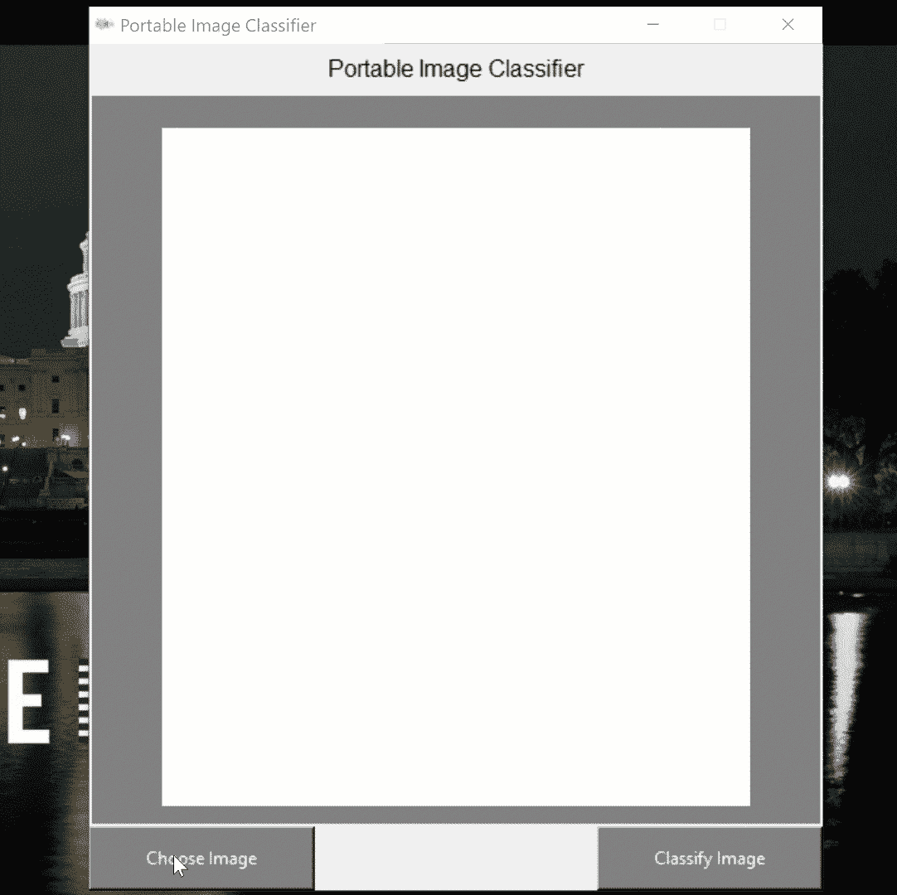
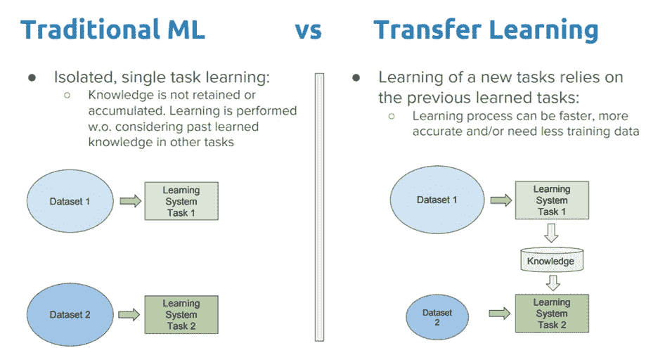
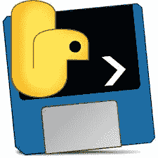

# 使用 Tkinter 部署机器学习项目

> 原文：<https://towardsdatascience.com/deploying-machine-learning-projects-using-tkinter-7f0ddc7f1bd1?source=collection_archive---------13----------------------->

## 以可执行文件格式部署免费机器学习项目的完整指南。


[R 莫](https://unsplash.com/@mooo3721?utm_source=medium&utm_medium=referral)在 [Unsplash](https://unsplash.com?utm_source=medium&utm_medium=referral) 上拍照

# 介绍

由于各种各样的开源库，现在开始探索数据集并使用 Python 中简单的机器学习(ML)算法进行一些初步预测是相对容易的。虽然，为了使这些训练好的模型在现实世界中有用，有必要共享它们，并使它们在其他用户机器上容易访问以进行预测。只有这样，机器学习才能被用来造福社会。

在本文中，我将带您了解如何轻松地为您的机器学习项目创建图形用户界面(GUI ),然后将您的应用程序作为可执行文件共享，该文件可以在其他机器上运行(无需最终用户安装 Python 或任何库！).如果您有兴趣了解更多，本文使用的所有代码(以及更多！)可在[我的 GitHub 档案](https://github.com/pierpaolo28/Data-Visualization/tree/master/Tkinter%20ML)上获得。

# 迁移学习图像分类

为了转移我们对图形界面开发和部署的关注，在本文中，我们将使用 Tensorflow 上提供的 VGG16 预训练模型来轻松构建一个便携式图像分类器。在视频 1 中，有一个演示我们应用程序最终工作流程的快速动画。



视频 1: GUI 演示

迁移学习是一个研究领域，专注于将机器学习模型获得的有用知识转移到另一个模型，我们计划将该模型用于不同的(但在某种程度上仍然相关的)主题。这在处理有限的数据时特别有用(图 1)。



图 1:迁移学习工作流([来源](/a-comprehensive-hands-on-guide-to-transfer-learning-with-real-world-applications-in-deep-learning-212bf3b2f27a))

迁移学习最常见的应用之一是[计算机视觉](/roadmap-to-computer-vision-79106beb8be4)。例如，在本文中，我们将使用在 [ImageNet 数据集](http://www.image-net.org/)上预先训练的 [VGG16 模型](https://neurohive.io/en/popular-networks/vgg16/)，以便快速构建一个健壮的图像分类器。事实上，ImageNet 数据集包含大量图像(1400 万)和大约 21000 个类，因此对于这种类型的任务来说非常完整。

研究人员目前正致力于将迁移学习技术应用于其他领域，如音乐[1]和文本分类[2]。

# 图形用户界面(GUI)

首先，我们需要导入所有必需的依赖项。

现在，我们可以利用 Tkinter 库来创建我们的图形界面(如视频 1 所示)。我们首先创建窗口的基础( ***root*** )，然后在它上面添加不同的元素，例如程序标题( ***tit*** )、框架( ***框架*** )加载图像以在框架上显示的按钮(***choose _ image***)和启动图像分类器的按钮(***class _ image*最后，我们实例化我们的 VGG16 模型并启动我们的 GUI ( ***使用 root.mainloop()*** )。****

为了关联当用户按下两个 GUI 按钮中的任何一个时要执行的动作，我们可以定义两个在单击时被激活的函数( ***load_img()*** 和 ***classify()*** )。

在 ***load_img()*** 函数中，我们首先清除框架以防有任何附加的小部件，然后我们让用户上传图像，最后我们重新缩放并在窗口框架上显示图像及其文件名。

在 ***classify()*** 函数中，我们改为预处理我们的图像(使用 [Keras 指南](https://keras.io/applications/#vgg16)用于这个预训练的模型)并最终在帧上打印我们的分类器的前 5 个预测及其百分比置信度。

一旦我们的程序在本地运行良好，我们就可以将其导出为可执行的格式。

# 部署

将 Python 文件转换成可执行文件的最简单方法之一(对于 Windows 或 Linux 平台)是使用 [Pyinstaller](https://www.pyinstaller.org/) (图 2)。



图 2: Pyinstaller [3]

对于只有一个文件且没有太多依赖项的项目，只需一条命令行语句即可完成:

```
pyinstaller my_script_name.py
```

虽然，对于更复杂的项目，为项目创建一个虚拟环境并使用一个 [Spec 文件](https://pyinstaller.readthedocs.io/en/stable/spec-files.html)可能是一个更好的主意，以便给 Pyinstaller 关于如何创建可执行文件以及包含什么资产的明确指示。在[此链接](https://github.com/pierpaolo28/Data-Visualization/blob/master/Tkinter%20ML/main.spec)可获得该项目的规格文件示例。

最后，如果我们的可执行文件可能需要不同的资产(例如图像、视频等)，那么使用 [NSIS](https://nsis.sourceforge.io/Download) 将所有东西都包含在安装系统文件中可能是一个好主意(这样更容易在另一台机器上安装可执行文件和所有需要的依赖项)。

如果您有兴趣自己使用这个应用程序，可以在[我的个人网站上找到下载链接。](https://pierpaolo28.github.io/Projects/project18.html)

此外，可以用来部署机器学习系统的一些替代技术正在使用:

*   [云服务](/flask-and-heroku-for-online-machine-learning-deployment-425beb54a274)(例如 Heroku、AWS、谷歌云)
*   [在线仪表盘](/interactive-dashboards-for-data-science-51aa038279e5)(如仪表盘、R-闪亮)
*   应用编程接口

这些技术现在被广泛使用，它们可以使机器学习模型很容易地在 Web 上获得，尽管它们很可能会产生托管费用(而不是使用可执行文件)。

*希望您喜欢这篇文章，感谢您的阅读！*

# 联系人

如果你想了解我最新的文章和项目[，请在媒体](https://medium.com/@pierpaoloippolito28?source=post_page---------------------------)上关注我，并订阅我的[邮件列表](http://eepurl.com/gwO-Dr?source=post_page---------------------------)。以下是我的一些联系人详细信息:

*   [领英](https://uk.linkedin.com/in/pier-paolo-ippolito-202917146?source=post_page---------------------------)
*   [个人博客](https://pierpaolo28.github.io/blog/?source=post_page---------------------------)
*   [个人网站](https://pierpaolo28.github.io/?source=post_page---------------------------)
*   [帕特里翁](https://www.patreon.com/user?u=32155890)
*   [中型型材](https://towardsdatascience.com/@pierpaoloippolito28?source=post_page---------------------------)
*   [GitHub](https://github.com/pierpaolo28?source=post_page---------------------------)
*   [卡格尔](https://www.kaggle.com/pierpaolo28?source=post_page---------------------------)

# 文献学

[1]音乐分类和回归任务的迁移学习，Keunwoo Choi，Gyö rgy Fazekas。访问地点:[https://arxiv.org/abs/1703.09179](https://arxiv.org/abs/1703.09179)

[2]使用卷积神经网络进行文本分类的迁移学习的实践者指南，Tushar Semwal，Gaurav Mathur。访问地点:[https://arxiv.org/abs/1801.06480](https://arxiv.org/abs/1801.06480)

[3] Pyinstaller。将 Python 程序冻结(打包)成独立的可执行文件 Github。访问地点:[https://github.com/pyinstaller/pyinstaller](https://github.com/pyinstaller/pyinstaller)