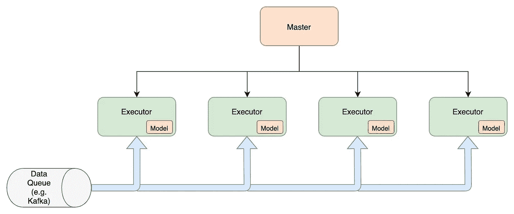
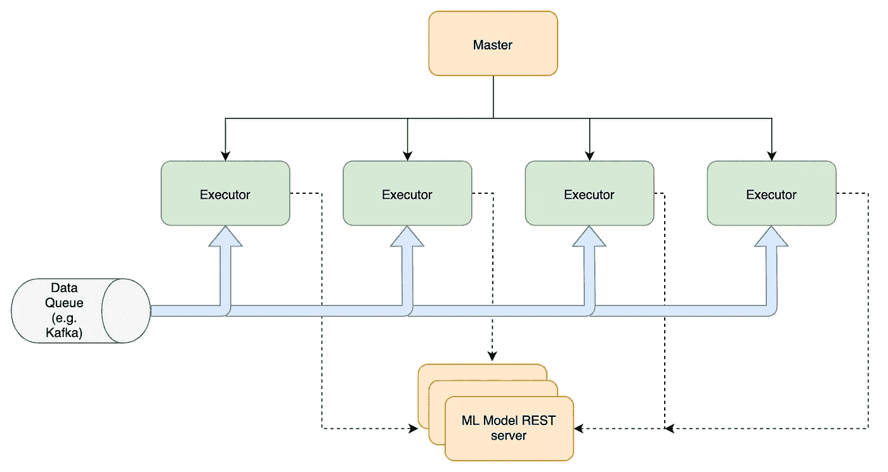
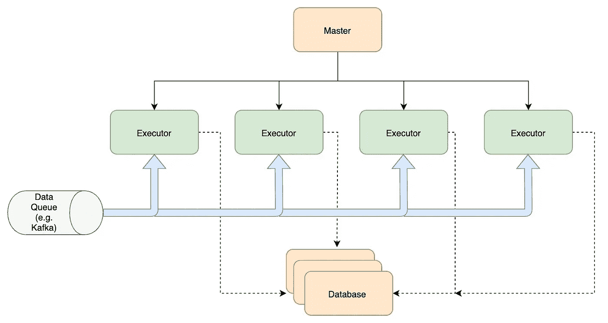

# 在分布式实时数据流应用中部署 ML 模型

> 原文：<https://towardsdatascience.com/deploying-ml-models-in-distributed-real-time-data-streaming-applications-217954a0b423?source=collection_archive---------7----------------------->

## 探索在 Apache Flink/Spark 或其他实时数据流应用程序中部署 ML 模型的各种策略。

在 [Unsplash](https://unsplash.com?utm_source=medium&utm_medium=referral) 上由 [Franck V.](https://unsplash.com/@franckinjapan?utm_source=medium&utm_medium=referral) 拍摄的照片

过去十年，机器学习从零到一。ML 的崛起可以被视为科技行业最具决定性的时刻之一。今天，ML 模型在几乎所有的服务中无处不在。

至今仍然存在的挑战之一是使用实时数据对模型进行训练和推断。让我们来看看在数据流生产作业中可以用来进行预测的各种策略。

# 沿着管道建模

对实时数据进行预测的自然方法是在处理数据的管道中运行 ML 模型。

在管道执行器中部署模型

这种方法有两个主要的复杂性-

1.  管道代码和模型代码的集成。
2.  优化集成管道以有效利用底层资源。

## 综合

大多数实时数据管道都是用 Java 或 Python 编写的。 [Apache Spark](https://spark.apache.org/) 和 [Apache Flink](https://flink.apache.org/) 都提供 Python API。这使得使用 [Scikit-Learn](https://scikit-learn.org/stable/) 或 [Tensorflow](https://www.tensorflow.org/) 编写的模型可以轻松集成。

您也可以使用 [Spark MLlib](https://spark.apache.org/mllib/) 或 [Flink ML](https://github.com/FlinkML) 来创建模型。这些模型便于集成，您不必担心可伸缩性和容错性。

但是如果你有一个用 Java 或 Scala 编写的预先存在的数据管道呢？在这种情况下，使用 Tensorflow Java API 或第三方库(如 [MLeap](https://github.com/combust/mleap) 或 [JPMML](https://github.com/jpmml/jpmml-evaluator) )来导出您的 Scikit-learn 模型并在您的代码中使用它们更有意义。JPMML 支持很多模型，但是 MLeap 更快。

## 最佳化

Python 和 Java/Scala 之间的选择代表了通用性和性能之间的权衡。如果您根据用例、预期的数据量和预期的延迟做出决策，那将是最好的。对于大多数应用程序，我更喜欢 Scala，因为预期的输入记录是每秒数百万条。

另一个优化是您应该分配给模型的并行执行器的数量。如果是逻辑回归或小型随机森林等轻量级模型，您甚至可以运行模型的单个实例，并将数据重新分区到单个执行器(这在生产中从来都不是一个好主意)。对于大型随机森林或深度神经网络之类的大型模型，找到正确的执行者数量主要是一项反复试验的工作。

您可能还需要优化您的 ML 模型，以便它们能够适合内存。有几种工具可用于此目的。

 [## TensorFlow Lite

### TensorFlow Lite 是一个开源的深度学习框架，用于设备上的推理。

www.tensorflow.org](https://www.tensorflow.org/lite) 

这种方法的另一个复杂之处是将模型更新到一个更新的版本。更新通常需要全新的部署。这也使得 A/B 测试相当重要。

# 作为 REST 服务的模型

这是最流行的推理方法之一。在 docker 容器中运行 python 代码，并提供一个 REST 接口来获得结果。Tensorflow 已经提供了开箱即用的 REST 模型。

将 ML 模型部署为服务

对于 Java，可以使用 MLeap 或者 DeepLearning4J。在这种方法中，您还可以根据吞吐量动态地增加/减少服务器的数量。

如果您的模型调用是异步的，这种方法在数据突发的情况下(比如在重启期间)无法触发背压。这可能会导致模型服务器中的 OOM 故障。必须采取额外的预防措施来防止这种情况。

延迟也很高，因为您需要一个网络调用来获取结果。通过使用 [gRPC](https://grpc.io/) 代替 REST，可以稍微减少延迟。

 [## 以下是超越 Http 1.1 的方法

### 实现自己的 http/2 服务。

codeburst.io](https://codeburst.io/heres-how-you-can-go-beyond-http-1-1-59e73f68bf75) 

# 数据库作为模型存储

如果您有固定的模型架构，例如线性回归、随机森林或小型神经网络，权重可以存储在分布式数据库中，如 Cassandra。您可以在运行时使用权重创建模型，并对新模型进行预测。

将模型存储在数据库中

这种方法是第一种和第二种方法的混合。它允许您在运行时更新模型，而不需要新的部署，同时还提供了背压功能。这是以多功能性为代价的，因为您限制了模型的潜在选项的数量。

## 那么应该选择哪种方法呢？

好吧，如果你想做一个简单的 POC 或者你的模型非常轻量级，就用 REST 模型服务器。运行您的模型所需的易于集成和非常少的代码更改使它成为一个有吸引力的选择。A/B 测试也可以快速完成。

如果您需要在几十毫秒内进行预测，流水线方法是首选。

最后，模型存储方法应该只在有几个模型的情况下使用，例如，每个城市数据有一个 ML 模型，并且它们也是轻量级的。