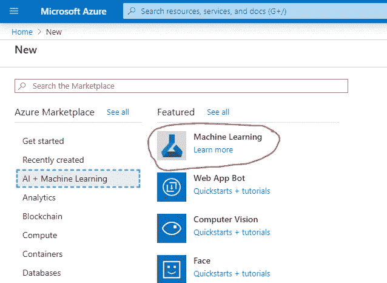
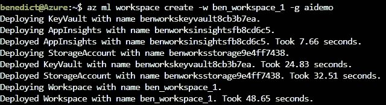
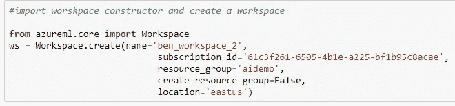
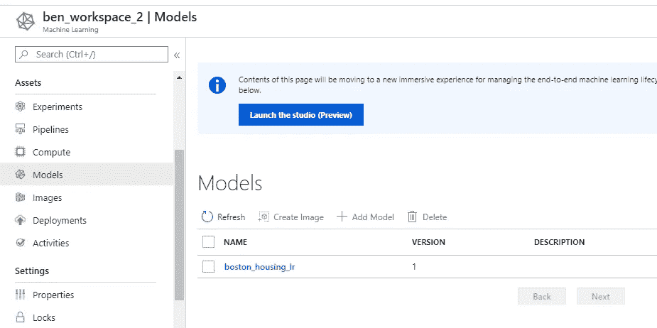
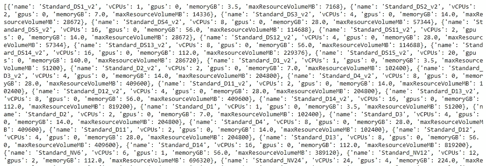
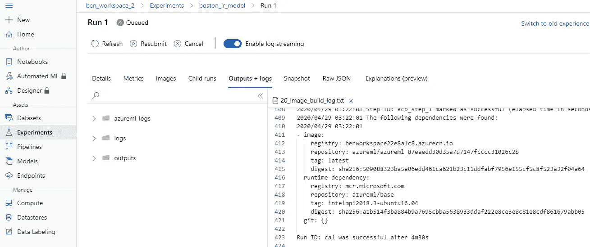
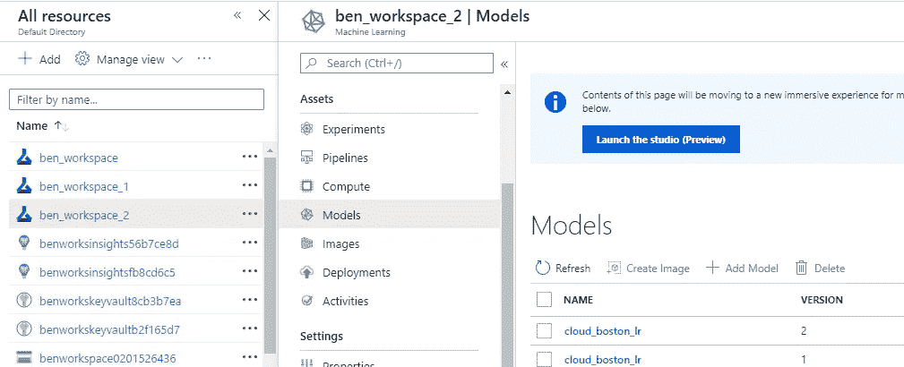

# 在 Azure 上部署 ML 模型

> 原文：<https://towardsdatascience.com/deploying-ml-models-on-azure-a948c106f7b5?source=collection_archive---------11----------------------->

## 在云上创建、构建和部署您自己的 ML 模型


凯文·Ku 在 [Unsplash](https://unsplash.com?utm_source=medium&utm_medium=referral) 上的照片

# 介绍

在我花了 3 年多的时间在 Jupyter Notebook 上开发机器学习模型之后，我从未能够将它部署到云上。您的线性回归模型有 90%的准确性，接近完美的 R 值，高 AUC(曲线下面积)是好的，但如果您的模型没有投入使用或部署，它还有什么用？

在本文中，我将逐步创建、训练一个模型，并将其部署到 Azure Machine Learning Studio 中。请注意，这篇文章大量引用了以下 Coursera 课程。当你完成一门在线课程时，一张证书并不能说明很多关于你的事情。因此，我借此机会复制我所学到的，并在 Azure 上部署我的模型。这是我参加的课程:

[](https://www.coursera.org/learn/developing-ai-applications-azure/) [## 在 Azure | Coursera 上开发 AI 应用

### 本课程介绍人工智能和机器学习的概念。我们将讨论机器学习…

www.coursera.org](https://www.coursera.org/learn/developing-ai-applications-azure/) 

我使用了一个免费试用版，你将获得价值 200 美元的货币来创建你的工作空间和存储空间。下面是它的链接:

[](https://azure.microsoft.com/en-us/free/search/?&ef_id=CjwKCAjwqJ_1BRBZEiwAv73uwPdRAtO49bav1c3mKYqYc0DFn2bfSIesgq7i_EAbJPEHr5Bz3p1HmhoCrPgQAvD_BwE:G:s&OCID=AID2000643_SEM_vDZWyCyS&MarinID=vDZWyCyS_341302918553_free%20trial%20azure_e_c__65978285502_kwd-300666826690&lnkd=Google_Azure_Brand&dclid=CPKDiI_EjOkCFcWRjwodmAoHbA) [## 立即创建您的 Azure 免费帐户| Microsoft Azure

### 开始享受 12 个月的免费服务和 200 美元的信用点数。立即使用 Microsoft Azure 创建您的免费帐户。

azure.microsoft.com](https://azure.microsoft.com/en-us/free/search/?&ef_id=CjwKCAjwqJ_1BRBZEiwAv73uwPdRAtO49bav1c3mKYqYc0DFn2bfSIesgq7i_EAbJPEHr5Bz3p1HmhoCrPgQAvD_BwE:G:s&OCID=AID2000643_SEM_vDZWyCyS&MarinID=vDZWyCyS_341302918553_free%20trial%20azure_e_c__65978285502_kwd-300666826690&lnkd=Google_Azure_Brand&dclid=CPKDiI_EjOkCFcWRjwodmAoHbA) 

# 创建工作空间

首先，您必须创建一个工作空间来存储您为项目创建的所有实验、模型和结果。有三种方法可以做到。

1.  工作区可以在 portal.azure.com[创建](https://portal.azure.com/)。



2.可以使用 Azure CLI 创建工作区



3.可以使用 Azure Notebook 创建工作区



# Azure 笔记本

我们将利用 Azure Notebook 在 Azure 上创建、训练和部署我们的模型。Azure 笔记本和 Jupyter 笔记本很像。如果您想在本地环境中使用 Jupyter Notebook，请随意。以下步骤仍然有效。

 [## 微软 Azure 笔记本电脑

### 提供对运行在微软 Azure 云上的 Jupyter 笔记本的免费在线访问。

www.notebooks.azure.com](https://www.notebooks.azure.com/) 

# 配置文件

您需要设置您的配置文件，以便可以在多种环境中引用您的工作区(例如，虚拟机、个人笔记本电脑、工作笔记本电脑等)。).更多信息请参考文档:[https://docs . Microsoft . com/en-us/python/API/azure ml-core/azure ml . core . workspace . workspace？view=azure-ml-py](https://docs.microsoft.com/en-us/python/api/azureml-core/azureml.core.workspace.workspace?view=azure-ml-py)

```
# Creating your configuration file
ws.write_config(path="./", file_name="ws_config.json")# View your configuration file
!cat .azureml/ws_config.json
```

# 模特培训

现在所有的“管理问题”都解决了，你终于可以开始训练你的模型了！

“哦不，在所有累人的步骤之后，我关闭了我所有的步骤和笔记本。我如何再次进入我的环境？”

别担心，这正是配置文件的目的。通过下面两行代码，您可以轻松地将工作区加载回笔记本

```
# Load your workspace in a brand new environment
from azureml.core import Workspace
ws = Workspace.from_config(path="./.azureml/ws_config.json")
```

现在，让我们用 Sklearn 提供的[波士顿房价数据集创建一个非常简单的线性回归模型。我将不详细讨论这个模型，因为这不是本文的目的。](https://scikit-learn.org/stable/modules/generated/sklearn.datasets.load_boston.html)

```
%%writefile my_sklearn_lr.py# Load the libraries
import numpy as np
import pandas as pd
import matplotlib.pyplot as plt
import os
import sklearn# Load Boston data
from sklearn.datasets import load_boston
boston_dataset = load_boston()# Train test split data
from sklearn.model_selection import train_test_split
num_Rooms_Train, num_Rooms_Test, med_price_Train, med_Price_Test = train_test_split(boston_dataset.data[:,5].reshape(-1,1), boston_dataset.target.reshape(-1,1))# Create Linear Regression model
from sklearn.linear_model import LinearRegression
price_room = LinearRegression()
price_room.fit (num_Rooms_Train,med_price_Train)
```

现在您已经有了一个名为 price_room 的模型，让我们将这个模型保存为一个 [pickle](https://docs.python.org/3/library/pickle.html) 文件:

```
# Save the model
from sklearn.externals import joblib
os.makedirs("outputs", exist_ok=True)
joblib.dump(value=price_room, filename="outputs/bh_lr.pkl")
```

# 将模型注册到工作空间

将模型保存为 pickle 文件后，您可以将其上传到您的工作空间:

```
from azureml.core.model import Modelmodel = Model.register(workspace=ws, model_path="./outputs/bh_lr.pkl", model_name="boston_housing_lr")
```



哒哒！您的模型现在在您的 Azure 工作区中可用

# 使用 Azure ML 训练模型

如果你的电脑只有 2GB 的 RAM 怎么办(我相信这种可能性极小…)？你可以用 Azure ML Services 提供的资源来训练你的模型，而不是使用你的本地资源。导入相关库后，您可以查看所有可用的虚拟机:

```
from azureml.core.runconfig import RunConfiguration
from azureml.core.compute import AmlCompute
list_vms = AmlCompute.supported_vmsizes(workspace=ws)
print(list_vms)
```



我们将简单地使用标准 DS1 v2:

```
compute_config = RunConfiguration()
compute_config.target = "amlcompute"
compute_config.amlcompute.vm_size = "Standard_DS1_v2"
```

## 属国

为了让您的模型在云中工作，您需要指定依赖关系。将依赖视为购物清单。你告诉程序你做饭/训练你的模型需要什么样的杂货店/图书馆。

```
from azureml.core.conda_dependencies import CondaDependenciesdependencies = CondaDependencies()
dependencies.set_python_version("3.6.6")
dependencies.add_pip_package("scikit-learn==0.20.3")
dependencies.add_pip_package("numpy==1.16.2")
dependencies.add_pip_package("pandas==0.23.4")
dependencies.add_pip_package("matplotlib==3.0.0")
compute_config.environment.python.conda_dependencies = dependencies
```

要找出依赖项的版本，只需键入:

```
<INSERT YOUR LIBRARY>.show_versions()
# e.g. pd.show_versions()
```

## 在云中训练您的模型

现在是时候运行具有依赖项的模型了，配置是您之前设置的。警告，这一部分可能需要相当长的时间，特别是如果您的模型很复杂，并且您使用的 VM 处理能力很低。

```
from azureml.core.experiment import Experiment
from azureml.core import ScriptRunConfig# The script you specify here is the one you wrote to train your linear model
script_run_config = ScriptRunConfig(source_directory=".",script="my_sklearn_lr.py", run_config=compute_config)
experiment = Experiment(workspace=ws, name="boston_lr_model")
run = experiment.submit(config=script_run_config)
run.wait_for_completion(show_output=True)
```

如果你觉得无聊，你可以在你的 Azure 门户中查看日志和输出:



# 部署您的模型

如果一个模型不用于预测，那么它有什么用呢？让我们检索您之前在云中训练的模型，并进行一些预测。

1.  找出你的模型在哪里

```
run.get_file_names()
```

2.下载您的模型

```
run.download_file(name="outputs/bh_lr.pkl")
```

3.将模型加载到您的本地环境中

```
from sklearn.externals import joblib
import numpy as nprun_model = joblib.load('bh_lr.pkl')
```

4.用你的模型做一些预测

```
run_model.predict(np.array([7.354]).reshape(-1,1))
```

5.如果不满意，重新培训模型。否则，您可以将模型注册到您的工作空间中

```
from azureml.core.model import Model# There are 2 ways to register your model into Azure ML# First way, using your environment
model = Model.register(workspace=ws, model_path="bh_lr.pkl", model_name="cloud_boston_lr")# Second way, using local file
run.register_model(model_name="cloud_boston_lr", model_path="outputs/bh_lr.pkl")
```

我们可以验证我们的两个模型都已上传:



# 结论

恭喜你！现在，您已经成功地在云上训练和部署了您的模型！不要玩弄工作室，并尝试部署其他模式，如 LSTM，有线电视新闻网，决策树，SVM 或任何你知道的模式。请充分利用所提供的 200 美元。