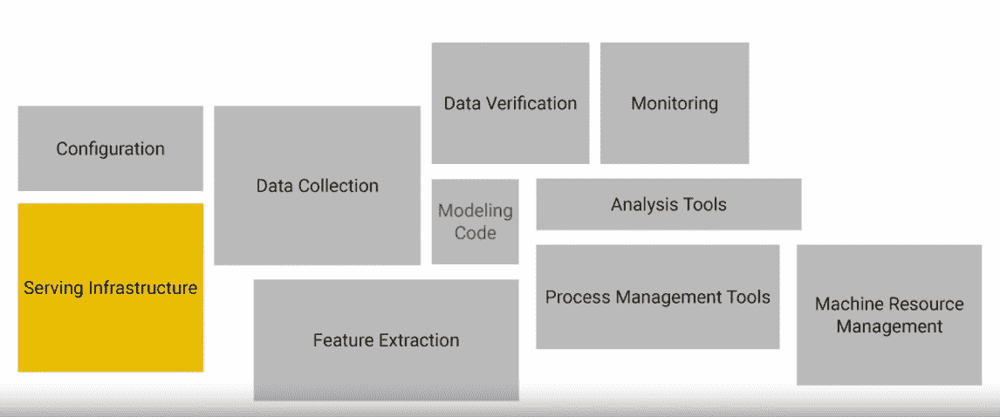
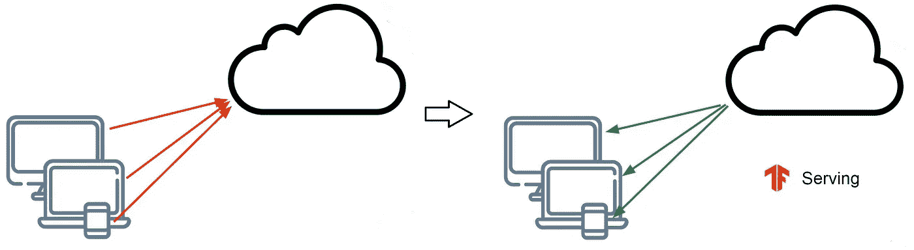
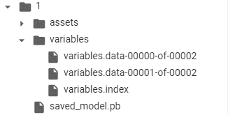
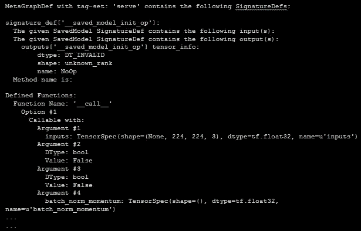

# 使用 TensorFlow 模型服务器将模型部署到生产环境中

> 原文：<https://towardsdatascience.com/deploying-models-to-production-with-tensorflow-model-server-225a81859031?source=collection_archive---------31----------------------->


来源:tensorflow.org

模型创建无疑是人工智能应用的一个重要部分，但在训练后知道什么也是非常重要的。我将展示如何通过 HTTP 和 HTTPS 服务 TensorFlow 模型，并使用 TF Model Server 轻松完成模型版本控制或模型服务器维护等工作。您还将看到为此所需的步骤以及您应该遵循的流程。我们还将了解 Kubernetes 和 GKE，以自动调整您的部署。

这篇博文中演示所用的所有代码和一些额外的例子都可以在这个 GitHub repo-上找到

[](https://github.com/Rishit-dagli/GDG-Ahmedabad-2020) [## 里希特-达格里/GDG-艾哈迈达巴德-2020

### 我在谷歌开发小组艾哈迈达巴德的会议是关于用 TensorFlow 模型服务器将模型部署到生产中，30…

github.com](https://github.com/Rishit-dagli/GDG-Ahmedabad-2020) 

我也在 [GDG(谷歌开发者组织)艾哈迈达巴德](https://www.meetup.com/GDG-Ahmedabad)发表过关于这个的演讲，在这里找到录音版本-

我演讲的录音版本

这里有同样的幻灯片-【bit.ly/tf-server-deck 

我希望你已经和一些深度学习模型合作过，并且自己也做了一些模型，也可以和 Keras 一起做。

# 部署过程背后的动机


来源:me.me

这是对理想场景的非常准确的描述，您的模型在测试或开发环境中工作良好，当您将其应用到现实世界或生产环境中时，问题就开始出现，事情就开始失败。您还需要确保您的模型一直在运行，并且您的用户有一个与模型交互的简单方法。它还应该在所有平台上运行良好，无论是 web、Android、IoS 还是嵌入式系统。您需要一个有弹性的管道来为您的模型服务，并且需要一个有效的方法来传递数据。这些只是生产和开发之间的一些差异。

# 需要处理哪些事情？

*   打包模型

因此，首先您需要获得模型，并以一种您可以在生产环境中使用的方式对其进行打包。理想情况下，您不会将相同格式的 Jupyter 笔记本投入生产，如果您愿意，您可以这样做，但通常不建议这样做。

*   在云托管服务器上发布模型

然后，您会希望将您的模型托管在某个云托管的服务器上，这样您就可以为您的用户提供服务，在他们需要模型的任何时候为他们提供模型。

*   维护服务器

既然您已经将模型发布到了云托管的服务器上，那么您还需要维护它。当我说你需要维护服务器的时候，我提到的主要事情之一是自动伸缩。如果你经历了用户数量的增加，你应该能够处理好你的用户，也许是通过增加你的资源。


显示自动缩放过程的图表

*   全球可用性

您现在想要确保的另一件事是您的模型具有全球可用性。这也意味着特定地区的用户不会面临大量的延迟。

*   应用程序接口

在此之后，您还需要为您的模型提供一种与您的设备交互的方式，很可能您会提供一个 API 来使用。然后你可以调用这个 API，或者有人可以调用你的模型并得到预测结果。你还有另外一件事要维护和保持运行，那就是 API。

*   模型版本控制

因此，明天当你或你的团队对模型进行更新时，你需要确保你的用户获得你的模型的最新版本，我们将在某个时候详细讨论这一点。例如，假设您提供一些影像分类服务，您必须不断更新您的模型，以便它能够以良好的准确性预测新的可用影像。

# 什么是 TF 模型服务器？

现在，您已经知道了将您的模型实际部署到云托管的服务器或为您的模型提供服务需要做些什么，让我们看看什么是 TF 模型服务器，更重要的是，它如何在您的用例中为您提供帮助。

TF Serving 是 TFX 或 TensorFlow Extended 的一部分，简单来说 TF Extended 是一个 API，旨在帮助您制作生产就绪的机器学习系统。我们将只讨论 TFX 的一个特定子部分，叫做 TF 服务。



演员表:[劳伦斯·莫罗尼](https://medium.com/u/e5a3b89cf15?source=post_page-----225a81859031--------------------------------)

这就是创建一个成熟的 ML 解决方案所要做的全部工作。我希望您了解的是，建模不是创建部署的唯一部分，事实上，也不是主要过程。TF 服务帮助您轻松完成服务基础架构部分。

因此，您可能希望在多种设备上运行您的模型，可能是在移动设备、低功耗嵌入式系统或网络上。也许您可以使用 TF Lite 将其部署在移动设备和嵌入式系统上，或者创建您的模型的 JavaScript 表示并直接在 web 上运行。很多时候，拥有一个集中的模型是一个更好的主意，在这个模型中，您的设备可以发送一个响应，然后服务器会执行它们，并将它们发送回发出调用的设备。



展示 TF 服务如何运作的图表

还记得我们讨论过的模型版本化吗？在这样的架构中，你只需要在服务器上更新模型的新版本，你的所有设备就可以立即访问它。然而，如果你使用传统的方法，如发送应用程序更新，一些用户有新的模式，一些用户有旧的模式，造成了不好的体验。在基于云的环境中，要做到这一点，可以根据用户数量动态分配资源。

TF 服务让你很容易做到这一点，这样你就不会遇到“哦，我刚刚更新了我的模型，我的服务器坏了！”诸如此类的事情。现在让我们在实践中看到这一点。

# 实践中的 TF 服务

*   安装 TF 服务

所以当然在开始之前你需要安装 TF 服务。repo 中这个博客的代码示例已经为您输入了安装命令。安装非常简单，在这里找到安装步骤。

*   转换模型

所以，你已经有了一个模型，你要做的第一件事就是简单地把它保存成一种 TF Serving 可用的格式。这里的第三行`directory_path`显示了保存模型的位置，另外两行只是传递输入和输出-

```
tf.saved_model.simple_save( keras.backend.get_session(), directory_path, inputs = {'input_image': model.input}, outputs = {i.name: i for i in model.outputs})
```

如果您导航到您保存此模型的路径，您将会看到一个类似这样的目录结构，我也创建了一个目录`1`，这是我的模型版本，我们将看到 TF server 如何帮助我们管理和部署这些版本。还要注意你的模型保存在一个`.pb`扩展名中。



保存的模型目录

*   保存的模型 CLI

还有一个很棒的界面叫做保存模型 CLI，我觉得它非常有用。这为您提供了许多关于已保存模型的有用信息，如操作签名和输入输出形状。

```
!saved_model_cli show --dir [DIR] --all
```

以下是显示该工具提供的信息的示例输出-



保存的模型 CLI 输出

*   启动模型服务器

这是你启动模型服务器的方法，让我们来分解一下

```
os.environ["MODEL_DIR"] = MODEL_DIR%%bash --bgnohup tensorflow_model_server \ --rest_api_port = 8501 \ --model_name = test \ --model_base_path="${MODEL_DIR}" >server.log 2>&1
```

因此，这里的第三行告诉它使用 tensorflow 模型服务器，当然，在实际实现它时，您不会包括 bash magic cell，即代码行`%bash --bg`,但是作为 Iassume，您可能会使用 Colab，我已经添加了这一点，因为 Colab 不为您提供直接终端。

这里的第四行指定了运行 TF 模型服务器的端口，这也非常简单。

需要注意的是,`--model_name`也会出现在你服务模型的 URL 中，所以如果你有多个模型在运行，管理你的服务模型 URL 也变得容易多了。

这里的最后一行指定您想要启用日志记录，有时日志在调试时非常有用。我个人经常使用它们来很容易地找出错误。

# 执行推理

现在让我们进入最有趣的部分，对模型进行推理。

*   传入数据

在模型上执行推理时要记住的一点是，在传递数据时，数据应该是列表的列表，而不仅仅是列表。事实上，这对开发者来说是一个额外的优势。让我们看看这意味着什么-

```
xs = np.array([[case_1], [case_2] ... [case_n]])
```

这里的`case_1`、`case_2`……`case_n`都有`x1`、`x2`……`xi`的所有特性值。

*   为数据创建一个 JSON 对象

```
data = json.dumps({"signature_name": [SIGNATURE], "instances": xs.tolist()})
```

如果你对保存的模型有所了解，你可能知道`SignatureDef`，对于那些不知道它定义了张量流图中支持的计算签名的人来说。所以你可以支持函数的 I/O。通过`saved_model_cli`你可以很容易的找到。在实例部分，我们将放入刚刚创建的`xs`。

*   提出推理请求

现在你可以简单地提出一个推理请求-

```
json_response = requests.post(
    '[http://localhost:8501/v1/models/test:predict](http://localhost:8501/v1/models/helloworld:predict)',         
    data = data,
    headers = headers)
```

记住我们谈论的是版本，而不是它包含的模型 URL`v1`，它允许我们容易地指定我们想要使用模型的版本 1。您还可以看到 URL 中反映的型号名称`test`。

你的头应该是这样的，因为你是以 JSON 的形式传入数据的

```
headers = {"content-type": "application/json"}
```

*   图像！

你们中的很多人可能会觉得，看看自己如何传递图像会很有趣。事实上，这样做很容易。代替我们在上面看到的`case_1`，您只需用一个值列表来替换它，这些值构成了您的图像。

# 一些额外的优势

现在你已经知道了 TF 服务器是如何工作的，以及如何使用它。了解了这一点，这里还有一些它提供的东西。现在，您可以理解，如果我们假设您部署了模型的版本 2，在出现任何问题的情况下，您的版本 1 将仍然是活动的和可用的。

此外，当您的新型号版本部署时，您没有停机时间，您的旧版本将继续正常工作，这些事情通常非常有用。TF 模型服务器可以帮助你很容易地做到这一点。

*   关注真实代码

TF Model Server 的一个非常棒的地方是让您专注于编写真正的代码，而不是担心基础架构和管理它，这是非常有用的，作为开发人员，您不会想花时间做这些基础架构方面的事情。这反过来允许您构建更好的 ML 应用程序，并让它们更快地启动和运行。

# 在云上服务模型

我们现在看到的东西可以很好地扩展到云，使其更加强大，您可以随时拥有自己的服务器。我们不会在这里讨论为什么是云或内部部署，也不会讨论负载平衡是如何发生的。我们将看到一个使用 Kubernetes 在云上部署模型的简短工作流。有了 TF 模型服务器，这就变得容易多了。

*   创建集群

首先，我假设您已经训练了一个模型，并为它构建了一个 docker 映像。做到这一点的步骤非常简单，我也在本次会议的 GitHub repo 中列出了它们。我们将从创建一个包含 5 个节点的 Kubernetes 集群开始，我将向您展示如何在云上部署一个简单的`resnet`模型。

```
gcloud container clusters create resnet-serving-cluster --num-nodes 5
```

*   推送 docker 图像

```
docker tag $USER/resnet_serving gcr.io/[PROJECT_ID]/resnetdocker push gcr.io/[PROJECT_ID]/resnet
```

然后，您可以将 docker 映像推送到容器注册表中

*   创建部署

现在，您已经准备好创建部署了，此处显示的 YAML 文件将为部署创建元数据，如您的映像和所需的复制副本数量，我在报告中为您提供了一个示例。

```
kubectl create -f [yaml]
```

另一件要记住的事情是，当使用云上托管的模型执行推理时，您现在将使用外部 IP 来进行推理请求，而不是我们之前使用的`localhost`。

我们从为什么部署过程是值得的开始。然后我们看到了部署您的模型所需要的东西，版本、可用性、全球性、基础设施等等。然后我们看到了 TF Model server 为我们提供了什么，以及为什么您应该选择 TF Model server 来进行部署。然后我们看到了与 TF 模型服务器相关的过程。您还看到了它如何允许您编写真正的代码，而不必担心基础设施、版本明智的 URL 以及对它们的简单管理。然后，我们开始研究如何在云上复制这一点，并了解 Kubernetes 如何让这一点变得简单。

我为你准备了几个笔记本，它们实现了你在这篇文章中看到的所有内容，你可以自己尝试一下。

# 关于我

大家好，我是里希特·达利

[推特](https://twitter.com/rishit_dagli)

[网站](https://rishit.tech/)

如果你想问我一些问题，报告任何错误，建议改进，给我反馈，你可以发邮件给我

*   [rishit.dagli@gmail.com](mailto:rishit.dagli@gmail.com)
*   [hello@rishit.tech](mailto:hello@rishit.tech)