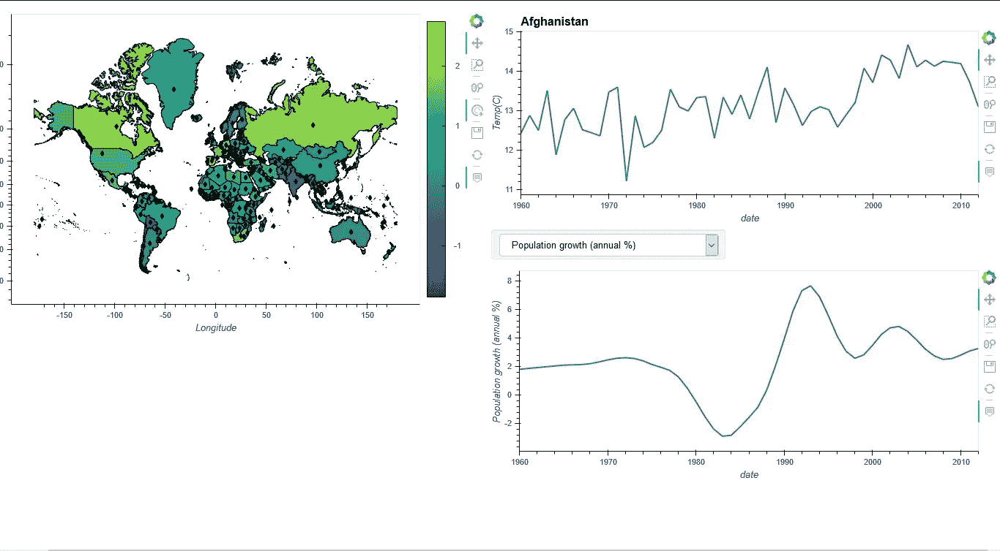

# 使用 Heroku 容器注册中心部署 Panel (Holoviz)仪表板

> 原文：<https://towardsdatascience.com/deploying-panel-holoviz-dashboards-using-heroku-container-registry-5221eb0538ba?source=collection_archive---------35----------------------->



交互式 Python 仪表盘

## 这篇文章旨在为使用 Heroku 部署面板应用程序提供一个简要的指南。当前的面板文档使用 Heroku 的默认应用程序构建，没有涵盖这里概述的大部分过程。

个人副业的福分之一就是选择和探索的能力。我最近开始了这样一个项目，主要是出于对全球变暖及其与我们宏观经济活动的联系的好奇。这让我经历了一个激动人心但有时也很痛苦的过程，我总结如下:

> 使用世界银行的 API 进行数据提取(高难度)→用于建模的数据准备(EDA)(高难度)→数据建模(低难度)

对我来说，最有趣的发现是，全国平均气温可能不一定是一个微不足道的概念。在某些情况下，我发现在同一气候带的国家之间，测量期间的温度变化很大；这是我们的宏观经济活动对气温产生重大影响的一个潜在迹象。不过，需要提醒的是，还需要更多的研究。对于任何有兴趣浏览研究结果或该项目的任何其他方面的人，这里有[链接](https://github.com/InsciteAnalytics/Climate-WorldBank)。

## 仪表板建筑

鉴于我已经经历了组织这个困难的数据集的过程，我不希望这个附带项目保持独立。我想建立一个仪表板，使我能够通过点击世界地图上的国家来查看每个国家的数据(我的数据是按国家排列的)。我还希望这张地图有一个显示每个国家温度变化(基于指数)的色标。最后，仪表板还必须在网上公开。

基于我对 Python 可视化/部署工具的了解，我期望花很多时间找到合适的库来实现这一点。令我惊讶的是，我发现 Anaconda 的 Holoviz 生态系统，由几个可视化、dashboarding 和部署工具组成，是我计划的一站式商店。


Holoviz 是所有这些多用途工具的集合

我不会进入代码或我如何建立仪表板的细节；有足够的材料可以带你经历这些。这些[教程](https://holoviz.org/tutorial/index.html)是一个很好的开始。

## 部署

现在这个帖子的关键来了。这是我旅程中在互联网上找不到太多直接帮助的部分。Panel 库(Holoviz 的一部分)为管理数据交互、设置管道、使用小部件和部署动态仪表板提供了一个优秀的工具包。部署就像用。servable()。这只有在部署在您的本地环境中时才成立。但是当涉及到像 Heroku(我将在这里讨论)这样的云服务器时，你很可能会遇到问题。然而，我希望这个简短的演练将有助于解决这些问题。

## web 部署的问题

1.当我开始使用 Heroku 进行部署时，我遇到的第一个问题是我环境中的许多包无法通过 pip 获得；因此，应用程序构建阶段不断失败。

2.为了纠正上述问题，我尝试了几个定制的第三方构建包，它们应该能够处理基于 conda 的环境，但没有一个对我有效。

3.即使我很幸运地找到了一个 buildpack，我意识到我的环境超过了 3GB，而 Heroku 只允许最大 500 MB 用于这样的部署。

4.Panel library 文档中的另一个选项是使用 MyBinder 进行部署，我试过了，但还是无法构建我的环境。

## 解决办法

通过创建 docker 文件使用 Heroku 容器注册表进行部署解决了这个问题。这是 Heroku 提供的三个部署选项中的第三个。其次，我没有使用环境文件，而是在 docker 文件中使用单独的库安装命令(这提供了更多的稳定性；然而，如果使用环境文件是强制性的，这里有一个[指南](https://pythonspeed.com/articles/activate-conda-dockerfile/)。

## 用近乎外行的语言快速浏览 Docker

3 个重要的 docker 概念:

1. **Docker 容器**:一个更简单/更快速的虚拟机替代品。因此，您可以在 Docker 容器中复制您的本地环境，该容器可能运行在提供商的平台上(在本例中为 Heroku ),并在其上运行您的应用程序。

2. **Docker 镜像**:构建和运行 Docker 容器的指令。

3. **Dockerfile** :包含 docker 图像蓝图的文本文件。

以下是我用来部署我的应用程序的 docker 文件:

```
# Starting from base miniconda image
FROM continuumio/miniconda3# Setting working directory in destination
WORKDIR /app# This is the complete set of libraries required
RUN conda install -c pyviz holoviz
RUN conda install -c pyviz geoviews-core
RUN conda install geopandas# Copy the relevant folder into the container
COPY ./dep-test/ .# Run panel serve to start the app
CMD panel serve --address="0.0.0.0" --port=$PORT main.py --allow-websocket-origin=worldbank-climate-dashboard.herokuapp.com
```

我的重点是最后一个 CMD 命令；但是为了理解这一点，有必要简要介绍一下 Panel 的部署系统:

**本地部署使用。servable()**

我提到过。servable()方法。什么时候。servable()附加到一个 panel 对象，该对象是使用 Tornado web 服务器部署的。因此，假设我有一个 python 文件或一个 jupyter 笔记本(在上面的例子中是它的 main.py ),其中包含一个带有可显示面板对象的仪表板的全部代码，我决定使用。servable()。要访问已部署的版本，我必须使用命令提示符浏览到我的项目文件夹(注意，提示符应该在适当的 conda 环境中),并输入以下命令:

**panel serve*filename . py*或 *filename.ipynb*** →这将在 Tornado web 服务器中打开应用程序，并为您提供使用浏览器访问它的链接。链接通常是: [http://localhost:5006/ *文件名*](http://localhost:5006/filename)

**Web 部署使用。servable()**

使用 Heroku 的 Web 部署是类似的。使用上面的 Dockerfile 文件，我们已经设置了所需的环境。CMD 命令使您能够在 shell 中运行命令；因此，这就是我们使用*面板服务*的地方。以下是您将如何根据自己的应用程序自定义上述 docker 文件中的 panel serve 命令:

```
CMD panel serve --address="0.0.0.0" --port=$PORT ***main.py*** --allow-websocket-origin=***worldbank-climate-dashboard***.herokuapp.com
```

考虑上面粗体和斜体部分，您将执行以下操作:

*   用包含仪表板代码的文件替换 ***main.py***
*   将***world bank-climate-dashboard***替换为您在 Heroku 中为应用程序选择的名称

如果你还没有帐户，下一步就是注册 Heroku(这是免费的)。他们的网络用户界面很棒，会引导你完成应用简介的创建过程。最后，在 Heroku 的 web UI 的应用程序部署部分，您将看到三种部署方法:

*   Heroku Git(使用 Heroku CLI)
*   Github(连接到应用程序的 Github Repo)
*   容器注册表(使用 Heroku CLI)

选择容器注册表，将显示必要的程序。只需记住 Heroku 提供的命令的以下附加内容:

```
$ heroku container:push web -a 'name of your app'
$ heroku container:release web -a 'name of your app'
```

我的朋友们。万事如意！

PS:这里有一个仪表盘[回购](https://github.com/InsciteAnalytics/worldbank-climate-dashboard)的链接。