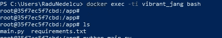

# 整理您的 Python 脚本并连接到外部 SQL Server

> 原文：<https://towardsdatascience.com/deploying-python-script-to-docker-container-and-connect-to-external-sql-server-in-10-minutes-225ff4c19ce5?source=collection_archive---------9----------------------->

## Docker、Python 和 SQL Server

## 查看了许多链接和教程后，我决定编写一个简单的指南，介绍如何将 Python 脚本部署到 Docker 容器，然后连接到外部 SQL Server 实例，并使用 [*pyodbc*](https://docs.microsoft.com/en-us/sql/connect/python/pyodbc/python-sql-driver-pyodbc?view=sql-server-ver15) 执行简单的插入命令。


照片由[阿里夫·里扬托](https://unsplash.com/@arifriyanto?utm_source=medium&utm_medium=referral)在 [Unsplash](https://unsplash.com?utm_source=medium&utm_medium=referral) 拍摄

编写本指南时，假设您已经具备:

*   Docker 安装完毕，转而使用 Linux 容器
*   SQL Server 实例正在运行

您需要创建 3 个文件:

*   Dockerfile 文件
*   main.py(这是您的主要 Python 代码)
*   requirements.txt

## Dockerfile 文件

```
FROM python:3WORKDIR /appADD requirements.txt .
ADD main.py .#Optional
ENV https_proxy=[http://[](http://proxy1.uk.webscanningservice.com:3128)proxy]:[port]
ENV http_proxy=[http://[](http://proxy1.uk.webscanningservice.com:3128)proxy]:[port]# install FreeTDS and dependencies
RUN apt-get update \
 && apt-get install unixodbc -y \
 && apt-get install unixodbc-dev -y \
 && apt-get install freetds-dev -y \
 && apt-get install freetds-bin -y \
 && apt-get install tdsodbc -y \
 && apt-get install --reinstall build-essential -y# populate "ocbcinst.ini" as this is where ODBC driver config sits
RUN echo "[FreeTDS]\n\
Description = FreeTDS Driver\n\
Driver = /usr/lib/x86_64-linux-gnu/odbc/libtdsodbc.so\n\
Setup = /usr/lib/x86_64-linux-gnu/odbc/libtdsS.so" >> /etc/odbcinst.ini#Pip command without proxy setting
RUN pip install -r requirements.txt#Use this one if you have proxy setting
RUN pip --proxy [http://](http://proxy1.uk.webscanningservice.com:3128)[proxy:port] install -r requirements.txtCMD ["python","-i","main.py"] 
```

## main.py

main.py 可能的样子示例

## requirements.txt

*   **选项 1**

创建一个文本文件并添加一行，如下所示:

```
pyodbc==4.0.28
```

*   **选项 2**

如果您使用 [PyCharm](https://www.jetbrains.com/pycharm/) 或任何终端并运行 [*pip freeze*](https://pip.pypa.io/en/stable/reference/pip_freeze/) 命令，请使用 Python 终端:

```
pip freeze > requirements.txt
```

这将产生一个包含所有必需模块的文件。

# 构建并运行 Docker 映像

最后，我们希望构建并运行映像。

```
#Build the image
docker build -t my-app .
#Run it
docker run my-app
#Find container name
docker ps --last 1
#Check logs
docker logs <container name>
```

如果您想浏览容器并手动运行脚本，那么修改 *Dockerfile 的最后一行，*构建并再次运行*:*

```
*#CMD ["python","-i","main.py"]CMD tail -f /dev/null*
```

*这将使容器长时间运行，使您能够使用以下命令打开 bash shell:*

```
*docker exec -ti <container name> bash*
```

*然后您将能够浏览容器并手动执行 *main.py* 。*

**

*打开 bash shell 后容器的屏幕截图*

*如果要停止或移除容器，请使用:*

```
*#List all containers
docker ps -a#List all container id
docker ps -aq#Stop container
docker stop <container_name>#Will remove all your containers
docker rm -f $(docker ps -aq)*
```