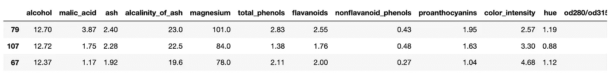
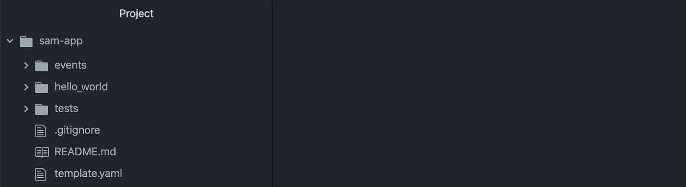

# 使用 SAM 在 AWS Lambda 上部署 Sklearn 机器学习

> 原文：<https://towardsdatascience.com/deploying-sklearn-machine-learning-on-aws-lambda-with-sam-8cc69ee04f47?source=collection_archive---------9----------------------->

## 在 API 背后的无服务器架构上生产机器学习


来自[佩克斯](https://www.pexels.com/photo/people-at-concert-1105666/?utm_content=attributionCopyText&utm_medium=referral&utm_source=pexels)的[毗湿奴·R·奈尔](https://www.pexels.com/@vishnurnair?utm_content=attributionCopyText&utm_medium=referral&utm_source=pexels)的照片

在笔记本电脑上构建机器学习模型非常简单。

部署模型以使它们在生产中可用并不容易。

生产 ML 很难。它不仅结合了 SDE，ML 和 DevOps。但是没有放之四海而皆准的方法。

一家公司的成立取决于业务需求、财务限制和技术技能的综合因素。

今天我们将学习在 [Lambda](https://aws.amazon.com/serverless/) 上部署[无服务器](https://en.wikipedia.org/wiki/Serverless_computing) ML。

*虽然大多数 ML 并不适合无服务器系统，但有时还是有意义的。一会儿有意义的时候我会解释的。*

## 目录:

1.  背景资料
2.  在本地训练一个模型
3.  将模式推向 S3
4.  构建 SAM 应用程序
5.  在本地测试应用程序
6.  将应用程序部署到 AWS
7.  测试 API
8.  结论

# 背景

## 什么时候 ML 适合无服务器？

你的 ML 很适合 Lambda，如果…

*   **你的型号小。** Lambda 会在每次请求时重新加载模型，因此大型模型会导致响应时间变慢。
*   **数据向量很小。** Lambda 配备了 3GB 内存上限。所以如果你的输入数据是海量的，它就会崩溃。
*   **您的模型将被零星地访问。** Lambda 向外扩展(不是向上扩展)到无限，并按请求收费。因此，它非常适合间歇性的“即时”需求。
*   **低成本很重要。** Lambda 每百万次请求收费 0.2 美元。

否则…考虑在 EC2 或 Sagemaker 上部署(如果钱不是问题的话)。

## 山姆是什么？

SAM 代表“无服务器应用程序模型”。这是一个通过代码提供 AWS 服务的开源框架。

通常，在 AWS 控制台中，总是选择基础设施即代码，而不是设置基础设施。前者更易维护，可复制，并允许在 Github 中存储版本。

## 教程先决条件

你需要在你的机器上设置一些东西。

*   AWS 外壳(下载并[配置](https://docs.aws.amazon.com/cli/latest/userguide/cli-configure-quickstart.html)
*   AWS SAM 客户端
*   码头工人

# 在本地训练一个模型

本教程的重点是部署。所以我们不会关心训练一个精确的模型。但是您可以很容易地用您自己的更复杂的模型来替换它。

在 Jupyter notebook 中，首先导入所需的库。

```
from sklearn.datasets import load_wine
import pandas as pd
import numpy as np
import pickle
```

导入数据并生成数据框架。

```
data = load_wine() # import dataset
df = pd.DataFrame(data['data'], columns=data['feature_names']) # build dataframe
df['target'] = data['target'] # add dependent variable
df = df.sample(frac=1) # randomize the data
df.head(3)
```



它看起来会像这样。

将数据分成测试集和训练集。

```
print("row count:",len(df))
train_df = df[:150]
test_df = df[150:]
#=> row count: 178
```

准备数据以训练模型。

```
def X_and_y_from_df(df, y_column, X_columns = []):
    '''Extract data from the dataframe'''
    X = {}
    for feature in X_columns:
        X[feature] = df[feature].tolist()
    y = df[y_column].tolist()
    return X, yX_train, y_train = X_and_y_from_df(train_df, 'target', ['alcohol'])
X_test, y_test = X_and_y_from_df(test_df, 'target', ['alcohol'])X_train = np.array(X_train['alcohol']).reshape(-1,1)
X_test = np.array(X_test['alcohol']).reshape(-1,1)
```

符合模型。

```
from sklearn.linear_model import LogisticRegression
model = LogisticRegression()
model.fit(X_train, y_train)
```

腌制模型。

```
import pickle
pickle.dump( model, open( "pickled_model.p", "wb" ) )
```

太好了！现在它的格式很容易在 S3 保存。

# 将模式推向 S3

在与上述笔记本相同的目录中打开命令行。

创建一个 S3 桶。

```
$ aws s3 mb s3://sam-sklearn-lambda-123
```

*注意:您将需要自己的全球唯一的存储桶名称。*

把你的腌模推到 S3 去。

```
$ aws s3 cp pickled_model.p s3://lambda-app-bucket-123
```

AWS 服务现在可以访问您的模型，并且无需重新部署任何其他代码就可以对其进行更新或更改。

# 构建 SAM 应用程序

在命令行上，初始化 SAM 应用程序。

```
$ sam init
```

这将询问您 4 个问题，这些问题将用于为我们的 SAM 应用程序构建一个起始模板。

回答下面的问题。

## 提示:

1.  **您想使用哪个模板源？** 1 — AWS 快速入门模板
2.  **您想使用哪个运行时？** 2 — python3.8
3.  **项目名称【Sam-app】:**【按“回车”保留默认名称】
4.  **AWS 快速入门应用程序模板:** 1 — Hello World 示例

现在`cd`进入刚刚创建的目录，用你喜欢的文本编辑器打开它。我用的是 Atom。

目录结构应该如下所示。



接下来，让我们将 lambda 代码所在的子目录的名称从`/hello_world`改为`code/`。您可以使用以下命令来完成此操作。

```
$ mv hello_world/ code/ 
```

现在是时候更新文件了。

## template.yaml

这个文件告诉 [CloudFormation](https://aws.amazon.com/cloudformation/) 应该提供哪些服务。

更新它，如下图所示。

```
AWSTemplateFormatVersion: '2010-09-09'
Transform: AWS::Serverless-2016-10-31
Description: 'Serverless wine classifier'
Globals:
  Function:
    Timeout: 10
Resources:
  WineClassifierFunction:
    Type: AWS::Serverless::Function
    Properties:
      CodeUri: WineClassifierFunction
      Handler: app.lambda_handler
      Runtime: python3.8
      MemorySize: 1024
      Role: arn:aws:iam::421242169512:role/LambdaCanReadS3
      Environment:
        Variables:
          s3_bucket: lambda-app-bucket-123
          model_name: pickled_model.p
      Events:
        WineClassifier:
          Type: Api
          Properties:
            Path: /classify
            Method: post
Outputs:
  WineClassifierApi:
    Description: API Gateway endpoint URL for Prod stage for WineClassifier function
    Value:
      Fn::Sub: [https://${ServerlessRestApi}.execute-api.${AWS::Region}.amazonaws.com/Prod/classify/](https://${ServerlessRestApi}.execute-api.${AWS::Region}.amazonaws.com/Prod/classify/)
```

*注意:您需要在 AWS 中创建一个 IAM 角色，它允许 Lambda 读取 S3 的文件。我的名字叫做"*arn:AWS:iam::421242169512:role/lambda can reads 3 "但是你需要用你的角色的名字替换它。

上面提供了 API 网关端点和 Lambda。

它还将运行在 lambda 上的语言指定为 Python3.8，设置一些可以在我们的 Lambda 代码中访问的变量，并配置 API 网关端点。

## code/app.py

这是我们的 Lambda 代码所在的地方。

```
import json
import sklearn
import boto3
import os
import json
import pickles3 = boto3.client('s3')
s3_bucket = os.environ['s3_bucket']
model_name = os.environ['model_name']
temp_file_path = '/tmp/' + model_namefrom sklearn.linear_model import LogisticRegressiondef lambda_handler(event, context):
    # Parse input
    body = event['body']
    input = json.loads(body)['data']
    input = float(input ) # Download pickled model from S3 and unpickle
    s3.download_file(s3_bucket, model_name, temp_file_path)
    with open(temp_file_path, 'rb') as f:
        model = pickle.load(f) # Predict class
    prediction = model.predict([[input]])[0] return {
        "statusCode": 200,
        "body": json.dumps({
            "prediction": str(prediction),
        }),
    }
```

简而言之，它导入库，从 S3 获取模型，解析输入请求，对其进行分类，并返回响应。

## code/requirement . txt

这是我们指定应该在 Lambda 上安装什么库的地方。下面是我们所需要的。

```
requests
boto3
sklearn
```

现在在命令行上运行以下命令。

```
$ sam build
```

这将创建一个`.aws-sam/build`目录，其中包含将被部署到 AWS 的代码。

# 在本地测试应用程序

在部署之前，让我们确保应用程序在本地工作。在此处得到成功回复之前，请不要继续。

运行以下命令以在本地设置应用。

```
$ sam local start-api
```

现在用卷曲达到终点。

```
$ curl -XPOST http://127.0.0.1:3000/classify -H 'Content-Type: application/json' -d '{"data":".10"}'
```

响应应该如下所示。

```
{"prediction": "1"}
```

如果你的回答如上，请继续！

# 将应用程序部署到 AWS

`cd`进入`.aws-sam/build/`目录。

```
$ cd .aws-sam
$ cd build
```

现在在下面跑。这将创建一个 zip 文件，其中包含将要部署的依赖项(马上)。这需要一分钟。

*注意:我使用我的 S3 桶的名字，但是你应该使用你的名字。*

```
$ sam package --template-file template.yaml --s3-bucket lambda-app-bucket-123 --output-template-file packaged.yaml
```

然后运行以下命令来部署您的应用程序。

```
$ sam deploy --template-file packaged.yaml --stack-name SklearnLambdaStack --capabilities CAPABILITY_IAM
```

您应该得到一个应用程序已经部署的确认。

# 测试 API

在之前的部署响应中，您将获得一个 URL。

如果一切正常，向该 URL 发送请求应该会返回与向本地运行的应用程序发送请求相同的响应。

```
$ curl -XPOST https://6lsk6c6vw2.execute-api.us-east-1.amazonaws.com/Prod/classify/ -H 'Content-Type: application/json' -d '{"data":".10"}'
```

所以以上应该回归。

```
{"prediction": "1"}
```

恭喜你！您已经部署了您的第一个无服务器 ML 应用程序！

# 结论

如您所见，在无服务器架构上部署 ML 绝非易事。

我们所走过的例子非常简单；我们甚至跳过了 API 认证，因为我不想偏离核心课程。

关于生产无服务器 ML 的例子并不多，所以我希望这有助于加速你的学习过程。

我完全期待在未来我们会看到更多更好的生产 ML 的工具。但在此之前，基础设施将与模型部署紧密结合。

我希望你觉得这很有用。一如既往，如果你遇到困难，请告诉我，我会尽力帮助你！