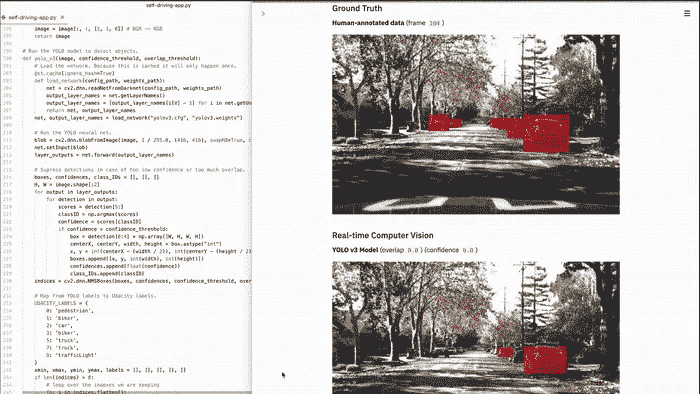
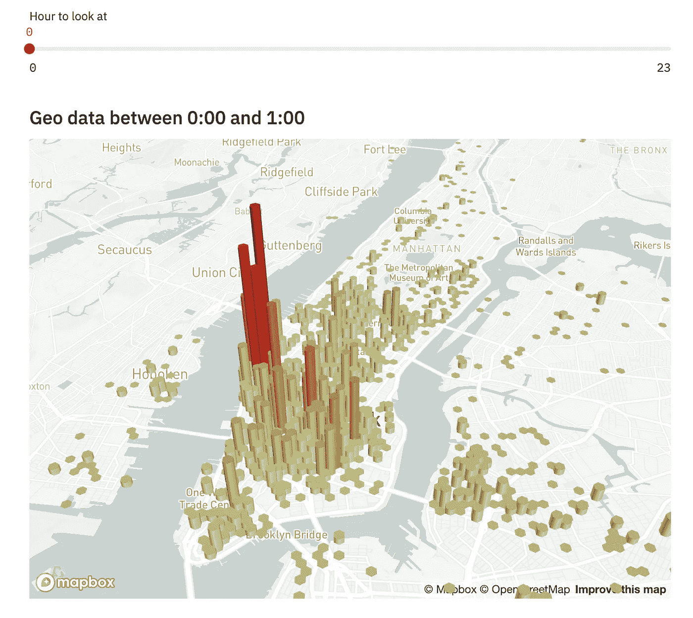

# 将 Streamlit 应用部署到 GCP

> 原文：<https://towardsdatascience.com/deploying-streamlit-apps-to-gcp-79ad5933013e?source=collection_archive---------16----------------------->


来自 Unsplash 的 Rene b hmer 的照片。

# 什么是 Streamlit？

如果您熟悉 Python 中的数据科学软件生态系统，您可能会遇到一些广泛使用的仪表板和数据可视化工具，这些工具是为编程用途而设计的(例如，嵌入笔记本电脑或作为独立的 web 应用程序)。在过去的几年里，像 [Dash](https://plotly.com/dash/) 、 [Bokeh](https://docs.bokeh.org/en/latest/index.html) 和 [Voila](https://voila.readthedocs.io/en/stable/using.html) 这样的公司已经成为这个领域中最大的开源公司之一。在 R 的世界里，还有仪表板工具的长期冠军:[闪亮](https://shiny.rstudio.com/)。

有了这个相对成熟的生态系统，你可能会质疑是否需要一个*又一个*框架来加入这个群体。但这正是 Streamlit 的团队正在做的事情:引入一个全新的框架来构建数据应用程序。更重要的是，他们也为他们的项目制造了不少轰动，以至于他们最近结束了一轮 2100 万美元的首轮融资，以允许他们继续开发他们的框架。

[](https://medium.com/streamlit/announcing-streamlits-21m-series-a-ae05daa6c885) [## 宣布推出价值 2100 万美元的 Streamlit A 系列产品

### 为数据科学界开发新的超级能力。

medium.com](https://medium.com/streamlit/announcing-streamlits-21m-series-a-ae05daa6c885) 

那么是什么让人们对 Streamlit 如此兴奋呢？



Streamlit 中实时计算机视觉可视化。照片来自 [Streamlit](https://www.streamlit.io/) 。

首先，这是你可能遇到的最简单的工具之一。没有样板文件，也没有什么特定于框架的概念需要记住。感觉设计的非常好。总的来说，这种简单性使得在几秒钟内构建一个应用程序变得非常快速和容易。

这种极简主义有助于第二个要点:事件管理轻而易举。这听起来可能很无聊，但在这种情况下这是一件大事。在 Streamlit 中管理事件不需要特定于框架的设计模式/回调。例如，假设您想通过点击一个按钮来运行一些代码，您可以在 Streamlit 中用以下代码来捕获:

```
import streamlit as stif st.button("Click Me"):
 print("Clicked")
```

每当按下`Click Me`按钮时，其下的程序块将被执行。相同的概念以几乎相同的方式应用于他们所有的交互组件。它在幕后做了一些聪明的把戏来实现这一点，但最终效果是一样的:你可以快速简单地编写具有复杂行为的应用程序，只需对底层代码做很少的更改。与 [Fire 让为现有代码创建 CLIs](https://mark.douthwaite.io/fire-simple-clis-done-fast/) 变得异常容易一样，Streamlit 让从现有*代码创建交互式应用变得异常容易。正如他们所说:它被设计成“洒”在你的代码上。*

最后，Streamlit 与现有的数据可视化工具集成起来也非常容易，并且非常容易部署启动——它与现代部署工具和技术配合得非常好。你可以随心所欲地将你的`matplotlib`图表嵌入到你的`dash`图中，然后将其打包，随时准备部署。总而言之，这些特性共同使 Streamlit 成为目前最具生产力的现代数据可视化工具之一。

# 创建您的应用

虽然 Streamlit 的文档对入门很有帮助，但是没有太多关于部署应用的内容。本文旨在强调将 Streamlit 应用部署为一个面向公众的实时网站是多么简单。它将使用 Streamlit 提供的一个“标准”演示应用程序:一个按一天中的时间[在纽约市](https://github.com/streamlit/demo-uber-nyc-pickups)的优步皮卡的可视化。但是，您可以随意创建自己的应用程序并进行部署(您将使用的模板无需更改！).

# 你需要什么

开始之前，你需要确定你已经准备好了一些东西。您将使用 Google App Engine 部署您的应用程序，因此这意味着您需要注册一个 Google Cloud 帐户(注册时还有 300 美元的信用点数！)然后安装他们的`gcloud`命令行工具。你可以在这里注册一个账户(不是代销商链接，不用担心！):

[](https://cloud.google.com/free) [## GCP 免费等级免费扩展试用和永远免费|谷歌云

### GCP 自由层以两种方式扩展我们的免费计划。3 个月免费试用的 300 美元积分和 20 多种免费产品…

cloud.google.com](https://cloud.google.com/free) 

谷歌云也为安装`gcloud`提供了很好的“入门”指南。

[](https://cloud.google.com/sdk/gcloud) [## gcloud 命令行工具概述| Cloud SDK 文档

### 本页包含 gcloud 命令行工具及其常用命令模式和功能的概述。的…

cloud.google.com](https://cloud.google.com/sdk/gcloud) 

完成后，确保你已经安装了[Docker](https://docs.docker.com/get-docker/)并且正在运行。你不需要与 Docker 互动来跟进这篇文章，但你需要它运行！您还需要拥有 Python 3.6 或更高版本的有效版本。为项目设置并激活一个 Python 虚拟环境也是一个好主意。

# 编码时间到了

所以，首先要做的是。您需要从 GitHub 克隆部署就绪的 [Streamlit 项目模板](https://github.com/markdouthwaite/streamlit-project)。在您的终端中，运行:

```
git clone [https://github.com/markdouthwaite/streamlit-project](https://github.com/markdouthwaite/streamlit-project)
```

导航到新的`streamlit-project`目录并运行:

```
pip install -r requirements.txt
```

正如您所料，这将安装运行此应用程序所需的软件包。有了这个设置，是时候测试你的应用了！您可以通过以下方式做到这一点:

```
make run-container
```

将您的应用程序构建到 Docker 映像中，并在`http://0.0.0.0:8080`启动运行您的应用程序的新容器。它会自动打开一个新的浏览器选项卡并加载你的应用程序。您应该会看到这样一个可爱的可视化效果:



照片来自 [Streamlit](https://www.streamlit.io/) 。

你可以随意编辑这个应用程序。了解 Streamlit 的强大功能是值得的。当你完成后，只要确保`make run`仍然在`http://0.0.0.0:8080`成功启动你的应用，然后你就可以开始部署了。

# 部署您的应用

您将使用[谷歌应用程序引擎](https://cloud.google.com/appengine)来部署应用程序。这是由 Google Cloud 提供的托管服务，可以帮助您超级轻松地部署和扩展您的应用。谷歌将为你管理缩放、服务器设置和其他零碎的东西。您所需要的只是一个正确配置的 Docker 映像，而且您已经很接近了。转到您的[谷歌云控制台](https://console.cloud.google.com/)，前往左侧导航菜单中的 App Engine，检查您的 App Engine API 是否处于活动状态。您现在应该能够运行:

```
make gcloud-deploy
```

这将建立你的图像，存储在谷歌容器注册(GCR)，然后配置和启动你的应用程序。完成后它会告诉你的。您应该会看到类似这样的内容(其中`{{YOUR-URL}}`将是您部署的应用程序的 URL):

```
Deployed service [default] to [{{YOUR-URL}}]
```

导航到所提供的 URL，查看您的应用程序的所有优点！

# 后续步骤

完成后，你的应用程序现在是公开可见的，可以与你希望的任何人共享。您现在还可以使用`make gcloud-deploy`自由编辑和重新部署您的应用程序。你甚至可以考虑用 [GitHub Actions](https://github.com/features/actions) 构建一个[持续集成和持续交付](https://mark.douthwaite.io/continuous-training-and-delivery/) (CI/CD)管道，以便在每次你向 GitHub 推送更改时自动重新部署你的应用。不过这取决于你！

# 解决纷争

如果你在上述步骤中遇到任何问题，App Engine 的文档非常好，值得一看:

如果你还在挣扎，请随时在 Twitter 上联系我。

# 收尾工作

差不多就是这样了。以可扩展、安全的方式部署新的 Streamlit 应用。简单，嗯？当您深入研究 Streamlit 时，您会注意到它在几个方面仍然有点受限:例如，布局和样式在默认情况下是高度受限的。然而，他们最近的几轮融资给了他们很多开发一些很酷的新功能的机会，这些东西*在他们的功能路线图上*，所以他们的到来只是时间问题。如果你对数据可视化感兴趣，Streamlit 绝对值得一看。