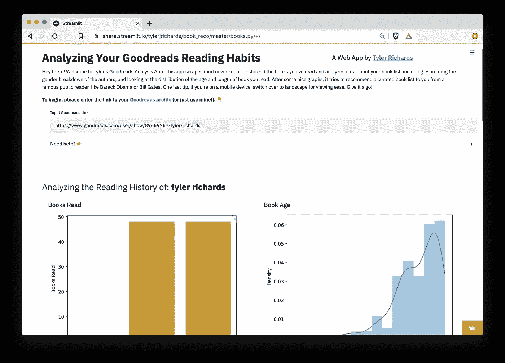
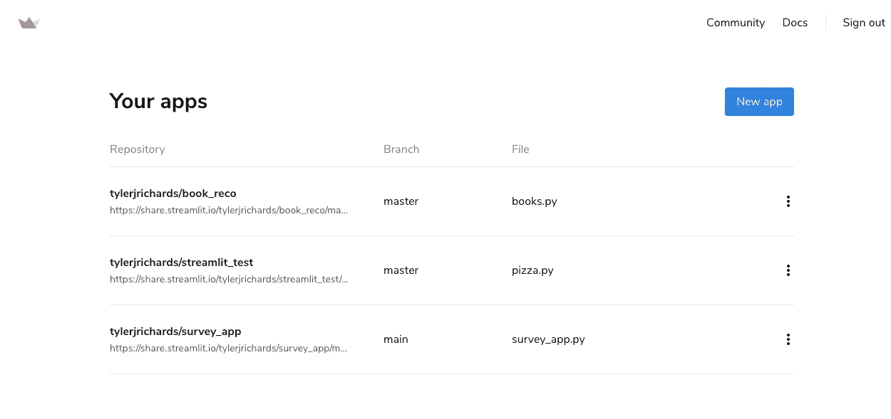
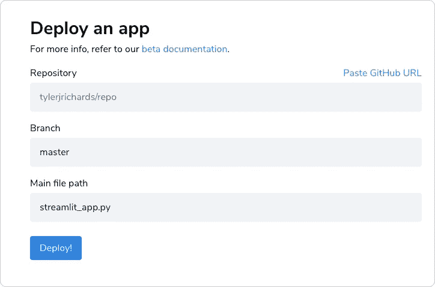

# 使用简化 it 共享部署简化 it 应用

> 原文：<https://towardsdatascience.com/deploying-streamlit-apps-using-streamlit-sharing-16105d257852?source=collection_archive---------29----------------------->

## 先睹为快 Streamlit 的新部署平台


作者图片

在过去的几周里，我一直在玩一个名为 Streamlit sharing 的新 Streamlit 功能，它使部署您的定制应用程序变得非常简单。我将首先介绍一些背景知识，因此如果您想查看 Streamlit 共享的文档，您可以在这里找到它们。

# 流线型背景

简单介绍一下背景，Streamlit 是一个框架，它可以让您快速而自信地将 python 脚本转换为 web 应用程序，对于需要快速共享模型或交互式分析的团队中的数据科学家来说，或者对于从事希望向世界展示的个人项目的数据科学家来说，它是一个不可思议的工具。如果你想尝试一下，这里有一个 [Streamlit 初学者教程](https://docs.streamlit.io/en/stable/)！

在过去的大约 6 个月里，我一直在使用 Streamlit，它一直**非常**有用。以前，如果我知道我想在项目结束时制作一个 web 应用程序，我总是会选择切换到 R 来获得精彩的 R shiny 框架，即使我是一个比 R 好得多的 python 程序员。经历 Django 或 flask 是如此多的开发摩擦，以至于对于个人项目来说很少是值得的，并且对于工作中的任何事情来说总是花费太多时间。但是在使用 Streamlit 之后，我现在不仅有了选择，而且发现自己更喜欢 python+Streamlit 而不是 R+shiny。

# 简化共享

这让我想起了几个月前。我启动了一个 [DS 项目](http://www.tylerjrichards.com/books_reco.html)，专注于使用来自 [Goodreads](http://www.tylerjrichards.com/books_reco.html) 应用的数据分析阅读习惯。我决定尝试一下 Streamlit，它将一个 Django/flask 应用程序在本地正常运行的多日过程变成了一个在本地使用 Streamlit 大约需要半小时的过程。这真的很简单，只要你想在应用程序上放一个图表、小部件或文本解释器，就可以把你的分析放到一个脚本中，并调用 Streamlit 函数。

然而，Streamlit 上最烦人的流程是部署和管理流程。我跟着学的[教程很简单，没花多少时间，但是相当广泛。它需要启动一个 ec2 实例，配置 SSH，使用 tmux，并在每次想要更改 web 应用程序时返回到这个终端。这是可行的，但令人讨厌。](/how-to-deploy-a-streamlit-app-using-an-amazon-free-ec2-instance-416a41f69dc3)



作者图片

几周前，Streamlit 看到了我的 Goodreads 应用程序，问我是否想测试一下他们的 Streamlit 共享测试版，该测试版应该可以消除上面解释的摩擦。很明显，我尝试过了。

**我所要做的就是:**

1.  将我的应用程序推送到 Github 回购
2.  添加一个 requirements.txt 文件，列出我使用的所有 python 库
3.  通过指向存储库的链接将 Streamlit 指向我的应用程序
4.  单击部署

这真的是**那么容易**弄清楚。我花了几个小时来解决这个问题，因为我预计会出现各种各样的错误(这是测试版！)，但我只用了不到 10 分钟就让它启动并运行了。

我目前正在运行三个应用程序，一个是测试应用程序，第二个是我之前提到的 [Goodreads 图书推荐应用程序](https://share.streamlit.io/tylerjrichards/book_reco/master/books.py/+/)，第三个是我在大约一个半小时内完成的一项技术调查的[交互分析](http://www.tylerjrichards.com/survey.html)(从想法到运行和部署 web 应用程序)。

切换到 Streamlit 共享还为我节省了每月约 5 美元的 AWS 账单，我很乐意为这项功能支付这笔费用，仅仅是因为节省了部署时间。



作者图片

如果我想尝试一个新的应用程序，我只需点击新的应用程序按钮，将其指向我的回购，他们就会处理其他一切。



作者图片

如果您的 Streamlit 应用程序使用任何其他包，请确保在您的 repo 中包含 requirements.txt 文件，否则您会在部署时立即得到一个错误。你可以使用像 pip freeze 这样的东西来获取需求，但是这会给你环境中的所有包，包括那些你在当前项目中不使用的包。这将降低您的应用程序部署速度！所以我建议使用像 pipreqs 这样的东西来保持你的应用程序的核心需求。

```
pip install pipreqs
pipreqs /home/project/location
```

如果对 apt-get 有要求，添加到`packages.txt -`，一行一个包。

# 结论

总而言之，Streamlit sharing 在节省开发时间和托管成本方面为我节省了美元(对使这一切成为可能的风险投资基金大喊一声)，使我的个人项目更具互动性和更漂亮，并消除了部署快速模型或分析的头痛。难怪我是细流迷。

想看更多这方面的内容？你可以在 [Twitter](https://twitter.com/tylerjrichards) 、 [Substack](https://insignificantdatascience.substack.com/p/starting-a-data-science-newsletter) 或[我的作品集网站](http://www.tylerjrichards.com)上找到我。

快乐的小溪！