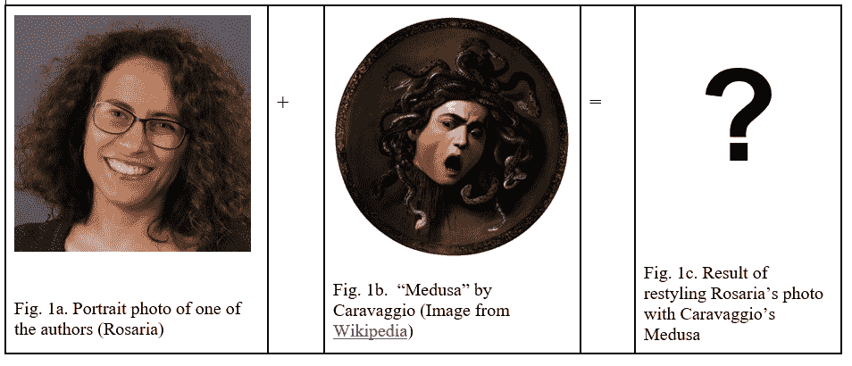
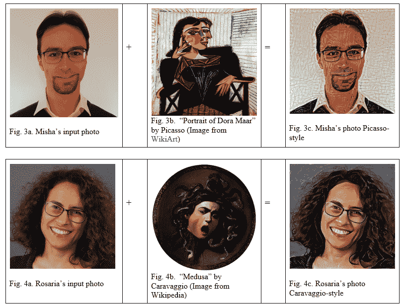
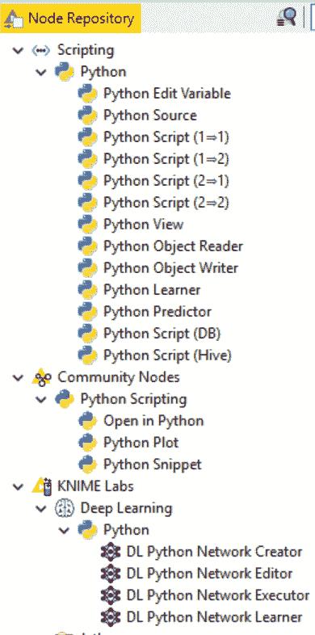
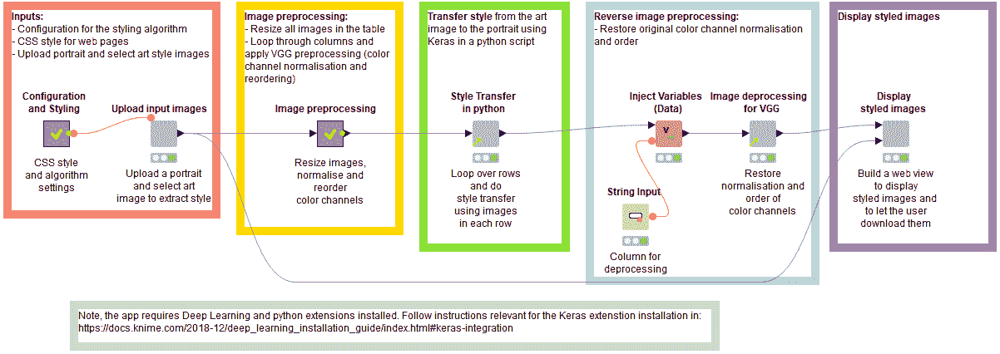

# 部署晦涩的 Python 脚本:肖像图片的神经造型

> 原文：<https://towardsdatascience.com/deploying-the-obscure-python-script-neuro-styling-of-portrait-pictures-49fa99b5dc8c?source=collection_archive---------49----------------------->

## Python 脚本的快速部署

*作者 Rosaria Silipo 和 Mykhailo Lisovyi，KNIME*

今天的款式是什么？

**当今风格:卡拉瓦乔还是毕加索？**

几个月前在网上冲浪时，我们看到了这项研究[i]，它承诺训练一个神经网络来根据你喜欢的画家的风格改变任何图像。这类研究释放了你的想象力(或者至少是我们的想象力)。

如何改变我目前的肖像图片，给它一个著名的[卡拉瓦乔](https://en.wikipedia.org/wiki/Caravaggio)画美杜莎触摸？那位同事的肖像照得更像毕加索的风格不是更好看吗？或者把梵高的《星夜》作为另一个梦幻同事的背景？给我们当中最喜欢冒险的人一点伊卡洛斯蓝？如果你对艺术有一点了解，你可以给自己的肖像赋予无穷无尽的细微差别。

好消息是这项研究附带了一个 [Python 脚本](https://keras.io/examples/neural_style_transfer/)，可以下载并重复使用。[二]

坏消息是，我们大多数人没有足够的 Python 知识来部署解决方案或使其适应我们的图像集。事实上，我们大多数人甚至没有足够的关于算法本身的知识。但事实证明我们不需要。我们不需要了解 Python，也不需要了解算法细节来根据一幅选定的画生成神经风格的图像。我们实际需要做的是:

*   上传人像图片，选择喜欢的风格(梵高的夜星，伊卡洛斯蓝，卡拉瓦乔的美杜莎等。).
*   稍等片刻，等待奇迹发生。
*   最后，下载神经风格的肖像图像。

这确实是最终用户需要做的所有事情。关于算法的细节是不必要的，因为底层 Python 脚本的全部知识也是不必要的。最终用户也不需要安装任何额外的软件，应该能够通过任何 web 浏览器与应用程序进行简单的交互。

你知道卡拉瓦乔画的美杜莎吗？这是他著名的自画像。注意美杜莎头上的蛇(图 1b)。图 1a 显示了本文作者之一 Rosaria 的肖像。如果我们根据卡拉瓦乔的美杜莎(图 1c)重新设计罗萨莉亚的肖像，会发生什么？

为了查看神经样式化的结果，我们将 Python 脚本(用于对图像进行神经样式化)集成到一个应用程序中，该应用程序可通过网络访问，与算法无关，不支持脚本，并且具有完全根据最终用户的请求定制的用户界面。

**来自网络浏览器的图像神经造型**

图二。对图像进行神经样式化所需的三个步骤:1)上传图像文件并选择艺术样式。2)等待网络找出神经样式。3)欣赏你的新肖像，它具有你喜欢的绘画的艺术风格。

从电脑、平板电脑或智能手机上的网络浏览器，该应用程序以最经典的方式启动，上传图像文件。让我们上传两位作者 Misha 和 Rosaria 的肖像图片。

之后，我们被要求选择绘画风格。罗萨莉亚是卡拉瓦乔绘画的忠实粉丝，所以她选择了《美杜莎》。米沙更喜欢毕加索的立体派，选择了他的《多拉·玛尔画像》

此时，网络开始处理数据:在我自己的笔记本电脑上用了 35 分钟，只用了我的 CPU 在更强大的机器上 35 秒[iv]带 GPU 加速。

现在，我们进入应用程序的最终网页。让我们看看网络提出的重新设计(图 3-4)。

神经风格图像在下面的图 3 和图 4 中示出。请注意，输入图像没有发生很大的变化。他们只是从艺术杰作中获得了一些颜色和图案，比如罗莎丽亚的美杜莎式头发或米莎照片中的背景墙。免责声明:尽管这些照片很有趣，但它们可能还不能用于你的护照！

三个简单的步骤从原始图像到相同的图像，由大师设计！不需要脚本和底层算法的调整。您只需要知道图像文件的位置和要应用的艺术风格。如果你改变主意，你可以随时回去改变绘画风格或输入图像。

**实现图像神经造型应用**

为了组装这个应用程序，我们只需要我们工具中的一些特性。

1.  与 Python 的集成
2.  图像处理功能
3.  web 部署选项

**Python 集成**

这里的任务是集成由牛津大学[视觉几何小组](http://www.robots.ox.ac.uk/~vgg/research/very_deep/)开发的 [VGG19](https://keras.io/applications/#vgg19) 神经网络，该神经网络可以从 Keras Documentation pageii 下载 Python 脚本来设计任意肖像图片。因此，我们需要一个 Python 集成。

开源[分析平台](https://www.knime.com/knime-software/knime-analytics-platform)的核心[安装](https://www.knime.com/downloads/download-knime)【v】中提供了与 Python 的集成。你只需要安装带有核心扩展的分析平台和带有 Keras 包的 Python。两个都安装好之后，您需要通过 File->Preferences->Python 页面将分析平台指向 Python 安装。如果你对下一步该做什么有疑问，请遵循 Python 集成[安装指南](https://docs.knime.com/latest/python_installation_guide/index.html)和深入

学习集成[安装指南](https://docs.knime.com/2018-12/deep_learning_installation_guide/index.html)。

安装后，您应该在节点库面板中看到一个 Python 类别，包括免费脚本、模型训练、模型预测器、绘图和更多 Python 函数(图 5)。所有 Python 节点都包括一个语法突出显示的脚本编辑器、两个用于脚本测试和调试的按钮、一个工作区监视器和一个显示可能错误的控制台。

注意，类似的集成也适用于 R、Java 和 JavaScript。这整个集成环境也使您能够协作和共享同事的代码和脚本。

图 5。在 KNIME 分析平台中提供 Python 函数的 Python 节点

**图像处理扩展**

图像处理功能在[图像处理](https://www.knime.com/community/image-processing)社区扩展中可用。安装后，您将在节点存储库中看到图像处理功能，在类别 Community Nodes/Image Processing 中。您可以使用它们来处理图像、提取特征、标注、过滤噪声、处理尺寸以及变换图像本身。

**Web 部署选项**

web 组件由 [WebPortal](https://www.knime.com/knime-software/knime-webportal) 提供。所有小部件节点在封装到组件中时，都将其图形视图显示为网页的一个元素。图 2 所示的两个网页是通过将多个小部件节点组合成一个组件而构建的。

**最终工作流程**

实现上述 web 应用程序的最终工作流程如图 6 所示，可从[中心](https://hub.knime.com/)下载，或从[示例服务器](https://youtu.be/CRa_SbWgmVk)的分析平台中，在 50 _ Applications/56 _ Restyling _ Images _ using _ Deep _ Learning 下下载。

图 6 中的工作流程开始于读取输入肖像图像和艺术风格图像(名为“上传输入图像”的组件)。然后，输入图像被调整大小、归一化，并且其颜色通道被重新排序。此时，Python 脚本(执行附录中所述的神经造型，并封装在名为“Python 中的样式转换”的组件中)接管并使用新的输入图像和选定的艺术样式重新训练神经网络。然后，对生成的图像进行反规格化，并将颜色通道恢复到原始顺序。最后一个节点称为“显示样式图像”，在最终的 web 页面上显示结果图像。

请注意，没有必要修改 Python 代码。将原始代码复制并粘贴到 Python 节点编辑器中，只需进行一些调整(例如，参数化训练设置)就足够了。

在更高的层面上，当终端用户从他们的 web 浏览器运行应用程序时，他们将看不到任何底层的 Python 脚本、神经网络架构，甚至是训练参数。这是向最终用户隐藏晦涩的脚本和算法复杂性的完美伪装。

图 6。工作流 01_Image_ReStyling_WebPortal 实现基于网络的应用程序，该应用程序执行输入图像的神经造型，并可在 50 _ Applications/56 _ ReStyling _ Images _ using _ Deep _ Learning 下的示例服务器上或在 KNIME Hub 上获得。

**Python 代码作为可重用组件**

现在，Python 脚本似乎工作得相当好，我们大多数不了解 Python 的人也可能喜欢使用它。“Python 中的样式转换”组件中的 Python 代码对我们来说工作得很好，但对其他人来说很难回收。

为了提高其他用户对 Python 脚本的可重用性，我们将这个组件转换为一个模板，并将其存储在一个中心位置。现在，新用户只需拖放模板，就可以在其工作流程中生成一个链接组件。

已经为图像处理组件创建了类似的模板。您可以通过灰色节点左下角的绿色箭头来识别此类模板的链接实例。

**一键部署图像神经造型应用**

最后一步是部署。换句话说，如何将我们新开发的工作流转化为一个可从 web 浏览器访问的高效应用程序，并处理当前数据。

我们需要做的只是将神经造型工作流从分析平台的本地工作区拖放到一个工作区。然后，可以通过服务器的 web 门户从任何 web 浏览器调用工作流。此外，如果使用了任何小部件节点，那么在 WebPortal 上执行工作流将会产生一系列交互式网页和仪表板。

请注意，这种一键式部署过程适用于任何 Python 脚本的部署，使其在生产环境中更易于使用。

**总结**

以玩 Rosaria 和 Misha 及其同事的神经风格肖像为借口，我们已经展示了导入、集成和部署一个晦涩的 Python 脚本是多么容易——而不需要了解 Python。

我们还展示了如何配置应用程序，使其可以在任何 web 浏览器上运行，我们只要求最终用户提供最少的必要信息，并隐藏所有其他不必要的细节。

为了使 Python 脚本和应用程序的其他部分可以被其他人重用，我们将一些部分打包为模板，并将其作为链接组件插入到许多其他不同的应用程序中。

**附录:神经式转移**

[神经风格转移](https://en.wikipedia.org/wiki/Neural_Style_Transfer)是一种使用神经网络从一幅图像中提取绘画风格并将其应用于另一幅图像的技术。它最早是在《艺术风格的神经算法 I》中提出的

主要思想是利用这样一个事实，即[卷积神经网络(CNN)](https://en.wikipedia.org/wiki/Convolutional_neural_network)【VI】在不同的层中捕捉不同的复杂程度。第一个卷积层可以作为低级边缘检测器，而最后一个卷积层可以捕获对象。由于我们只对通用对象检测器感兴趣，所以我们不需要为了风格转换而训练专用网络。相反，我们可以使用任何现有的预训练多层 CNN。在本文中，我们使用了由牛津大学视觉几何小组开发的 VGG19 神经网络，该网络以 Python 脚本的形式提供，可从 Keras 文档页面[ii]下载。

样式化过程被定义为自定义函数的优化。该功能有几个部分:

*   一个术语确保结果图像类似于原始图像中的高级对象。这是通过输入和输出图像之间的差异实现的，其中输出图像是最后一个卷积层中的网络响应。
*   第二学期旨在捕捉艺术绘画的风格。首先，样式被表示为层内跨通道的相关性。接下来，从第一层到最后一层，跨 CNN 层计算样式表示的差异。
*   最后一个术语加强了生成的风格化图像的平滑度，并在“通过反转图像来理解深层图像表示”中得到提倡

最后，使用由 [Keras](https://keras.io/) 提供的自动微分功能迭代地执行该定制函数的优化。自定义函数需要针对每个新的输入图像进行优化。这意味着，对于每一个新的肖像，我们需要在预先训练好的 CNN 上再次运行优化程序。

[i] L. Gatys 等，艺术风格的神经算法，[arXiv:1508.06576]

[ii] [Keras 神经传递样式示例](https://keras.io/examples/neural_style_transfer/)，Keras 文档页面

[iii]笔记本电脑规格:CPU Intel i7–8550 u，4 核，多线程；16 GB 内存

【四】GPU 机器规格:CPU Intel i7–6700，4 核，带多线程；32 GB 内存；配备 8GB VRAM 的 NVIDIA GeForce GTX 1080

[v] Aravindh Mahendran，Andrea Vedaldi，通过反转理解深层图像表示，[arXiv:1412.0035]

[vi] [卷积神经网络](https://www.youtube.com/playlist?list=PLkDaE6sCZn6Gl29AoE31iwdVwSG-KnDzF)YouTube 上的视频系列，Deeplearning.ai，2017

*如首次发表于*[*data versity*](https://www.dataversity.net/deploying-the-obscure-python-script-neuro-styling-of-portrait-pictures/)*。*