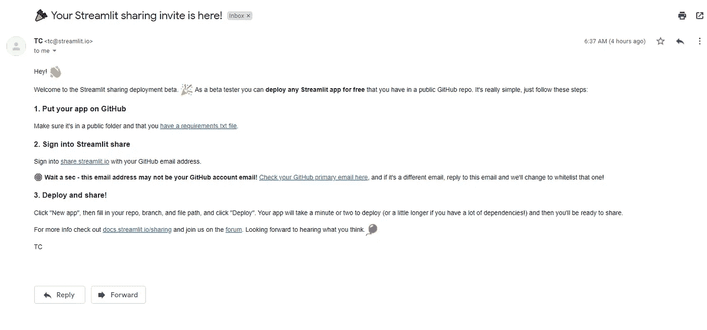
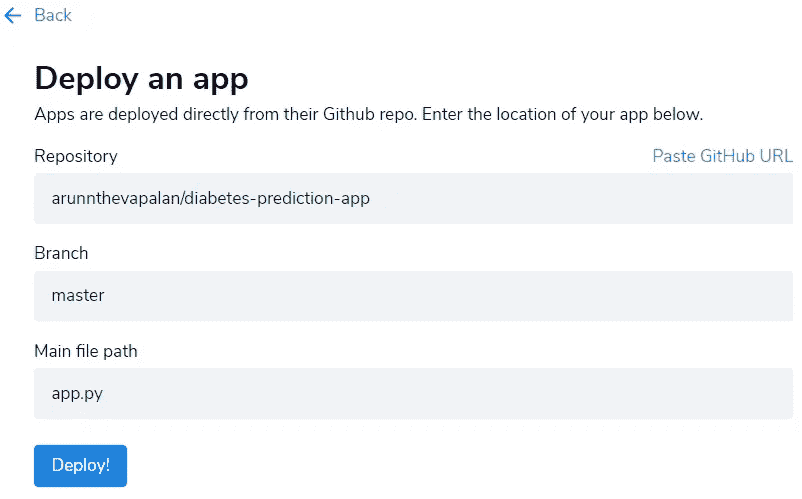
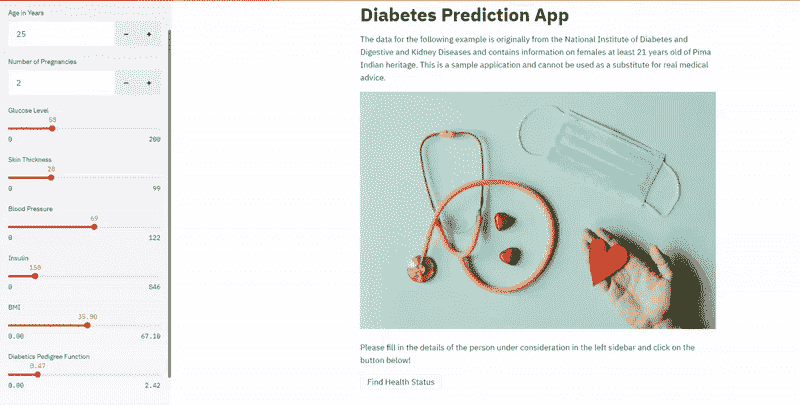

# 在 2021 年部署你的机器学习应用

> 原文：<https://towardsdatascience.com/deploying-your-machine-learning-apps-in-2021-a3471c049507?source=collection_archive---------35----------------------->

## 实践教程

## Streamlit 分享来了，很牛逼。


这是今天早上的我。(布鲁克·卡吉尔在 [Unsplash](https://unsplash.com?utm_source=medium&utm_medium=referral) 上拍照)

现在还是 2020 年。我醒来时发现收件箱里有些东西让我大吃一惊。如果这个承诺是真的，它将彻底改变我今后构建和部署机器学习应用的方式。

给你一点背景，我最近在做一个非常基础的项目，基于诊断方法预测糖尿病的发病。当我构建任何东西时，最终目标是让最终用户可以访问它。*永远*。在有了一些设计、开发和部署多个 ML 应用程序的经验之后，我或多或少地知道了这个过程。一旦模型开发完成，我首先[构建一个包装模型的应用](https://medium.com/towards-artificial-intelligence/how-i-build-machine-learning-apps-in-hours-a1b1eaa642ed)，然后[将应用](/how-to-dockerize-any-machine-learning-application-f78db654c601)文档化，最后将它部署到任何云服务提供商。

但我不知道的是，Streamlit 的优秀团队另有打算。今天早上我的收件箱里收到了一封邮件。相信我，这改变了模型部署的一切。现在还是 2020 年，但我可以预见 2021 年将会发生什么。



这封邮件是对新推出的简化应用程序部署的 Streamlit 共享平台的邀请。虽然仍处于测试阶段，但我忍不住对 2021 年的到来感到兴奋。(作者截图)

# 简化共享和承诺

如果你还没有听说过 [Streamlit](https://www.streamlit.io/) ，它是一个 python 库，可以让构建 ML 应用变得快速而简单。当我说构建任何机器学习应用程序只需要[几个小时](https://medium.com/towards-artificial-intelligence/how-i-build-machine-learning-apps-in-hours-a1b1eaa642ed?source=friends_link&sk=66a5df0a2570e1cf0f12211f3b4f2fc2)时，我并没有夸大其词。 [Streamlit 分享](https://share.streamlit.io/)是一个新推出的分享 Streamlit 应用的平台。现在已经存在类似的平台，如 Heroku 和 Netlify，以便于部署，但当使用 Streamlit 构建时，这个新平台可能是您的最佳选择。Streamlit 称其为*“机器学习代码的简单、可共享的播放按钮。”*让我们来了解一下？

对我们这些数据科学家来说，这个承诺非常简单。将您的代码推送到 GitHub，将 Streamlit 指向您的存储库并免费部署您的应用程序。那么有什么问题呢？目前，共享仅支持公共和开源应用。如果你需要为私有/内部用例部署应用，你需要等待 [Streamlit 团队，](https://www.streamlit.io/for-teams)目前处于测试开发阶段。

现在我们已经了解了这个工具，我非常兴奋能够接触到这个平台。

# 如何部署机器学习应用程序

正如我之前提到的，我们将在这里使用的例子是使用 Streamlit 构建的糖尿病预测应用程序。请参考[这个 GitHub 库](https://github.com/arunnthevapalan/diabetes-prediction-app)获取应用的完整代码。确保添加 [requirements.txt](https://github.com/arunnthevapalan/diabetes-prediction-app/blob/master/requirements.txt) 文件。需求文件只不过是应用程序使用的 python 包及其版本的列表。在你的终端上一个简单的`pip freeze`命令会给你精确的细节。在幕后，该文件有助于简化 it 安装部署所需的所有依赖项。

现在我们的存储库已经准备好了，我登录了 Streamlit 共享平台。出现提示时，我授权 Streamlit 访问我的 Github 帐户。我填写了详细信息，然后单击了 Deploy。



简单的部署过程。(作者截图)

等等……就这样？[我的应用被部署给全世界看](https://share.streamlit.io/arunnthevapalan/diabetes-prediction-app/app.py)。这个过程变得如此简单，让我惊叹不已。

整个部署过程大约需要 5 分钟。每当我更新应用程序并将代码推送到我的 GitHub 库时，部署的应用程序也会更新。这太疯狂了。



已部署应用的截屏(按作者)

然而，由于该平台仍处于测试阶段，因此存在一些资源限制，例如每个用户帐户 3 个应用程序，以及一些已知的[限制](https://docs.streamlit.io/en/stable/deploy_streamlit_app.html#limitations-and-known-issues)。[官方文档](https://docs.streamlit.io/en/stable/deploy_streamlit_app.html)很好地概括了更多信息，[社区](https://discuss.streamlit.io/c/streamlit-sharing/13)总是很有帮助。

我坚信，到 2021 年，由于 Streamlit，这将成为常态。您可以使用 Streamlit 快速原型化您的 ML 应用程序，并使用 Streamlit 共享在几个小时内部署它们。老实说，我迫不及待地想看到更多的特性被添加到 Streamlit！

# 现在轮到你了

我明白了。既然你已经阅读了这篇文章，你会喜欢开发和部署你自己的机器学习应用程序。这里有一个你也可以做到的回顾。

1.  [构建您常用的 ML 模型，并快速将它们打包到一个 Streamlit 应用程序中。](https://medium.com/towards-artificial-intelligence/how-i-build-machine-learning-apps-in-hours-a1b1eaa642ed)
2.  将您的代码推送到 GitHub。确保包含 requirements.txt 文件。
3.  [请求邀请](https://www.streamlit.io/sharing)共享 Streamlit。(*在我写这篇文章的时候还在测试阶段——应该很快就会推出)*
4.  登录您的 [Streamlit 共享账户](https://share.streamlit.io/)并授权其访问 GitHub。
5.  选择要部署的存储库、分支和代码。点击部署！
6.  *(可选)在此分享你的应用链接。我也很想看到并分享它。*

```
This article is a part of my series on **Machine Learning in Production**:
- [How I Build Machine Learning Apps in Hours](https://medium.com/towards-artificial-intelligence/how-i-build-machine-learning-apps-in-hours-a1b1eaa642ed)
- [How to Dockerize Any Machine Learning Application](/how-to-dockerize-any-machine-learning-application-f78db654c601)
- [Deploying Your Machine Learning Apps in 2021](/deploying-your-machine-learning-apps-in-2021-a3471c049507)
```

我希望你喜欢阅读，就像我喜欢为你写这篇文章一样。我在这里的 [*媒体*](https://arunnthevapalan.medium.com/) *中广泛地写了我在数据科学方面的经历。欢迎在*[*LinkedIn*](https://www.linkedin.com/in/arunn-thevapalan/)*上与我联系，我很乐意听到各种反馈。*