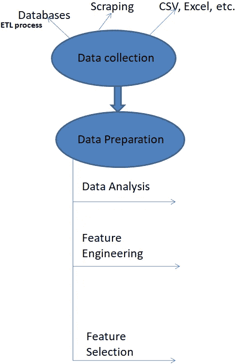
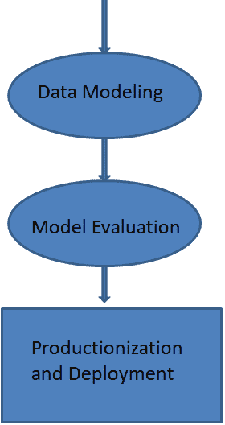

# 从顶点到最低点的机器学习模型的部署和生产— I

> 原文：<https://towardsdatascience.com/deployment-and-productionization-of-machine-learning-models-from-acme-to-nadir-i-cdb5de1b098d?source=collection_archive---------55----------------------->

## ***了解从数据采集到模型部署的全过程。***

**数据科学——商业事务**

构建机器学习模型的典型过程涉及数据收集:用于从数据库(ETL)或任何其他来源获取数据的过程，然后分析数据，从数据中设计和选择特征，以在数据上构建模型，最后分析模型结果。但是一旦你建立了模型，你会怎么做呢？在哪里以及如何利用它来获取利益？

**碎成碎片**

有收集数据的方法，或者我应该说有许多数据来源。有时需要经过一个漫长的过程(ETL、数据库)才能获得与业务问题相关的所需数据，有时客户会以 excel、CSV 或任何其他文件格式向您提供数据，但后者的可能性很小。大多数情况下，您需要连接到数据库，或者遵循一个完整的 DBM 过程，将数据发送到仓库，然后进行分析并构建模型。我会在另一篇文章中详细讲述这个过程。

一旦你清理好数据并准备好。我们从分析数据开始，通常从发现基本的见解和一些健全性检查(数据类型、汇总统计等)开始。在数据科学中，这个术语叫做探索性数据分析(EDA)。这可以在获取数据时完成，即在作为数据源的系统中完成，也可以通过 Python、R 等工具完成。我更喜欢 Python。

从这里开始，我们走向流程的业务端。从特征工程开始，涉及缺失值插补、离群点检测、变量变换等。特征选择是从数据集中的所有给定特征(特征=变量)中选择最相关的特征，也是该过程的关键部分。这两个过程给了我们所谓的“特征化”数据。特征工程和特征选择是一个很大且费时的话题，因此，集中讨论过程是很重要的。

**点睛之笔**

我们漫步到模型建立和评估阶段，已经获得了“特征化”的数据，这仅涉及建立不同的机器学习模型并选择给出最佳结果的模型。(培训和测试阶段)。一旦我们得到了模型，之后你会做什么？

你已经有了团队认可的最终模型，现在你需要生产这个模型。生产化是什么意思？这意味着将模型部署到生产系统中，部署到实时场景中。在研究阶段已经完成了所有必要的测试。我们需要部署这个模型来应用我们的研究。

给定数据，我们离线训练我们的模型。该模型部署在实时场景中，它从现实世界中获取连续输入，并根据模型类型(回归、分类等)给出连续输出。

在这一点上，我认为我们讨论机器学习管道和机器学习模型之间的区别是很重要的，因为我们不仅部署模型，而且部署整个管道。

机器学习管道包含了从数据中获得预测所需的所有步骤(我上面提到的步骤)。然而，机器学习模型只是这个管道的一部分(模型构建部分)。虽然模型描述了使用数据中的模式来生成预测的特定算法或方法，但管道概述了机器学习过程中涉及的所有步骤，从收集数据到获取预测。

你如何把你的模型放到一个生产环境中，所有必要的细节将在后续的文章中讨论。