# 部署可能很容易——使用 Amazon ec2 部署图像检测 FastAPI API 的数据科学家指南

> 原文：<https://towardsdatascience.com/deployment-could-be-easy-a-data-scientists-guide-to-deploy-an-image-detection-fastapi-api-using-329cdd80400?source=collection_archive---------11----------------------->


科迪·布莱克在 [Unsplash](https://unsplash.com?utm_source=medium&utm_medium=referral) 上的照片

## 使用亚马逊 EC2+Pytorch+Fastapi 和 Docker

就在最近，我写了一篇关于 FastAPI 的简单的[教程](/a-layman-guide-for-data-scientists-to-create-apis-in-minutes-31e6f451cd2f)，内容是关于简化和理解 API 如何工作，以及使用框架创建一个简单的 API。

*那个帖子得到了相当好的回应，但是被问得最多的问题是* ***如何在 ec2 上部署 FastAPI API，以及如何使用图像数据而不是简单的字符串、整数和浮点数作为 API*** *的输入。*

> 我在网上搜索了一下，但是我能找到的只是一些不太熟悉的文档和人们使用 NGINX 或 ECS 进行部署的许多不同方式。对我来说，这些都不是特别伟大或完整的。

所以，我试着在 FastAPI 文档的帮助下自己做这件事。在本帖中，我们将主要关注四件事:

*   设置 Amazon 实例
*   创建用于对象检测的 FastAPI API
*   使用 Docker 部署 FastAPI
*   带有用户界面的端到端应用

***那么，事不宜迟，我们开始吧。***

你可以跳过任何你认为你精通的部分，尽管我希望你浏览整篇文章，尽管它可能很长，因为概念之间有很多相互联系。

# 1.设置 Amazon 实例

在开始使用 Amazon ec2 实例之前，我们需要设置一个实例。你可能需要用你的电子邮件 ID 注册，并在 [AWS 网站](https://aws.amazon.com/)上设置支付信息。就像单点登录一样工作。从这里开始，我将假设您有一个 AWS 帐户，因此我将解释接下来的重要部分，以便您可以继续操作。

*   使用[https://us-west-2.console.aws.amazon.com/console](https://us-west-2.console.aws.amazon.com/console)进入 AWS 管理控制台。
*   在 AWS 管理控制台上，您可以选择“启动虚拟机”在这里，我们试图设置一台机器，在那里我们将部署我们的 FastAPI API。
*   第一步，您需要为机器选择 AMI 模板。我选的是 Ubuntu 以来的 18.04 Ubuntu 服务器。

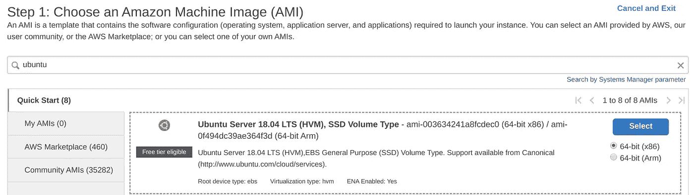

*   在第二步中，我选择了`t2.xlarge`机器，它有 4 个 CPU 和 16GB RAM，而不是空闲层，因为我想使用对象检测模型，并且需要一些资源。

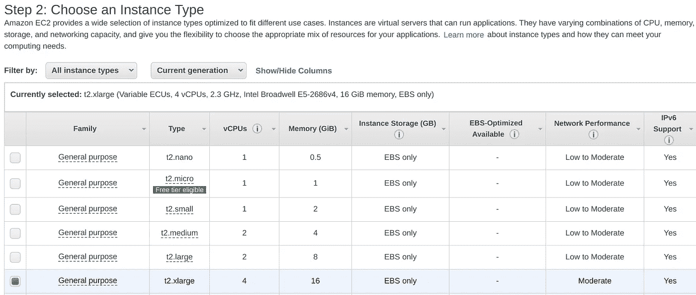

*   继续按下一步，直到你到达“6。配置安全组”选项卡。这是最关键的一步。您需要添加一个类型为“HTTP”且端口范围为 80 的规则。

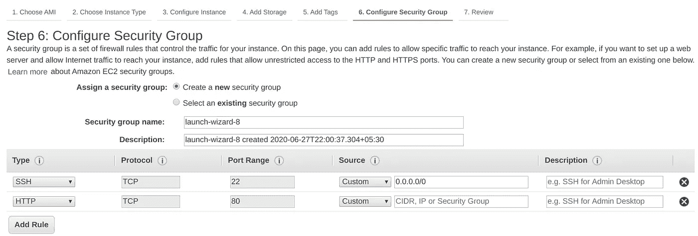

*   您可以单击“查看并启动”，最后单击“启动”按钮来启动实例。单击启动后，您可能需要创建一个新的密钥对。这里我创建了一个名为`fastapi`的新密钥对，并使用“Download Key Pair”按钮下载它。请妥善保管此密钥，因为每次您需要登录到此特定机器时都会用到它。下载密钥对后，单击“启动实例”

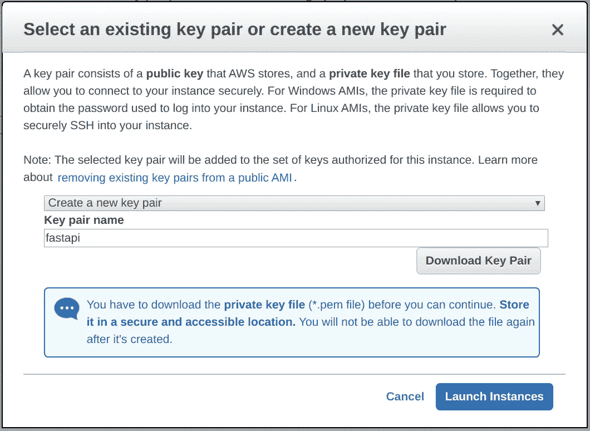

*   现在，您可以转到您的实例，查看您的实例是否已经启动。提示:查看实例状态；它应该显示“运行”

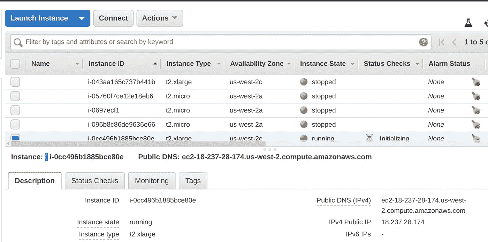

*   另外，这里要注意的是公共 DNS(IPv4)地址和 IPv4 公共 IP。我们将需要它来连接到这台机器。对我来说，它们是:

```
Public DNS (IPv4): ec2-18-237-28-174.us-west-2.compute.amazonaws.comIPv4 Public IP: 18.237.28.174
```

*   一旦你在文件夹中运行了下面的命令，你就保存了`fastapi.pem`文件。如果文件被命名为`fastapi.txt`，你可能需要将其重命名为`fastapi.pem.`

```
# run fist command if fastapi.txt gets downloaded.
# mv fastapi.txt fastapi.pemchmod 400 fastapi.pem
ssh -i "fastapi.pem" ubuntu@<Your Public DNS(IPv4) Address>
```

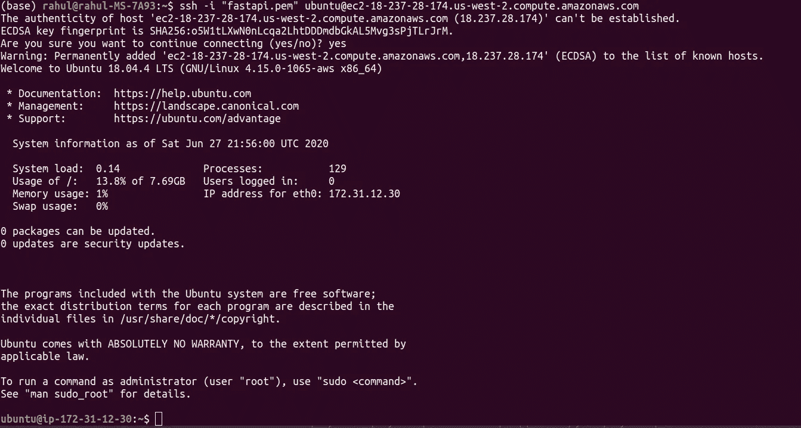

现在我们已经启动并运行了 Amazon 实例。我们可以在这里继续讨论帖子的真实部分。

# 2.创建用于对象检测的 FastAPI API

在我们部署 API 之前，我们需要有一个 API，对吗？在我最近的一篇文章中，我写了一个简单的[教程来理解 FastAPI](/a-layman-guide-for-data-scientists-to-create-apis-in-minutes-31e6f451cd2f) 和 API 基础。如果你想了解 FastAPI 的基础知识，请阅读这篇文章。

因此，这里我将尝试创建一个图像检测 API。至于如何把图像数据传递给 API？想法是——***除了字符串，什么是图像？*** 一个图像只是由字节组成，我们可以把这些字节编码成一个字符串。我们将使用 base64 字符串表示法，这是一种将二进制数据转换为 ASCII 字符的流行方法。并且，我们将传递这个字符串表示来给我们的 API 一个图像。

## A.一些图像基础知识:什么是图像，但一个字符串？

所以，让我们先看看如何将图像转换成字符串。我们使用`‘rb’` 标志从图像文件中读取二进制数据，并使用`base64.b64encode`函数将其转换为 base64 编码的数据表示。然后，我们使用`decode`到`utf-8`函数将基本编码数据转换成人类可读的字符。如果现在还没什么意义，也不用担心。 ***只要明白任何数据都是二进制的，我们可以使用一系列步骤将二进制数据转换为其字符串表示。***

举个简单的例子，如果我有一个像下面这样的简单图像，我们可以用下面的方法把它转换成一个字符串:


狗 _ 带 _ 球. jpg

```
import base64with open("sample_images/dog_with_ball.jpg", "rb") as image_file:
    base64str = base64.b64encode(image_file.read()).decode("utf-8")
```

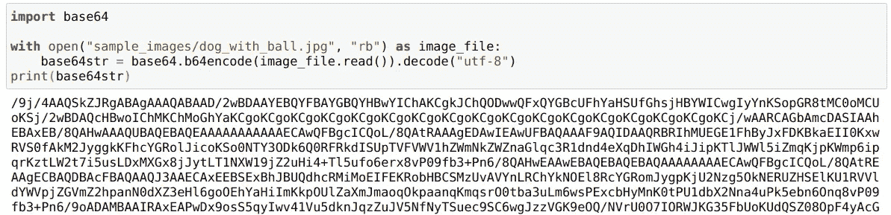

我们可以得到任何图像的字符串表示

在我的笔记本电脑上，这里有一个名为`dog_with_ball.png`的文件的字符串表示。

很好，我们现在有了图像的字符串表示。并且，我们可以将这个字符串表示发送给我们的 FastAPI。但是我们还需要有一种方法从图像的字符串表示中读回图像。毕竟，我们使用 PyTorch 和任何其他包的图像检测 API 需要有一个可以预测的图像对象，这些方法不能在字符串上工作。

这里有一种从图像的 base64 字符串创建 PIL 图像的方法。大多数情况下，我们只是以同样的顺序做相反的步骤。我们使用`.encode.`在`‘utf-8’`中编码，然后使用`base64.b64decode`解码成字节。我们使用这些字节通过`io.BytesIO`创建一个 bytes 对象，并使用`Image.open`将这个 bytes IO 对象作为 PIL 图像打开，这可以很容易地用作我的 PyTorch 预测代码的输入。 ***再简单一点，它只是将*** `***base64***` ***图像串转换为实际图像的一种方式。***

```
import base64
import io
from PIL import Imagedef base64str_to_PILImage(base64str):
   base64_img_bytes = base64str.encode('utf-8')
   base64bytes = base64.b64decode(base64_img_bytes)
   bytesObj = io.BytesIO(base64bytes)
   img = Image.open(bytesObj) 
   return img
```

那么这个功能起作用吗？我们自己看吧。我们可以只使用字符串来获取图像。

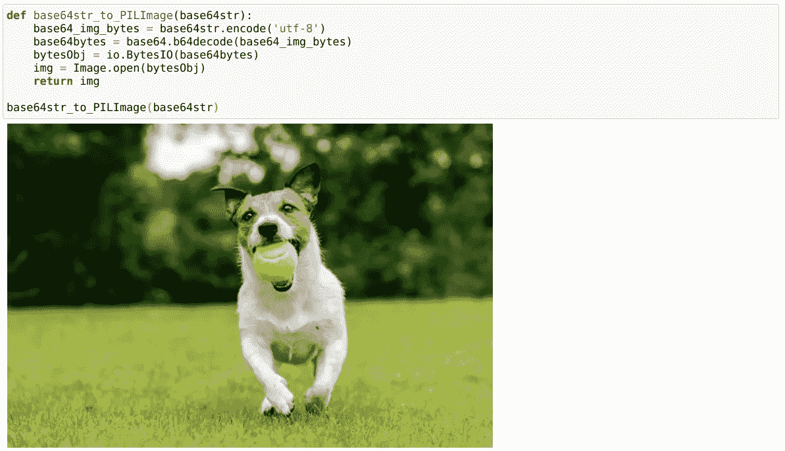

我们的快乐狗狗又回来了。比绳子好看。

## B.编写实际的 FastAPI 代码

因此，现在我们知道我们的 API 可以从我们的用户那里获得一个字符串形式的图像，让我们创建一个对象检测 API，它使用这个字符串形式的图像，并输出带有对象类的对象的边界框。

在这里，我将使用来自`torchvision.models`的 Pytorch 预训练`fasterrcnn_resnet50_fpn`检测模型进行对象检测，该模型是在 COCO 数据集上训练的，以保持代码简单，但可以使用任何模型。如果你想用 Pytorch 训练你的自定义[图像分类](/end-to-end-pipeline-for-setting-up-multiclass-image-classification-for-data-scientists-2e051081d41c)或者[图像检测](https://lionbridge.ai/articles/create-an-end-to-end-object-detection-pipeline-using-yolov5/)模型，可以看看这些帖子。

下面是 FastAPI 的完整代码。虽然它看起来很长，但我们已经知道了所有的部分。在这段代码中，我们主要执行以下步骤:

*   使用 FastAPI()构造函数创建我们的 fast API 应用程序。
*   加载我们的模型和它被训练的类。我从 PyTorch [文档](https://pytorch.org/docs/stable/torchvision/models.html)中获得了课程列表。
*   我们还定义了一个新的类`Input`，它使用一个名为`pydantic`的库来验证我们将从 API 最终用户那里获得的输入数据类型。在这里，终端用户给出`base64str`和一些用于目标检测预测的分数`threshold`。
*   我们添加了一个名为`base64str_to_PILImage`的函数，正如它的名字一样。
*   我们编写了一个名为`get_predictionbase64`的预测函数，它使用图像的 base64 字符串表示和一个阈值作为输入，返回边界框和类的字典。我们还在这个函数的顶部添加了`[@app](http://twitter.com/app).put(“/predict”)`来定义我们的端点。如果你需要理解 put 和 endpoint，请参考我之前在 FastAPI 上发表的文章。

## C.先本地后全局:在本地测试 FastAPI 代码

在我们转向 AWS 之前，让我们检查一下代码是否在我们的本地机器上工作。我们可以使用以下命令在笔记本电脑上启动 API:

```
uvicorn fastapiapp:app --reload
```

以上意味着您的 API 现在正在您的本地服务器上运行，`--reload`标志表示当您更改`fastapiapp.py`文件时，API 会自动更新。这在开发和测试时非常有用，但是当您将 API 投入生产时，您应该删除这个`--reload`标志。

您应该会看到类似这样的内容:

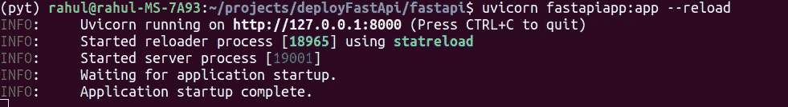

现在，您可以尝试使用请求模块来访问这个 API 并查看它是否工作:

```
import requests,jsonpayload = json.dumps({
  "base64str": base64str,
  "threshold": 0.5
})response = requests.put("[http://127.0.0.1:8000/predict](http://127.0.0.1:8000/predict)",data = payload)
data_dict = response.json()
```

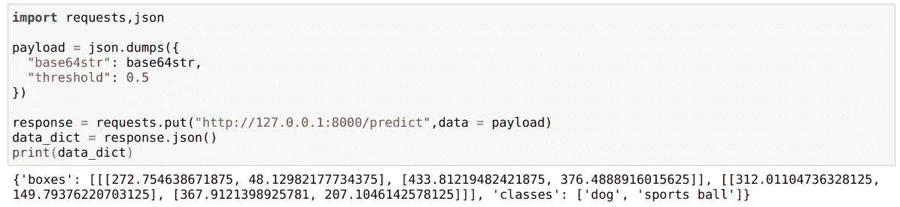

所以我们使用 API 得到我们的结果。这个图像包含一只狗和一个运动球。我们也有边界框的角 1 ( `x1,y1)`和角 2 ( `x2,y2`)坐标。

## D.让我们想象一下

虽然并非绝对必要，但我们可以在 Jupyter 笔记本中想象结果:

以下是输出:

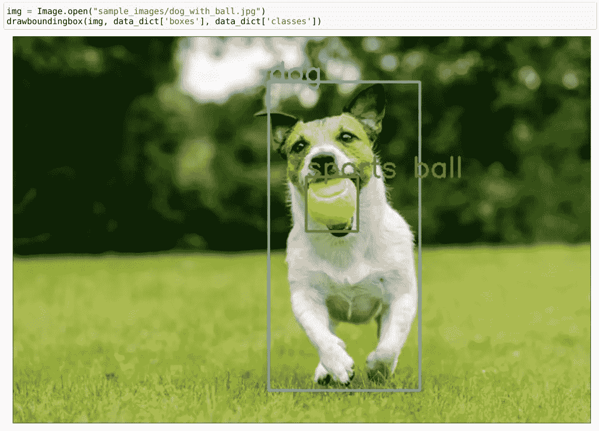

这里你会注意到，我从本地文件系统中获取了图像，这可以被认为是欺骗，因为我们不想保存用户通过 web UI 发送给我们的每个文件。我们应该能够使用相同的`base64string`对象，我们也必须创建这个图像。对吗？

别担心，我们也能做到。还记得我们的`base64str_to_PILImage` 功能吗？我们也可以用这个。

```
img = base64str_to_PILImage(base64str)
drawboundingbox(img, data_dict['boxes'], data_dict['classes'])
```

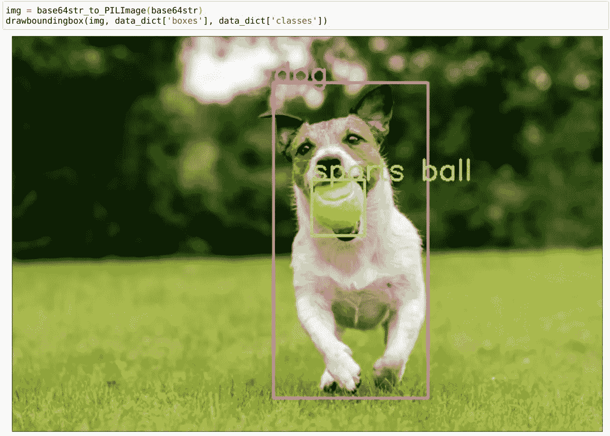

看起来很棒。我们有工作的 FastAPI，也有 amazon 实例。我们现在可以开始部署了。

# 3.在 Amazon ec2 上部署

到目前为止，我们已经创建了一个 AWS 实例，还创建了一个 FastAPI，它将图像的 base64 字符串表示作为输入，并返回边界框和相关的类。但是所有的 FastAPI 代码仍然驻留在我们的本地机器上。 ***我们怎么把它放到 ec2 服务器上？并在云上运行预测。***

## A.安装 Docker

我们将使用 docker 部署我们的应用程序，正如`fastAPI`创建者自己所建议的那样。我会试着解释 docker 是如何工作的。下面的部分可能看起来令人生畏，但它只是一系列的命令和步骤。所以和我在一起。

我们可以从安装 docker 开始，使用:

```
sudo apt-get update
sudo apt install docker.io
```

然后，我们使用以下命令启动 docker 服务:

```
sudo service docker start
```

## B.为 docker 创建文件夹结构

```
└── dockerfastapi
    ├── Dockerfile
    ├── app
    │   └── main.py
    └── requirements.txt
```

这里`dockerfastapi`是我们项目的主文件夹。这是这个文件夹中的不同文件:

**一、** `**requirements.txt**` **:** Docker 需要一个文件，这个文件告诉它我们的 app 运行需要哪些所有的库。这里我列出了我在 Fastapi API 中使用的所有库。

```
numpy
opencv-python
matplotlib
torchvision
torch
fastapi
pydantic
```

**二。** `**Dockerfile**` **:** 第二个文件是 Dockerfile。

```
FROM tiangolo/uvicorn-gunicorn-fastapi:python3.7COPY ./app /app
COPY requirements.txt .
RUN pip --no-cache-dir install -r requirements.txt
```

***Docker 是如何工作的？:*** 你可以跳过这一节，但这将有助于了解 docker 是如何工作的。

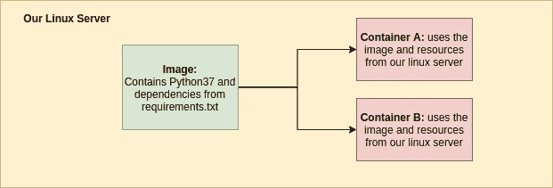

可以把`dockerfile`想成类似于`sh file,`的东西，它包含创建可以在容器中运行的 docker 映像的命令。人们可以把 docker 映像想象成一个安装了 Python 和 Python 库等所有东西的环境。容器是一个单元，它只是我们系统中一个使用 docker `image`的孤立盒子。使用 docker 的好处是，我们可以创建多个 docker 映像，并在多个容器中使用它们。例如，一个图像可能包含 python36，而另一个图像可能包含 python37。我们可以在一台 Linux 服务器上生成多个容器。

我们的`Dockerfile`包含了几样东西:

*   `FROM`命令:这里第一行`FROM`指定我们从`tiangolo’s` (FastAPI creator) Docker 镜像开始。根据他的网站:“*这个图像有一个“自动调整”机制，这样你就可以添加你的代码，自动获得同样的高性能。【不作牺牲】*。我们所做的只是从一个镜像开始，它为我们安装了 python3.7 和，并自动为`uvicorn`和`gunicorn` ASGI 服务器添加了一些配置和一个用于 ASGI 服务器的`start.sh`文件。对于喜欢冒险的人来说，特别是`[commandset](https://github.com/tiangolo/uvicorn-gunicorn-fastapi-docker/blob/master/docker-images/python3.7.dockerfile)1`和`[commandset2](https://github.com/tiangolo/uvicorn-gunicorn-docker/blob/master/docker-images/python3.7.dockerfile)`通过一种命令菊花链的方式被执行。
*   `COPY`命令:我们可以把 docker 镜像看作一个包含文件等的文件夹。在这里，我们将之前创建的`app`文件夹和`requirements.txt`文件复制到 docker 映像中。
*   `RUN`命令:我们运行 pip install 命令，使用 docker 映像上的`requirements.txt` 文件安装所有 python 依赖项。

**三。main.py:** 这个文件包含了我们之前创建的`fastapiapp.py`代码。记住只保留文件名`main.py`。

## C.码头工人建造

我们已经得到了所需结构的所有文件，但是我们还没有使用任何 docker 命令。我们首先需要使用 Dockerfile 构建一个包含所有依赖项的映像。

我们可以简单地通过以下方式做到这一点:

```
sudo docker build -t myimage .
```

这将从`tiangolo’s`映像下载、复制和安装一些文件和库，并创建一个名为`myimage.`的映像。这个`myimage`有 python37 和一些由`requirements.txt` 文件指定的 python 包。

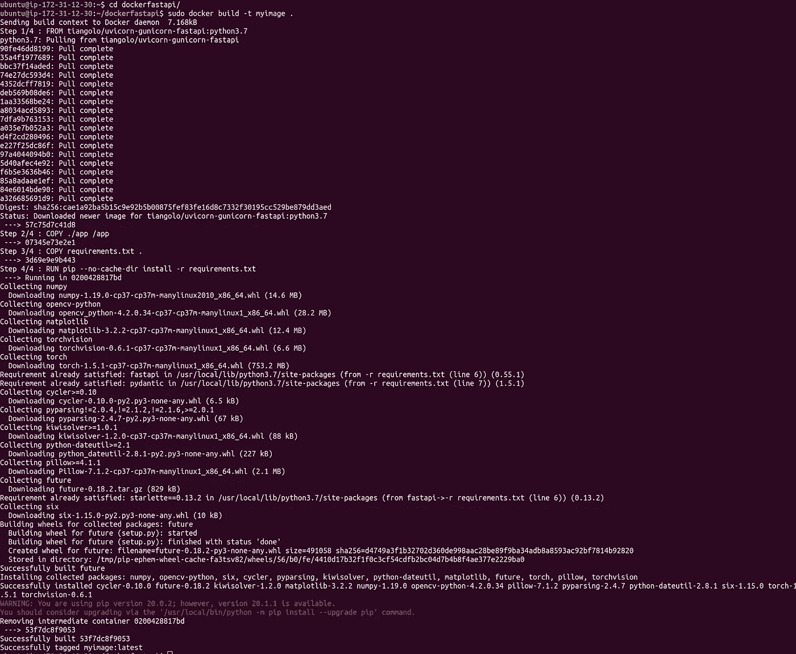

然后我们只需要启动一个运行这个图像的容器。我们可以通过以下方式做到这一点:

```
sudo docker run -d --name mycontainer -p 80:80 myimage
```

这将创建一个名为`mycontainer`的容器，它运行我们的 docker 映像`myimage`。部分`80:80`将我们的 docker 容器端口 80 连接到我们的 Linux 机器端口 80。

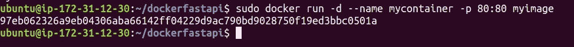

事实上就是这样。此时，您应该能够在浏览器中打开下面的 URL。

```
# <IPV4 public IP>/docs
URL: 18.237.28.174/docs
```

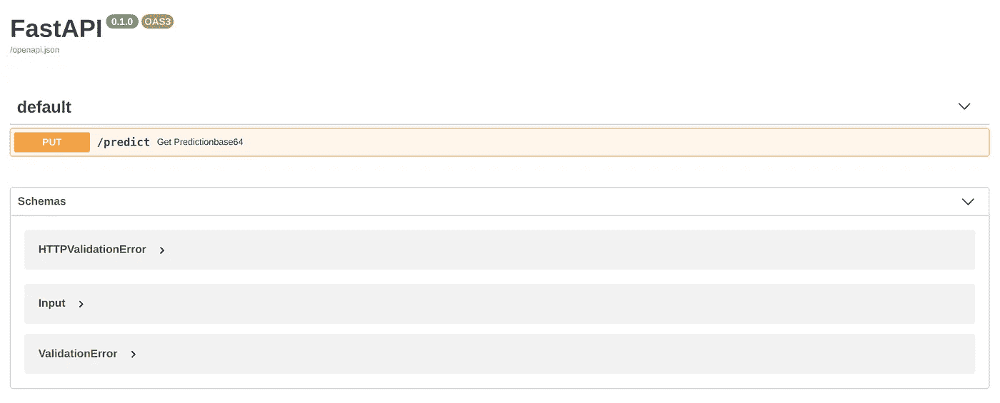

我们可以通过编程来检查我们的应用程序，使用:

```
payload = json.dumps({
  "base64str": base64str,
  "threshold": 0.5
})response = requests.put("[http://18.237.28.174/predict](http://18.237.28.174/predict)",data = payload)
data_dict = response.json()
print(data_dict)
```


> 是的，我们的 API 终于部署好了。

## D.故障排除，因为现实世界并不完美

[来源](https://giphy.com/gifs/ball-bounce-recovery-HNhz3wGdH62LS/embed):因为这就是真实世界部署的样子。

以上所述都是好的，如果你严格按照说明去做，它们会立即发挥作用，但是现实世界并不是这样的。在这个过程中，您肯定会遇到一些错误，并且需要调试您的代码。因此，为了帮助您，一些 docker 命令可能会派上用场:

*   **日志:**当我们使用`sudo docker run`运行我们的容器时，我们没有得到很多信息，这是调试时的一个大问题。您可以使用下面的命令查看实时日志。如果您在这里看到一个错误，您将需要更改您的代码并重新构建映像。

```
sudo docker logs -f mycontainer
```

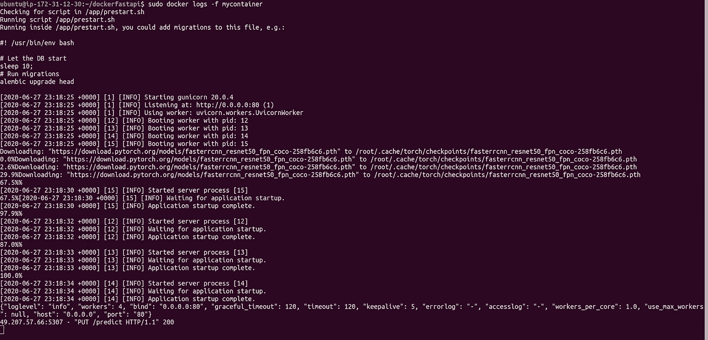

*   **启动和停止 Docker:** 有时候，重启 Docker 可能会有帮助。在这种情况下，您可以使用:

```
sudo service docker stop
sudo service docker start
```

*   **列出图像和容器:**使用 docker，您将最终创建图像和容器，但是您将无法在工作目录中看到它们。您可以使用以下方式列出图像和容器:

```
sudo docker container ls
sudo docker image ls
```

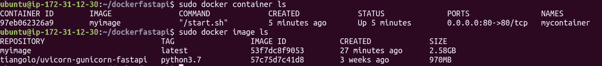

*   **删除未使用的 docker 图像或容器:**您可能需要删除一些图像或容器，因为它们会占用系统的大量空间。这是你如何做的。

```
# the prune command removes the unused containers and images
sudo docker system prune# delete a particular container
sudo docker rm mycontainer# remove myimage
sudo docker image rm myimage# remove all images
sudo docker image prune — all
```

*   **检查 localhost:**Linux 服务器没有浏览器，但是我们仍然可以看到浏览器的输出，虽然有点难看:

```
curl localhost
```

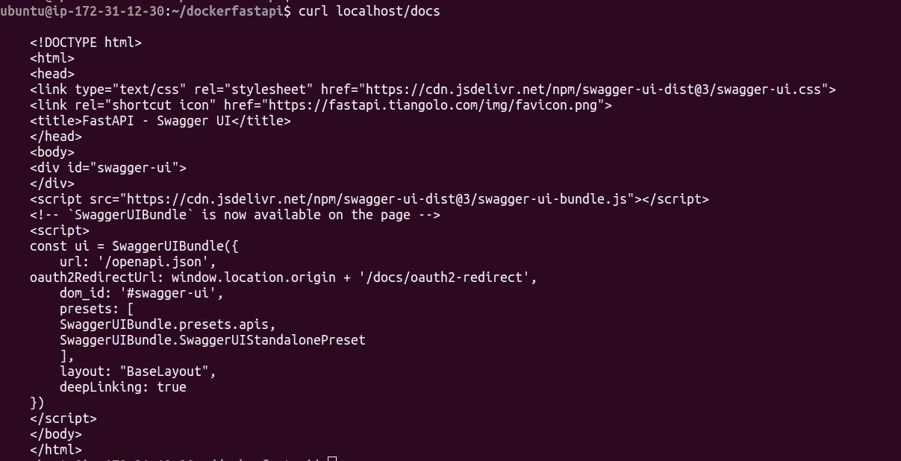

*   **开发时不需要一次又一次地重新加载映像:**对于开发来说，只需在我们的机器上更改代码内容并进行现场测试，而不必每次都构建映像，这是非常有用的。在这种情况下，在每次代码更改时自动运行带有实时自动重载的服务器也是很有用的。这里，我们使用 Linux 机器上的应用程序目录，在开发过程中，我们用开发选项`/start-reload.sh`替换缺省值(`/start.sh`)。一切正常后，我们可以再次构建我们的映像，并在容器中运行它。

```
sudo docker run -d -p 80:80 -v $(pwd):/app myimage /start-reload.sh
```

如果这还不够，在这里添加一个包含有用的 docker 命令的 docker 备忘单:


[来源](http://dockerlabs.collabnix.com/docker/cheatsheet/)

# 4.带有用户界面的端到端应用

我们已经完成了 API 的创建，但是我们还可以使用 FastAPI 创建一个基于 UI 的应用程序。这不是你在生产环境中要做的事情(在生产环境中，你可能让开发人员使用 react、node.js 或 javascript 来制作应用程序),但这里主要是检查如何使用图像 API 的端到端流程。我将在本地而不是 ec2 服务器上托管这个准系统 Streamlit 应用程序，它将从托管在 ec2 上的 FastAPI API 获取边界框信息和类。

如果你需要了解更多关于 streamlit 是如何工作的，你可以看看这篇[帖子](/how-to-write-web-apps-using-simple-python-for-data-scientists-a227a1a01582)。此外，如果您想将这个 streamlit 应用程序也部署到 ec2，这里还有一个[教程](/how-to-deploy-a-streamlit-app-using-an-amazon-free-ec2-instance-416a41f69dc3)。

下面是 ec2 上带有 UI 和 FastAPI API 的整个 app 的流程:

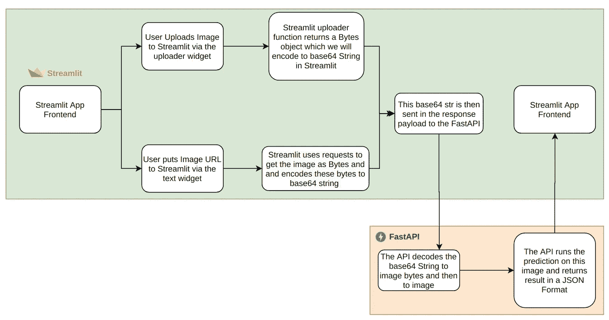

项目架构

在我们的 streamlit 应用中，我们需要解决的最重要的问题是:

## 如何使用 Streamlit 从用户处获取图像文件？

**答:使用文件上传器:**我们可以通过以下方式使用文件上传器:

```
bytesObj = st.file_uploader(“Choose an image file”)
```

下一个问题是，我们从 streamlit 文件上传者那里得到的这个 bytesObj 是什么？在 streamlit 中，我们将从`file_uploader`中获得一个`bytesIO`对象，我们需要将它转换为 base64str，用于我们的 FastAPI 应用程序输入。这可以通过以下方式实现:

```
def bytesioObj_to_base64str(bytesObj):
   return base64.b64encode(bytesObj.read()).decode("utf-8")base64str = bytesioObj_to_base64str(bytesObj)
```

**B .使用 URL:** 我们也可以使用`text_input`从用户那里获得一个图片 URL。

```
url = st.text_input(‘Enter URL’)
```

然后，我们可以使用请求模块和 base64 编码和`utf-8`解码从 URL 获取 base64 字符串格式的图像:

```
def ImgURL_to_base64str(url):
    return base64.b64encode(requests.get(url).content).decode("utf-8")base64str = ImgURL_to_base64str(url)
```

这是我们的 Streamlit 应用程序的完整代码。你已经看到了这篇文章中的大部分代码。

我们可以使用以下方式在本地运行这个 streamlit 应用程序:

```
streamlit run streamlitapp.py
```

我们可以看到在我们的`localhost:8501.`上运行的应用程序可以很好地处理用户上传的图像以及基于 URL 的图像。这里有一张猫的图片，也给你们中的一些猫爱好者。

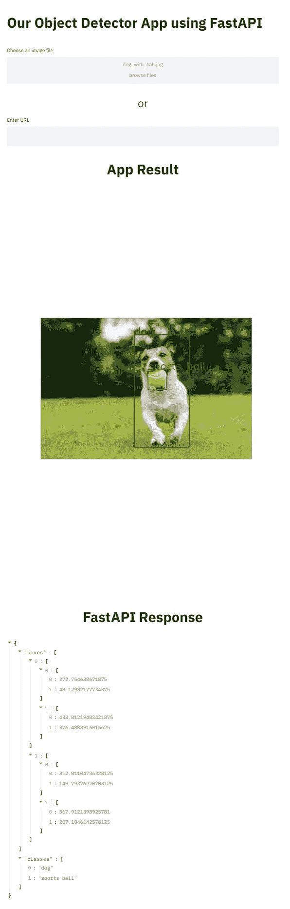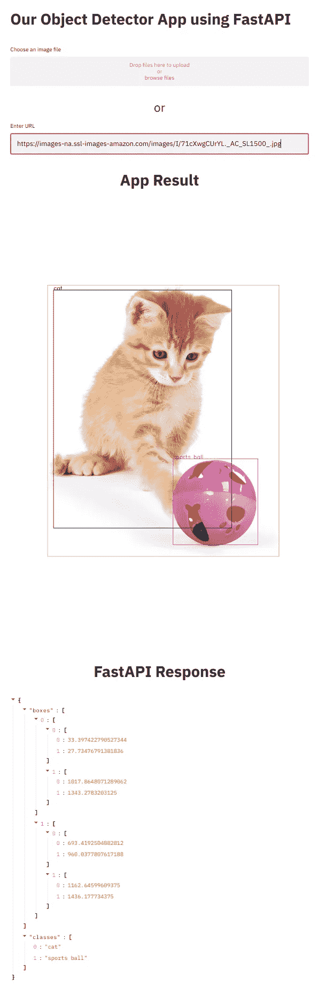

我们使用所有组件— Streamlit、FastAPI 和 Docker 的最终结果。

原来如此。我们在这里创建了一个完整的工作流，通过 FastAPI 在 ec2 上部署图像检测模型，并在 Streamlit 中利用这些结果。我希望这能帮助您解决在生产中部署模型的问题。你可以在我的 [GitHub](https://github.com/MLWhiz/data_science_blogs/tree/master/deployFastApi) 库找到这篇文章的代码以及我所有的文章。

让我知道你是否喜欢这篇文章，以及你是否愿意在你的日常部署需求中包含 Docker 或 FastAPI 或 Streamlit。我也希望在 Docker 上创建一个更详细的帖子，请关注我，关注我的写作。详情如下。

# 继续学习

如果你想了解更多关于建立机器学习模型并将其投入生产的知识，AWS 上的这个[课程可以满足你的要求。](https://coursera.pxf.io/e45BJ6)

谢谢你的阅读。将来我也会写更多初学者友好的帖子。在 [Medium](https://medium.com/@rahul_agarwal?source=post_page---------------------------) 上关注我或者订阅我的[博客](http://eepurl.com/dbQnuX?source=post_page---------------------------)来了解他们。一如既往，我欢迎反馈和建设性的批评，可以通过 Twitter [@mlwhiz](https://twitter.com/MLWhiz?source=post_page---------------------------) 联系

此外，一个小小的免责声明——这篇文章中可能会有一些相关资源的附属链接，因为分享知识从来都不是一个坏主意。