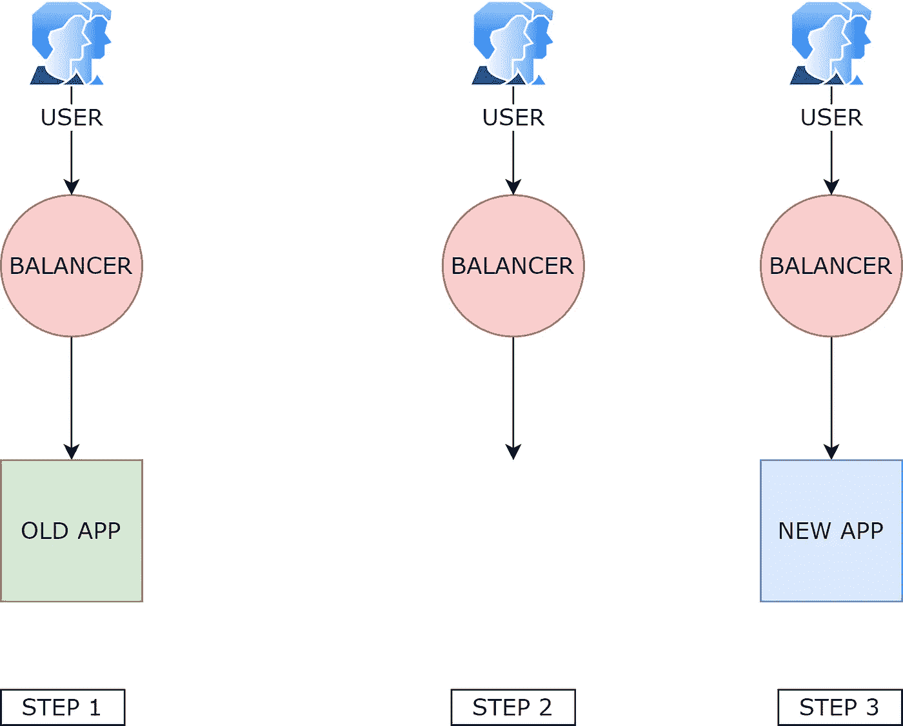
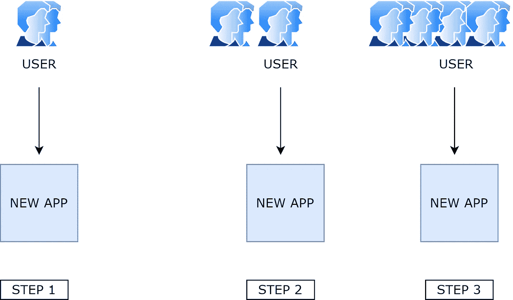
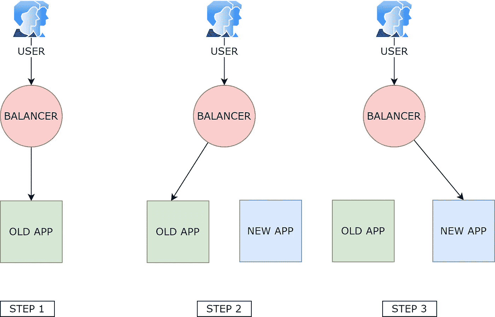
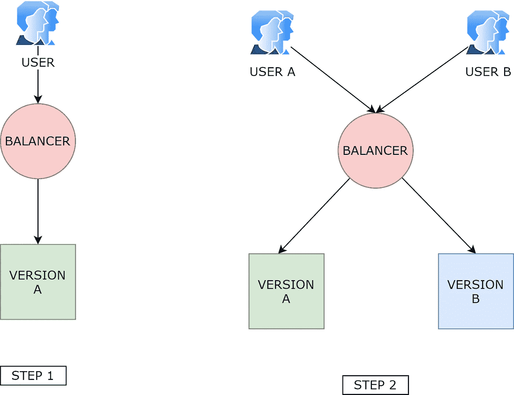
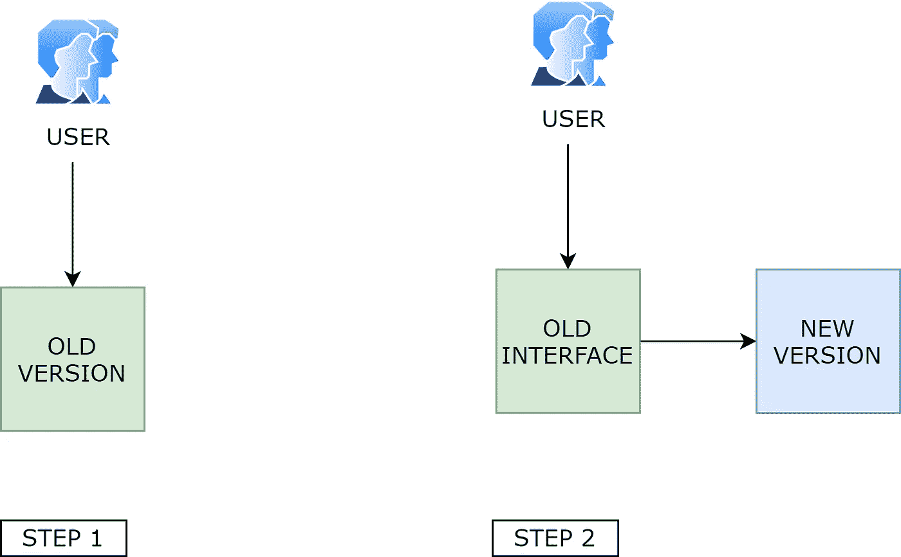

# 部署策略

> 原文：<https://towardsdatascience.com/deployment-strategies-a4fe6f743e08?source=collection_archive---------30----------------------->

## 如何选择正确的策略来满足您的应用需求

每个应用程序的部署都有一个时间点。我们可以将这个活动委托给一个自动化的任务或者手动完成，但是我们需要在幕后有一个部署策略。我读过许多关于部署的指南，其中大部分都很好地解释了如何实现给定的解决方案。与现实世界的缺失环节是将实施与需求相匹配。简而言之，在应用解决方案之前，您必须了解您的需求。这就是为什么我想把重点放在场景和策略上。

foto di[Free-Photos](https://pixabay.com/photos/?utm_source=link-attribution&utm_medium=referral&utm_campaign=image&utm_content=768815)da[Pixabay](https://pixabay.com/it/?utm_source=link-attribution&utm_medium=referral&utm_campaign=image&utm_content=768815)

# 为什么我们需要权衡

您将在下一段中发现，每种部署策略都满足不同的需求。识别您的用例对于选择正确的工具是至关重要的。每个解决方案都必须与应用程序要求兼容，这也包括列表中的预算变量。

你是对的；它带有权衡威胁的味道。但事实就是如此。你不能用火箭筒射杀一只苍蝇。

> 询问您的客户是否更喜欢不会使其服务离线的部署策略。我觉得很容易猜到它的答案。

如果可能的话，我们需要在部署过程中保持服务的活力。对于一个用户很少的简单应用程序来说，这看起来有点大材小用，但是用同样的努力实现零停机 DevOps 过程通常是可能的。因此，零停机时间可能是我们应该始终考虑的因素。

在许多情况下，我们需要同时维护两个版本(旧的和新的，有和没有新的特性，等等。).如果您考虑您的自动化部署服务，这个解决方案相对容易实现，可能需要一个基础设施创建阶段。重要的是成本。运行同一个应用程序的两个实例通常是链接运行两个简单的虚拟机。对于一个庞大的系统来说，运行一个应用程序的两个并行版本所需的基础设施翻倍的成本可能会令人望而却步。因此，保持多个系统同时可用可能是一个问题。

我可以继续举其他例子，但问题很简单。我们需要根据应用程序的实际需求来调整我们的解决方案。

> 过于简化会导致某些东西今天有效，明天就会失效。过于远视会让你睡得很香，但可能会影响你的预算。

# 部署策略

## 再创造

旧版本关闭；然后，新的被激活。当您有一个简单的服务器，并且您更新您的网站时，这个过程就会发生。

我和❤️一起做的

**优点:**

*   易于实施

**缺点:**

*   需要很短的停机时间。
*   在某些错误的情况下，开关是硬的。

## 倾斜的

部署新版本并逐步交付给用户。当您发布一个新的应用程序，并且希望调整性能或某些关键特性时，建议使用这个解决方案。如果你打算在大规模发布之前收集用户的反馈并调整你的应用程序，这也是一个不错的选择。

我和❤️一起做的

**优点:**

*   进步分子

**缺点:**

*   达到完全部署需要很长时间
*   昂贵(如果您将此解决方案应用于现有应用程序，您将有两个运行环境)

## 蓝色\绿色

新版本与另一个版本一起部署；然后，流量被切换到新的服务器。只有当新版本上线并经过测试时，切换才会发生，因此操作是即时且安全的。

我和❤️一起做的

**优点:**

*   安全的
*   无停机时间

**缺点:**

*   难以实现
*   暂时需要两个运行环境(昂贵)
*   许多 web 服务器在内部实现了蓝/绿机制，因此您可以开箱即用。

## A/B 测试

两个版本，新的和旧的，一起工作。一些目标用户登陆新网站，这样你就可以得到反馈

我和❤️一起做的

**优点:**

*   您可以比较这两个平台并获得反馈

**缺点:**

*   昂贵的
*   很难在完整的应用程序上实现，因为您需要在同一个数据库上运行两个应用程序

## 阴影

新版本的应用程序通过旧平台接收流量，并向呼叫者提供复古兼容的响应。

我和❤️一起做的

**优点:**

*   确保追溯兼容性
*   对用户透明

**缺点:**

*   很难在完整的 web 应用程序上实现
*   给你的限制，以符合旧的应用程序永远。

# 选择正确的策略。

嗯，这取决于需求和预算。这第一句话是无可挑剔的，但完全没有用😅。因此，我将尝试为每种情况绘制正确的解决方案，以便您可以选择正确的解决方案。

## 新的应用土地推向市场

当一个新的应用程序投入生产时，没有什么可破坏的，所以一切都更容易。在上线之前，您可以使用重新创建或绿/蓝方法激活新的应用程序。这个提议唯一的遗憾是，你将有一个完整的开关。在发布日，所有用户将一起进入您的 web 应用程序。在没有任何 bug、分析漏洞或性能问题的理想世界中，这不是问题。在现实世界中，交钥匙总是一个赌注，即使您已经做了最好的分析，您测试了所有的东西两次，并且运行了性能测试。我的建议是尽可能进行倾斜部署。从有限数量的用户开始，让您收集反馈并解决问题，而不会出现紧急情况。

## 现有应用程序的更新

当一个应用程序运行时，我觉得很难逐步部署一个新版本或者在应用程序级别进行 A/B 测试。最大的问题是，您需要运行两个不同的应用程序，费用加倍，并且两个应用程序必须共享同一个数据库。但是还有一个实际的限制。谁了解用户？谁来决定哪个客户有资格购买 A 或 B 版本？答案很简单:商业逻辑。因此，更容易管理的地方是应用程序内部，也就是业务逻辑所在的地方。要解决不同功能之间的平衡需求，更简单的解决方案是在应用程序级别进行操作。您可以简单地部署一个具有两个用户可以激活的特性的应用程序。在微服务时代，添加或删除部件并应用一些业务逻辑是相对容易的。为什么不呢？

一旦您能够管理 A/B 测试或应用程序内部新特性的激活，您将需要一个不会破坏任何东西的部署。蓝/绿部署就可以了。

## 您想要替换一个遗留的 web 服务。

当您有成千上万用户使用的遗留 API 时，替换它总是一团糟。问题可能来自使用 IP 地址而不是 DNS 的用户，或者防火墙问题。任何微小的改变都可能引发问题，所以我们要超级保守。影子版本部署是正确的解决方案。嘲笑所有的回应，打电话的人可以继续像往常一样，而你启动了新的系统。然后，您可以要求用户切换并监控旧 API 的使用，但不要着急。最后可以关闭老界面，不用担心会切走一部分用户。最大的问题是维护两个不同系统并使它们保持一致的成本，几乎是在与用户的界面上(如果您在真实服务上做了一些更改，模拟需要保持与初始定义的一致性)。此外，您必须在模拟接口上支持旧的 API 接口的事实可能会在某种程度上限制您的能力。

## 您希望向现有产品添加新功能。

当您在现有项目上添加一个特性，并且希望在完全注册之前进行正确的测试时，A/B 或渐变部署会很有用。第一个让您比较两个应用程序对用户的影响，但是第二个逐渐引入了一个新特性。这两种方法都是提高用户参与度的有趣且有用的方法，但很难针对每个功能实现。主要问题是保持应用程序的两个并发版本一起运行。这意味着双倍的基础设施成本、双倍的维护成本，需要保持数据库与两个正在运行的应用程序兼容。对于所有这些问题，在大多数情况下，您可以在应用程序级别管理逐步部署。这种方法还有一个优点，就是您可以在用户范围内非常容易地为每个用户定义一个定制策略。

# 带什么回家

部署应用程序是 DevOps 的一个棘手的方面，必须考虑一些业务需求才能有效。像往常一样，有很多选择。很多都管用，但是你可以挑最适合你的。