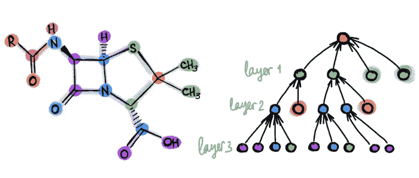
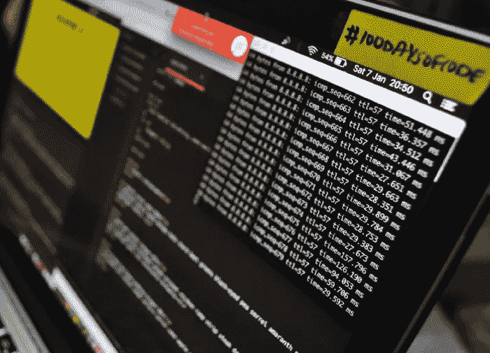
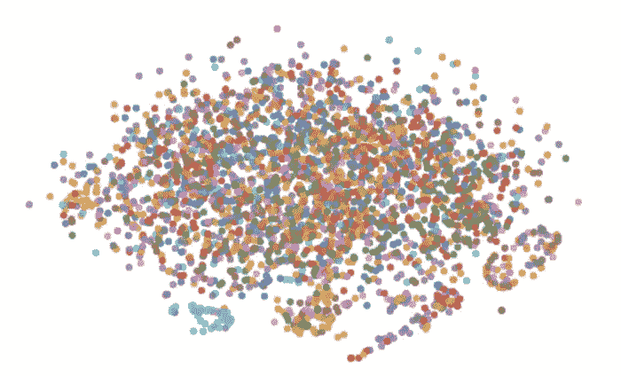
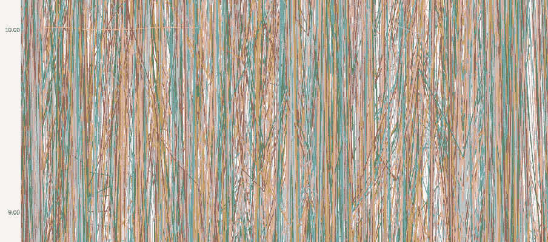

# 被认为有害的深度？

> 原文：<https://towardsdatascience.com/depth-considered-harmful-1a022f3abbac?source=collection_archive---------55----------------------->

## 我们需要深度图神经网络吗？

由[迈克尔布朗斯坦](https://medium.com/u/7b1129ddd572?source=post_page-----1a022f3abbac--------------------------------) — 9 分钟阅读

深度学习的标志之一是使用数十层甚至数百层的神经网络。与之形成鲜明对比的是，图形深度学习中使用的大多数架构都很浅，只有少数几层。在这篇文章中，我提出了一个异端的问题:图神经网络架构中的深度带来任何优势吗？

刘易斯·恩古吉在 Unsplash 上拍摄的照片

## [有抱负的数据科学家的 5 个典型思维错误](/5-typical-mindset-mistakes-of-aspiring-data-scientists-32eca8e9e0c4)

由[孙铁麟迈斯特](https://medium.com/u/bc17bd299bf1?source=post_page-----1a022f3abbac--------------------------------) — 6 分钟读取

在过去的几年里，我和 500 多名有抱负的数据科学家一起工作过，我看到了他们容易犯的一些典型的思维错误。在这篇文章中，我想分享其中的五个。

## [基于歌词的歌曲推荐，带有 Doc2Vec 嵌入和 Spotify 的 API](/lyric-based-song-recommendation-with-doc2vec-embeddings-and-spotifys-api-5a61c39f1ce2)

由亚当·里维斯曼 — 5 分钟阅读

单词嵌入对于自然语言处理来说是一个非常有用的工具。它们通常作为神经网络的参数被学习，并允许我们将单词映射到数字。更具体地说，它们允许我们将单词映射到高维向量。

照片由 Riho Kroll 在 Unsplash 上拍摄

## [方差注入式思维](/variance-infused-thinking-49f3e780890d)

通过[饶彤彤](https://medium.com/u/840a3210fbe7?source=post_page-----1a022f3abbac--------------------------------) — 8 分钟读取

历史看起来是确定的，而且经常被这样解释。本世纪初的科技泡沫显然是一个泡沫，正如所有泡沫都会发生的那样，它最终破裂了。20 世纪 80 年代的日本房地产，2008 年的美国房地产，20000 美元的比特币，杂草股等等也是如此。在崩盘后的几年里，历史学家关注的是风险有多明显，最终的内爆有多不可避免。

## [Kubernetes 上的气流之旅](/a-journey-to-airflow-on-kubernetes-472df467f556)

由马塞洛·拉韦略·罗西 — 12 分钟读完

我对 Apache Airflow 的拙见:基本上，如果您有多个自动化任务要调度，并且您正在摆弄 cron 任务，即使它们的一些依赖项失败了，您也应该尝试一下。