# 深度估计:基础和直觉

> 原文：<https://towardsdatascience.com/depth-estimation-1-basics-and-intuition-86f2c9538cd1?source=collection_archive---------0----------------------->

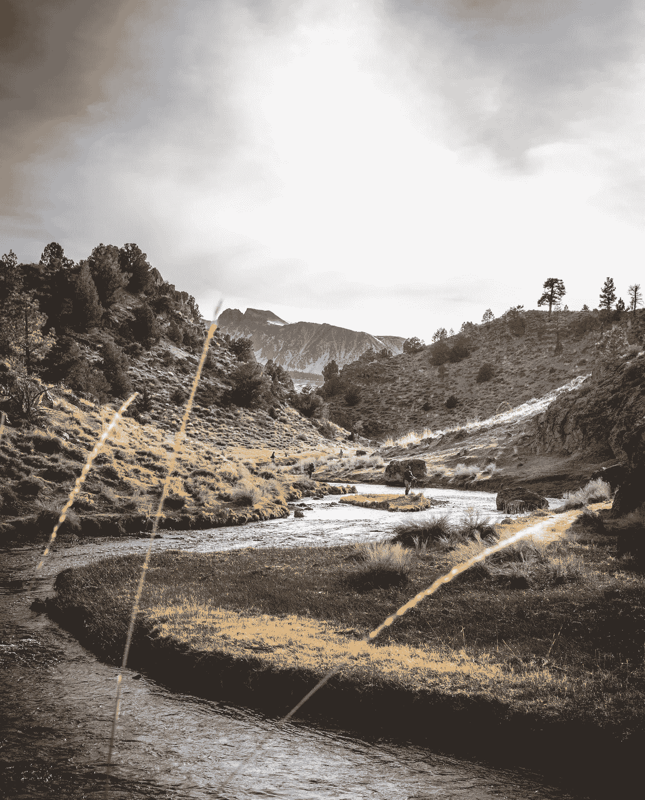

在 [Unsplash](https://unsplash.com/s/photos/depth?utm_source=unsplash&utm_medium=referral&utm_content=creditCopyText) 上由 [Shea Rouda](https://unsplash.com/@shrouda?utm_source=unsplash&utm_medium=referral&utm_content=creditCopyText) 拍摄的照片

## 深度对于 3D 视觉至关重要

测量相对于相机的距离仍然很困难，但绝对是开启自动驾驶、3D 场景重建和 AR 等激动人心的应用的关键。在机器人技术中，深度是执行感知、导航和规划等多种任务的关键先决条件。

创建 3D 地图将是另一个有趣的应用，计算深度允许我们[将从多个视图捕获的图像](/inverse-projection-transformation-c866ccedef1c)投影到 3D 中。然后，对所有的点进行配准和匹配，就可以完美地重构场景。

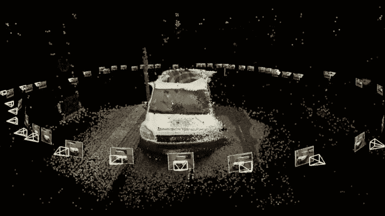

[来源](https://moneyinc.com/3d-reconstruction-models/):3D 重建场景

需要解决的一些挑战性问题包括**对应匹配、**由于诸如纹理、遮挡、非朗伯表面等原因而变得困难、**解决不明确的解决方案、**其中许多 3D 场景实际上可以在图像平面上给出相同的图片，即预测的深度不是唯一的。

从相机获取距离信息因其相对低廉的生产成本和密集的表现形式而极具吸引力。将这项技术带给大众就像拥有一台现成的照相机一样简单。目前，检索深度的最佳替代方法是使用激光雷达等主动测距传感器。它们是天然高保真传感器，提供高度精确的深度信息。

由于各种原因，如遮挡、场景中的动态对象和不完美的立体对应，在深度估计方面进行工作，特别是在自主车辆的应用中，确实具有挑战性。对于立体匹配算法来说，反光、透明、镜面是最大的敌人。例如，汽车的挡风玻璃通常会降低匹配性能，从而降低估计性能。因此，大多数公司仍然依赖激光雷达来可靠地提取距离。然而，自动驾驶汽车感知堆栈的当前趋势是转向传感器融合，因为[每个传感器在其提取的特征方面都有其优势](https://medium.com/swlh/camera-lidar-projection-navigating-between-2d-and-3d-911c78167a94)。尽管如此，自深度学习出现以来，该领域已经获得了很大的牵引力并取得了显著的成果。许多研究致力于解决这些问题。

在计算机视觉中，深度是从两种流行的方法中提取的。即，来自单目图像(静态或连续)的**深度或来自立体图像**的**深度。这篇文章将重点给读者一个深度估计的背景和与之相关的问题。需要对相机射影几何有充分的理解。**

通过阅读这篇文章，我希望你能从总体上对深度知觉有一个直观的理解。此外，概述了深度估计研究的趋势和方向。然后我们将讨论一些(许多)相关的问题。

各种深度估计算法将在后续帖子中详细阐述，以免过多的细节淹没您！

# 我们如何看待这个世界

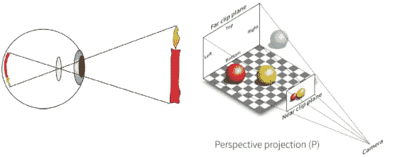

图二。投射到视网膜上(左)。[投影到像平面](https://gamedev.stackexchange.com/questions/136007/projection-texture-mapping)(右)

让我们从我们人类一般如何感知深度开始。这将给我们一些关于深度估计的有价值的见解，因为这些方法中的许多是从我们的人类视觉系统中得到的。机器视觉和人类视觉在图像形成方式上有相似之处(图 2)。从理论上讲，当来自光源的光线击中表面时，它会反射并射向我们视网膜的背面，投射出去，我们的眼睛将它们作为 2D [1]进行处理，就像图像在图像平面上形成一样。

那么，当投影场景在 2D 时，我们如何在 3D 中测量距离和理解我们的环境呢？例如，假设有人要给你一拳，你本能地知道你什么时候会被击中，当他/她的拳头靠得太近时，你会躲开它！或者当你开车时，你可以通过某种方式判断何时踩油门或踩刹车，以便与其他司机和行人保持安全距离。

这里的工作机制是，我们的大脑开始通过识别模式来推理传入的视觉信号，如大小、纹理和场景的运动，称为**深度线索**。没有关于图像的距离信息，但是我们可以毫不费力地解释和恢复深度信息。我们感知到场景的哪一面离我们近，哪一面离我们远。此外，这些线索让我们能够将平面图像上的物体和表面视为 3D [1]。

## 如何破坏深度(不是人类/计算机视觉)

只是为了强调一个有趣的事实，解释这些深度线索始于场景如何在人类和摄像机视觉中被投射到**透视图**。另一方面，正视图或侧视图的**正交投影**会破坏所有深度信息。

考虑图 3，观察者可以分辨出房子的哪个方面离他/她更近，如左图所示。然而，完全不可能从正确的图像中区分相对距离。甚至背景也可能和房子在同一平面上。

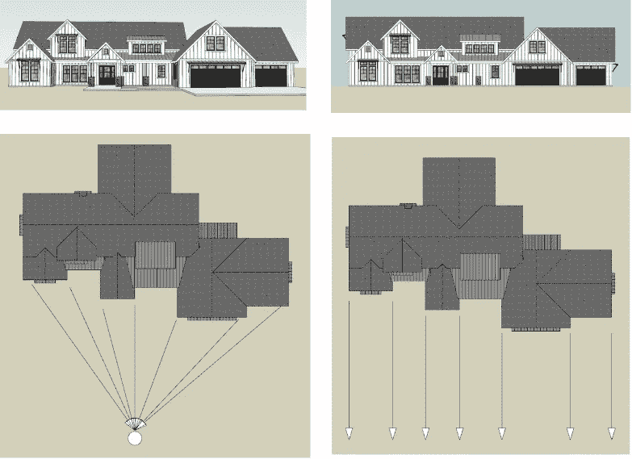

[图 3。透视投影(左)。正投影(右)](https://www.quora.com/How-do-people-with-depth-perception-issues-drive-a-car-and-stop-in-traffic-by-providing-adequate-space-and-not-crashing-the-car-in-front-of-theirs)

# 利用线索判断深度

基本上有 4 类深度线索:静态单眼、运动深度、双目和生理线索[2]。我们下意识地利用这些信号来非常好地感知深度。

## 图像深度线索

我们从单一静止图像中感知深度的能力取决于场景中事物的空间排列。下面，我总结了一些提示，让我们能够推理不同物体的距离。从你与地球母亲的日常互动中，你可能已经感觉很自然了。希望不要花太多心思去计算各种线索。

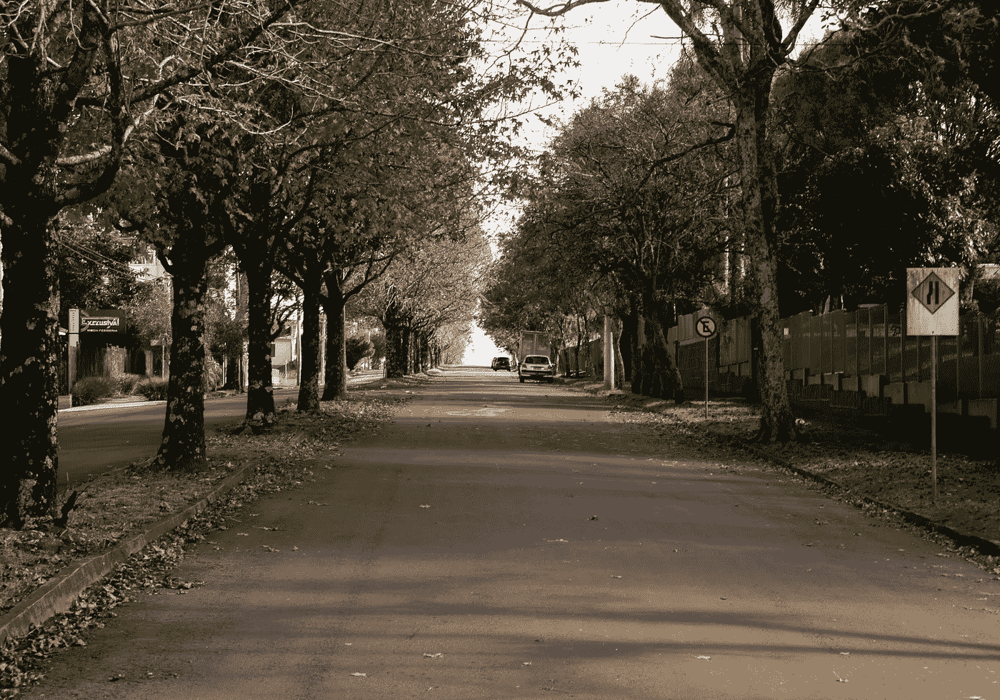

由[蜜桃红·坎普斯·菲利佩](https://unsplash.com/@matfelipe?utm_source=unsplash&utm_medium=referral&utm_content=creditCopyText)在 [Unsplash](https://unsplash.com/s/photos/depth-road?utm_source=unsplash&utm_medium=referral&utm_content=creditCopyText) 上拍摄的照片

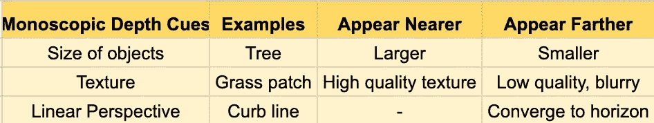

加州大学伯克利分校进行了一项有趣的研究，他们通过实验表明，当视界可见时，我们有一种压倒性的倾向来利用这一特性快速感知深度。当你看到上面的图片时，你会这样想吗？

## 来自运动的深度线索(运动视差)

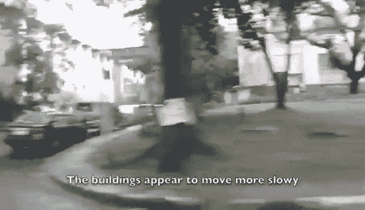

图五。[运动视差](https://gfycat.com/shabbycalculatingduckling)

你也不应该对此感到惊讶。作为一个观察者，当你在运动时，你周围的物体比远处的物体经过得快。某样东西出现得越远，它离开观察者的速度似乎就越慢。

## 来自立体视觉的深度线索(双目视差)

**视网膜差异**:又一个有趣的现象，让我们能够识别深度，这可以从一个简单的实验中直观地理解。

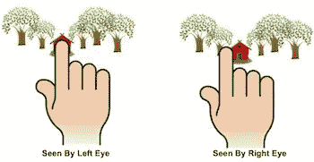

图六。[来源](https://www.pinterest.com/pin/93731235972658209/?lp=true)

闭上一只眼睛，将食指放在面前，尽可能靠近你的脸。现在，反复关闭一个，打开另一个。注意到你的手指在动！你的左右眼观察到的视野差异被称为**视网膜差异**。现在伸出一臂长的手指，做同样的动作。你应该注意到手指位置的变化变得不那么明显了。这应该给你一些关于立体视觉如何工作的线索。

这种现象被称为****；**由于对世界的两种不同视角而感知深度的能力。通过比较两只眼睛视网膜的图像，大脑计算距离。差距越大，事情离你越近。**

# **计算机视觉中的深度估计**

**深度估计的目标是获得场景的空间结构的表示，恢复图像中物体的三维形状和外观。这也被称为逆问题[3]，在这种情况下，我们试图在信息不足以完全确定解决方案的情况下恢复一些未知数。这意味着 2D 视图和 3D 视图之间的映射不是唯一的(图 12 ),我将在这一部分介绍经典的立体方法和深度学习方法。**

**那么机器实际上是如何感知深度的呢？我们能否以某种方式转移上面讨论的一些想法？具有令人印象深刻的结果的最早算法始于 90 年代使用立体视觉的深度估计。密集立体对应算法取得了很多进展[4] [5] [6]。研究人员能够利用几何学从数学上限制和复制立体视觉的概念，同时实时运行。本文对所有这些观点进行了总结[7]。**

**至于单目深度估计，它最近开始通过使用神经网络来学习直接提取深度的表示而受到欢迎[8]。其中通过基于梯度的方法隐含地学习深度线索。除此之外，在自我监督的深度估计方面已经有了很大的进步[9][10][11]。这是特别令人兴奋和开创性的！在这种方法中，模型被训练成通过优化代理信号来预测深度。训练过程中不需要地面真相标签。大多数研究要么利用几何线索，如多视图几何或核几何来学习深度。我们稍后会谈到这一点。**

## **来自立体视觉的深度估计**

****

**图 7。极线几何(左)。校正后的图像(右)**

**使用立体相机解决深度的主要思想涉及到**三角测量**和**立体匹配**的概念。形式依赖于良好的校准和**校正**来约束问题，以便它可以在被称为**核平面的 2D 平面上建模，**这极大地将后者简化为沿着**核线**(图 7) **的线搜索。关于极线几何的更多技术细节将在以后的帖子中讨论。****

**类似于双目视差，一旦我们能够匹配两个视图之间的像素对应，下一个任务是获得编码差异的表示。这种表示被称为**视差，d.** 为了从视差中获得深度，可以从相似的三角形中计算出公式(图 8)**

**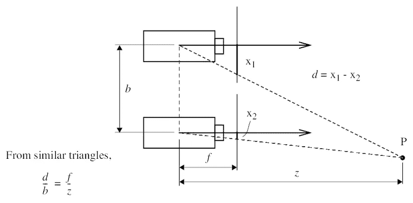**

**图 8。立体几何**

**这些步骤如下**

*   **从特征描述符中识别相似点。**
*   **使用匹配成本函数匹配特征对应。**
*   **使用极线几何，找到并匹配一个画框与另一个画框的对应关系。匹配成本函数[6]用于测量像素相异度**
*   **根据已知的对应关系`d = x1 — x2`计算视差，如图 8 所示。**
*   **根据已知视差计算深度`z = (f*b)/d`**

**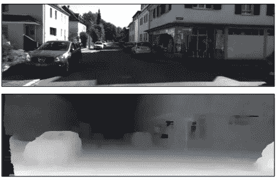**

**图九。来自 Kitti 的差异表示**

## **深度学习时代**

**深度学习擅长高级感知和认知任务，如识别、检测和场景理解。深度知觉属于这一类，同样应该是一种自然的前进方式。目前有 3 个广泛的框架来学习深度:**

****监督学习**:直接从单目图像估计深度的开创性工作始于 sa xena【8】。他们通过监督学习，通过最小化回归损失，学会了直接从 2D 图像中的单眼线索回归深度。从那以后，许多不同的方法被提出来，通过提出新的体系结构或损失函数来改善表征学习**

****使用 SFM 框架的自监督深度估计:**该方法将问题框架化为学习从视频序列生成新视图。神经网络的任务是通过在不同的时间步长`I_t-1, I_t+1`拍摄图像并应用从姿态网络学习的变换来执行图像扭曲，从源视图生成目标视图`I_t`。通过使用空间变换网络[14]以可区分的方式将扭曲视图合成视为监督，训练成为可能。在推断时间，深度 CNN 将从单视图 RGB 图像预测深度(图 10)。我建议您阅读这篇文章以了解更多信息。请注意，这种方法确实有一些缺点，如无法确定比例和模拟下一节中描述的移动对象。**

**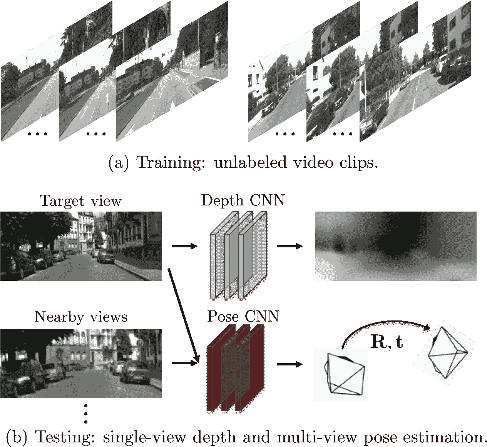**

**图 10。[无监督单目深度估计](https://people.eecs.berkeley.edu/~tinghuiz/projects/SfMLearner/cvpr17_sfm_final.pdf)**

****使用立体图的自我监督单目深度估计**:又一个有趣的方法。这里(图 11)，代替将图像序列作为输入，该模型将仅从左侧 RGB 预测视差`d_l, d_r`，`I_l`。与上述方法类似，空间转换器网络使用视差扭曲 RGB 图像对`I_l, I_r`。回想一下`x2 = x1 — d`。因此可以合成成对视图，并且使用重建视图`I_pred_l, I_pred_r`和目标视图`I_l, I_r`之间的重建损失来监督训练。**

**为了使这种方法有效，假设基线必须是水平的和已知的。必须对图像对进行校正，以便通过视差进行准确的变换。从而计算结果`d = x1 — x2`如图 8 所示。**

**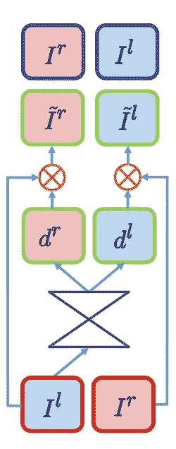**

**图 11。[使用立体的自我监督单目深度估计](https://arxiv.org/pdf/1609.03677.pdf)**

## **CNN 深度线索和偏差学习**

**理解和破译黑盒一直是可解释机器学习中正在进行的研究。在深度估计的背景下，一些工作已经开始研究神经网络依赖于什么样的深度线索或者从特定数据集学习的归纳偏差。**

**在[汤姆等人的开创性工作中，ICCV 2019](https://openaccess.thecvf.com/content_ICCV_2019/papers/van_Dijk_How_Do_Neural_Networks_See_Depth_in_Single_Images_ICCV_2019_paper.pdf) ，他们进行了几个简单的测试，通过实验找到了估计深度和场景结构之间的关系。请注意，这是在 Kitti 数据集上完成的，Kitti 数据集是一个室外道路场景，具有固定的相机位置，并且具有某种程度上可见的消失点和地平线。**

**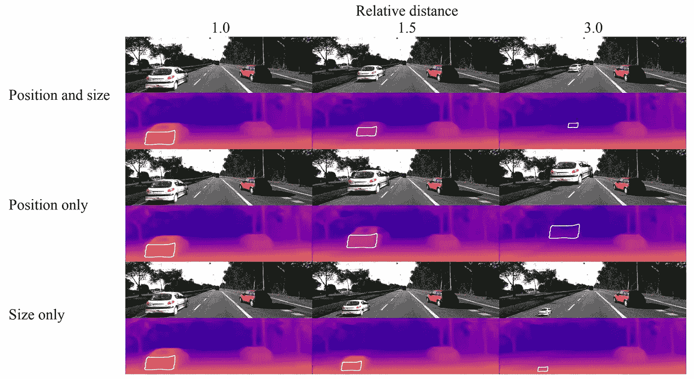**

**[来源](https://openaccess.thecvf.com/content_ICCV_2019/papers/van_Dijk_How_Do_Neural_Networks_See_Depth_in_Single_Images_ICCV_2019_paper.pdf)**

****物体相对于地面接触点的位置提供了强大的上下文信息**:对于道路上的物体，通过增加汽车在垂直方向上的位置。我们看到，当模型离地面较远时，它不能很好地估计深度。**

**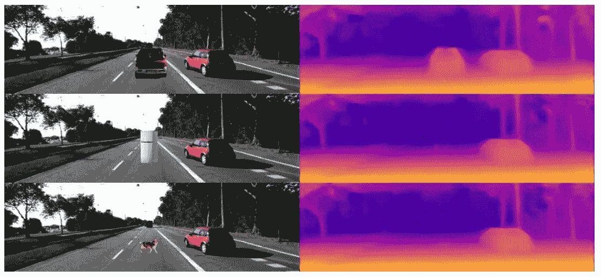****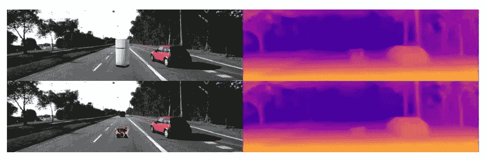**

**[源](https://openaccess.thecvf.com/content_ICCV_2019/papers/van_Dijk_How_Do_Neural_Networks_See_Depth_in_Single_Images_ICCV_2019_paper.pdf):物体下面的阴影作为深度估计的强特征**

****形状不重要，但阴影重要**:在另一个实验中，通过放置一个带有人工投射阴影的任意对象，即使在训练期间无法获得深度，模型也可以合理地估计深度。**

**Rene 等人完成了有趣的工作，他们在由室内和室外场景组成的相对较大规模的数据集上训练了一个深度模型。从观察来看，有一个自然的偏差，图像的下半部分总是靠近相机。这可以被视为下图右上角示例中的一种故障模式。此外，深度模型倾向于预测内容，而不是在左下角的情况下识别为镜子中的反射。在论文中还可以发现许多其他有趣的发现。**

**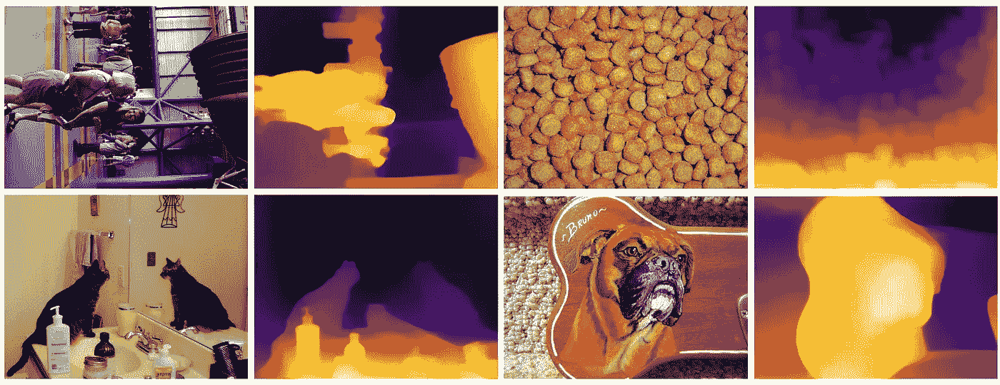**

**[来源](https://arxiv.org/pdf/1907.01341.pdf)**

**进行的研究仍然相当有限。要提供更多的结论性发现，还需要做大量的工作。**

# **为什么测量深度这么难？**

**最后，让我们试着理解深度估计的一些基本问题。主要原因在于 3D 视图到 2D 图像的投影丢失了深度信息。当有运动和移动物体时，另一个问题就根深蒂固了。我们将在本节中详细介绍它们。**

## **深度估计是不适定的**

**通常在进行单目深度估计的研究时，许多作者会提到从单幅 RGB 图像估计深度的问题是不适定的逆问题。这意味着世界上观察到的许多 3D 场景确实可以对应于同一个 2D 平面(图 11 和 12)。**

**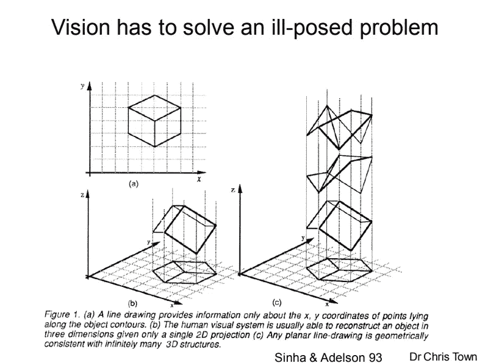**

**图 12。[来源](https://www.cl.cam.ac.uk/teaching/1011/CompVision/Town%20-%20ComputerVision%20-%20L1.pdf)**

## **不适定:单目深度估计的尺度模糊**

**回想一下，调整焦距将按比例缩放图像平面上的点。现在，假设我们以某个因子`k`缩放整个场景 X，同时以因子`1/k`缩放相机矩阵 P，图像中场景点的投影保持完全相同**

**`x = PX = (1/k)P * (kX) = x`**

**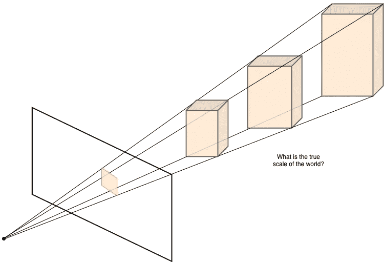**

**也就是说，我们永远无法仅从图像中恢复实际场景的精确比例！**

**请注意，单目基础技术存在此问题，因为可以通过已知基线恢复立体装备的比例。**

## **不适定:投影模糊**

**假设我们对场景进行几何变换，有可能变换后，这些点会映射到平面上的同一个位置。又一次给我们留下了同样的困难。见下图**

**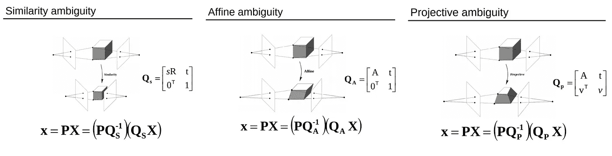**

**[图十三。变换后物体的投影映射到平面上的同一点](http://www.cs.unc.edu/~lazebnik/spring11/lec17_sfm.pdf)**

## **降低匹配的属性**

**对于需要三角测量的基于立体或多视角的深度估计，通常涉及 [**检测-描述-匹配**](https://www.researchgate.net/publication/292995470_Image_Features_Detection_Description_and_Matching) 的流水线。当场景是从非常不同的视点拍摄的或者图像之间的光照变化很大时，匹配变得非常困难。下图给出了一个极端情况，其中描述符无法区分特征。这些有问题的案例包括:**

*   **无纹理区域:许多像素将具有相同的像素强度**
*   **反射表面**
*   **重复模式**
*   **遮挡:对象在一个视图中被遮挡，但在另一个视图中不被遮挡。**
*   **违反[朗伯性质:朗伯曲面指的是无论从哪里看都具有相同亮度的曲面。当图像从两个不同的视角显示同一场景时，由于非理想的漫反射，相应的亮度强度可能不相等。](https://en.wikipedia.org/wiki/Lambert%27s_cosine_law)**

**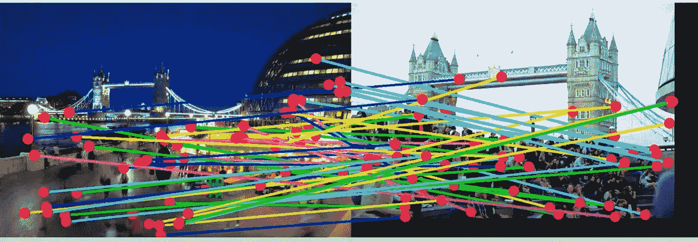**

**一个非常困难的场景，有很大的视角差异和不同的人群。**

## **移动物体违反了 SFM 方法的静态假设**

**场景中的动态对象进一步使估计过程复杂化。从运动中通过结构进行深度估计涉及移动的摄像机和连续的静态场景。**这个假设必须适用于匹配和对齐像素**。当场景中有移动的对象时，这个假设就不成立了。为此，许多研究人员研究了几种方法来模拟场景中的移动对象，包括使用光流[12]合并速度信息，或使用实例分割遮罩来模拟对象从一帧到另一帧的运动[13]。**

# **下一步是什么**

**我希望你已经从这篇介绍性的文章中获得了一些关于深度估计的有价值的见解，为什么它是一个具有挑战性但又极其重要的任务，以及该技术的当前状态是什么。我坚信深度可以用相机和视觉来解决。我对此很乐观。因为我们自己仅仅依靠单眼或双眼视觉来与我们的环境互动。**

> **感谢您阅读这篇文章。希望它给你一些好的见解！点击查看更多关于计算机视觉和机器学习的帖子。欢迎留下任何反馈:)**

** [## 深度估计的不确定性

### 你对你预测的深度有把握吗？

towardsdatascience.com](/uncertainty-in-depth-estimation-c3f04f44f9)  [## 自我监督的深度估计:打破观念

### 在这篇文章中，我想通过自我监督学习来分解各种各样的深度估计的想法。对于…

towardsdatascience.com](/self-supervised-depth-estimation-breaking-down-the-ideas-f212e4f05ffa)  [## 逆投影变换

### 深度和反向投影

towardsdatascience.com](/inverse-projection-transformation-c866ccedef1c) 

# 参考

[1] [视觉科学导论](http://www.mind.ilstu.edu/curriculum/vision_science_intro/vision_science_intro.php)，戴维·l·安德森

[2]双目和 3d 显示器的视觉舒适性，Frank L. Kooi，Alexander Toet，*在 SPIE 国际光学工程学会会议录*25(2):99–108，2004 年 8 月

[3]计算机视觉:算法和应用，Richard Szeliski

[4]m .奥托米和 t .卡纳德(1993 年)。多基线立体声。 *IEEE 模式分析与机器智能汇刊*，15(4):353–363。

[5]博伊科夫、维克斯列尔和扎比赫(1998 年)。早期视觉的可变窗口方法。 *IEEE 模式分析与机器智能汇刊*，20(12):1283–1294。

[6]伯奇菲尔德和托马西(1999 年)。像素到像素立体的深度不连续性。《国际计算机视觉杂志》，35(3):269–293。

[7]Scharstein d .和 Szeliski r .(2002 年)。稠密两帧立体对应算法的分类和评价。国际计算机视觉杂志，47(1):7–42。

[8] D. Eigen、C. Puhrsch 和 R. Fergus。使用多尺度深度网络从单幅图像预测深度图。NIPS，2014。

[9] R .加尔格、g .卡内罗和 I .里德。用于单视图深度估计的无监督 cnn:几何学拯救。ECCV，2016。

[10] T .周、m .布朗、n .斯奈夫利和 d .洛来自视频的深度和自我运动的无监督学习。CVPR，2017。

[11]戈达尔、奥达和布罗斯托。具有左右一致性的无监督单目深度估计。CVPR，2017。

[12] Z. Yang，P. Wang，Y. Wang，W. Xu 和 R. Nevatia .每一个像素都很重要:具有整体 3d 运动理解的无监督几何学习。arxiv.org/pdf/1806.10556, 2018。

[13] R. Mahjourian、M. Wicke 和 A. Angelova。使用 3d 几何约束从单目视频无监督学习深度和自我运动。IEEE 计算机视觉和模式识别会议论文集，第 5667-5675 页，2018 年。

[14]贾德尔伯格先生、西蒙扬先生、齐塞尔曼先生和卡武克库奥卢先生。空间变压器网络。在日本，2015 年。**