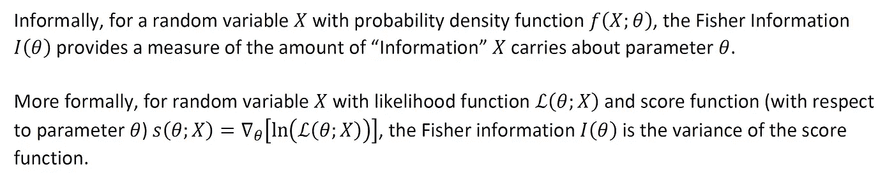
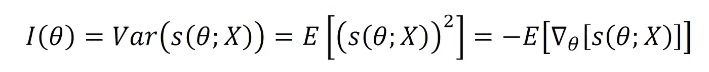
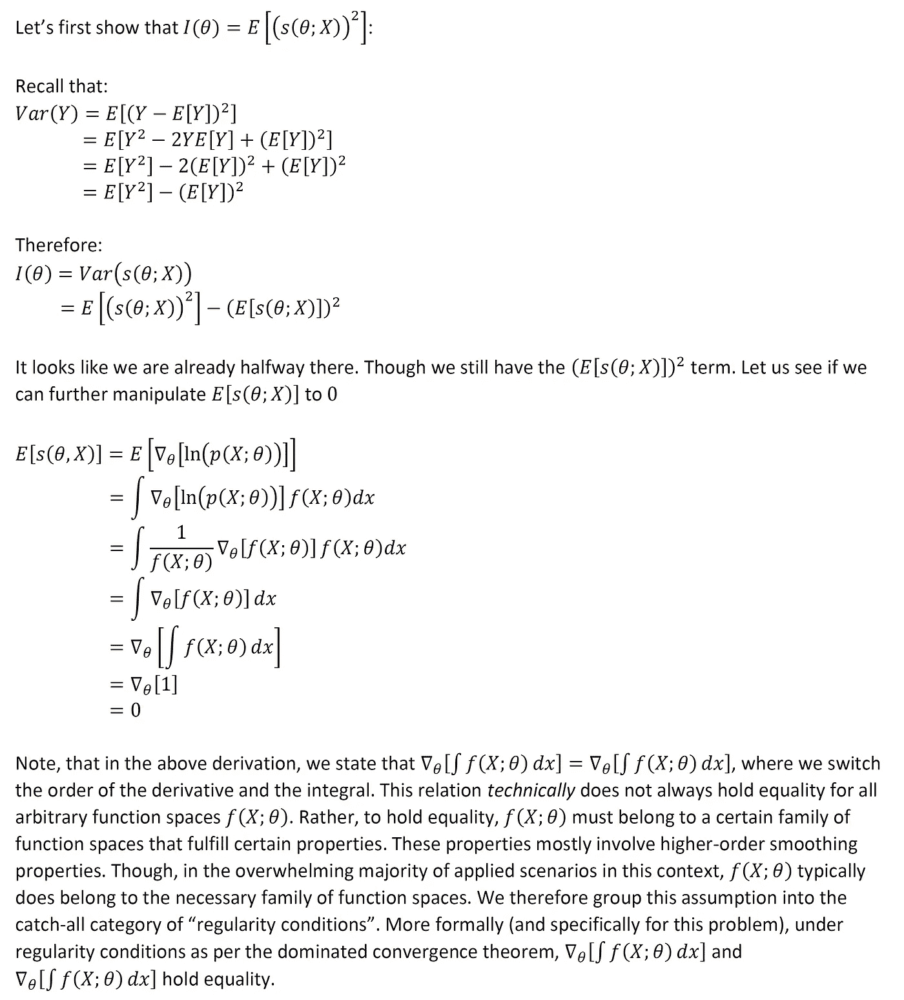
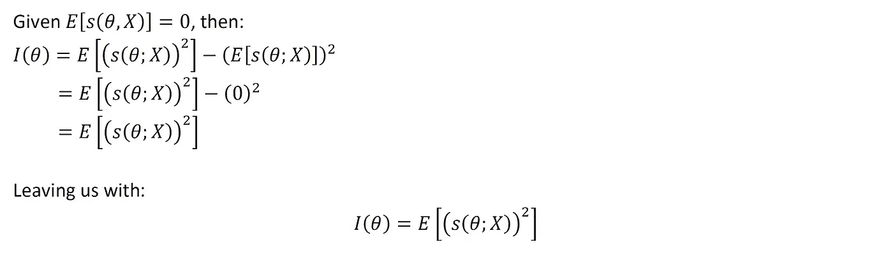
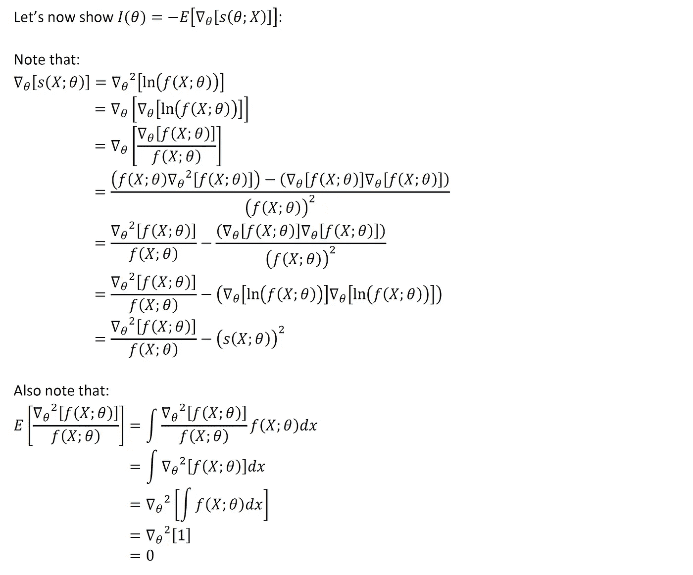
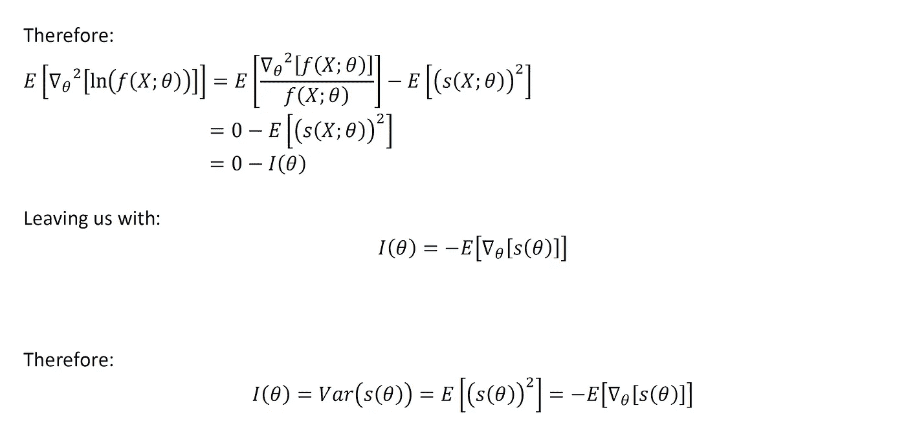
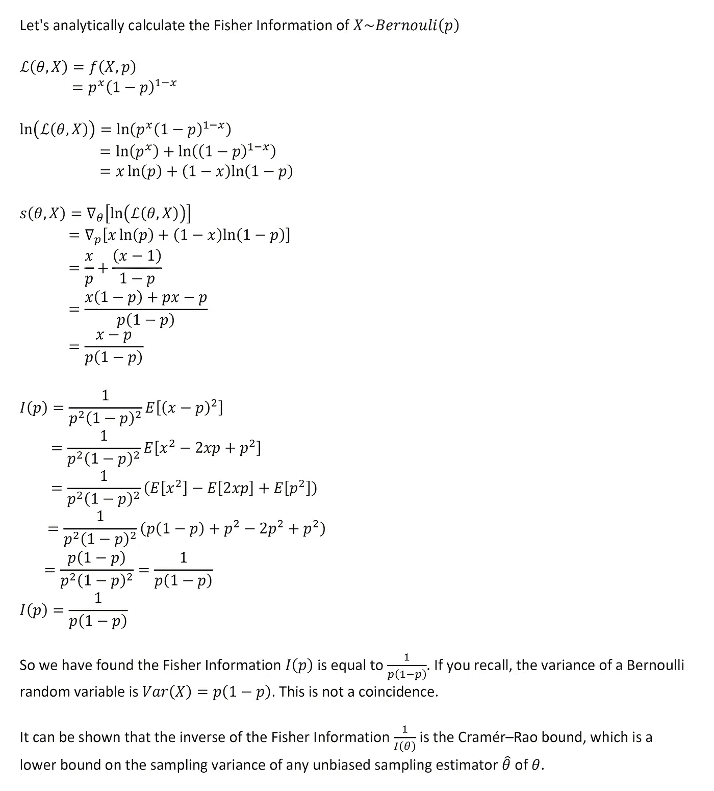

# 费希尔信息的推导

> 原文：<https://towardsdatascience.com/derivations-of-the-fisher-information-bc81c82f12f6?source=collection_archive---------32----------------------->

## 一些理论，一些例子，和一些见解

## 背景和动机

Fisher 信息是数理统计中的一个重要量，在极大似然估计(MLE)的渐近理论和 cramér–Rao 下界的规范中起着重要作用。

让我们看看费希尔信息的定义:

上面的描述似乎很公平。费雪信息是分数的方差。简单，容易，太棒了！

教科书经常陈述(有时没有证明)在正则条件下，以下三个量都等于费雪信息:

当我在大学第一次遇到这个材料时，我不清楚这三个量是如何相等的？在 Medium 上快速搜索发现了关于这个话题的大量报道。我觉得下面的证明值得了解。这些证明中使用的一些技术在概率论和数理统计的其他地方也是有用的。所以让我们开始吧。

## 1)费希尔信息=得分函数的二阶矩

## 2)费希尔信息=得分函数的梯度的负期望值

## 示例:伯努利随机变量的费希尔信息，以及与方差的关系

利用我们在上面学到的知识，我们来做一个快速练习。

## 最后的想法

希望以上有见地。正如我在以前的一些文章中提到的，我认为没有足够的人花时间去做这些类型的练习。对我来说，这种基于理论的洞察力让我在实践中更容易使用方法。我个人的目标是鼓励该领域的其他人采取类似的方法。我打算在未来写一些基础作品，所以请随时在[**【LinkedIn】**](http://www.linkedin.com/in/andrew-rothman-49739630)和 [**上与我联系，并在 Medium**](https://anr248.medium.com/) 上关注我的更新！