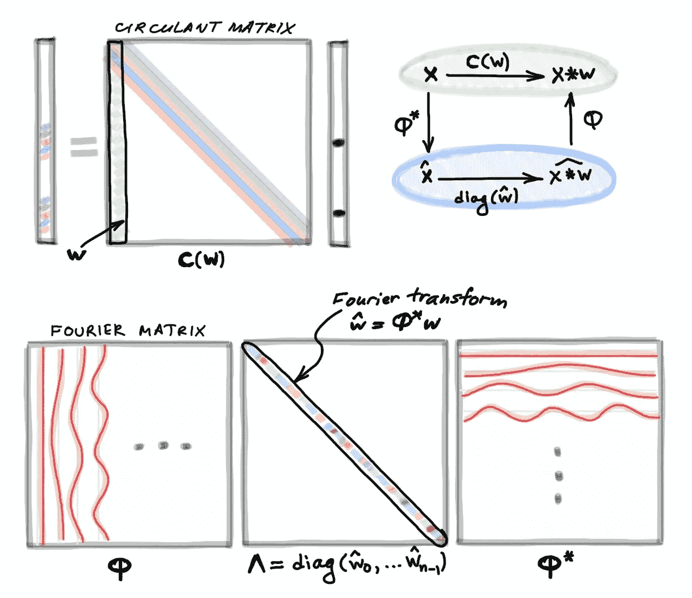
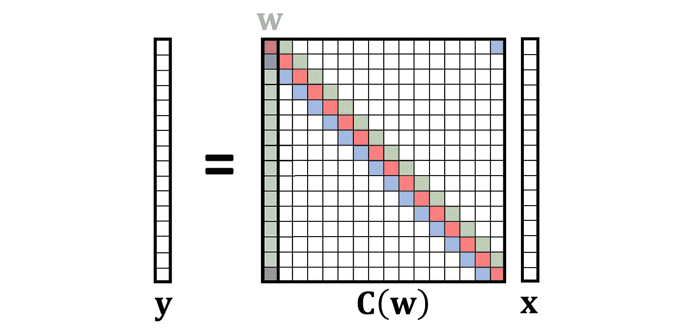
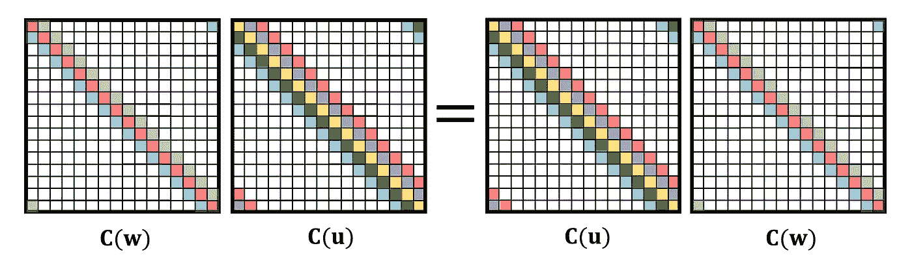
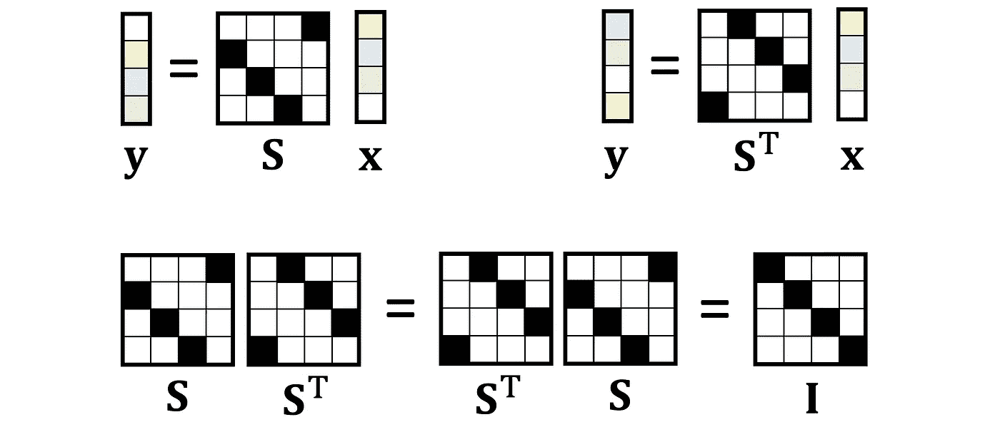
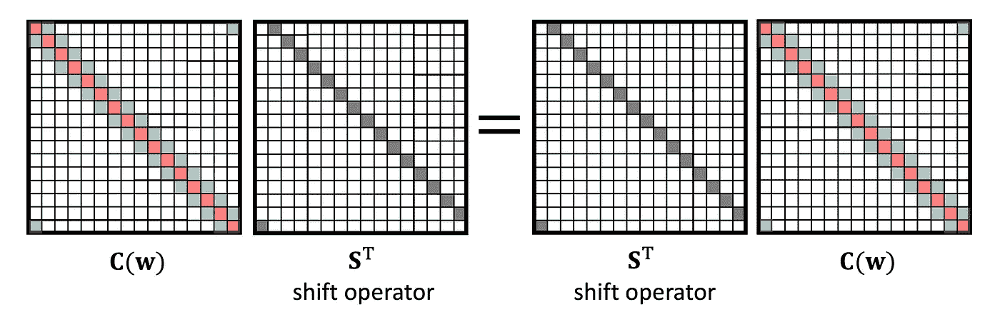
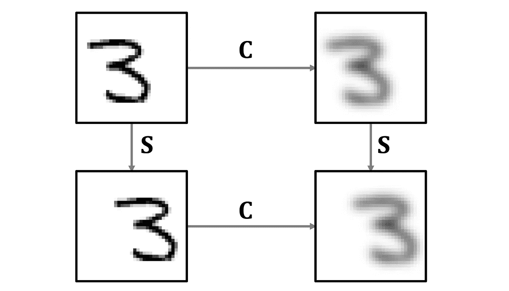
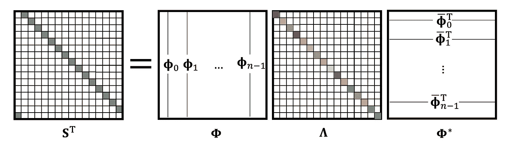
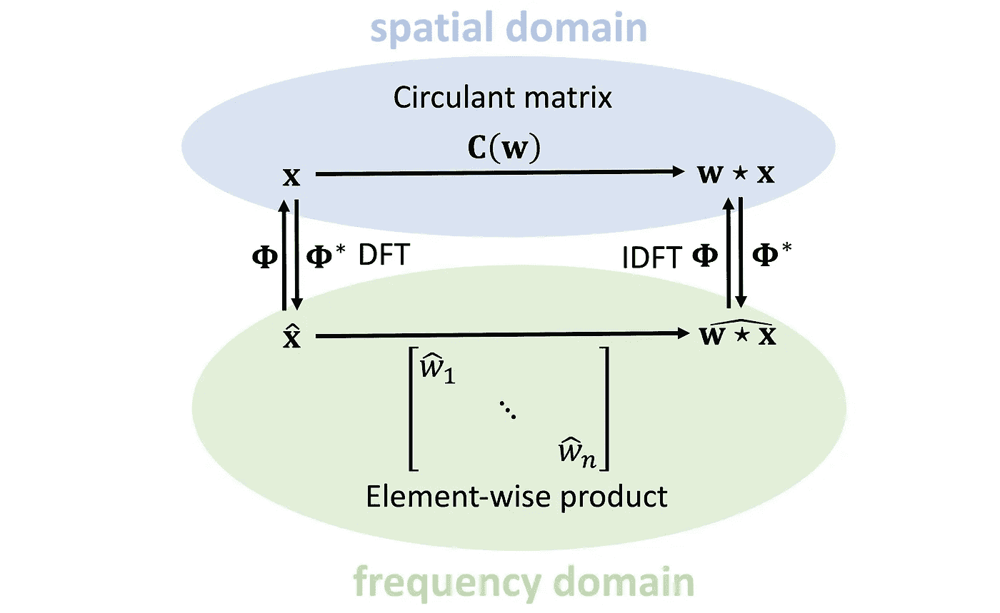

# 从第一原理导出卷积

> 原文：<https://towardsdatascience.com/deriving-convolution-from-first-principles-4ff124888028?source=collection_archive---------5----------------------->

## 深度学习的基础

## *你有没有想过卷积有什么特别之处？在这篇文章中，我从第一原理推导出卷积，并表明它自然地出现在平移对称中。*

> 某些原则的内涵为某些事实的内涵提供了便利。(克劳德·阿德里安·赫尔维蒂乌斯)

D 在我的本科学习期间，我在以色列理工学院学习电子工程，我总是对卷积这样一个重要的概念突然出现感到震惊。这个看似武断的定义像眼里的一粒沙子一样扰乱了信号处理世界原本美好的画面。让卷积从第一原理中产生，而不是让它成为假设，那该多好啊！正如我将在本文中展示的，这些首要原则是平移不变性或对称性的概念。

让我从基础信号处理课程中教授的公式开始，该公式定义了两个 *n* 维向量 **x** 和 **w** 的离散卷积:

这里，为了方便起见，我假设所有的索引都从零运行到*n*1，并且取模*n*；把向量想象成定义在圆上是很方便的。将上面的公式写成矩阵-向量乘法会产生一个非常特殊的矩阵，称为*循环矩阵*:

循环矩阵具有多对角线结构，每条对角线上的元素具有相同的值。它可以通过将向量 **w** [3】的移位(模 *n* )版本堆叠在一起而形成；为此，我使用符号 **C** ( **w** )来指代由向量 **w** 形成的循环矩阵。由于任何卷积**x**∫**w***都可以被等价地表示为循环矩阵**C**(**w**)**x**的乘法，所以我将这两个术语互换使用。*

*O 线性代数中我们最先学到的一点就是矩阵乘法是不可交换的，也就是一般情况下，**AB**≦**BA**。然而，循环矩阵是非常特殊的例外:*

> *循环矩阵交换，*

*或者换句话说，**C**(**w**)**C**(**u**)=**C**(**u**)**C**(**w**)。对于任何循环矩阵，或者任何选择的 **u** 和 **w** 都是如此。等价地，我们可以说卷积是一个交换运算，**x**∫**w**=**w**∫**x**。*

**

*特别选择 **w** =[0，1，0…，0]会产生一个特殊的循环矩阵，将向量向右移动一个位置。这个矩阵被称为(右)*移位算子*【4】，用 **S** 表示。右移位运算符的转置是左移位运算符。显然，先左移再右移(反之亦然)没有任何作用，这意味着 **S** 是一个正交矩阵:*

**

*循环矩阵可以用它们的交换性来刻画。仅证明移位的交换性似乎就足够了(文献[5]中的引理 3.1):*

> *矩阵是循环的当且仅当它随移位交换。*

*这个“当且仅当”语句的第一个方向导致了一个非常重要的性质，称为*平移*或*移位等方差*【6】:卷积与移位的可交换性意味着，不管我们是先移位一个向量然后卷积它，还是先卷积然后移位，结果都是一样的。*

**

*第二个方向允许我们*将*卷积定义为移位等变线性运算:为了移位交换，矩阵必须具有循环结构。这正是我们从一开始就渴望的，从平移对称的第一原理中产生卷积[7]。我们可以从移位等方差的要求出发，得出卷积的公式，作为满足它的唯一可能的线性运算，而不是像信号处理书籍中通常做的那样，给出卷积的公式并证明它的移位等方差性质。*

**

*作为移位和模糊操作可互换性的移位等变图解。*

*信号处理课程中教授的另一个重要事实是卷积和傅立叶变换之间的联系。在这里，傅里叶变换也是出人意料地出现，然后显示出它将卷积运算对角化，允许在频域中执行两个矢量的卷积，作为它们的傅里叶变换的逐元素乘积。从来没有人解释过这些正弦和余弦来自哪里，它们有什么特别之处。*

*为了追根究底，回想一下线性代数中的一个事实:*

> *交换矩阵可联合对角化。*

*换句话说，两个满足 **AB** = **BA** 的矩阵将具有相同的特征向量(但可能是不同的特征值)[9]。由于所有循环矩阵都交换，我们可以选择其中的一个并计算其特征向量——上述定理确保这些也将是所有循环矩阵的特征向量。*

*方便选择换班操作符 **S** 。由于 **S** 是正交矩阵，我们期望它的特征向量是正交的[10]。一个简单的计算(见[5]中的第 4.1 节)得出如下结论*

> *傅里叶变换将移位算子对角化。*

*我希望此时你已经有了今天的第二个“啊哈”时刻:这就是正弦和余弦的来源！它们是移位算子的特征向量；我将它们表示为矩阵**φ**的列。注意特征向量是复数，所以我们在转置**φ**时需要取复数共轭。乘以**φ***(从左起)称为傅立叶变换，乘以**φ**称为傅立叶逆变换。*

**

*因为所有循环矩阵都是可联合对角化的，所以它们也可以通过傅立叶变换来对角化[11]。它们只是在特征值上有所不同。最后缺失的一点是意识到*

> *C( ***w*** )的特征值是 w 的傅里叶变换。*

*我们现在可以把这个难题的所有部分放入一个被称为[卷积定理](https://en.wikipedia.org/wiki/Convolution_theorem)的陈述中:卷积**x**∑**w**可以作为循环矩阵 **C** ( **w** )应用于原始坐标系中的 **x** (有时这被称为“空间域”卷积)，或者通过首先计算**的傅里叶变换，在傅里叶基(“谱域”)中计算***

**

*因为**φ**具有特殊的冗余结构，所以利用[快速傅立叶变换](https://en.wikipedia.org/wiki/Fast_Fourier_transform#:~:text=A%20fast%20Fourier%20transform%20(FFT,frequency%20domain%20and%20vice%20versa.) (FFT)算法，可以用𝒪( *n* log *n* 复杂度来计算乘积**φ* x**和**φx**。*

*为什么卷积的这种定义很重要，并且应该这样教？我在这里重复一下我在这篇文章开始时引用的赫尔维·提乌斯的话:“对某些原则的了解很容易弥补对某些事实的了解的不足”。在卷积的情况下，它从第一原理的推导允许容易地推广到其他领域。在下一篇文章中，我将展示如何在图上定义卷积，以产生图形深度学习架构的关键构建块。*

*[1] A. Dominquez-Torres，[卷积的历史和起源](https://www.slideshare.net/Alexdfar/origin-adn-history-of-convolution)对卷积运算的概念和符号的[历史发展](https://www.embs.org/pulse/articles/history-convolution-operation/)进行了有趣的探究。卷积积分第一次出现在 J. B. D'Alembert 的《世界体系的不同要点的研究》( 1754)中泰勒定理的推导中。这一优先权常常被错误地认为是 P.-S. de Laplace 的著作，载于《关于土地和功能的数字》(1773 年)。巴黎皇家科学院院士，学者与外国人 7:503–540，尽管该出版物不包含任何卷积的痕迹。拉普拉斯在他后来写于 1778 年并于 1781 年出版的概率回忆录中确实使用了卷积。早期的命名尝试包括 *résultante* (法语“合成”的意思，查尔斯·卡勒于 1899 年首次使用) *composizione* (意大利语“合成”的意思，维托·沃尔泰拉于 1910 年使用)，以及 *faltung* (在德语中字面意思是“折叠”，古斯塔夫·多伊奇于 1923 年使用)；后者主宰了 20 世纪初的德国文学。英文名 *convolution* 来源于拉丁语 *con* (“在一起”)和 *volvere* (“卷起”)，是德语 *faltung、*的直译，俄语变体 *свёртка* 也是如此。这个英语术语的首次使用可以追溯到 1934 年 Aurel Friedrich Wintner 的论文；它后来被多奇(1937)和加德纳和巴恩斯(1942)的权威著作巩固在文学作品中。1910 年，沃尔泰拉首次使用了星形符号，尽管形式有所不同。珀西·约翰·丹尼尔使用了点符号。卷积的第一个现代符号为*f*∫*g*，这是两者的组合，这是由于 Doetsch (1923)。*

*【2】从技术上来说，我这里定义的是*循环卷积*。*

*[3]注意， **C** ( **w** )的行具有被转置的矢量 **w** ，导致出现在卷积公式中的反射，并将其与[相关性](/convolution-vs-correlation-af868b6b4fb5)的相关概念区分开来。注意边界条件(右上角和左下角的 **C** 的元素)。*

*[4]我交替使用术语*运算符*和*矩阵*。*

*[5] B. Bamieh，[发现变换:关于循环矩阵、循环卷积和离散傅立叶变换的教程](https://arxiv.org/pdf/1805.05533) (2018)。arXiv:1805.05533 提供了我在这篇文章中讨论的推导的细节。*

*[6]有些经常混淆*不变性*(拉丁文中“不变”的意思)和*等变*(“同变”)，很多信号处理书籍都把我这里讨论的性质称为“移位不变性”。一个功能是*换挡同变*if*f*(**Sx**)=**S***f*(**x**)*。*换句话说，我们是否先换档，然后再 *f* 都没有关系，反之亦然。不同的是，平移不变性是不受平移影响的性质:函数*f*(**Sx**)=*f*(**x**)是*平移不变性*。平移不变性是物理学中的一个基本概念(在这里它经常以“平移对称”的名义出现)，表明物理定律不依赖于空间中的位置。在经典力学的变分公式中，通过 [Noether 定理](https://en.wikipedia.org/wiki/Noether%27s_theorem)从位移不变性中得出动量守恒这样的基本定律。*

*[7]等方差的概念是更一般的，可以用群论形式来扩展。T. Cohen 和 M. Welling， [Group equivariant 卷积网络](http://proceedings.mlr.press/v48/cohenc16.pdf) (2016)中使用了这个框架。继续。ICML，将细胞神经网络卷积层的移位等方差扩展到更一般的操作，如旋转。假设 *f* : X→Y，其中 x 和 y 是一些不同的空间，对应的运算群𝒢和𝒢'分别定义在 x 和 y 的元素上，群等方差表示为*f*(𝔤(**x**))=𝔤'(*f*(**x**))其中𝔤∈𝒢和𝔤'∈𝒢'.请注意，𝔤'不一定等于𝔤，因为输出空间 y 的结构和偶数维可以不同于输入空间 x 的结构和偶数维。本文中讨论的标准卷积是一种特殊情况，X=Y 是 n 维向量的空间，𝒢=𝒢'是平移组，𝔤=𝔤'是移位运算符。*

*[8]由于我们处理的是有限维向量，所以术语“傅立叶变换”在这里指的是[离散傅立叶变换](https://en.wikipedia.org/wiki/Discrete_Fourier_transform) (DFT)。*

*[9]更准确地说，联合对角化意味着两个交换矩阵具有相同的*特征空间*，因为在一般情况下，特征值可以具有非平凡的多重性。因为在我这里讨论的例子中，所有的特征值都是简单的，我们可以讨论一个公共的特征基。*

*[10]但是，由于 **S** 是非对称的，所以它不具有实特征值(对称实矩阵具有实特征值)。 **S** 的特征值恰好是单位根的复根[。](https://en.wikipedia.org/wiki/Root_of_unity)*

*[11]当我说矩阵 **C** 被傅立叶变换“对角化”时，我的意思是矩阵**φ* Cφ**是对角的。由于傅立叶变换是一个正交矩阵(**φ*φ**=**I**)，从几何角度来说，它相当于坐标系统的一个变化，相当于一个 *n* 维旋转。在这个坐标系中， **C** 的动作变成了元素的乘积。*

*[12]在信号处理中，通常在频域中设计滤波器，因此从不明确计算 **w** 的傅里叶变换。*

**关于图形深度学习的其他文章，请参见我的博客***【迈向数据科学】* [*订阅*](https://michael-bronstein.medium.com/subscribe) *到我的帖子，获取* [*中级会员*](https://michael-bronstein.medium.com/membership) *，或者关注我的* [*推特*](https://twitter.com/mmbronstein) *。***