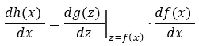

# 从头开始推导反向传播方程(第一部分)

> 原文：<https://towardsdatascience.com/deriving-the-backpropagation-equations-from-scratch-part-1-343b300c585a?source=collection_archive---------3----------------------->

## 深入了解神经网络的训练方式

在这一系列简短的[两篇文章](/deriving-the-backpropagation-equations-from-scratch-part-2-693d4162e779)中，我们将从头开始推导全连接(密集)层的三个著名反向传播方程:

以下所有解释都假设我们只向网络提供一个训练样本。如何将公式扩展到小批量将在这篇文章的最后解释。

# 正向传播

我们首先简要回顾一下单层的正向传播(以矩阵形式):

图层𝑙的输入是矢量(通常称为特征矢量):

方括号中的值(上标中)表示网络层。我们用变量 n 来表示一层中的节点数。定义图层𝑙行为的系数(权重和偏差)为:

中介价值:

被称为 ***的加权输入*** 是通过:

加权输入以元素方式馈入激活函数(也称为非线性):

要获得输出:

常见的激活功能有 ReLU、leaky ReLU、tanh、sigmoid、Swish 等。如上标所示，理论上每层可以具有不同的激活函数。

# 获得直觉

在不知道反向传播是什么的情况下推导反向传播方程是没什么用的。为此，我们首先将上一节定义的单个层链接成一个𝐿层网络。

(图片由作者提供)

训练神经网络的目标是提高其在给定任务上的性能，例如分类、回归。通过损失函数𝓛来评估性能，该损失函数在训练期间被添加为链的最后一个块。对于每个样本，损失函数将网络的输出与地面真实值𝒚进行比较，并输出单个实值(！idspnonenote)信号。)号。通常，较小的数字表示性能良好，而较大的数字表示性能不佳。

接下来，我们输入一个具体的样本到我们的网络中，例如

并通过各层连续向前传播。我们在图层𝑙停下来，看看计算出的加权输入，比如说:

然后，我们继续传播以获得损失函数值，例如𝓛 = 0.3247。

现在，我们回到𝑙层，并增加其第一个节点的值:

微小的价值:

同时保持所有其他节点不变。从𝑙层开始，我们向前传播改变后的加权输入:

通过网络并获得损失函数𝓛 = 0.3242 的微小变化值。

由于网络的分级性质，微小的推动δ导致了后面层𝑙 + 1、𝑙 + 2 等的所有激活。稍微更改它们的值，如下图所示:

绿色箭头表示增加，红色箭头表示减少(图片来自作者)

在我们设计的例子中，当我们增加𝑙.层中第一个节点的值时，损失函数的值减少了
δ𝓛=-0.0005 一般来说，对于一些节点，损失函数将减小，而对于其他节点，损失函数将增大。这完全取决于网络的权重和偏差。

上述两个三角形之比就是所谓的“斜率三角形”:

这个斜率三角形当然可以对所有节点和所有层进行计算。它是下列偏导数的近似值:

在文献中，这种偏导数通常被称为*误差*，我们将随后使用这个术语。*误差*正是从最后一层𝐿开始，通过网络反向传播的量。

通过使用第一反向传播方程，我们可以将层𝑙的*误差*向后传播一步到其前一层𝑙 -1:

重复应用该等式允许我们获得所有层的*误差*。

让我们简短地总结一下反向传播的机理:

训练神经网络的过程包括通过调整网络的权重和偏差来最小化损失函数。使用梯度下降或其变体来完成自适应。事实证明，偏置的梯度与*误差*完全匹配:

权重的梯度也可以通过外积直接从*误差*中获得:

# 扩展到多个样本

要计算小批量样品的重量和偏差梯度，我们只需独立执行上述步骤(！)对于小批量的所有样品，随后平均梯度:

其中，𝑚表示小批量样品的数量，圆括号中的数值表示样品编号。

请注意，在计算效率极高的反向传播“矢量化版本”中，针对单个样本独立计算*误差*。然而，计算是并行进行的。

# 链式法则

学校里教的基本链式法则允许我们计算嵌套函数的导数:

𝑔(.在哪里)和𝑓(.称之为“外层功能”)的“内在功能”。导数是:

也可以写成这样:

为了推导反向传播方程，我们需要对基本的链式法则稍加扩展。首先，我们扩展𝑔和𝑓函数，以接受多个变量。我们选择外部函数𝑔取三个实变量并输出一个实数:

因为𝑔现在接受三个变量，我们也需要三个不同的内部函数𝑓s，用于每个变量。假设每个𝑓s 接受两个实数变量并输出一个实数:

接下来，我们将内部函数插入外部函数，得到:

请注意，得到的函数只是两个(！idspnonenote)的函数。)实变量。现在，我们想获得下面的偏导数:

与上述基本链规则一样，我们首先获取外部函数𝑔相对于其第一个变量的偏导数，并将其乘以第一个内部函数的偏导数:

请注意，我们首先取外部函数𝑔的偏导数，就好像内部函数不存在一样。只是随后我们将内部函数插入到变量中，用垂直线表示。

然而，我们还没有完成，因为外部函数不仅仅依赖于一个变量。幸运的是，扩展链规则具有非常清晰的结构，因此我们接下来对第二个和第三个变量执行完全相同的步骤。随后，将所有步骤加在一起:

更一般地说，对于任意外函数和𝑛任意内函数:

链式法则是:

为了清楚起见，我们去掉了在具体值

同样的程序适用于其他变量的导数。

在本系列的第二部分中，我们将使用扩展链规则来推导反向传播方程。