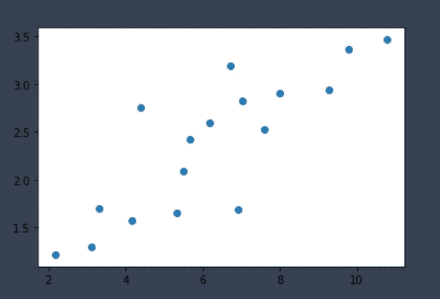
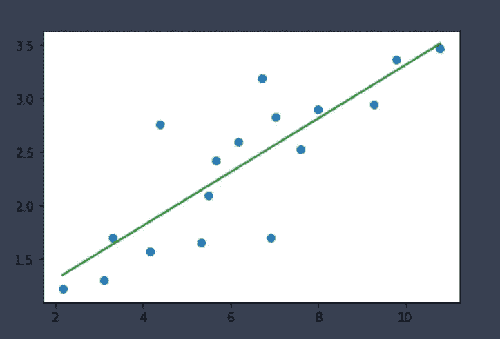
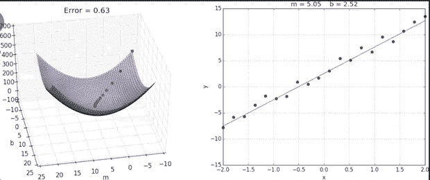
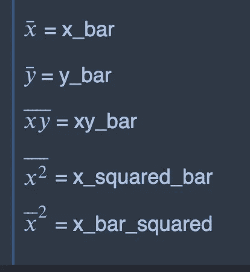
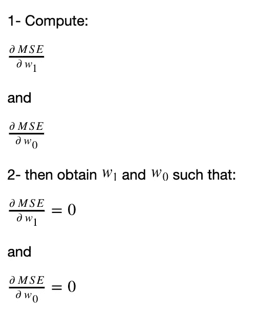
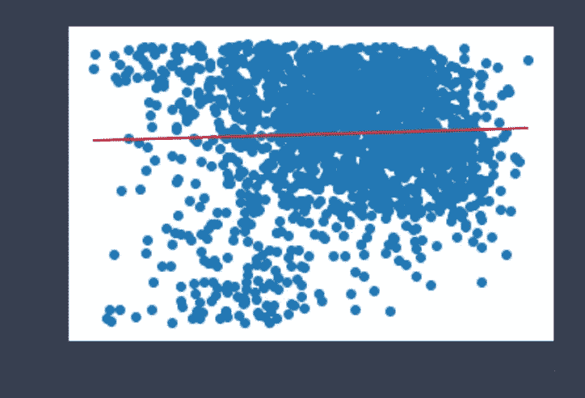

# 降序:Python 中线性回归的一种尝试

> 原文：<https://towardsdatascience.com/descending-a-shakedown-of-linear-regression-with-in-python-a9aec054c860?source=collection_archive---------86----------------------->

## 线性回归快速指南以及如何使用梯度下降在 Python 中实现它。


克里斯·利维拉尼在 [Unsplash](https://unsplash.com/s/photos/data?utm_source=unsplash&utm_medium=referral&utm_content=creditCopyText) 上的照片

*这个项目的所有示例代码都可以在* [*这里*](https://github.com/RobotGyal/linear-regression-example) 找到

在几乎每个人一生中的某个时刻，都有那么一刻，他们希望自己能预知未来。无论是通过使用臭名昭著的水晶球，还是通过在德洛里安跳跃到未来，未来仍然是一个不可能知道或预测的概念。

除非你从事数据科学。

使用原始数据并利用计算机科学和统计学创建模型的众多好处之一是，数据科学家可以根据现有数据和可观察到的趋势预测结果。

线性回归是一种技术，试图“通过将一个线性方程 T10 与观测数据 T11 拟合来模拟两个变量之间的关系”——耶鲁大学

这个线性方程给了我们一组数据点的最佳拟合线。使用这条线，既可以用肉眼看到，也可以作为其他预测模型的起点，我们能够以一定的准确度预测未来/增加的数据点。



随机散点图— Aleia Knight

取 1.0-10.0 之间的这组随机点，并将其绘制在散点图上。

有了这一组点，几乎立刻就能看出一个趋势。

正线性。

但是准确地知道直线的值，它的斜率和它的截距并不是仅仅通过查看原始图就可以得到的值。



最适合的系列——Aleia Knight

应用线性回归，我们可以看到最佳拟合的实际线。从这里，我们可以向前延伸线，并能够大致看到超过 10.0 和小于 1.0 的数据点可以预测到哪里。

足够简单，但数据很少会如此干净、简洁或直接。

如果我们使用像 [Spotify 歌曲属性数据集](https://www.kaggle.com/geomack/spotifyclassification)这样的数据，并从中绘制一些数据，会怎么样..


Spotify 数据:能量与可跳舞性——Aleia Knight

有许多模型和方法可以找出最适合无法直观解释的数据的线。

我们将使用线性回归的两种主要方法来寻找最佳拟合线。

1.  均方误差
2.  梯度下降

# 设置

总是从加载必要的导入并创建数据和变量开始

```
import pandas as pd     #For data handling
import matplotlib.pyplot as plt    #For data visualization
import numpy as np       #For calculationsdata = pd.read_csv('data.csv')  #Spotify data
x = data['danceability']
y = data['energy']
```

*展望未来，统计和微积分中有许多复杂的数学公式和技术。访问* [*偏导数简介*](https://mathinsight.org/partial_derivative_introduction) *和**[**线性回归**](https://ml-cheatsheet.readthedocs.io/en/latest/linear_regression.html) **n** *快速复习概念和公式。**

# ****使用渐变下降****

*这种技术可以被认为是一种优化的方法，通过寻找与理想值的最小误差来找到最佳拟合线。*

**

*giphy.com*

*这个过程的第一步是找到我们的最佳斜率和截距。也就是后来所知的“权重”，只要我们的 x 和 y 数据保持不变，这些值在这些计算中将保持不变。*

*为了计算斜率和截距，我们需要以下公式来计算权重的均方误差， **w1** 和 **w0。***

****

*公式— Aleia Knight*

*左侧图像显示了数学符号到相关变量的转换。右侧是用于计算***【w1(斜率)*** 和 ***w0(截距)*** 的公式。这个过程如果手工完成，需要深入的微积分知识，特别是解多变量方程，求偏导数。*

> ***查找资源:***
> 
> *[求解多变量方程](https://www.youtube.com/watch?v=qDe4RsEhmJc)*
> 
> *[寻找偏导数](https://www.youtube.com/watch?v=JAf_aSIJryg)*

*一旦我们找到 w1 和 w0 的值，我们就可以使用这些公式来求解 **w1** 和 **w0** 的实际值。*

*这是一个漫长的过程，但是有了 numpy 库，我们能够简化这个过程。*

*这将打印出语句(对于特定的示例)。*

```
*Slope is / Weight 1 : 0.05034768176424329
Intercept / Weight 2 is: 0.6504410345649969 

(0.05034768176424329, 0.6504410345649969)*
```

> *坚持这两个价值观！*

*理解`y_pred=w1*x+w0`的一个更简单的方法是把它想成更熟悉的形式`y=mx+b`。`y_pred`是基于我们之前找到的 **w1** 和 **w0** 的预测线。*

*绘制这条线，我们看到:*

**

*Spotify 数据:能量与可跳舞性——梯度下降——Aleia Knight*

*直觉上，这似乎有点奇怪，但当我们看聚类(另一种分析风格)时，这确实是有意义的，并且我们的数据似乎确实有较低的正趋势。*

*我们可以用均方差来分析这条线的有效性。*

# *均方误差*

*这个概念很简单，因为我们看到的是实际点和预测点之间的差异。*

```
*actual = 1
predicted = 3
error = 2*
```

*这是在所有数据点上完成的(求和)，除以点的数量(平均值)，并找到平方(平方)以消除任何负数。值 0 是不可能的，但是越接近零越好。这反映在代码中。*

*`MSE via my calculations is: 0.04412711932424555`*

*非常接近零，这太棒了！这告诉我们，误差值非常低，所以我们的线是相当准确的。*

*giphy.com*

*这种算法和许多其他算法一样，可以用于计算机科学、数据科学和技术涉及的任何领域。*

*正是通过使用这些能力，我们能够更快、更有效地处理数据，并利用它来帮助我们走向未来。*