# 下降法——最速下降法和共轭梯度法

> 原文：<https://towardsdatascience.com/descent-method-steepest-descent-and-conjugate-gradient-math-explained-78601d8df3ce?source=collection_archive---------16----------------------->

## 数学解释

 [## 下降法 Python 中的最速下降和共轭梯度

### 让我们从这个方程开始，我们想解出 x:

medium.com](https://medium.com/@msdata/descent-method-steepest-descent-and-conjugate-gradient-in-python-85aa4c4aac7b) 

让我们从这个方程开始，我们想解出 x:

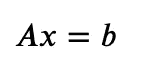

当 A 是**对称正定**时，解 x 最小化下面的函数(否则，x 可能是最大值)。这是因为 f(x)的梯度，∇f(x) = Ax- b .而当 Ax=b 时，∇f(x)=0 因而 x 是函数的最小值。

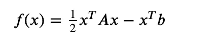

在这篇文章中，我将向你展示两种求 x 的方法——最速下降法和共轭梯度法。

# 最速下降法

下降法的主要思想是，我们从 x 的起点开始，试图找到下一个更接近解的点，迭代这个过程，直到找到最终解。

例如，在步骤 k，我们在点𝑥(𝑘).我们如何决定下一步去哪里？我们应该往哪个方向走？我们应该去多少？

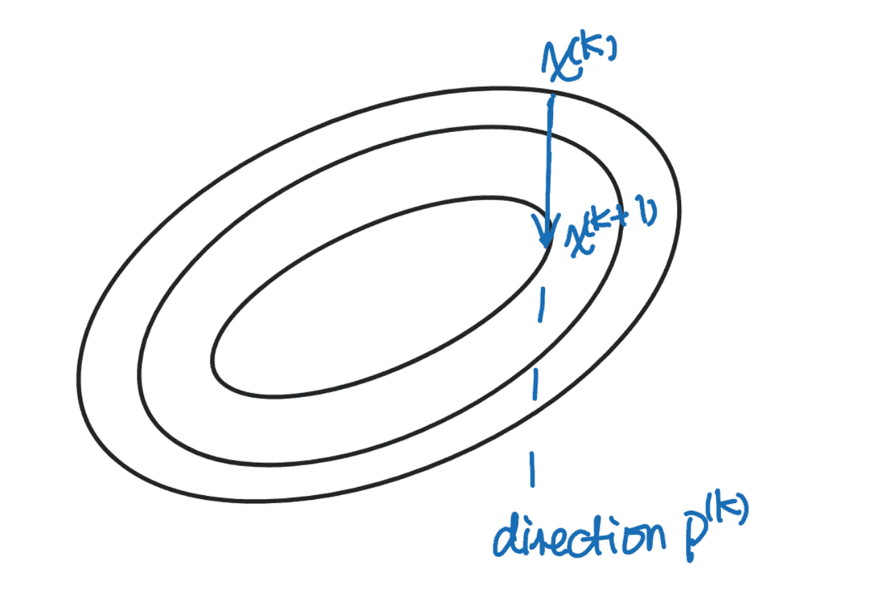

让我们假设我们决定去的方向是 p(k ),我们沿着这个方向走多远是𝛼.那么下一个数据点可以写成:

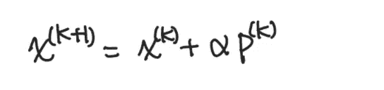

对于每一步，最速下降法都希望朝着最陡的斜坡下降，在那里最有效(这里 r 表示残差):

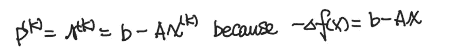

一旦我们决定了前进的方向，我们要确保在这个方向上最小化函数:

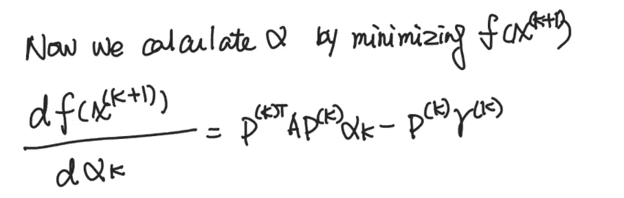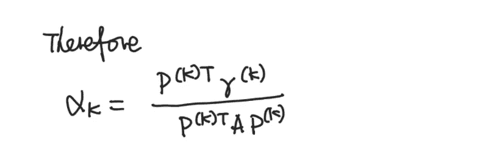

现在我们可以计算下一个数据点的 x 和残差:

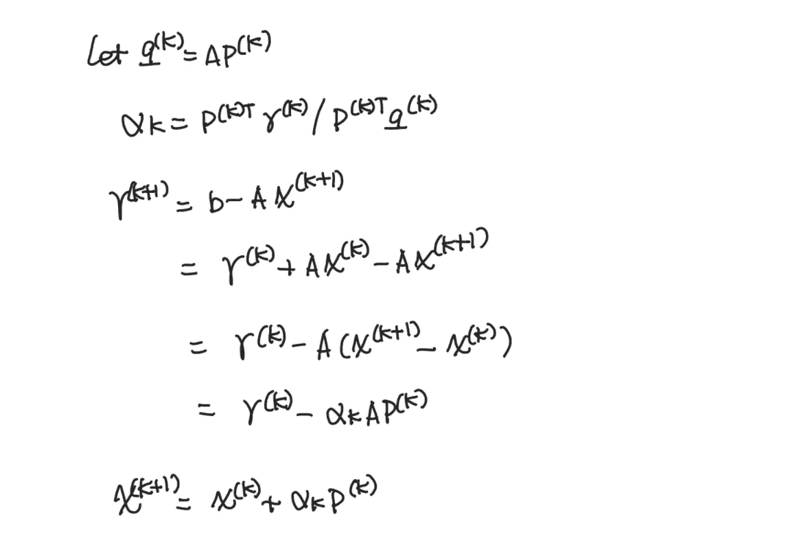

这基本上是最速下降法背后的数学原理。通常我们会给残差一个停止准则，然后我们迭代这个过程，直到到达停止点。

对于 Python 实现，请查看:

 [## 下降法 Python 中的最速下降和共轭梯度

### 让我们从这个方程开始，我们想解出 x:

medium.com](https://medium.com/@msdata/descent-method-steepest-descent-and-conjugate-gradient-in-python-85aa4c4aac7b) 

# 共轭梯度法

最速下降法是伟大的，我们在每一步的方向上最小化函数。但这并不能保证，我们要最小化的方向，来自于所有之前的方向。这里我们引入一个非常重要的术语共轭方向。方向 p 是共轭方向，如果它们具有下列性质(注 A 是对称正定的):

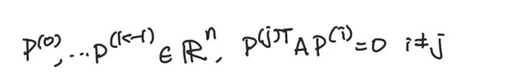

只有当前方向 p 与所有先前方向共轭时，下一个数据点才会在所有先前方向的跨度内最小化函数。

问题是，当 p 必须是共轭时，我们如何计算搜索方向 p？

记住最陡下降选择了最陡斜率，也就是每步的残差(r)。我们知道这是一个好的选择。不如我们找一个最接近最陡下降方向的 A 共轭方向，也就是说，我们最小化向量(r-p)的 2 范数。

通过计算，我们知道当前方向是当前残差和上一个方向的组合。

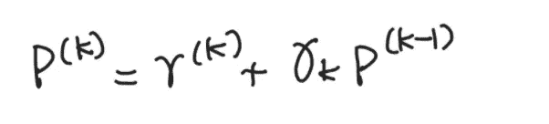

因为α-共轭方向的性质:

然后我们可以计算𝛾_𝑘:

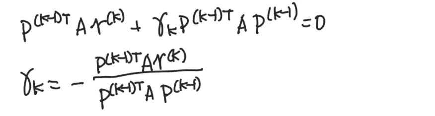

总之，共轭梯度法如下:

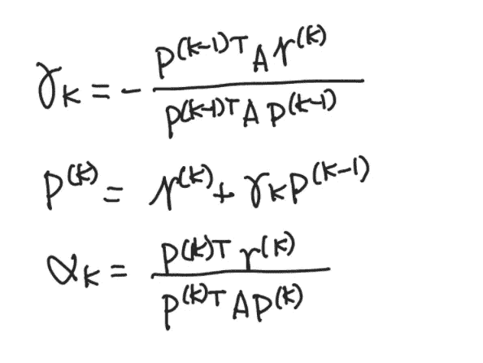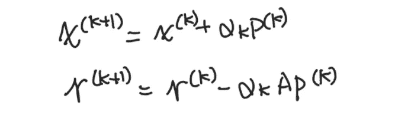

同样，对于 Python 实现，请查看:

 [## 下降法 Python 中的最速下降和共轭梯度

### 让我们从这个方程开始，我们想解出 x:

medium.com](https://medium.com/@msdata/descent-method-steepest-descent-and-conjugate-gradient-in-python-85aa4c4aac7b) 

现在你知道如何用最速下降法和共轭梯度法解线性方程组了！尽情享受吧！

参考:

 [## ALAFF 技术细节

### 这一单元可能是这门课程中技术难度最大的单元。为了完整起见，我们在这里给出了细节，但是…

www.cs.utexas.edu](https://www.cs.utexas.edu/users/flame/laff/alaff/chapter08-important-observations.html)