# 手工描述性统计

> 原文：<https://towardsdatascience.com/descriptive-statistics-by-hand-a055d299c34?source=collection_archive---------31----------------------->

照片由 [Pop &斑马](https://unsplash.com/@popnzebra?utm_source=medium&utm_medium=referral)拍摄

# 介绍

T 他的文章解释了如何手工计算主要的描述性统计数据以及如何解释它们。要了解如何在 R 中计算这些度量，请阅读文章“[R](https://www.statsandr.com/blog/descriptive-statistics-in-r/)中的描述性统计”。

描述统计学(广义上)是统计学的一个分支，旨在总结、描述和呈现一系列数值或数据集。由于难以识别数据中的任何模式，没有任何准备或没有任何汇总措施的长系列值通常不能提供信息。下面是一个 100 个成年人的身高(单位为厘米)的例子:

*188.7* 、 *169.4* 、 *178.6* 、 *181.3* 、 *179* 、 *173.9* 、 *171.9* 、 *157.2* 、 *173.3* 、 *187.1* 、 *194* 、*、*170.7 *177.1* 、 *171.4* 、 *182.6* 、 *167.7* 、 *161.3* 、 *179.3* ，， *171.3* 、 *176.9* 、 *180.8* 、 *189* 、 *167.7* 、*188【、* 【t160.1】、*【t1163.6】、*、【165】、*、【167】、【t168.1】【t1169.1】、【t170.1】【、【t176.0】***

面对这一系列，任何人都很难(甚至不可能)理解这些数据，并在合理的时间内对这些成年人的规模有一个清晰的看法。描述性统计允许进行总结，从而对数据有更好的了解。当然，通过一项或几项措施汇总数据，难免会丢失一些信息。然而，在许多情况下，丢失一些信息通常更好，但反过来获得一个概述。

描述性统计通常是任何统计分析的第一步，也是重要的一部分。它允许通过检测潜在的异常值(即看起来与其余数据分离的数据点)、收集或编码错误来检查数据质量。它也有助于“理解”数据，如果描述性统计数据表现良好，它已经是进一步分析的良好起点。

# 位置与离差度量

几种不同的方法(如果我们正在分析一个样本，称为统计)被用来总结数据。其中一些给出了关于数据位置的理解，另一些给出了关于数据分散的理解。在实践中，为了以最简洁但完整的方式总结数据，这两种类型的衡量标准经常一起使用。我们用下面的图来说明这一点，图中代表了分成两组(每组 50 人)的 100 个人的身高(以厘米为单位):

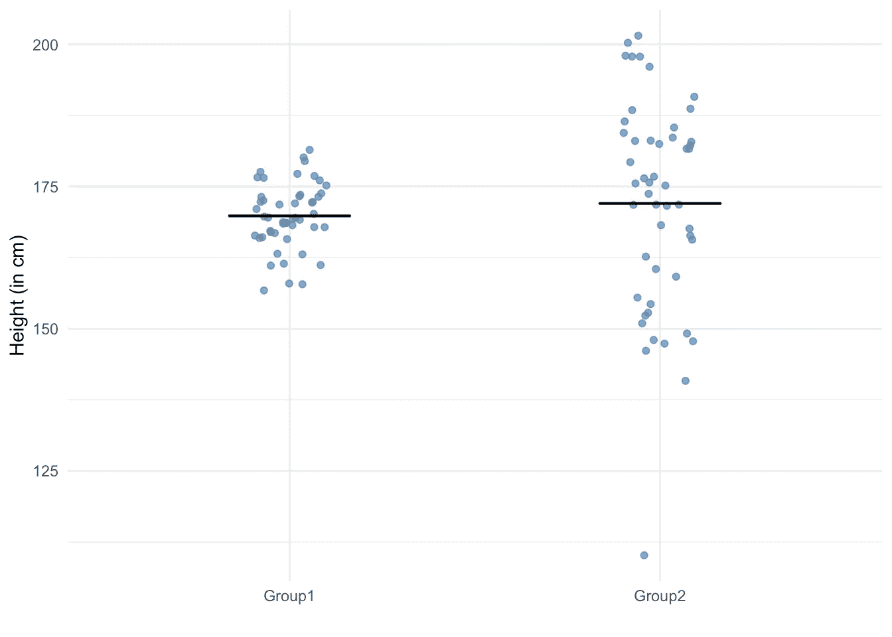

黑线对应的是平均值。两组的平均身高(厘米)相似。然而，很明显，这两个组的高度离散度非常不同。因此，如果单独呈现位置或分散测量，通常是不够的，呈现两种类型测量的多个统计数据是一种好的做法。

在接下来的章节中，我们将详细介绍最常见的位置和离差测量，并举例说明。

# 位置

位置测量允许查看数据的“位置”和周围的值。换句话说，位置测量给出了对什么是中心趋势，即数据作为一个整体的“位置”的理解。它包括以下统计数据(其他数据也存在，但我们只关注最常见的数据):

*   最低限度
*   最高的
*   意思是
*   中位数
*   第一四分位数
*   第三个四分位数
*   方式

在接下来的章节中，我们将详细介绍并手动计算它们。

# 最小值和最大值

最小值(min)和最大值(max)分别是最小值和最大值。给定 6 个成人样本的身高(以厘米为单位):

*188.7* 、 *169.4* 、 *178.6* 、 *181.3* 、 *179* 和 *173.9*

最小 169.4 cm，最大 188.7 cm。这两个基本统计数据清楚地显示了这 6 个成年人的最小和最高的尺寸。

# 平均

均值，也称为平均值，可能是最常见的统计数据。它给出了平均值的概念，即数据的中心值，或者说重心。通过将所有值相加并将该和除以观察次数(表示为 nn)来得到平均值:

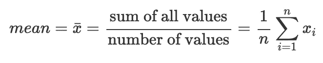

下面是平均值的直观表示:

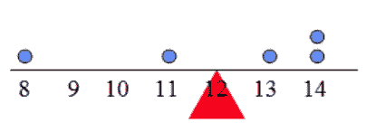

卑鄙。资料来源:加州大学卢万分校 LFSAB1105

给定上述 6 名成人样本，平均值为:

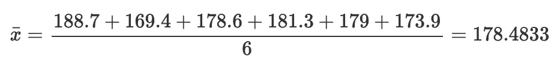

总之，平均尺寸，即 6 名成人样本的平均尺寸为 178.48 厘米(四舍五入到小数点后两位)。

# 中位数

中位数是位置的另一种度量，因此它也给出了关于数据集中趋势的想法。对中位数的解释是，中位数以下的观察值与中位数以上的一样多。换句话说，50%的观察值低于中位数，50%的观察值高于中位数。中间值的直观表示如下:

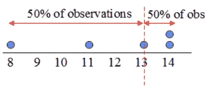

中位数。资料来源:加州大学卢万分校 LFSAB1105

计算中值的最简单方法是首先将数据从最低到最高排序(即按升序)，然后取中间点作为中值。从排序后的值中，对于奇数个观察值，中间点很容易找到:它是下面的观察值与上面的一样多的值。仍然从排序的值来看，对于偶数个观察值，中点正好在两个中间值之间。形式上，排序后，中位数是:

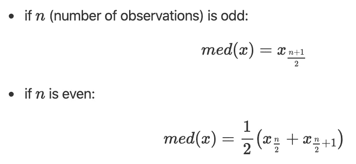

其中 x 的下标表示排序数据的编号。公式看起来比实际要难，所以让我们看两个具体的例子。

# 奇数个观察值

给定从引言中呈现的 100 个成人中选取的 7 个成人的样本的身高:

*188.9* 、 *163.9* 、 *166.4* 、 *163.7* 、 *160.4* 、 *175.8* 和 *181.5*

我们首先从低到高排序:

*160.4* ， *163.7* ， *163.9* ， *166.4* ， *175.8* ， *181.5* 和 *188.9*

假设观察数 nn 为奇数(因为 n=7)，中值为

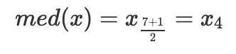

所以我们从排序后的值中取第四个值，对应于 166.4。总之，这 7 个成年人的平均尺寸是 166.4 厘米。可以看到，166.4 以下有 3 个观测值，166.4 cm 以上有 3 个观测值。

# 偶数个观察值

现在让我们来看看观察次数为偶数时的情况，这比观察次数为奇数时的情况稍微复杂一些。给定 6 个成人样本的身高:

*188.7* 、 *169.4* 、 *178.6* 、 *181.3* 、 *179* 和 *173.9*

我们按升序对值进行排序:

*169.4* 、 *173.9* 、 *178.6* 、 *179* 、 *181.3* 和 *188.7*

假设观察数量 nn 为偶数(因为 n=6)，则中位数为

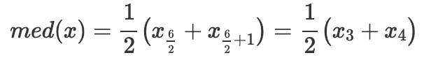

因此，我们将排序后的值中的第三个和第四个值相加，并将这个和除以 2(这相当于取这两个中间值的平均值):

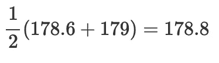

总之，这 6 个成年人的平均尺寸是 178.8 厘米。再次注意，下面的观察值与上面的 178.8 厘米一样多。

# 平均值与中值

虽然平均值和中间值经常彼此相对接近，但是它们不应该混淆，因为它们在不同的环境中都有优点和缺点。除了几乎每个人都知道(或至少听说过)平均值这一事实之外，它还有一个优点，即它为每个不同的数据系列提供了一个独特的图像。然而，它的缺点是均值对异常值(即极值)敏感。另一方面，中位数的优势在于它可以抵抗异常值，而不方便的是，对于非常不同的数据系列，它可能是完全相同的值(因此对于数据来说不是唯一的)。

为了说明“对局外人来说是明智的”这个论点，考虑一下酒吧里的三个朋友比较他们的工资。他们的工资分别为 *1800* 、 *2000* 和 *2100* €，平均工资为 *1967* €。他们的一个朋友(碰巧也是比尔·盖茨的朋友)加入了他们的酒吧。他们现在的工资分别是 *1800* 、 *2000* 、 *2100* 和 *1000000* €。这四个朋友的平均工资现在是 251475€，相比之下，1967 年没有这位富有朋友的€的平均工资是 30。虽然说这四个朋友的平均工资是 *251475* €在统计学上是正确的，但是你会承认这个标准并不能代表这四个朋友的真实工资，因为他们中的三个挣得比平均工资少得多。正如我们刚刚看到的，平均值对异常值是敏感的。另一方面，如果我们报告中位数，我们看到 3 个第一朋友的中位数工资是 *2000* €，4 个朋友的中位数工资是 *2050* €。正如您在本例中看到的，中位数对异常值不敏感，对于具有这种极值的系列，中位数比平均值更合适，因为它通常能更好地表示数据。(*注:*这个例子也说明了绝大多数人的收入是如何低于新闻报道的平均工资的。然而，这超出了本文的范围。)

给定前面的例子，然后可以选择总是使用中间值而不是平均值。然而，中位数有它自己的不便之处，而这是平均数所没有的:与平均数相比，中位数不那么独特，也不那么具体。考虑以下数据，代表参加统计和经济学考试的 5 名学生的成绩:

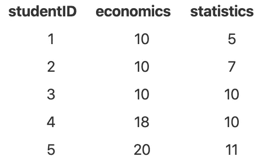

经济学和统计学的成绩中位数是一样的(中位数= *10* )。因此，如果我们只计算中位数，我们可以得出结论，学生在经济学和统计学方面表现一样好。然而，尽管两个班级的中位数完全相同，但很明显，学生在经济学方面的表现要比统计学好。事实上，经济学的平均成绩是 *13.6* ，统计学的平均成绩是 *8.6* 。我们刚刚在这里展示的是，中位数仅基于一个单一值，即中间值，或者如果有偶数个观察值，则基于两个中间值，而平均值基于所有值(因此包含更多信息)。因此，中值对于异常值是不敏感的，但是对于不同的数据系列，它也不是唯一的(即，不特定的)，而对于不同的数据系列，平均值更可能是不同的和唯一的。这两种测量之间在特异性和唯一性方面的差异可能使平均值对没有异常值的数据更有用。

总之，根据上下文和数据，报告平均值或中值，或者两者都报告通常更有意思。关于两个最重要的位置测量值之间的比较，最后一点需要注意的是，当平均值和中值相等时，数据的分布通常可被视为遵循正态分布(也称为高斯分布)。

# 第一和第三四分位数

第一个和第三个四分位数在某种意义上类似于中位数，它们也将观察值分为两部分，只是这两部分不相等。提醒一下，中位数是把数据分成相等的两部分(50%的观测值在中位数以下，50%在中位数以上)。第一个四分位数对观测值进行分割，使得在第一个四分位数的下方有 25%的观测值**，而在**上方有 75%的观测值**。第三个四分位数，正如你现在已经猜到的，代表 75%的观察值在它下面，因此 25%的观察值在它上面。有几种方法可以计算第一个和第三个四分位数(有时会有细微的差别，例如 R 使用了不同的方法)，但我认为手动计算这些统计数据时最简单的方法是:**

1.  按升序对数据进行排序
2.  计算 0.25⋅n 和 0.75⋅n(即观察次数的 0.25 和 0.75 倍)
3.  将这两个数字四舍五入到下一个整数
4.  这两个数字分别代表第一个和第三个四分位数的等级(在已排序的序列中)

奇数和偶数观测值的步骤相同。以下是以下系列的一个示例，代表 9 个成年人的身高(以厘米为单位):

*170.2* ， *181.5* ， *188.9* ， *163.9* ， *166.4* ， *163.7* ， *160.4* ， *175.8* 和 *181.5*

我们先从最低到最高排序:

*160.4* ， *163.7* ， *163.9* ， *166.4* ， *170.2* ， *175.8* ， *181.5* ， *181.5* 和 *188.9*

有 9 个观察值，所以

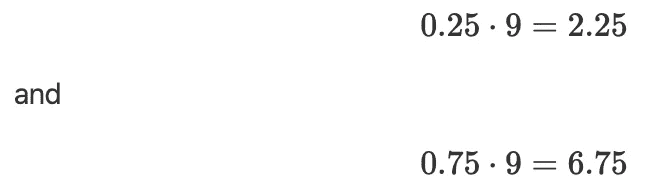

向上取整得到 3 和 7，分别代表第一个和第三个四分位数的等级。因此，第一个四分位数是 163.9 厘米，第三个四分位数是 181.5 厘米。

总之，25%的成年人身高低于 163.9 厘米(因此他们中的 75%高于 163.9 厘米)，而 75%的成年人身高低于 181.5 厘米(因此他们中的 25%高于 181.5 厘米)。

# q0.25、q0.75 和 q0.5

请注意，第一个四分位数表示为 q0.25，第三个四分位数表示为 q0.75(其中 q 代表四分位数)。如您所见，中位数实际上是第二个四分位数，因此有时也表示为 q0.5。

# 关于十分位数和百分位数的注记

十分位数和百分位数类似于四分位数，只是它们将数据分成 10 和 100 等份。例如，第四个十分位数(q0.4)是这样一个值，它下面有 40%的观察值，因此上面有 60%的观察值。此外，第 98 百分位(q0.98，有时也表示为 P98)是这样的值，即有 98%的观察值低于它，因此有 2%的观察值高于它。百分位数通常用于婴儿的体重和身高，为父母提供关于他们的孩子与同年龄的其他孩子相比的准确信息。

# 方式

数列的众数是最常出现的数值。换句话说，它是出现次数最多的值。考虑到 9 个成年人的身高:

*170* ， *168* ， *171* ， *170* ， *182* ， *165* ， *170* ， *189* 和 *167*

模式为 170，因为它是最常见的值，出现 3 次。所有其他值只出现一次。总之，这个样本的大多数成年人身高都是 170 cm。请注意，一个系列可能没有模式(例如， *4* 、 *7* 、 *2* 和 *10* )或一个以上的模式(例如， *4* 、 *2* 、 *2* 、 *8* 、 *11* 和 *11* )。

具有两种模式的数据通常被称为双峰数据，具有两种以上模式的数据通常被称为多峰数据，这与具有一种模式的序列被称为单峰数据相反。

# 定性变量模式

与一些只能计算定量变量(例如平均值)的描述性统计不同，可以计算定量**和**定性变量的模式(如果您不记得区别，请参见不同类型变量[和](https://statsandr.com/blog/variable-types-and-examples/)的概述)。

给定上述 9 名成人的眼睛颜色:

*棕色*，*棕色*，*棕色*，*棕色*，*蓝色*，*蓝色*，*蓝色*，*棕色*和*绿色*

众数是棕色的，所以这个样本的大部分成年人眼睛都是棕色的。

# 散布

所有以前的描述性统计有助于了解数据的位置和方位。我们现在介绍最常见的离差度量，这有助于了解数据的离差和可变性(分布被压缩或拉伸的程度):

*   范围
*   标准偏差
*   差异
*   四分位差
*   变异系数

至于位置测量，我们逐个手工详细计算这些统计数据。

# 范围

范围是最大值和最小值之间的差值:

范围=最大最小

给定我们的 6 名成人样本的身高(厘米):

*188.7* 、 *169.4* 、 *178.6* 、 *181.3* 、 *179* 和 *173.9*

范围是 188.7-169.4 = 19.3 厘米。该范围的优点是计算起来非常容易，并且它给出了数据中可能值的精确概念。缺点是它只依赖于两个最极端的值。

# 标准偏差

标准差是统计学中最常见的离差度量。像位置测量的平均值一样，如果我们必须给出一个统计量来概括数据的分布，它通常是标准差。顾名思义，标准差告诉我们什么是数据的“正常”偏差。它实际上是计算与平均值的平均偏差。标准差越大，数据越分散。相反，标准差越小，数据越集中在平均值附近。下面是标准差的直观表示:

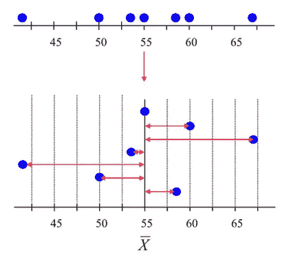

标准差。资料来源:加州大学卢万分校 LFSAB1105

标准差比之前的统计数据要复杂一些，因为有两个公式取决于我们面对的是样本还是总体。总体包括来自特定组的所有成员、所有可能的结果或感兴趣的度量。样本由从总体中抽取的一些观察值组成，即总体的一部分或子集。例如，人口可能是“**所有**居住在比利时的人”，样本可能是“**一些**居住在比利时的人”。如果你想了解更多，请阅读这篇关于[总体和样本的差异](https://www.statsandr.com/blog/what-is-the-difference-between-population-and-sample/)的文章。

# 总体的标准偏差

总体的标准差，用σ表示，为:

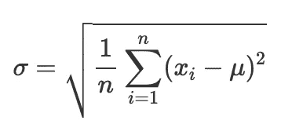

从公式中可以看出，标准差实际上是数据与其均值μμ的平均偏差。注意观察值和平均值之间的差的平方，以避免负差被正差补偿。

为了简单起见，假设一个只有 3 个成年人的群体(步骤与大群体相同，只是计算时间更长)。低于他们的身高(厘米):

*160.4* 、 *175.8* 和 *181.5*

平均值为 172.6(四舍五入到 1 位小数)。因此，标准偏差为:

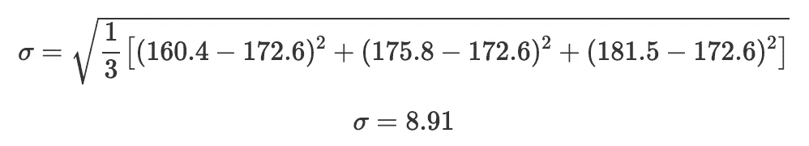

总之，这三个成年人身高的标准偏差是 8.91 厘米。这意味着，平均而言，该人群中成年人的身高偏离平均值 8.91 厘米。

# 样本的标准偏差

样本的标准差类似于总体的标准差，只是我们用 n1n 1 而不是 nn 来除，用 s 表示:

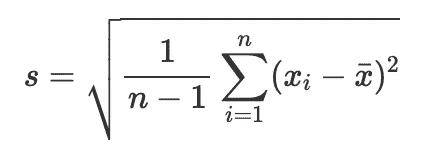

现在想象一下，上一节中出现的 3 个成年人是一个样本，而不是一个群体:

*160.4* 、 *175.8* 和 *181.5*

平均值仍然是 172.6(四舍五入到 1 位小数)，因为无论是总体还是样本，平均值都是一样的。标准偏差现在是:

总之，这三个成年人身高的标准偏差是 10.92 厘米。对人口的解释是一样的。

# 差异

方差就是标准差的平方。换句话说，标准差是方差的平方根。我们也区分总体和样本的方差。

# 总体方差

用σ^2 表示的总体方差为:

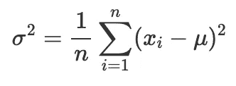

如您所见，方差公式与标准差公式相同，只是方差的平方根被去掉了。记住我们三个成年人的身高:

*160.4* 、 *175.8* 和 *181.5*

标准偏差是 8.91 厘米，所以这些成年人身高的方差是 8.91^2 = 79.39 cm^2(见下文为什么方差的单位是 unit^2).

# 样本的方差

同样，样本的方差类似于总体的方差，只是我们除以 n1 而不是 n，它表示为 s^2:

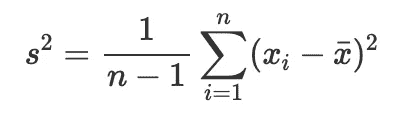

再次假设上一节中的 3 个成年人是一个样本，而不是一个群体:

*160.4* 、 *175.8* 和 *181.5*

该样本的标准偏差为 10.92 厘米，因此这些成人身高的方差为 119.14 cm^2.

# 标准差与方差

标准差和方差通常可以互换使用，它们都通过测量观察值与平均值的距离来量化给定数据集的分布。但是，标准差可以更容易地解释，因为标准差的单位与数据的测量单位相同(虽然它是方差的 unit^2)。按照我们以厘米为单位的成人身高示例，标准偏差以厘米为单位测量，而方差以 cm^2.为单位测量事实上，标准偏差与初始测量单位保持相同的单位，这使得它更容易解释，因此在实践中更常用。

# 记号

为完整起见，在下表中显示了总体和样本的方差和标准差的不同符号:

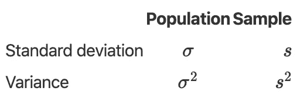

# 四分位间距

还记得前面提出的第一个 q0.25 和第三个四分位数 q0.75 吗？四分位距是使用四分位来衡量数据离差的另一种方法。这是第三个四分位数和第一个四分位数之间的差异:

IQR = q 0.75 q 0.25

考虑到第一个和第三个四分位数部分给出的 9 名成人的身高:

*170.2* ， *181.5* ， *188.9* ， *163.9* ， *166.4* ， *163.7* ， *160.4* ， *175.8* 和 *181.5*

第一个四分位数为 163.9 厘米，第三个四分位数为 181.5 厘米。IQR 是这样的:

IQR = 181.5-163.9 = 17.6

总之，四分位距是 17.6 厘米。四分位范围实际上是中间数据的范围(因为它是较高值和较低值之间的差值)。下图可能有助于更好地理解 IQR 和四分位数:

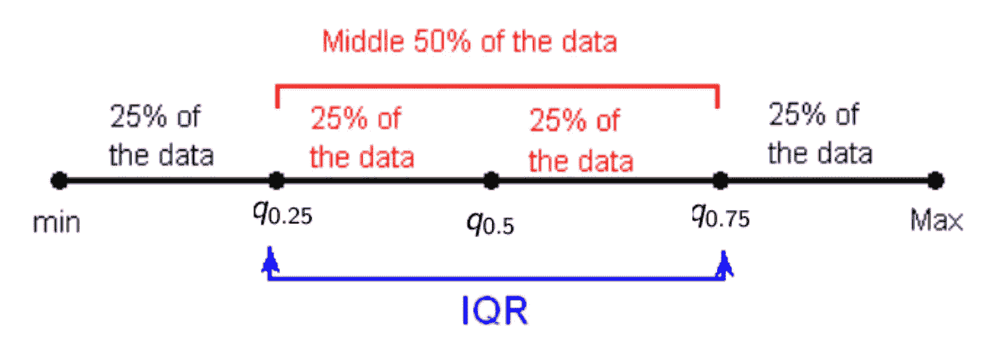

IQR，第一和第三季度。资料来源:加州大学卢万分校 LFSAB1105

# 变异系数

最后一个离差度量是变异系数。变异系数表示为 CV，是标准偏差除以平均值。形式上:

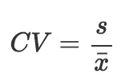

考虑 4 个成人样本的身高:

*163.7* 、 *160.4* 、 *175.8* 和 *181.5*

平均值为 170.35 厘米，标准偏差为 9.95 厘米。(找到相同的价值观作为练习！)变异系数为

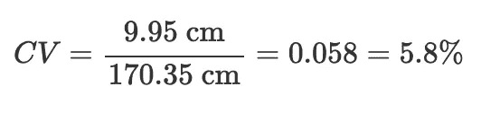

综上，变异系数为 5.8%。注意，根据经验，变异系数大于 15%通常意味着数据是异质的，而变异系数等于或小于 15%意味着数据是同质的。假设在这种情况下变异系数等于 5.8%，我们可以得出结论，这 4 个成年人在身高方面是同质的。

# 变异系数与标准偏差

虽然变异系数不为公众所知，但事实上，在进行描述性统计时，它是值得提出的。

标准偏差应始终在数据平均值的背景下理解，并取决于其单位。标准偏差的优点是，它可以告诉我们平均数据与测量数据的单位平均值相差多远。当考虑具有相同单位和近似相同平均值的变量时，标准差是有用的。然而，当用不同的单位或相差很大的平均值来比较变量时，标准差就没那么有用了。例如，一个标准偏差为 10 厘米的变量不能与一个标准偏差为 10€的变量进行比较，从而得出哪一个变量最分散的结论。

变异系数是具有相同单位的两个统计值的比率。因此，它没有单位，与测量数据的单位无关。由于是无单位的，所以可以比较对具有不同单位或差异很大的平均值的数据集或变量计算的变异系数，以最终得出哪个数据或变量更分散(或更不分散)的结论。例如，考虑 10 名女性的样本，她们的身高为厘米，工资在€。身高和工资的变异系数分别为 0.032 和 0.061。我们可以得出结论，相对于她们各自的平均值，这些女性的工资变化大于身高变化(因为工资的变异系数大于身高的变异系数)。

这就结束了一篇比较长的文章，感谢阅读！我希望这篇文章能帮助你理解和手工计算不同的描述性统计。如果您想了解如何在 R 中计算这些度量，请阅读文章“[R](https://www.statsandr.com/blog/descriptive-statistics-in-r/)中的描述性统计”。

和往常一样，如果您有与本文主题相关的问题或建议，请将其添加为评论，以便其他读者可以从讨论中受益。

**相关文章:**

*   [我的数据服从正态分布吗？关于最广泛使用的分布以及如何检验 R 中的正态性的注释](https://www.statsandr.com/blog/do-my-data-follow-a-normal-distribution-a-note-on-the-most-widely-used-distribution-and-how-to-test-for-normality-in-r/)
*   [手工卡方独立性检验](https://www.statsandr.com/blog/chi-square-test-of-independence-by-hand/)
*   [R 中的描述性统计](https://www.statsandr.com/blog/descriptive-statistics-in-r/)
*   [总体和样本有什么区别？](https://www.statsandr.com/blog/what-is-the-difference-between-population-and-sample/)
*   [一个闪亮的手工推断统计应用](https://www.statsandr.com/blog/a-shiny-app-for-inferential-statistics-by-hand/)

*原载于 2020 年 1 月 18 日 https://statsandr.com***。**