# R 中的描述统计

> 原文：<https://towardsdatascience.com/descriptive-statistics-in-r-8e1cad20bf3a?source=collection_archive---------7----------------------->

## 本文解释了如何计算 R 中的主要描述性统计数据，以及如何以图形方式呈现它们。


照片由[鲁特森·齐默曼](https://unsplash.com/@ruthson_zimmerman?utm_source=medium&utm_medium=referral)拍摄

# 介绍

这篇文章解释了如何计算 R 中的主要描述性统计数据，以及如何用图表的方式展示它们。要了解每个描述性统计背后的推理，如何手工计算它们以及如何解释它们，请阅读文章“[手工描述性统计](https://www.statsandr.com/blog/descriptive-statistics-by-hand/)”。

简要回顾一下那篇文章中所说的内容，描述统计学(广义上的)是统计学的一个分支，旨在总结、描述和呈现一系列值或数据集。描述性统计通常是任何统计分析的第一步和重要部分。它允许检查数据的质量，并有助于通过对数据有一个清晰的概述来“理解”数据。如果表述得好，描述性统计已经是进一步分析的良好起点。有许多方法可以总结一个数据集。它们分为两种类型:

1.  位置测量和
2.  分散测量

位置测量提供了对数据集中趋势的理解，而分散测量提供了对数据扩散的理解。在本文中，我们只关注 R 中最常见的描述性统计及其可视化的实现(如果认为合适的话)。有关每项措施的目的和用法的更多信息，请参见在线或上述文章中的[。](https://www.statsandr.com/blog/descriptive-statistics-by-hand/)

# 数据

我们在整篇文章中使用数据集`iris`。这个数据集在 R 中是默认导入的，你只需要通过运行`iris`来加载它:

```
dat <- iris # load the iris dataset and renamed it dat
```

下面是该数据集及其结构的预览:

```
head(dat) # first 6 observations##   Sepal.Length Sepal.Width Petal.Length Petal.Width Species
## 1          5.1         3.5          1.4         0.2  setosa
## 2          4.9         3.0          1.4         0.2  setosa
## 3          4.7         3.2          1.3         0.2  setosa
## 4          4.6         3.1          1.5         0.2  setosa
## 5          5.0         3.6          1.4         0.2  setosa
## 6          5.4         3.9          1.7         0.4  setosastr(dat) # structure of dataset## 'data.frame':    150 obs. of  5 variables:
##  $ Sepal.Length: num  5.1 4.9 4.7 4.6 5 5.4 4.6 5 4.4 4.9 ...
##  $ Sepal.Width : num  3.5 3 3.2 3.1 3.6 3.9 3.4 3.4 2.9 3.1 ...
##  $ Petal.Length: num  1.4 1.4 1.3 1.5 1.4 1.7 1.4 1.5 1.4 1.5 ...
##  $ Petal.Width : num  0.2 0.2 0.2 0.2 0.2 0.4 0.3 0.2 0.2 0.1 ...
##  $ Species     : Factor w/ 3 levels "setosa","versicolor",..: 1 1 1 1 1 1 1 1 1 1 ...
```

该数据集包含 150 个观察值和 5 个变量，代表萼片和花瓣的长度和宽度以及 150 种花的种类。萼片和花瓣的长度和宽度是数值变量，物种是一个有 3 个水平的因子(在变量名称后用`num`和`Factor w/ 3 levels`表示)。如果需要刷新，请参见 R 中的[不同变量类型。](https://www.statsandr.com/blog/data-types-in-r)

关于图，我们给出了默认的图和著名的`{ggplot2}`包中的图。来自`{ggplot2}`包的图形通常具有更好的外观，但是它需要更高级的编码技能(参见文章“[R 中的图形与 ggplot2](https://www.statsandr.com/blog/graphics-in-r-with-ggplot2/) ”以了解更多信息)。如果你需要发布或分享你的图表，我建议如果可以的话使用`{ggplot2}`，否则默认的图表就可以了。

**提示:我最近从** `**{esquisse}**` **插件中发现了 ggplot2 构建器。看看你如何从** `[**{ggplot2}**](https://www.statsandr.com/blog/rstudio-addins-or-how-to-make-your-coding-life-easier/)` [**包**](https://www.statsandr.com/blog/rstudio-addins-or-how-to-make-your-coding-life-easier/) **中轻松地** [**画出图形，而不必自己编码。**](https://www.statsandr.com/blog/rstudio-addins-or-how-to-make-your-coding-life-easier/)

本文中显示的所有图都可以定制。例如，可以编辑标题、x 和 y 轴标签、颜色等。然而，定制图超出了本文的范围，所以所有的图都没有任何定制。感兴趣的读者可以在网上找到大量的资源。

# 最小值和最大值

通过`min()`和`max()`功能可以找到最小值和最大值:

```
min(dat$Sepal.Length)## [1] 4.3max(dat$Sepal.Length)## [1] 7.9
```

或者是`range()`功能:

```
rng <- range(dat$Sepal.Length)
rng## [1] 4.3 7.9
```

直接给出最小值和最大值。注意，`range()`函数的输出实际上是一个包含最小值和最大值的对象(按照这个顺序)。这意味着您实际上可以通过以下方式获得最小值:

```
rng[1] # rng = name of the object specified above## [1] 4.3
```

最大值为:

```
rng[2]## [1] 7.9
```

这提醒我们，在 R 中，通常有几种方法可以达到相同的结果。使用最短代码段的方法通常是首选，因为较短的代码段不容易出现编码错误，并且可读性更好。

# 范围

正如您所猜测的，通过从最大值中减去最小值，可以很容易地计算出范围:

```
max(dat$Sepal.Length) - min(dat$Sepal.Length)## [1] 3.6
```

据我所知，没有默认的函数来计算范围。但是，如果您熟悉用 R 编写函数，您可以创建自己的函数来计算范围:

```
range2 <- function(x) {
  range <- max(x) - min(x)
  return(range)
}range2(dat$Sepal.Length)## [1] 3.6
```

这相当于上面给出的最大最小值。

# 平均

平均值可以用`mean()`函数计算:

```
mean(dat$Sepal.Length)## [1] 5.843333
```

*温馨提示:*

*   如果数据集中至少有一个缺失值，使用`mean(dat$Sepal.Length, na.rm = TRUE)`计算排除 NA 后的平均值。该参数可用于本文中介绍的大多数函数，而不仅仅是平均值
*   对于截断的平均值，使用`mean(dat$Sepal.Length, trim = 0.10)`并根据您的需要更改`trim`参数

# 中位数

通过`median()`函数可以计算出中值:

```
median(dat$Sepal.Length)## [1] 5.8
```

或者使用`quantile()`功能:

```
quantile(dat$Sepal.Length, 0.5)## 50% 
## 5.8
```

因为 0.5 阶的分位数(q0.5)对应于中值。

# 第一和第三四分位数

由于使用了`quantile()`函数，并通过将第二个参数设置为 0.25 或 0.75，可以计算出第一个和第三个四分位数的中值:

```
quantile(dat$Sepal.Length, 0.25) # first quartile## 25% 
## 5.1quantile(dat$Sepal.Length, 0.75) # third quartile## 75% 
## 6.4
```

您可能已经看到，上面的结果与您手工计算第一个和第三个四分位数[的结果略有不同。这是正常的，有许多方法来计算它们(R 实际上有 7 种方法来计算分位数！).然而，这里和文章“](https://www.statsandr.com/blog/descriptive-statistics-by-hand/)[手工描述性统计](https://www.statsandr.com/blog/descriptive-statistics-by-hand/)”中介绍的方法是最简单和最“标准”的方法。此外，两种方法之间的结果没有显著变化。

# 其他分位数

正如您已经猜到的，任何分位数也可以用`quantile()`函数来计算。例如，第四个十分位数或第 98 个百分位数:

```
quantile(dat$Sepal.Length, 0.4) # 4th decile## 40% 
## 5.6quantile(dat$Sepal.Length, 0.98) # 98th percentile## 98% 
## 7.7
```

# 四分位间距

四分位数间距(即第一个四分位数和第三个四分位数之间的差值)可以用`IQR()`函数计算:

```
IQR(dat$Sepal.Length)## [1] 1.3
```

或者再次使用`quantile()`功能:

```
quantile(dat$Sepal.Length, 0.75) - quantile(dat$Sepal.Length, 0.25)## 75% 
## 1.3
```

如前所述，如果可能的话，通常建议使用最短的代码来获得结果。因此，最好使用`IQR()`函数来计算四分位数范围。

# 标准偏差和方差

使用`sd()`和`var()`函数计算标准偏差和方差:

```
sd(dat$Sepal.Length) # standard deviation## [1] 0.8280661var(dat$Sepal.Length) # variance## [1] 0.6856935
```

请记住文章[手动描述性统计](https://www.statsandr.com/blog/descriptive-statistics-by-hand/)中的内容，无论是计算样本还是总体，标准差和方差都是不同的(参见[样本和总体之间的差异](https://www.statsandr.com/blog/what-is-the-difference-between-population-and-sample/))。在 R 中，计算标准差和方差时，假设数据代表一个样本(因此分母为 n-1，其中 n 为观察次数)。据我所知，R 中默认没有计算总体的标准差或方差的函数。

*提示:*要同时计算多个变量的标准差(或方差)，使用`lapply()`和适当的统计数据作为第二个参数:

```
lapply(dat[, 1:4], sd)## $Sepal.Length
## [1] 0.8280661
## 
## $Sepal.Width
## [1] 0.4358663
## 
## $Petal.Length
## [1] 1.765298
## 
## $Petal.Width
## [1] 0.7622377
```

命令`dat[, 1:4]`选择变量 1 至 4，因为第五个变量是一个[定性](https://www.statsandr.com/blog/variable-types-and-examples/#qualitative)变量，不能对这类变量计算标准偏差。如有必要，参见 R 中不同[数据类型的概述。](https://www.statsandr.com/blog/data-types-in-r/)

# 摘要

您可以使用`summary()`一次计算数据集所有数值变量的最小值、第一四分位数、中值、平均值、第三四分位数和最大值:

```
summary(dat)##   Sepal.Length    Sepal.Width     Petal.Length    Petal.Width   
##  Min.   :4.300   Min.   :2.000   Min.   :1.000   Min.   :0.100  
##  1st Qu.:5.100   1st Qu.:2.800   1st Qu.:1.600   1st Qu.:0.300  
##  Median :5.800   Median :3.000   Median :4.350   Median :1.300  
##  Mean   :5.843   Mean   :3.057   Mean   :3.758   Mean   :1.199  
##  3rd Qu.:6.400   3rd Qu.:3.300   3rd Qu.:5.100   3rd Qu.:1.800  
##  Max.   :7.900   Max.   :4.400   Max.   :6.900   Max.   :2.500  
##        Species  
##  setosa    :50  
##  versicolor:50  
##  virginica :50  
##                 
##                 
##
```

*提示:*如果您需要这些分组描述性统计数据，请使用`by()`功能:

```
by(dat, dat$Species, summary)## dat$Species: setosa
##   Sepal.Length    Sepal.Width     Petal.Length    Petal.Width   
##  Min.   :4.300   Min.   :2.300   Min.   :1.000   Min.   :0.100  
##  1st Qu.:4.800   1st Qu.:3.200   1st Qu.:1.400   1st Qu.:0.200  
##  Median :5.000   Median :3.400   Median :1.500   Median :0.200  
##  Mean   :5.006   Mean   :3.428   Mean   :1.462   Mean   :0.246  
##  3rd Qu.:5.200   3rd Qu.:3.675   3rd Qu.:1.575   3rd Qu.:0.300  
##  Max.   :5.800   Max.   :4.400   Max.   :1.900   Max.   :0.600  
##        Species  
##  setosa    :50  
##  versicolor: 0  
##  virginica : 0  
##                 
##                 
##                 
## ------------------------------------------------------------ 
## dat$Species: versicolor
##   Sepal.Length    Sepal.Width     Petal.Length   Petal.Width          Species  
##  Min.   :4.900   Min.   :2.000   Min.   :3.00   Min.   :1.000   setosa    : 0  
##  1st Qu.:5.600   1st Qu.:2.525   1st Qu.:4.00   1st Qu.:1.200   versicolor:50  
##  Median :5.900   Median :2.800   Median :4.35   Median :1.300   virginica : 0  
##  Mean   :5.936   Mean   :2.770   Mean   :4.26   Mean   :1.326                  
##  3rd Qu.:6.300   3rd Qu.:3.000   3rd Qu.:4.60   3rd Qu.:1.500                  
##  Max.   :7.000   Max.   :3.400   Max.   :5.10   Max.   :1.800                  
## ------------------------------------------------------------ 
## dat$Species: virginica
##   Sepal.Length    Sepal.Width     Petal.Length    Petal.Width   
##  Min.   :4.900   Min.   :2.200   Min.   :4.500   Min.   :1.400  
##  1st Qu.:6.225   1st Qu.:2.800   1st Qu.:5.100   1st Qu.:1.800  
##  Median :6.500   Median :3.000   Median :5.550   Median :2.000  
##  Mean   :6.588   Mean   :2.974   Mean   :5.552   Mean   :2.026  
##  3rd Qu.:6.900   3rd Qu.:3.175   3rd Qu.:5.875   3rd Qu.:2.300  
##  Max.   :7.900   Max.   :3.800   Max.   :6.900   Max.   :2.500  
##        Species  
##  setosa    : 0  
##  versicolor: 0  
##  virginica :50  
##                 
##                 
##
```

其中参数是数据集、分组变量和汇总函数的名称。请遵循此顺序，如果不遵循此顺序，请指定参数的名称。

如果您需要更多的描述性统计数据，请使用`{pastecs}`包中的`stat.desc()`:

```
library(pastecs)
stat.desc(dat)##              Sepal.Length  Sepal.Width Petal.Length  Petal.Width Species
## nbr.val      150.00000000 150.00000000  150.0000000 150.00000000      NA
## nbr.null       0.00000000   0.00000000    0.0000000   0.00000000      NA
## nbr.na         0.00000000   0.00000000    0.0000000   0.00000000      NA
## min            4.30000000   2.00000000    1.0000000   0.10000000      NA
## max            7.90000000   4.40000000    6.9000000   2.50000000      NA
## range          3.60000000   2.40000000    5.9000000   2.40000000      NA
## sum          876.50000000 458.60000000  563.7000000 179.90000000      NA
## median         5.80000000   3.00000000    4.3500000   1.30000000      NA
## mean           5.84333333   3.05733333    3.7580000   1.19933333      NA
## SE.mean        0.06761132   0.03558833    0.1441360   0.06223645      NA
## CI.mean.0.95   0.13360085   0.07032302    0.2848146   0.12298004      NA
## var            0.68569351   0.18997942    3.1162779   0.58100626      NA
## std.dev        0.82806613   0.43586628    1.7652982   0.76223767      NA
## coef.var       0.14171126   0.14256420    0.4697441   0.63555114      NA
```

通过在前面的函数中添加参数`norm = TRUE`，您可以获得更多的统计数据(即偏度、峰度和正态性检验)。请注意，变量`Species`不是数字，因此无法计算该变量的描述性统计数据，并显示 NA。

# 变异系数

变异系数可以通过`stat.desc()`(见上表中的`coef.var`线)或手动计算得到(记住变异系数是标准偏差除以平均值):

```
sd(dat$Sepal.Length) / mean(dat$Sepal.Length)## [1] 0.1417113
```

# 方式

据我所知，没有找到变量模式的函数。然而，由于函数`table()`和`sort()`，我们可以很容易地找到它:

```
tab <- table(dat$Sepal.Length) # number of occurrences for each unique value
sort(tab, decreasing = TRUE) # sort highest to lowest## 
##   5 5.1 6.3 5.7 6.7 5.5 5.8 6.4 4.9 5.4 5.6   6 6.1 4.8 6.5 4.6 5.2 6.2 6.9 7.7 
##  10   9   9   8   8   7   7   7   6   6   6   6   6   5   5   4   4   4   4   4 
## 4.4 5.9 6.8 7.2 4.7 6.6 4.3 4.5 5.3   7 7.1 7.3 7.4 7.6 7.9 
##   3   3   3   3   2   2   1   1   1   1   1   1   1   1   1
```

`table()`给出每个唯一值出现的次数，然后`sort()`和参数`decreasing = TRUE`从最高到最低显示出现的次数。因此变量`Sepal.Length`的模式是 5。此代码查找模式也可应用于定性变量，如`Species`:

```
sort(table(dat$Species), decreasing = TRUE)## 
##     setosa versicolor  virginica 
##         50         50         50
```

或者:

```
summary(dat$Species)##     setosa versicolor  virginica 
##         50         50         50
```

# 相互关系

另一个描述性统计是相关系数。相关性衡量两个变量之间的线性关系。

计算 R 中的相关性需要一个详细的解释，所以我写了一篇文章，涵盖了[相关性和相关性测试](https://www.statsandr.com/blog/correlation-coefficient-and-correlation-test-in-r/)。

# 相依表

`table()`上面介绍的也可以用在两个定性变量上来创建一个列联表。数据集`iris`只有一个定性变量，因此我们为这个例子创建一个新的定性变量。我们创建变量`size`，如果花瓣的长度小于所有花的中值，则对应于`small`，否则对应于`big`:

```
dat$size <- ifelse(dat$Sepal.Length < median(dat$Sepal.Length),
  "small", "big"
)
```

以下是按大小排列的事件摘要:

```
table(dat$size)## 
##   big small 
##    77    73
```

我们现在用`table()`函数创建两个变量`Species`和`size`的列联表:

```
table(dat$Species, dat$size)##             
##              big small
##   setosa       1    49
##   versicolor  29    21
##   virginica   47     3
```

或者用`xtabs()`功能:

```
xtabs(~ dat$Species + dat$size)##             dat$size
## dat$Species  big small
##   setosa       1    49
##   versicolor  29    21
##   virginica   47     3
```

列联表给出了每个分组的病例数。例如，只有一朵大刚毛藻花，而数据集中有 49 朵小刚毛藻花。

更进一步，我们可以从表中看出，setosa 花的尺寸似乎比 virginica 花大。为了检查大小是否与物种显著相关，我们可以进行独立性的卡方检验，因为两个变量都是分类变量。参见如何用手和 R 中的[进行该测试](https://www.statsandr.com/blog/chi-square-test-of-independence-in-r/)[。](https://www.statsandr.com/blog/chi-square-test-of-independence-by-hand/)

请注意，`Species`在行中，`size`在列中，因为我们在`table()`中指定了`Species`，然后又指定了`size`。如果要切换两个变量，请更改顺序。

代替具有频率(即..病例数)您还可以通过在`prop.table()`函数中添加`table()`函数来获得每个子组中的相对频率(即比例):

```
prop.table(table(dat$Species, dat$size))##             
##                      big       small
##   setosa     0.006666667 0.326666667
##   versicolor 0.193333333 0.140000000
##   virginica  0.313333333 0.020000000
```

注意，您也可以通过向`prop.table()`函数添加第二个参数来按行或按列计算百分比:`1`表示行，或者`2`表示列:

```
# percentages by row:
round(prop.table(table(dat$Species, dat$size), 1), 2) # round to 2 digits with round()##             
##               big small
##   setosa     0.02  0.98
##   versicolor 0.58  0.42
##   virginica  0.94  0.06# percentages by column:
round(prop.table(table(dat$Species, dat$size), 2), 2) # round to 2 digits with round()##             
##               big small
##   setosa     0.01  0.67
##   versicolor 0.38  0.29
##   virginica  0.61  0.04
```

更多高级列联表见[高级描述统计](https://www.statsandr.com/blog/descriptive-statistics-in-r/#cross-tabulations-with-ctable)部分。

# 马赛克图

镶嵌图允许可视化两个定性变量的列联表:

```
mosaicplot(table(dat$Species, dat$size),
  color = TRUE,
  xlab = "Species", # label for x-axis
  ylab = "Size" # label for y-axis
)
```

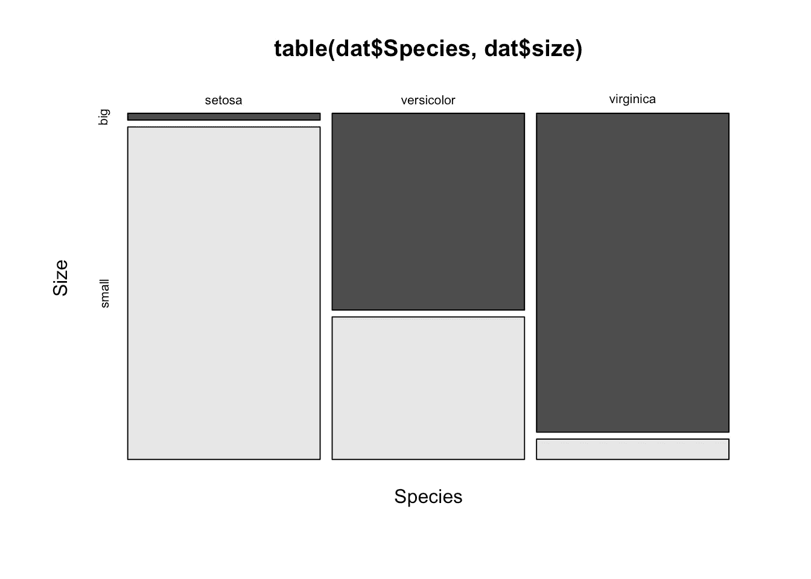

镶嵌图显示，对于我们的样本，大小花的比例在三个物种之间明显不同。特别是，海滨锦鸡儿属物种是最大的，而 setosa 属物种是三个物种中最小的(就萼片长度而言，因为变量`size`是基于变量`Sepal.Length`)。

供您参考，镶嵌图也可以通过`{vcd}`包中的`mosaic()`功能完成:

```
library(vcd)mosaic(~ Species + size,
       data = dat,
       direction = c("v", "h"))
```


# 条形图

柱状图只能在定性变量上完成(参见定量变量的差异[这里](https://www.statsandr.com/blog/variable-types-and-examples/))。柱状图是一种可视化定性变量分布的工具。我们绘制了定性变量`size`的柱状图:

```
barplot(table(dat$size)) # table() is mandatory
```

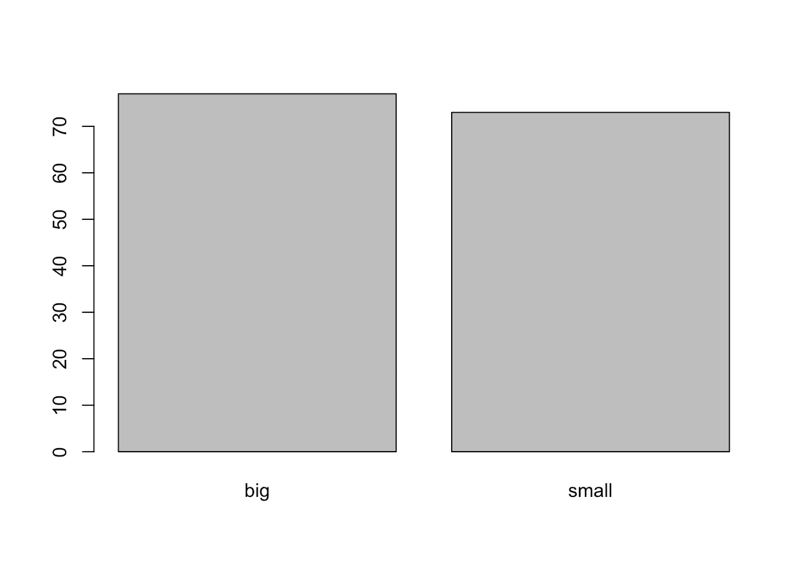

您也可以像我们之前做的那样，通过添加`prop.table()`来绘制相对频率而不是频率的柱状图:

```
barplot(prop.table(table(dat$size)))
```

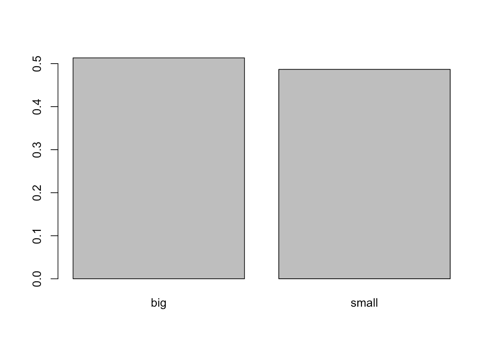

在`{ggplot2}`中:

```
library(ggplot2) # needed each time you open RStudio
# The package ggplot2 must be installed firstggplot(dat) +
  aes(x = size) +
  geom_bar()
```

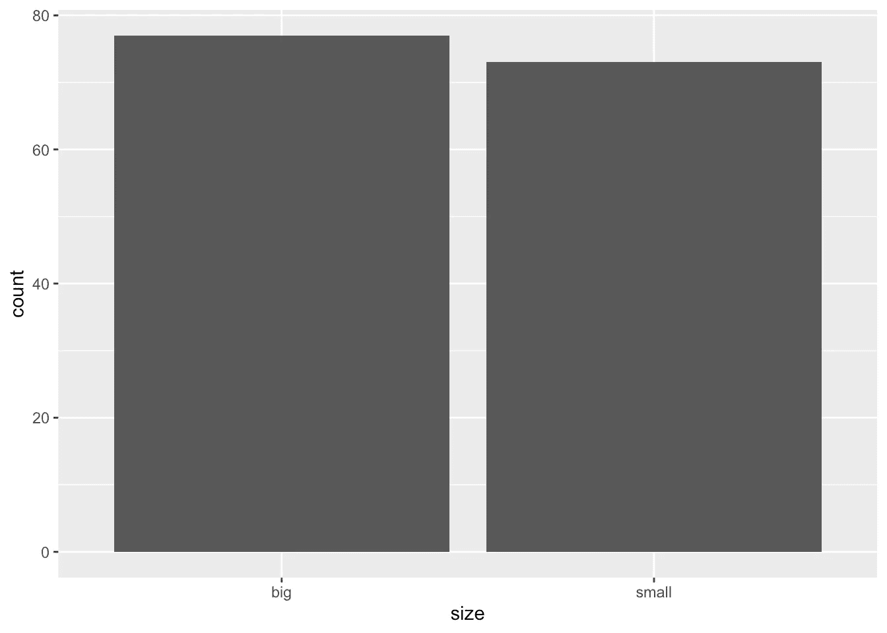

# 柱状图

直方图给出了定量变量分布的概念。这个想法是将值的范围分成区间，并计算每个区间内有多少个观察值。直方图有点类似于柱状图，但是直方图用于定量变量，而柱状图用于定性变量。要在 R 中绘制直方图，使用`hist()`:

```
hist(dat$Sepal.Length)
```

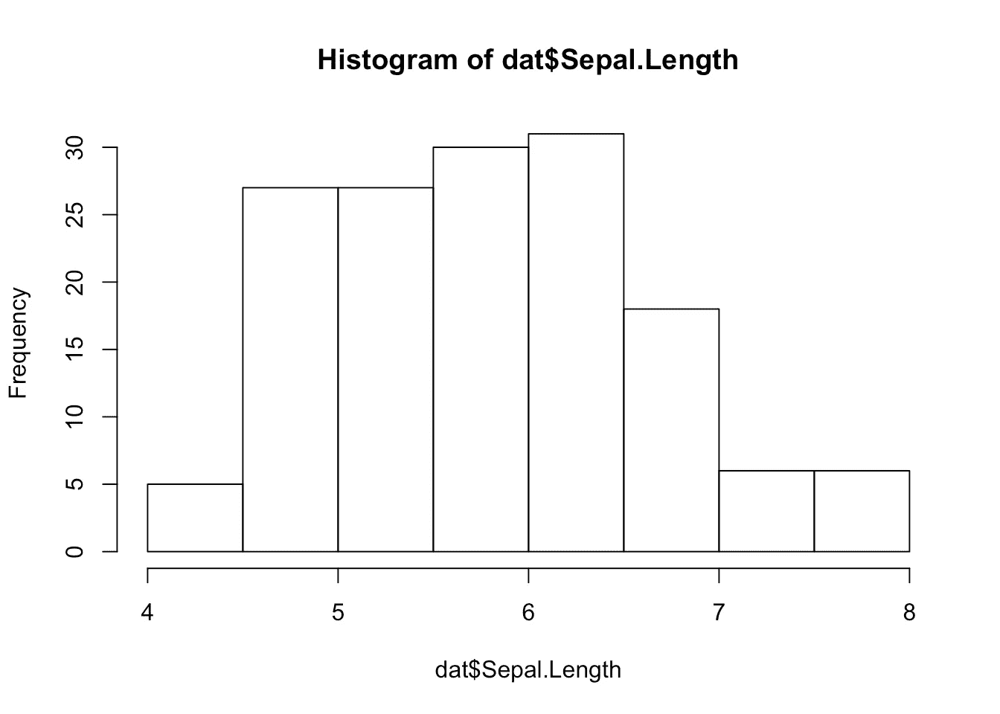

如果您想要更改容器的数量，请在`hist()`函数中添加参数`breaks =`。一个经验法则(称为斯特奇斯定律)是，仓的数量应该是观察数量的平方根的舍入值。数据集包括 150 个观察值，因此在这种情况下，箱的数量可以设置为 12。

在`{ggplot2}`:

```
ggplot(dat) +
  aes(x = Sepal.Length) +
  geom_histogram()
```

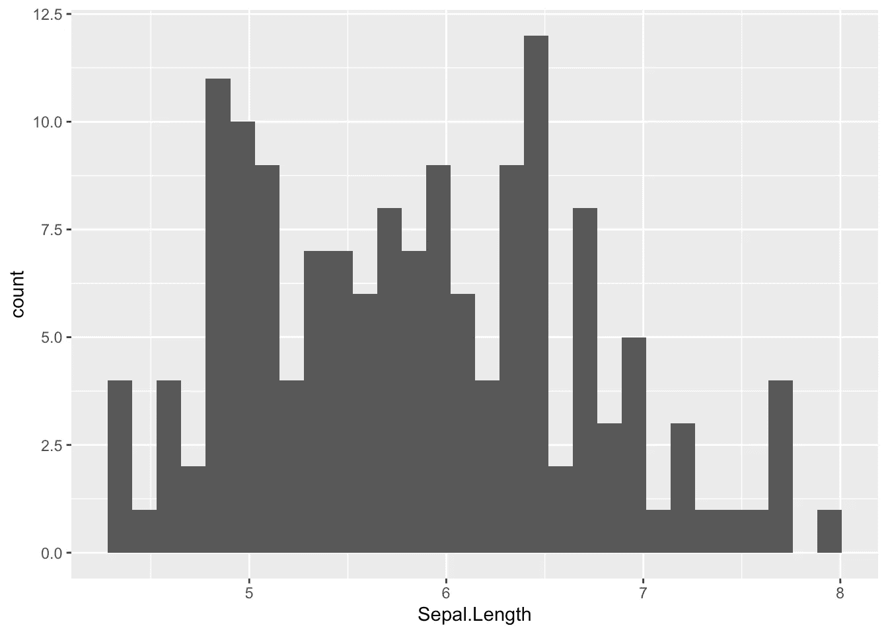

默认情况下，箱子的数量为 30。例如，您可以使用`geom_histogram(bins = 12)`更改该值。

# 箱线图

箱线图在描述性统计中非常有用，但往往没有得到充分利用(主要是因为公众没有很好地理解它)。箱线图通过直观显示五个常见位置汇总(最小值、中值、第一/第三四分位数和最大值)以及使用四分位数间距(IQR)标准分类为可疑异常值的任何观察值，以图形方式表示定量变量的分布。IQR 标准意味着 q0.75+1.5⋅IQR 以上和 q0.25−1.5⋅IQR 以下的所有观测值(其中 q0.25 和 q0.75 分别对应于第一和第三四分位数)都被 r 视为潜在异常值。箱线图中的最小值和最大值表示为没有这些可疑异常值。在同一个图上看到所有这些信息有助于对数据的分散和位置有一个良好的初步了解。在绘制数据的箱线图之前，请参见下图，该图解释了箱线图上的信息:

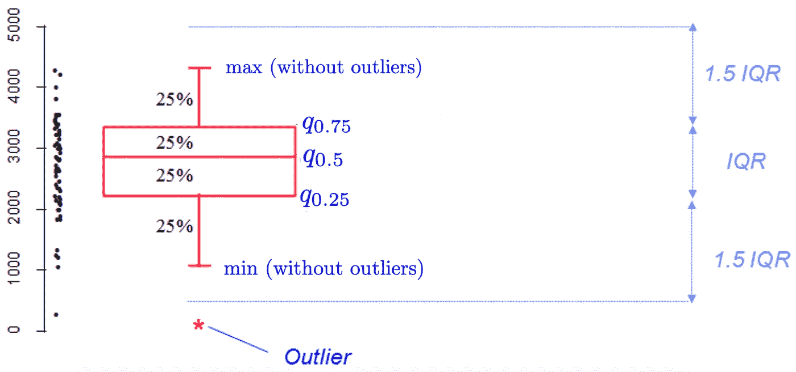

详细箱线图。资料来源:加州大学卢万分校 LFSAB1105

现在我们的数据集有一个例子:

```
boxplot(dat$Sepal.Length)
```

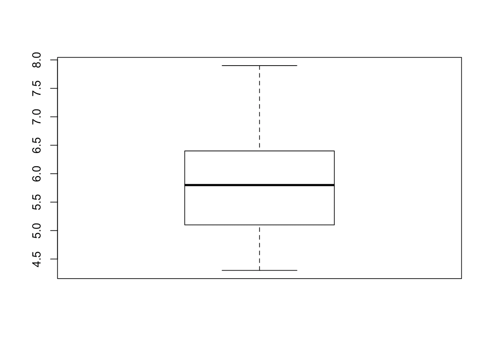

为了比较和对比两个或更多组的分布情况，并排显示的箱线图提供的信息甚至更多。例如，我们比较不同物种的萼片长度:

```
boxplot(dat$Sepal.Length ~ dat$Species)
```

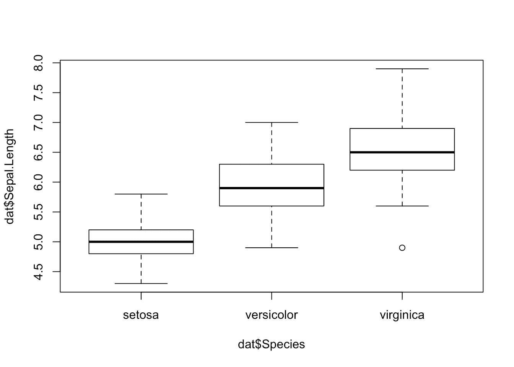

在`{ggplot2}`:

```
ggplot(dat) +
  aes(x = Species, y = Sepal.Length) +
  geom_boxplot()
```

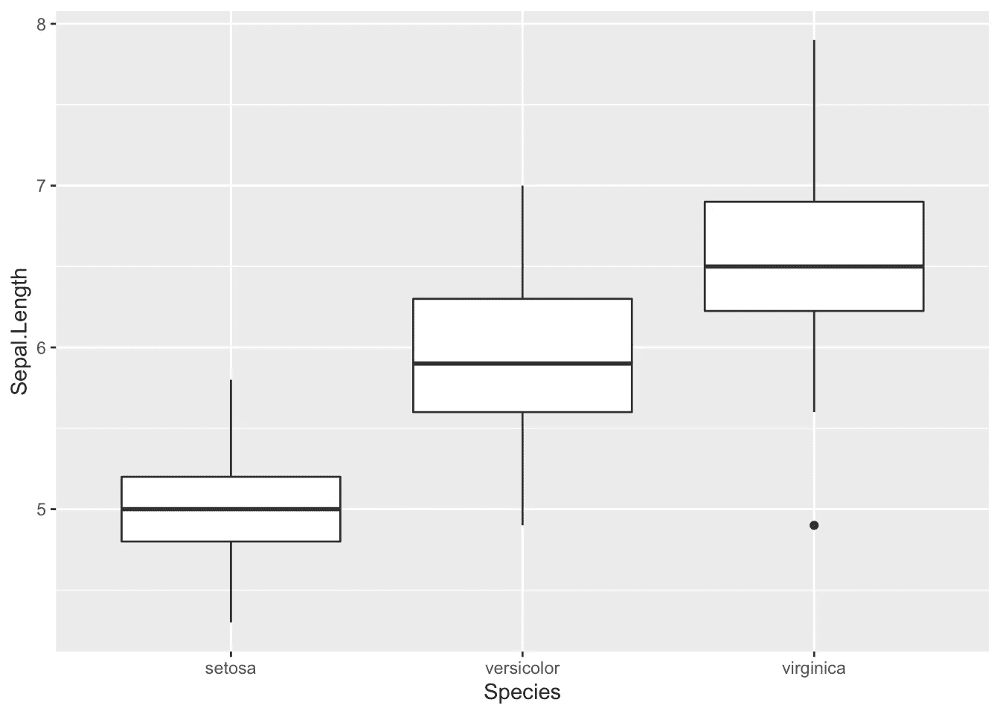

# 点图

点状图或多或少类似于箱线图，只是观察值以点表示，并且图上没有汇总统计数据:

```
library(lattice)dotplot(dat$Sepal.Length ~ dat$Species)
```

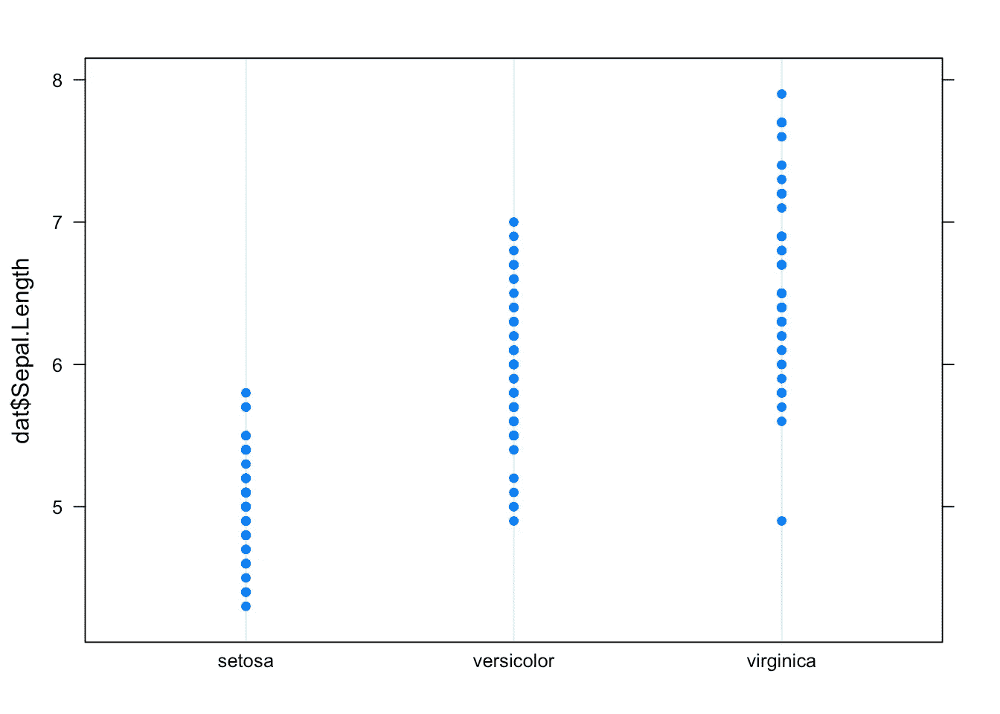

# 散点图

散点图允许检查两个定量变量之间是否有潜在的联系。出于这个原因，散点图经常被用来可视化两个变量之间的潜在关联[。例如，当绘制萼片长度和花瓣长度的散点图时:](https://www.statsandr.com/blog/correlation-coefficient-and-correlation-test-in-r/)

```
plot(dat$Sepal.Length, dat$Petal.Length)
```

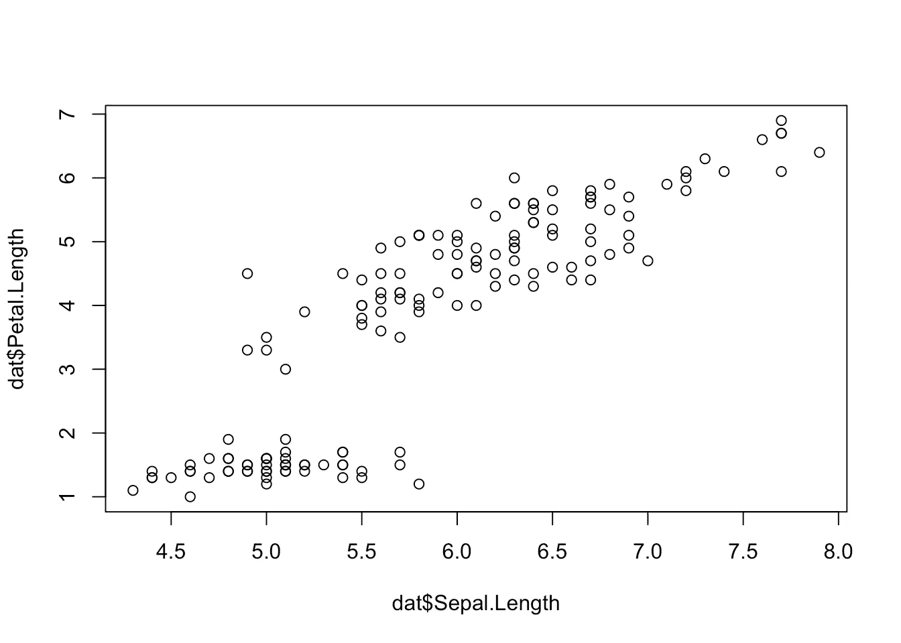

这两个变量之间似乎有正相关。

在`{ggplot2}`中:

```
ggplot(dat) +
  aes(x = Sepal.Length, y = Petal.Length) +
  geom_point()
```

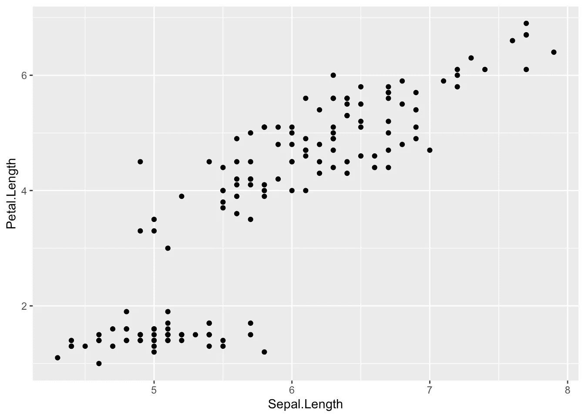

作为箱线图，散点图在根据因子区分点时提供的信息甚至更多，在这种情况下，物种:

```
ggplot(dat) +
  aes(x = Sepal.Length, y = Petal.Length, colour = Species) +
  geom_point() +
  scale_color_hue()
```

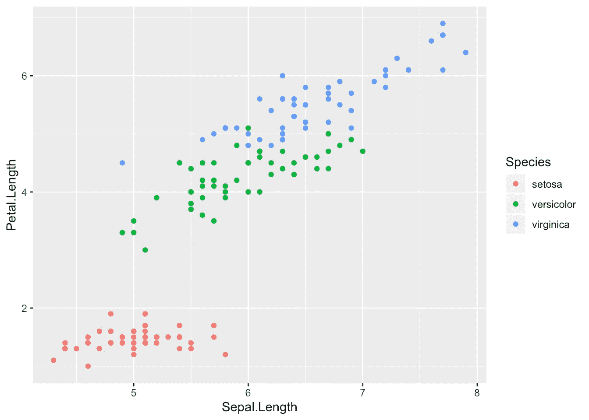

# QQ 图

# 对于单个变量

为了检查变量的正态性假设(正态性是指数据遵循正态分布，也称为高斯分布)，我们通常使用直方图和/或 QQ 图。 [1](https://www.statsandr.com/blog/descriptive-statistics-in-r/#fn1) 如果您需要更新相关内容，请参阅讨论[正态分布以及如何评估 R](https://www.statsandr.com/blog/do-my-data-follow-a-normal-distribution-a-note-on-the-most-widely-used-distribution-and-how-to-test-for-normality-in-r/) 中的正态假设的文章。直方图前面已经介绍过了，下面是如何绘制 QQ 图:

```
# Draw points on the qq-plot:
qqnorm(dat$Sepal.Length)
# Draw the reference line:
qqline(dat$Sepal.Length)
```

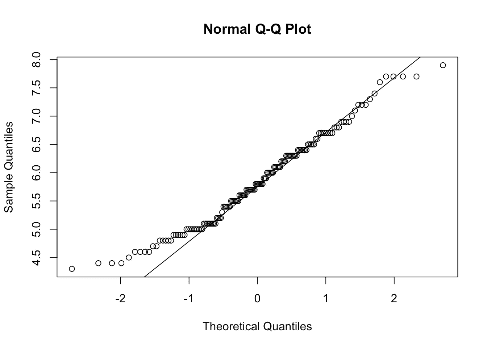

或者使用`{car}`包中的`qqPlot()`函数绘制带置信带的 QQ 图:

```
library(car) # package must be installed first
qqPlot(dat$Sepal.Length)
```

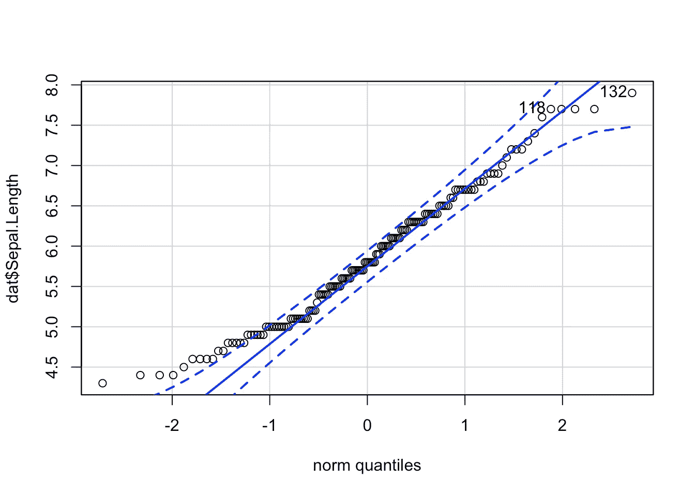

```
## [1] 132 118
```

如果点靠近参考线(有时称为亨利线)并在置信带内，则可以认为满足正态性假设。点和参考线之间的偏差越大，并且它们越位于置信带之外，满足正态条件的可能性就越小。变量`Sepal.Length`似乎不遵循正态分布，因为有几个点位于置信带之外。当面对非正态分布时，第一步通常是对数据应用对数变换，并重新检查经过对数变换的数据是否正态分布。应用对数变换可以通过`log()`功能完成。

在`{ggpubr}`:

```
library(ggpubr)
ggqqplot(dat$Sepal.Length)
```

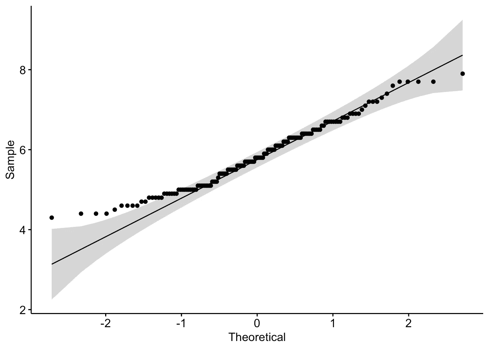

# 按组

对于一些统计检验，所有组都需要正态假设。一种解决方案是通过手动将数据集分成不同的组来为每个组绘制 QQ 图，然后为每个数据子集绘制 QQ 图(使用上面所示的方法)。另一个(更简单的)解决方案是用`{car}`包中函数`qqPlot()`中的参数`groups =`为每个组自动绘制一个 QQ 图:

```
qqPlot(dat$Sepal.Length, groups = dat$size)
```

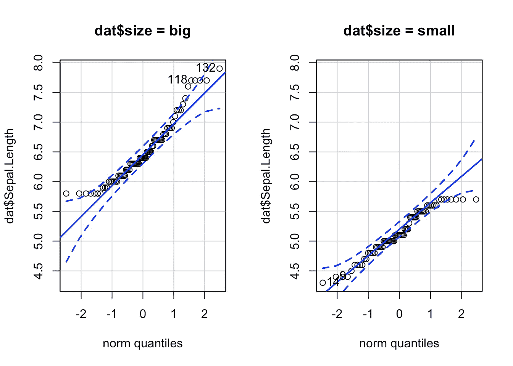

在`{ggplot2}`中:

```
qplot(
  sample = Sepal.Length, data = dat,
  col = size, shape = size
)
```

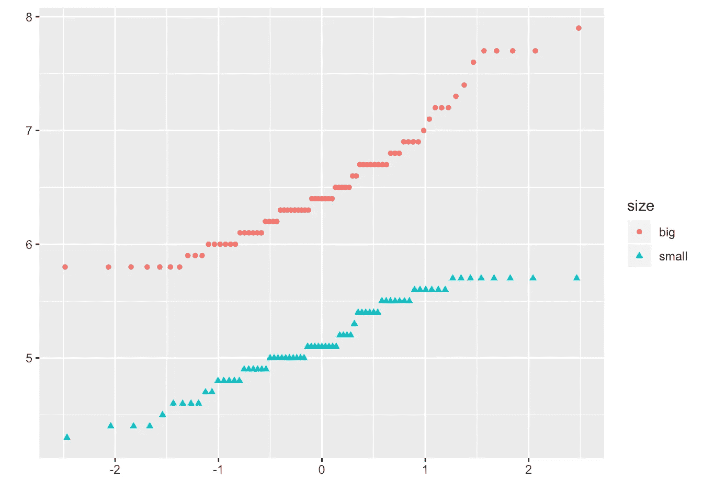

也可以仅通过形状或颜色来区分组。为此，删除上述`qplot()`函数中的参数`col`或`shape`之一。

# 密度图

密度图是直方图的平滑版本，用于相同的概念，即表示数值变量的分布。函数`plot()`和`density()`一起用于绘制密度图:

```
plot(density(dat$Sepal.Length))
```

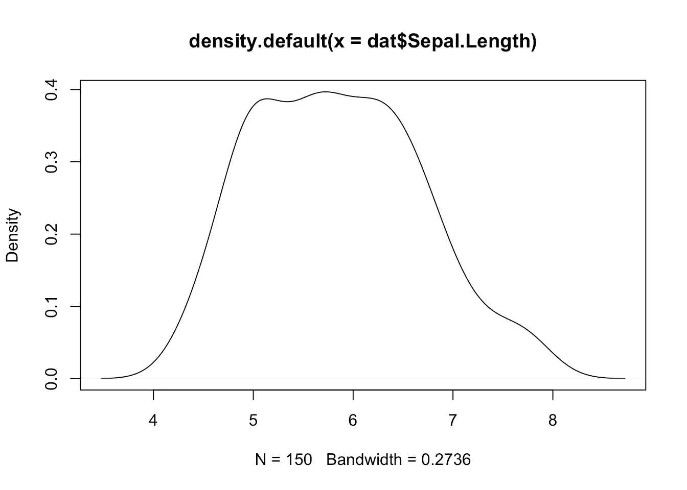

在`{ggplot2}`中:

```
ggplot(dat) +
  aes(x = Sepal.Length) +
  geom_density()
```

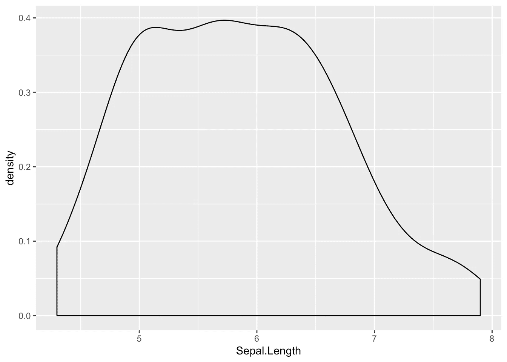

# 相关图

最后一种描述图是相关图，也称为相关图。这种类型的图表比上面给出的图表更复杂，因此将在另一篇文章中详细介绍。参见[如何绘制相关图以突出显示数据集中最相关的变量](https://www.statsandr.com/blog/correlogram-in-r-how-to-highlight-the-most-correlated-variables-in-a-dataset)。

# 高级描述统计学

我们讨论了计算最常见和最基本的描述性统计数据的主要函数。然而，r 中有更多的函数和包来执行更高级的描述性统计。在本节中，我将介绍其中一些函数和包在我们的数据集上的应用。

# `{summarytools}`套餐

我在 R 语言项目中经常使用的一个描述性统计软件包是`[{summarytools}](https://cran.r-project.org/web/packages/summarytools/index.html)`软件包。该包围绕 4 个功能展开:

1.  `freq()`对于频率表
2.  `ctable()`用于交叉制表
3.  `descr()`用于描述性统计
4.  `dfSummary()`对于数据帧摘要

对于大多数描述性分析来说，这 4 个功能的组合通常已经足够了。此外，这个包在构建时考虑到了 [R Markdown](https://www.statsandr.com/blog/getting-started-in-r-markdown/) ，这意味着输出在 HTML 报告中表现良好。对于非英语使用者，内置了法语、葡萄牙语、西班牙语、俄语和土耳其语翻译。

在接下来的几节中，我将分别阐述这四个函数。随后的输出在 R Markdown 报告中显示得更好，但在本文中，我将自己限制在原始输出上，因为目标是展示函数如何工作，而不是如何使它们呈现得更好。如果您想在 R Markdown 中以漂亮的方式打印输出，请参见包装的[插图](https://cran.r-project.org/web/packages/summarytools/vignettes/Introduction.html)中的设置设置。 [2](https://www.statsandr.com/blog/descriptive-statistics-in-r/#fn2)

# 带`freq()`的频率表

`freq()`功能生成频率表，其中包含频率、比例以及缺失数据信息。

```
library(summarytools)
freq(dat$Species)## Frequencies  
## dat$Species  
## Type: Factor  
## 
##                    Freq   % Valid   % Valid Cum.   % Total   % Total Cum.
## ---------------- ------ --------- -------------- --------- --------------
##           setosa     50     33.33          33.33     33.33          33.33
##       versicolor     50     33.33          66.67     33.33          66.67
##        virginica     50     33.33         100.00     33.33         100.00
##             <NA>      0                               0.00         100.00
##            Total    150    100.00         100.00    100.00         100.00
```

如果不需要关于缺失值的信息，添加`report.nas = FALSE`参数:

```
freq(dat$Species,
     report.nas = FALSE) # remove NA information## Frequencies  
## dat$Species  
## Type: Factor  
## 
##                    Freq        %   % Cum.
## ---------------- ------ -------- --------
##           setosa     50    33.33    33.33
##       versicolor     50    33.33    66.67
##        virginica     50    33.33   100.00
##            Total    150   100.00   100.00
```

对于只有计数和比例的极简输出:

```
freq(dat$Species,
     report.nas = FALSE, # remove NA information
     totals = FALSE, # remove totals
     cumul = FALSE, # remove cumuls
     headings = FALSE) # remove headings## 
##                    Freq       %
## ---------------- ------ -------
##           setosa     50   33.33
##       versicolor     50   33.33
##        virginica     50   33.33
```

# 与`ctable()`交叉列表

`ctable()`函数为分类变量对生成交叉表(也称为列联表)。使用数据集中的两个分类变量:

```
ctable(x = dat$Species,
       y = dat$size)## Cross-Tabulation, Row Proportions  
## Species * size  
## Data Frame: dat  
## 
## ------------ ------ ------------ ------------ --------------
##                size          big        small          Total
##      Species                                                
##       setosa           1 ( 2.0%)   49 (98.0%)    50 (100.0%)
##   versicolor          29 (58.0%)   21 (42.0%)    50 (100.0%)
##    virginica          47 (94.0%)    3 ( 6.0%)    50 (100.0%)
##        Total          77 (51.3%)   73 (48.7%)   150 (100.0%)
## ------------ ------ ------------ ------------ --------------
```

默认情况下显示行比例。要显示列或总比例，分别添加`prop = "c"`或`prop = "t"`参数:

```
ctable(x = dat$Species,
       y = dat$size,
       prop = "t") # total proportions## Cross-Tabulation, Total Proportions  
## Species * size  
## Data Frame: dat  
## 
## ------------ ------ ------------ ------------ --------------
##                size          big        small          Total
##      Species                                                
##       setosa           1 ( 0.7%)   49 (32.7%)    50 ( 33.3%)
##   versicolor          29 (19.3%)   21 (14.0%)    50 ( 33.3%)
##    virginica          47 (31.3%)    3 ( 2.0%)    50 ( 33.3%)
##        Total          77 (51.3%)   73 (48.7%)   150 (100.0%)
## ------------ ------ ------------ ------------ --------------
```

要完全删除比例，请添加参数`prop = "n"`。此外，为了只显示最低限度，添加`totals = FALSE`和`headings = FALSE`参数:

```
ctable(x = dat$Species,
       y = dat$size,
       prop = "n", # remove proportions
       totals = FALSE, # remove totals
       headings = FALSE) # remove headings## 
## ------------ ------ ----- -------
##                size   big   small
##      Species                     
##       setosa            1      49
##   versicolor           29      21
##    virginica           47       3
## ------------ ------ ----- -------
```

这相当于在[列联表](https://www.statsandr.com/blog/descriptive-statistics-in-r/#contingency-table)中执行的`table(dat$Species, dat$size)`和`xtabs(~ dat$Species + dat$size)`。

为了显示[卡方独立性检验](https://www.statsandr.com/blog/chi-square-test-of-independence-in-r/)的结果，添加`chisq = TRUE`参数: [3](https://www.statsandr.com/blog/descriptive-statistics-in-r/#fn3)

```
ctable(x = dat$Species,
       y = dat$size,
       chisq = TRUE, # display results of Chi-square test of independence
       headings = FALSE) # remove headings## 
## ------------ ------ ------------ ------------ --------------
##                size          big        small          Total
##      Species                                                
##       setosa           1 ( 2.0%)   49 (98.0%)    50 (100.0%)
##   versicolor          29 (58.0%)   21 (42.0%)    50 (100.0%)
##    virginica          47 (94.0%)    3 ( 6.0%)    50 (100.0%)
##        Total          77 (51.3%)   73 (48.7%)   150 (100.0%)
## ------------ ------ ------------ ------------ --------------
## 
## ----------------------------
##  Chi.squared   df   p.value 
## ------------- ---- ---------
##     86.03      2       0    
## ----------------------------
```

p 值接近于 0，所以我们拒绝两个变量之间独立性的零假设。在我们的上下文中，这表明物种和大小是相互依赖的，并且这两个变量之间存在显著的关系。

由于结合了`stby()`和`ctable()`函数，还可以为第三分类变量的每个级别创建一个列联表。我们的数据集中只有 2 个分类变量，所以让我们使用有 4 个分类变量(即性别、年龄组、吸烟者、患病者)的`tabacco`数据集。对于这个例子，我们想要创建一个变量`smoker`和`diseased`的列联表，并且对于每个`gender`:

```
stby(list(x = tobacco$smoker, # smoker and diseased
          y = tobacco$diseased), 
     INDICES = tobacco$gender, # for each gender
     FUN = ctable) # ctable for cross-tabulation## Cross-Tabulation, Row Proportions  
## smoker * diseased  
## Data Frame: tobacco  
## Group: gender = F  
## 
## -------- ---------- ------------- ------------- --------------
##            diseased           Yes            No          Total
##   smoker                                                      
##      Yes               62 (42.2%)    85 (57.8%)   147 (100.0%)
##       No               49 (14.3%)   293 (85.7%)   342 (100.0%)
##    Total              111 (22.7%)   378 (77.3%)   489 (100.0%)
## -------- ---------- ------------- ------------- --------------
## 
## Group: gender = M  
## 
## -------- ---------- ------------- ------------- --------------
##            diseased           Yes            No          Total
##   smoker                                                      
##      Yes               63 (44.1%)    80 (55.9%)   143 (100.0%)
##       No               47 (13.6%)   299 (86.4%)   346 (100.0%)
##    Total              110 (22.5%)   379 (77.5%)   489 (100.0%)
## -------- ---------- ------------- ------------- --------------
```

# 用`descr()`描述性统计

`descr()`函数生成描述性(单变量)统计数据，其中包含常见的集中趋势统计数据和离差测量值。(如果您需要提醒，请参见[集中趋势和分散程度之间的差异](https://www.statsandr.com/blog/descriptive-statistics-by-hand/#location-versus-dispersion-measures)。)

该函数的一个主要优点是它接受单个矢量和数据帧。如果提供了数据框，则会忽略所有非数字列，因此您不必在运行函数之前亲自移除它们。

`descr()`功能允许显示:

*   只有一个你选择的描述性统计的选择，以平均值和标准差的`stats = c("mean", "sd")`参数为例
*   使用`stats = "fivenum"`的最小值、第一个四分位数、中间值、第三个四分位数和最大值
*   最常见的描述性统计(均值、标准差、最小值、中值、最大值、有效观察值的数量和百分比)，用`stats = "common"`:

```
descr(dat,
      headings = FALSE, # remove headings
      stats = "common") # most common descriptive statistics## 
##                   Petal.Length   Petal.Width   Sepal.Length   Sepal.Width
## --------------- -------------- ------------- -------------- -------------
##            Mean           3.76          1.20           5.84          3.06
##         Std.Dev           1.77          0.76           0.83          0.44
##             Min           1.00          0.10           4.30          2.00
##          Median           4.35          1.30           5.80          3.00
##             Max           6.90          2.50           7.90          4.40
##         N.Valid         150.00        150.00         150.00        150.00
##       Pct.Valid         100.00        100.00         100.00        100.00
```

*提示*:如果你有大量的变量，添加`transpose = TRUE`参数以获得更好的显示效果。

为了按组计算这些描述性统计数据(例如，我们数据集中的`Species`)，请将`descr()`函数与`stby()`函数结合使用:

```
stby(data = dat,
     INDICES = dat$Species, # by Species
     FUN = descr, # descriptive statistics
     stats = "common") # most common descr. stats## Descriptive Statistics  
## dat  
## Group: Species = setosa  
## N: 50  
## 
##                   Petal.Length   Petal.Width   Sepal.Length   Sepal.Width
## --------------- -------------- ------------- -------------- -------------
##            Mean           1.46          0.25           5.01          3.43
##         Std.Dev           0.17          0.11           0.35          0.38
##             Min           1.00          0.10           4.30          2.30
##          Median           1.50          0.20           5.00          3.40
##             Max           1.90          0.60           5.80          4.40
##         N.Valid          50.00         50.00          50.00         50.00
##       Pct.Valid         100.00        100.00         100.00        100.00
## 
## Group: Species = versicolor  
## N: 50  
## 
##                   Petal.Length   Petal.Width   Sepal.Length   Sepal.Width
## --------------- -------------- ------------- -------------- -------------
##            Mean           4.26          1.33           5.94          2.77
##         Std.Dev           0.47          0.20           0.52          0.31
##             Min           3.00          1.00           4.90          2.00
##          Median           4.35          1.30           5.90          2.80
##             Max           5.10          1.80           7.00          3.40
##         N.Valid          50.00         50.00          50.00         50.00
##       Pct.Valid         100.00        100.00         100.00        100.00
## 
## Group: Species = virginica  
## N: 50  
## 
##                   Petal.Length   Petal.Width   Sepal.Length   Sepal.Width
## --------------- -------------- ------------- -------------- -------------
##            Mean           5.55          2.03           6.59          2.97
##         Std.Dev           0.55          0.27           0.64          0.32
##             Min           4.50          1.40           4.90          2.20
##          Median           5.55          2.00           6.50          3.00
##             Max           6.90          2.50           7.90          3.80
##         N.Valid          50.00         50.00          50.00         50.00
##       Pct.Valid         100.00        100.00         100.00        100.00
```

# 使用`dfSummary()`的数据帧摘要

`dfSummary()`函数生成一个汇总表，其中包含数据集中所有变量的统计数据、频率和图表。显示的信息取决于变量的类型(字符、因子、数字、日期),也根据不同值的数量而变化。

```
dfSummary(dat)## Data Frame Summary  
## dat  
## Dimensions: 150 x 6  
## Duplicates: 1  
## 
## ----------------------------------------------------------------------------------------------------------------------
## No   Variable        Stats / Values           Freqs (% of Valid)   Graph                            Valid    Missing  
## ---- --------------- ------------------------ -------------------- -------------------------------- -------- ---------
## 1    Sepal.Length    Mean (sd) : 5.8 (0.8)    35 distinct values     . . : :                        150      0        
##      [numeric]       min < med < max:                                : : : :                        (100%)   (0%)     
##                      4.3 < 5.8 < 7.9                                 : : : : :                                        
##                      IQR (CV) : 1.3 (0.1)                            : : : : :                                        
##                                                                    : : : : : : : :                                    
## 
## 2    Sepal.Width     Mean (sd) : 3.1 (0.4)    23 distinct values           :                        150      0        
##      [numeric]       min < med < max:                                      :                        (100%)   (0%)     
##                      2 < 3 < 4.4                                         . :                                          
##                      IQR (CV) : 0.5 (0.1)                              : : : :                                        
##                                                                    . . : : : : : :                                    
## 
## 3    Petal.Length    Mean (sd) : 3.8 (1.8)    43 distinct values   :                                150      0        
##      [numeric]       min < med < max:                              :         . :                    (100%)   (0%)     
##                      1 < 4.3 < 6.9                                 :         : : .                                    
##                      IQR (CV) : 3.5 (0.5)                          : :       : : : .                                  
##                                                                    : :   . : : : : : .                                
## 
## 4    Petal.Width     Mean (sd) : 1.2 (0.8)    22 distinct values   :                                150      0        
##      [numeric]       min < med < max:                              :                                (100%)   (0%)     
##                      0.1 < 1.3 < 2.5                               :       . .   :                                    
##                      IQR (CV) : 1.5 (0.6)                          :       : :   :   .                                
##                                                                    : :   : : : . : : :                                
## 
## 5    Species         1\. setosa                50 (33.3%)           IIIIII                           150      0        
##      [factor]        2\. versicolor            50 (33.3%)           IIIIII                           (100%)   (0%)     
##                      3\. virginica             50 (33.3%)           IIIIII                                             
## 
## 6    size            1\. big                   77 (51.3%)           IIIIIIIIII                       150      0        
##      [character]     2\. small                 73 (48.7%)           IIIIIIIII                        (100%)   (0%)     
## ----------------------------------------------------------------------------------------------------------------------
```

# `describeBy()`来自`{psych}`包

`{psych}`包中的`describeBy()`函数允许按分组变量报告多个汇总统计数据(即有效病例数、平均值、标准偏差、中值、修整平均值、mad:中值绝对偏差(与中值的偏差)、最小值、最大值、范围、偏斜度和峰度)。

```
library(psych)
describeBy(dat,
           dat$Species) # grouping variable## 
##  Descriptive statistics by group 
## group: setosa
##              vars  n mean   sd median trimmed  mad min  max range skew kurtosis
## Sepal.Length    1 50 5.01 0.35    5.0    5.00 0.30 4.3  5.8   1.5 0.11    -0.45
## Sepal.Width     2 50 3.43 0.38    3.4    3.42 0.37 2.3  4.4   2.1 0.04     0.60
## Petal.Length    3 50 1.46 0.17    1.5    1.46 0.15 1.0  1.9   0.9 0.10     0.65
## Petal.Width     4 50 0.25 0.11    0.2    0.24 0.00 0.1  0.6   0.5 1.18     1.26
## Species*        5 50 1.00 0.00    1.0    1.00 0.00 1.0  1.0   0.0  NaN      NaN
## size*           6 50  NaN   NA     NA     NaN   NA Inf -Inf  -Inf   NA       NA
##                se
## Sepal.Length 0.05
## Sepal.Width  0.05
## Petal.Length 0.02
## Petal.Width  0.01
## Species*     0.00
## size*          NA
## ------------------------------------------------------------ 
## group: versicolor
##              vars  n mean   sd median trimmed  mad min  max range  skew
## Sepal.Length    1 50 5.94 0.52   5.90    5.94 0.52 4.9  7.0   2.1  0.10
## Sepal.Width     2 50 2.77 0.31   2.80    2.78 0.30 2.0  3.4   1.4 -0.34
## Petal.Length    3 50 4.26 0.47   4.35    4.29 0.52 3.0  5.1   2.1 -0.57
## Petal.Width     4 50 1.33 0.20   1.30    1.32 0.22 1.0  1.8   0.8 -0.03
## Species*        5 50 2.00 0.00   2.00    2.00 0.00 2.0  2.0   0.0   NaN
## size*           6 50  NaN   NA     NA     NaN   NA Inf -Inf  -Inf    NA
##              kurtosis   se
## Sepal.Length    -0.69 0.07
## Sepal.Width     -0.55 0.04
## Petal.Length    -0.19 0.07
## Petal.Width     -0.59 0.03
## Species*          NaN 0.00
## size*              NA   NA
## ------------------------------------------------------------ 
## group: virginica
##              vars  n mean   sd median trimmed  mad min  max range  skew
## Sepal.Length    1 50 6.59 0.64   6.50    6.57 0.59 4.9  7.9   3.0  0.11
## Sepal.Width     2 50 2.97 0.32   3.00    2.96 0.30 2.2  3.8   1.6  0.34
## Petal.Length    3 50 5.55 0.55   5.55    5.51 0.67 4.5  6.9   2.4  0.52
## Petal.Width     4 50 2.03 0.27   2.00    2.03 0.30 1.4  2.5   1.1 -0.12
## Species*        5 50 3.00 0.00   3.00    3.00 0.00 3.0  3.0   0.0   NaN
## size*           6 50  NaN   NA     NA     NaN   NA Inf -Inf  -Inf    NA
##              kurtosis   se
## Sepal.Length    -0.20 0.09
## Sepal.Width      0.38 0.05
## Petal.Length    -0.37 0.08
## Petal.Width     -0.75 0.04
## Species*          NaN 0.00
## size*              NA   NA
```

# `aggregate()`功能

`aggregate()`函数允许将数据分成子集，然后计算每个子集的汇总统计数据。例如，如果我们想通过`Species`和`Size`计算变量`Sepal.Length`和`Sepal.Width`的平均值:

```
aggregate(cbind(Sepal.Length, Sepal.Width) ~ Species + size,
          data = dat,
          mean)##      Species  size Sepal.Length Sepal.Width
## 1     setosa   big     5.800000    4.000000
## 2 versicolor   big     6.282759    2.868966
## 3  virginica   big     6.663830    2.997872
## 4     setosa small     4.989796    3.416327
## 5 versicolor small     5.457143    2.633333
## 6  virginica small     5.400000    2.600000
```

感谢阅读。我希望这篇文章能帮助你在 r 中做描述性统计。如果你想手工做同样的事情或理解这些统计代表什么，我邀请你阅读文章"[手工描述性统计](https://www.statsandr.com/blog/descriptive-statistics-by-hand/)"。

和往常一样，如果您有与本文主题相关的问题或建议，请将其添加为评论，以便其他读者可以从讨论中受益。

**相关文章:**

*   [安装和加载 R 包的有效方法](https://www.statsandr.com/blog/an-efficient-way-to-install-and-load-r-packages/)
*   [我的数据符合正态分布吗？关于最广泛使用的分布以及如何检验 R 中的正态性的注释](https://www.statsandr.com/blog/do-my-data-follow-a-normal-distribution-a-note-on-the-most-widely-used-distribution-and-how-to-test-for-normality-in-r/)
*   [R 中的 Fisher 精确检验:小样本的独立性检验](https://www.statsandr.com/blog/fisher-s-exact-test-in-r-independence-test-for-a-small-sample/)
*   [R 中独立性的卡方检验](https://www.statsandr.com/blog/chi-square-test-of-independence-in-r/)
*   [如何在简历中创建时间线](https://www.statsandr.com/blog/how-to-create-a-timeline-of-your-cv-in-r/)

1.  正态性检验，如夏皮罗-维尔克或科尔莫戈罗夫-斯米尔诺夫检验，也可以用来检验数据是否遵循正态分布。然而，在实践中，正态性检验通常被认为过于保守，因为对于大样本量，与正态性的微小偏差都可能导致违反正态性条件。由于这个原因，通常情况下，正态性条件是基于视觉检查(直方图和 QQ 图)和形式检验(例如夏皮罗-维尔克检验)的组合来验证的。 [↩](https://www.statsandr.com/blog/descriptive-statistics-in-r/#fnref1)
2.  注意这个包需要`plain.ascii`和`style`参数。在我们的例子中，这些参数被添加到每个块的设置中，所以它们是不可见的。 [↩](https://www.statsandr.com/blog/descriptive-statistics-in-r/#fnref2)
3.  注意，也可以计算比值比和风险比。关于这个问题的更多信息，请参见软件包的简介，因为这些比率超出了本文的范围。 [↩](https://www.statsandr.com/blog/descriptive-statistics-in-r/#fnref3)

*原载于 2020 年 1 月 22 日 https://statsandr.com**[*。*](https://statsandr.com/blog/descriptive-statistics-in-r/)*