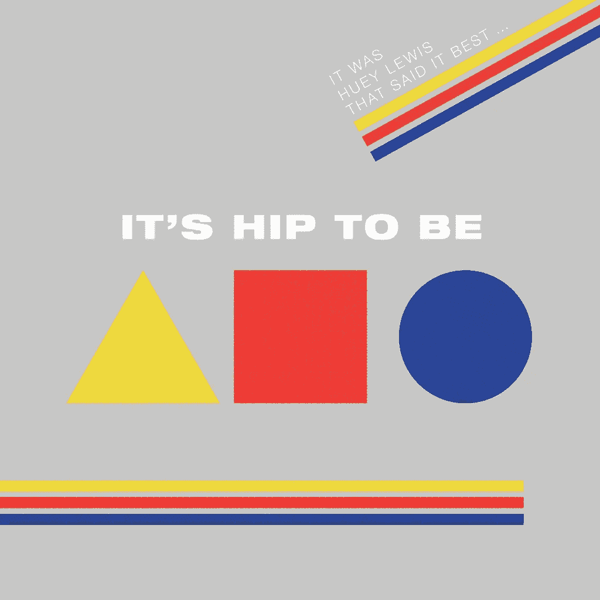
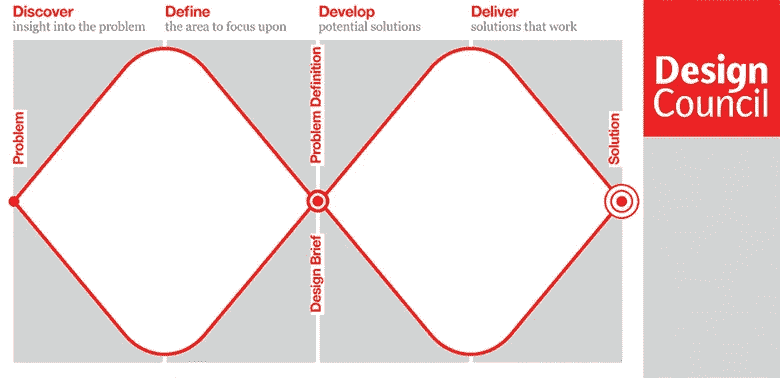

# 数据科学项目的设计和结构

> 原文：<https://towardsdatascience.com/design-and-the-structure-of-data-science-projects-c1bc5f745d17?source=collection_archive---------19----------------------->

## 作为数据科学家，我们必须学会处理不确定性。我们可以借用其他学科的技术来帮助我们做到这一点。

信不信由你，这些不是设计师的首选工具。

与和你完全不同的人一起工作会是一次非常有益的经历。如果你幸运的话，你最终会改变对世界的看法，并因此成为一个更好的人。对我来说，这种改变发生在第一次与 ***设计师*** 合作的时候。

“设计师”，我听到你语无伦次！“他们对数据科学项目了解多少？他们不就是给东西上色吗？”

部分原因是，当他们大三刚开始的时候。然而，好的人会设法把他们的蜡笔留在线内**【1】**。在这一点上，他们被提升为高级设计师，必须做一大堆我们称之为 ***真正的设计*** 的东西。我认为这种 ***真实设计*** 的过程在数据科学项目中非常有用。

我保证，过一会儿我会回到这个设计过程。然而，独立于实现它们的人的流程是我最讨厌的事情之一。对不起 Scrum/敏捷/prince 2/看板的人。首先，让我们思考一下这种心态，它来自哪里，以及它与科学家和工程师通常接受的培训方式有何不同。

## **设计思维的根源**

> “一个物体是由其性质定义的。为了使它正常工作，我们必须首先研究它的性质。为了使它完美地服务于其目的，它必须以实际的方式履行其职能。” ***瓦尔特·格罗皮乌斯，包豪斯的创始人***

包豪斯思维无处不在。

包豪斯是现代设计的发源地，在德国蓬勃发展，直到邪恶的纳粹将其关闭。历史上积累的垃圾将被扔掉，物品将按照其本质核心进行制作。还记得米开朗基罗对教皇说，为了创作他的雕塑杰作，“他只是移走了所有不是大卫的东西”吗？这是第一次艺术感受被应用到日常生活中。从这里开始的智力思维延伸到了 iPhone 的设计。**【2】**

我们已经可以看到我所说的不同的思考方式。作为科学家或工程师，我们被训练来提供解决方案。通常在计划中，我们会抓住一个问题并立即开始解决它。但是考虑一下格罗皮乌斯的引用。设计师要做的第一件事就是理解这个东西的功能和目的。他们最终会找出问题所在，然后才知道如何解决。

现在，您参与过多少数据科学项目，因为解决了一个并不符合客户需求的问题而放弃了大量工作？有办法避免这种情况吗？在这之前，我们必须离开关于“事物本质”的神秘陈述，转而…

## 实用主义在美国

在 30 年代，设计运动跨越了大西洋——那是在美国建墙之前的日子。瓦尔特·格罗皮乌斯最终成为了哈佛大学的教授。一个新的包豪斯在芝加哥开张了。

在美国，围绕设计的思考变得不那么神秘了，设计师们开始制作对我们其他人有用的工具包。像“设计科学”这样的短语开始被使用。斯坦福大学的 D-School 成立了，他们围绕自己创造的设计流程，推出了一家咨询公司 IDEO。我发现这个过程在数据科学项目中非常有用。设计师们非常习惯走进一个定义不清的项目，拼命想弄清楚这些人到底想要什么，然后想出一些让他们的客户满意的方法。

听起来熟悉吗？“就给我数据科学。它必须有效，其他所有人都在这么做……”

## 数据科学和设计过程

我在设计师的工具箱里找到的最有用的东西，是英国设计委员会称之为双钻石的东西。据我所知，这似乎与斯坦福大学 D-School 的设计过程密切相关。

图片来自英国设计协会

时间在左右轴上。上下轴，即钻石的高度，应该代表你对这个项目的确定性。因此，当你从左向右移动时(即随着时间的推移)，你会逐渐变得不确定，然后变得更确定，然后变得不确定，最后在项目结束时又变得确定。运气好的话。

基本思想是，在第一个菱形中，你要找出问题，在第二个菱形中，你要找出答案。即使在这个高层次上，我们也能看到设计师的训练方式和我作为科学家的训练方式之间的差异。首先，不确定性被认为是这个过程中不可避免和令人满意的一部分！乏味的中年男人——我可以这么说，我就是一个——对事情发表意见是坚决不鼓励的。其次，我们的科学训练是这样的，“这里有一个假设，现在做所有这些详细而仔细的工作，最好是用复杂而巧妙的方法，并找出假设是否正确”。大部分时间都花在了细致和仔细的工作上，因为这是理性和聪明的。假设本身被认为是凭空变出来的，好像我们都为灵感过程的不合理性感到尴尬。另一方面，设计师已经仔细考虑了这个过程，虽然灵感不能保证，但你可以积累对你有利的机会。

记住这一点，让我们来看看这个过程的四个阶段。

**1。发现**

凭借在工业界和学术界 20 年的数据科学经验，我可以有把握地说，对于一个被培养成科学家的人来说，这是最令人沮丧的阶段。然而，这也是最必要的，尤其是在处理许多不同的利益时。每个人，我是说每个人，都会对这个项目有看法。这一阶段的想法是梳理出问题的统一“本质”——还记得包豪斯吗？你将会参加很多会议。很多人都会议论纷纷。如果你是某种类型的人，你可能会对人们不同的方向感到不知所措和困惑。如果你是另一种人，你可能会觉得其他人都是白痴，应该马上停止说话*。如果你是第一种人，那就不用担心。如果你是第二个，那么冷静下来。记住这是钻石的加宽阶段。我们在这里是为了得到关于问题是什么的许多观点，而那些观点将会是矛盾的和不完整的，因为，嗯…人类。*

***2。定义***

*但是你不能永远困惑下去。在这个过程中的某个时刻，应该开始形成一系列的想法。你应该能够看到一些你可以做的有用的事情。关于这一点，你应该开始感到兴奋，因为你开始看到(a)这些人想从你这里得到什么，以及(b)你可以帮助他们的所有很酷的数据科学。这太棒了。请记住，回到您的最终用户身边，检查您认为他们真正想要的是什么。如果你正确地完成了第一步，应该没问题。对吗？*

***3。开发***

*没错。现在你已经弄清楚了你应该做什么，是时候开始着手做了。厉害！在这一点上，你可能会感觉如释重负。然而，你也会撞向现实。你先试的方法行不通。会有你没有想到的外在因素。数据会被弄乱(总是这样)。你可能开始认为这个白痴可能不是阶段 1 中的任何人。那个白痴可能住得离家近一点。幸运的是，这是你的训练和经验发挥作用的地方。相信我，你会没事的。*

***4。交付***

*嗬哼。这一期限即将到来。如果运气好的话，一些清晰的东西将会形成，并且你已经解决了这个问题——至少在某种程度上你的解决方案足够好。你可能只是希望这一切早点发生。你可能也有一个满脑子想做的很酷的事情。小心点。这是个陷阱。先找出可行的解决方案。*

*这就是英国设计委员会的四个阶段。作为一名数据科学家，我会增加第五个。*

***5。展开***

*现在只需“直播”您的解决方案。*

**哈哈哈哈哈哈哈。**

*在地球上，你的解决方案可能是一堆 SQL、python 脚本和 Jupyter 笔记本，用信念粘在一起。现在，你需要努力将所有这些变成类似专业产品的东西。在这个阶段，你现在会 100%确定地意识到那个白痴实际上就是你，你会乞求这一切结束。我打赌你现在希望使用源代码控制，嗯？*

*我对此有点厚脸皮的原因是,“部署”是一个至少和其他阶段加起来一样长和复杂的阶段。制作一个真正的实时系统包括代码和科学的同行评审，测试，集成，更多的测试，部署，甚至更多的测试，监控以及模型本身的持续改进。这不是一件小事，我们将在晚些时候回到这个主题。*

*这就是设计过程:找出问题，然后找出解决方案。如你所知，我真的很喜欢和设计师一起工作。当然，这可能会有些过头。以设计为导向的思维很容易变成只有设计师的思维，其他人只是执行一个自称为“*创意*的想法。呕吐。设计师有他们自己的一套偏见，所以你最终只能得到一个漂亮但成本低，几乎不起作用的原型，不可能投入生产。*

*但是你怎么看？认识这些阶段吗？你的应对策略是什么？请在评论中告诉我们！*

***脚注***

***【1】**明确一点，对于我亲爱的做设计师的朋友们，*这是一个笑话。我也见过你们用钢笔。**

***【2】**[https://www . Smithsonian mag . com/arts-culture/how-Steve-jobs-love-of-simplicity-fueled-a-design-revolution-23868877/](https://www.smithsonianmag.com/arts-culture/how-steve-jobs-love-of-simplicity-fueled-a-design-revolution-23868877/)*

***【3】**参见例如:司马贺的《人工科学》*