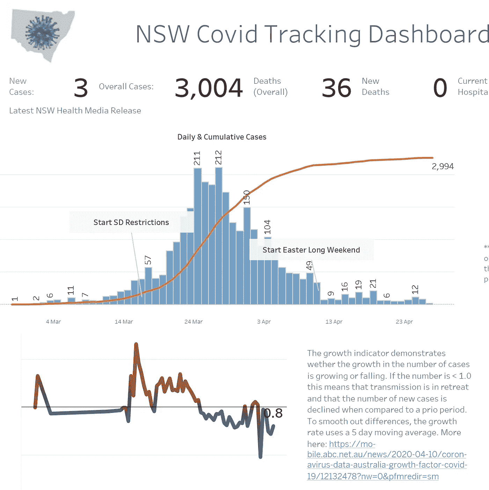
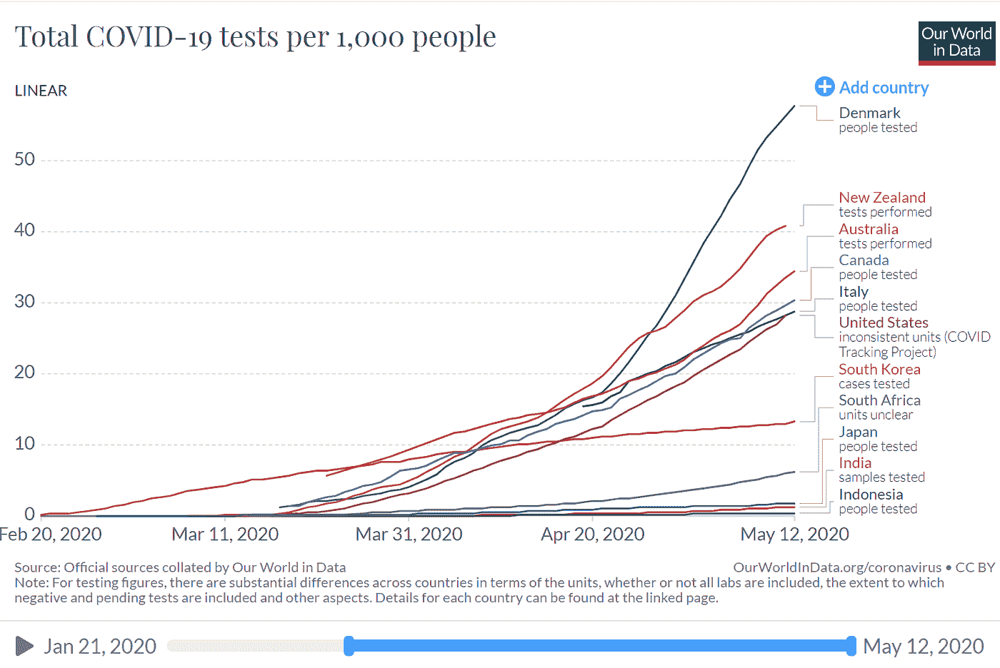
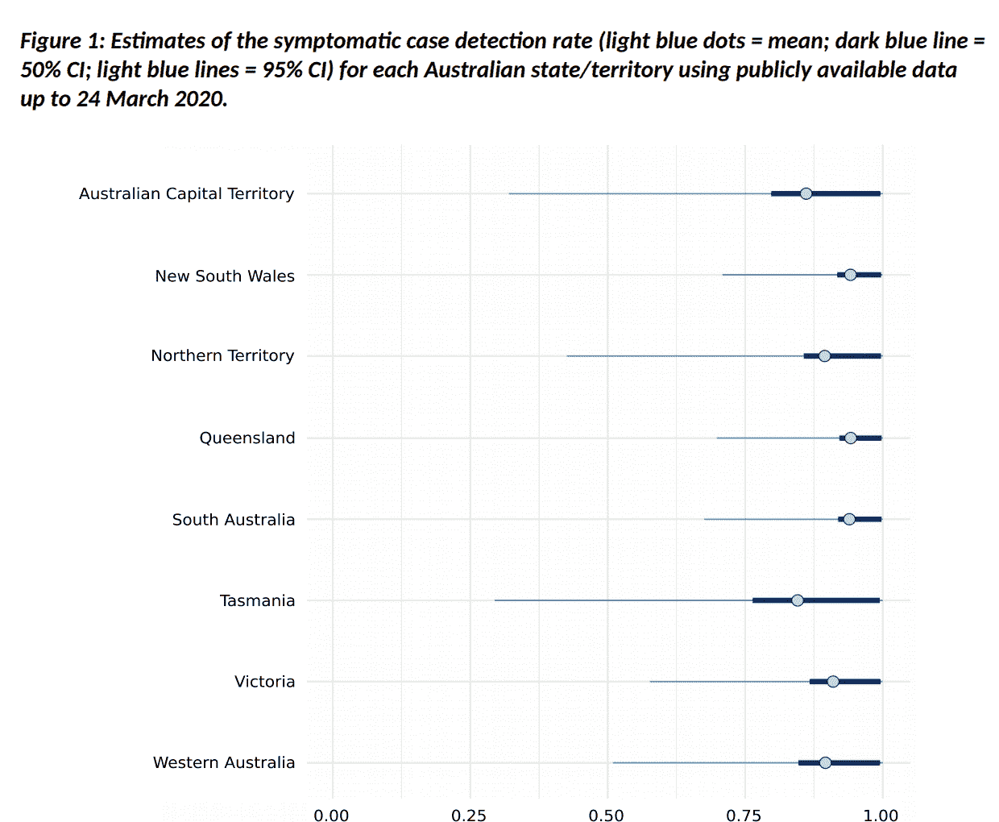
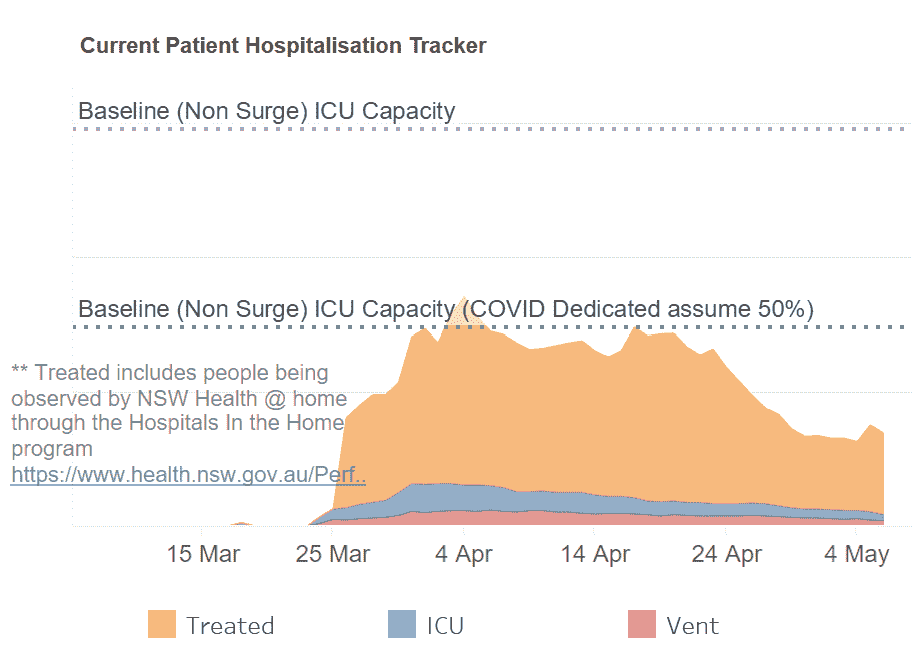
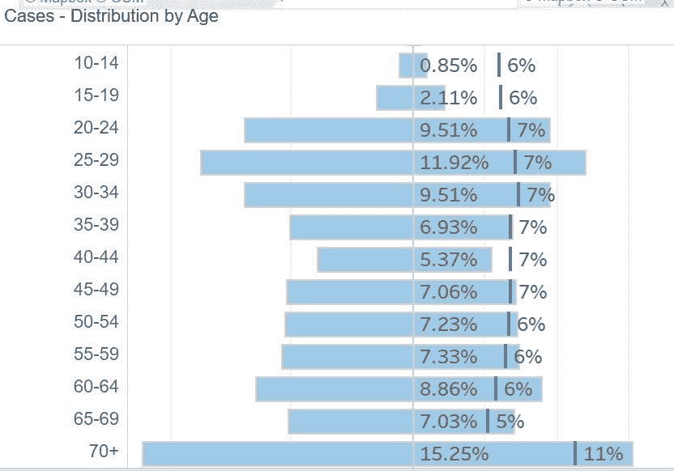
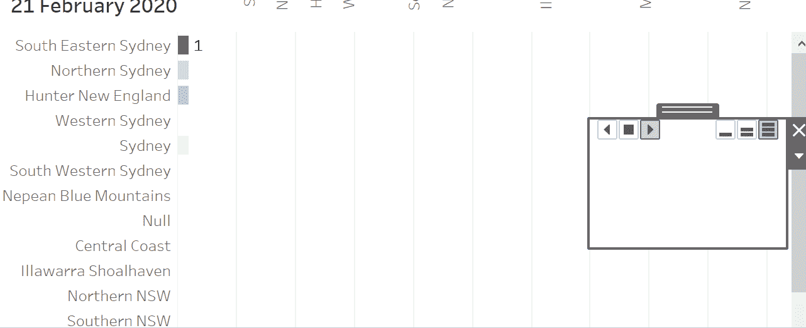
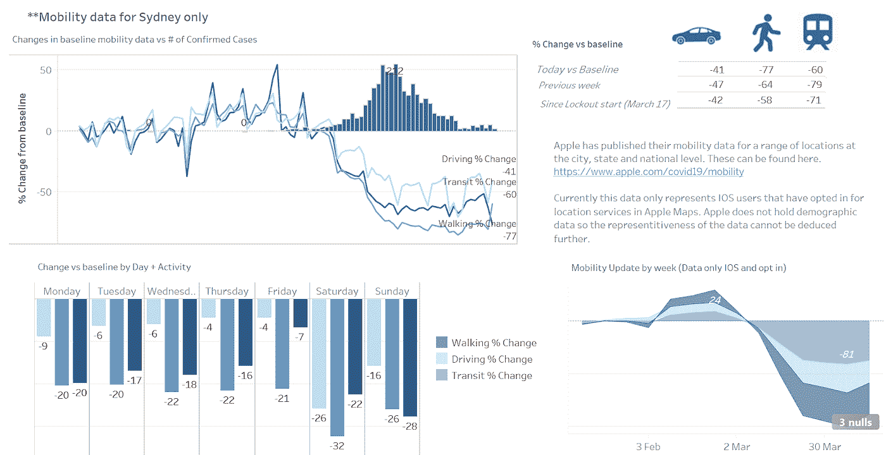

# 为我的家乡州创建 COVID 仪表板的设计决策

> 原文：<https://towardsdatascience.com/design-decisions-in-creating-a-covid-dashboard-for-my-home-state-545a24238952?source=collection_archive---------71----------------------->

最近，我利用业余时间为我的家乡澳大利亚新南威尔士州开发了一个新冠肺炎仪表板。这样做的主要动机是因为我感兴趣的某些数据要么不可用，要么在日常粒度上不可用，要么没有以我认为有价值的方式呈现。仪表板可在此处找到:

设计仪表板是一个数据项目，也是一个设计决策。需要做出的决策包括:需要哪些指标，最终用户将如何使用该工具，如何添加适合于指标的上下文，如何在仪表板中导航或添加“流程”元素以增强用户体验。在本文中，我将在创建新冠肺炎仪表板时讨论其中的一些选择。

## 我应该做一个仪表板吗？

我需要做的第一个编辑决定是是否要做一个仪表板。由于对新冠肺炎知之甚少，而且许多数据来源不完整，我认为，如果使用一个检测能力不足的国家报告的数字，这项工作将是徒劳的。幸运的是，澳大利亚和新南威尔士州拥有一些世界领先的人均检测数据，因此它可以有一定程度的信心说，它正在识别社区内的绝大多数 Covid 病例。

事实上，全国领先的传染病研究中心之一在他们的研究中表明，大多数有症状的病例都有可能被检测出来，其中新南威尔士州在检测覆盖面方面表现尤为突出。([https://www . Doherty . edu . au/uploads/content _ doc/Estimating _ changes _ in _ the _ transmission _ of _ 新冠肺炎 _April14-public-release.pdf](https://www.doherty.edu.au/uploads/content_doc/Estimating_changes_in_the_transmission_of_COVID-19_April14-public-release.pdf) )

鉴于这种强有力的测试立场，以及对州当局捕获和报告的数据点在识别病例的能力方面可能是全面的高度信心，我认为，由于数据的潜在准确性和完整性，制作仪表板是可行的。此外，我决定只关注新南威尔士州(澳大利亚人口最多的州，也是我居住的州)。原因很简单，各州的数据各不相同([https://the conversation . com/how-much-have-much-much-much-much-much-much-much-much-u-we-keep-better-records-we-don-know-136252](https://theconversation.com/how-much-has-australia-really-flattened-the-curve-of-coronavirus-until-we-keep-better-records-we-dont-know-136252))为了 Covid 的目的，澳大利亚的 6 个州可以被视为独立的民族国家，因为它们的地理位置(和面积)以及在州一级政策实施方面的差异。

## 我应该使用什么工具来构建控制面板？

基本上，我把范围缩小到了 3 个比较有名的可视化工具，它们要么是免费的，要么有一个免费增值服务选项来满足我的目的:Tableau、微软的 Power BI (PBI)和谷歌数据工作室(GDS)。我还对专门针对数据新闻的工具做了一些研究，比如 fluore 和 DataWrapper。然而，尽管它们显示了很大的潜力，我还是决定在未来的项目中使用它们，因为我是一个新手，可能会面临更陡峭的学习曲线，这会消耗我的执行时间。

三名候选人各有弱点。虽然我喜欢使用 PBI 进行快速和肮脏的分析，它有一些最好的开箱即用的可视化以及最强大的开发者附加软件生态系统，但我并不热衷于他们用于公开共享工作的云平台。另一方面，GDS 在实际获取该工具所需的数据量方面存在限制，因为他们更喜欢用户使用 google sheets，google sheet 随后在表格尺寸方面存在限制，并且与其他两种工具相比，缺乏其他服务的数据连接器。

这让我有了 Tableau，我很高兴使用它，因为我对这个软件最有经验，我知道我设想的报告应该包含的内容(见下文)在 Tableau 中很容易执行，不需要太多的修改或代码繁重的工作区。在 Tableau 中，我需要做的最复杂的事情是一个大约 15 行的 case 语句，用于按州按年龄组对人口细分进行编码。在一个理想的世界里，我可能会选择 GDS，因为我觉得它在风格上是最强的，特别是当谈到他们的发布平台和分享工作的能力时，然而 Tableau Public 虽然不太引人注目，但却有强大的产品和大量的观众，以及允许我及时执行的所有必要功能。

## 报告应该包括什么

下一个问题是仪表板中应该包括哪些措施。在项目开始的时候，我对我想看的东西有一个很好的看法。这在一定程度上是因为我做仪表板的动机是因为我很难找到定期发布的信息，如同期病例增长率，或检测阳性百分比，或者如果它们被发布，信息在每天的粒度上是不可用的(医院/ ICU 入院的情况)。

除了我希望看到的措施之外，我还希望报告保留一些关于 Covid 管理的关键领域的结构(或者至少是具有可靠的公开可用数据的关键领域——联系人追踪除外),如测试、社交距离实践等。这就产生了最初设计的想法，为每个领域(以及案例和“主页”)设计一个工作表，以便用户可以在工作簿中简单地导航，找到他们需要的信息。这些部分可以在我创建的导航“功能区”中找到，每个部分都指向这些特定指标的指定控制面板。

一旦我对类别有了清晰的认识，接下来的问题就是找到合适的度量来跟踪，以及这些度量的可视化。这些决定中的大部分是由获得这些信息所获得的效用以及它们与市场上其他可视化的区别所驱动的。这使我能够确定一些主要的与众不同的特征，包括:

a)通过使用从州卫生当局的每日媒体发布中收集的公开可用信息，绘制住院人数、ICU 住院人数和使用呼吸机的患者人数的图表，实现“拉平曲线”可视化。然后，根据已知和假设的容量进行映射(假设来源于建议澳大利亚政府响应的主要建模者，他们在规划资源时使用 50%的床位专用于非 covid 患者假设)。

b)我在图表上覆盖了新南威尔士州的人口分布，这些图表用于跟踪按年龄段划分的病例(和测试)分布，以便快速识别代表过多/不足的人口。这解决了不断回顾和查看人口普查数据的需要，以了解年龄分层的传播是如何在社区内表现出来的。

c)我使用运动图来显示当地政府区域随时间的传播情况，以便于显示疫情和“热点”。数据也按传播源进行了删减，以表明相对于从海外司法管辖区传入的传播，有多少是在社区内发生的(新南威尔士州和全澳大利亚的大多数病例都是如此)。

d)最后，我覆盖了最近发布的 IOS 数据，这些数据显示了苹果地图用户选择使用案例后移动数据的变化。查看同一 IOS 数据集按星期几的移动性变化，加上不同时间段的变化，以及所提供的三类变量(步行、驾驶和交通)的行为差异

苹果 IOS 数据强调移动性的变化和社交距离措施的地面流动效应

我还花了一些时间反复思考报告中不应该包含的特性，或者因为无法扩展而不实用的特性。例如，这导致决定按地理位置绘制病例爆发的热图，而不是像著名的[约翰·霍普斯金](https://coronavirus.jhu.edu/map.html)仪表板那样的气泡图，因为这将更有效地扩展。尽管 JH 的仪表盘上会有大量难以辨认的相互重叠的圆圈，但热图可以使用彩色阴影来显示每个邮编案件数量之间的相对差异。这种可视化比气泡图更有效，如果案例数是 500 或 5000，也同样有用。

使用仪表板使我能够遵循我感兴趣的指标，并以可消费的方式组织公开可用的数据。一旦 Covid 通过，我希望做更多的工作，并为其他健康指标重新调整该模板。Covid 疫情带来的对数据的兴趣可以转化为对更多仪表板的需求，将数据融入背景并提供给乐于接受和感兴趣的公众，仪表板是数据重要性和可见性持续增长的最明显表现。

在这里可以找到【https://datandi.com/projects】**并每日更新**

## *有用的资源*

*我发现并参考的其他有用的可视化报告工具包括:*

*[https://www.covid19data.com.au/](https://l.facebook.com/l.php?u=https%3A%2F%2Fwww.covid19data.com.au%2F%3Ffbclid%3DIwAR0ug0Gy4TGEsAVlgWLik6W_iy1c-lGRk6PcTI3_mS7OX8a1NPCbnsUbq98&h=AT1fswtqngJwJ5ucaEAnE0HNoFvgMHW3xEm7LUa2KB9LqWigmBvkcMI5MZAgakJUMNdRwdCtix_MW_hIyq7qxUXX77PijAm-Y-TGZYKi873ppBWzYZ6dGrdjBH48dy6-vw&__tn__=-UK-R&c[0]=AT0XiBw_9IB9K4Osl7D1CYkFBqgPXr3F3xsx1ciU-CstsV8U5oS03UnKDAktbkh2z9ZfTKF4zKQtKlx1BCbKJwrpT1pKZ2r7PwX7aJTS6jZfHSGmT_caGsc_m6zIyGW3FHoe1HydaWmmlVF3YY_ubw)*

*每日联邦政府仪表板[https://www . health . Gov . au/resources/publications/coronavirus-新冠肺炎一览](https://l.facebook.com/l.php?u=https%3A%2F%2Fwww.health.gov.au%2Fresources%2Fpublications%2Fcoronavirus-covid-19-at-a-glance%3Ffbclid%3DIwAR3-sZxMsJUTBWVK8qt-8MMfVTsREb-9Rss-njl-U0GYgujBe5WmRrYcn9Q&h=AT1xyDy2oWVhWCnHlnGail1ObTwGt-f0u_gpPCFb58_KJyUaOjc-iAIdvi_onwVfxR4i6Rri7KgtHzGQuWwb0j3e1riYEwPh-RTdznlK165JefYudchvZd8ZElDzSYTyAA&__tn__=-UK-R&c[0]=AT0XiBw_9IB9K4Osl7D1CYkFBqgPXr3F3xsx1ciU-CstsV8U5oS03UnKDAktbkh2z9ZfTKF4zKQtKlx1BCbKJwrpT1pKZ2r7PwX7aJTS6jZfHSGmT_caGsc_m6zIyGW3FHoe1HydaWmmlVF3YY_ubw)*

*流行病计算器:【https://gabgoh.github.io/COVID/index.html (哇，这个做得很好，向开发者致敬！)*

*《悉尼先驱晨报》最近公布的数据 viz 工具[https://www . smh . com . au/national/新冠肺炎-data-centre-coronavirus-by-the-numbers-2020 04 01-p54g 4 w . html](https://l.facebook.com/l.php?u=https%3A%2F%2Fwww.smh.com.au%2Fnational%2Fcovid-19-data-centre-coronavirus-by-the-numbers-20200401-p54g4w.html%3Ffbclid%3DIwAR3-sZxMsJUTBWVK8qt-8MMfVTsREb-9Rss-njl-U0GYgujBe5WmRrYcn9Q&h=AT1G6OpaWyJ0NpNkpdQFxqvk7memp0eBvexkMa_zbOkBMJj3-W4x9LfgrpyQdIQzlhCKHb-V0_ef6PkHk5T77tX4r-mp79kQsG1zqaMj8jHYisJNqG7r0H-_Nl0TgmDmBw&__tn__=-UK-R&c[0]=AT0XiBw_9IB9K4Osl7D1CYkFBqgPXr3F3xsx1ciU-CstsV8U5oS03UnKDAktbkh2z9ZfTKF4zKQtKlx1BCbKJwrpT1pKZ2r7PwX7aJTS6jZfHSGmT_caGsc_m6zIyGW3FHoe1HydaWmmlVF3YY_ubw)*