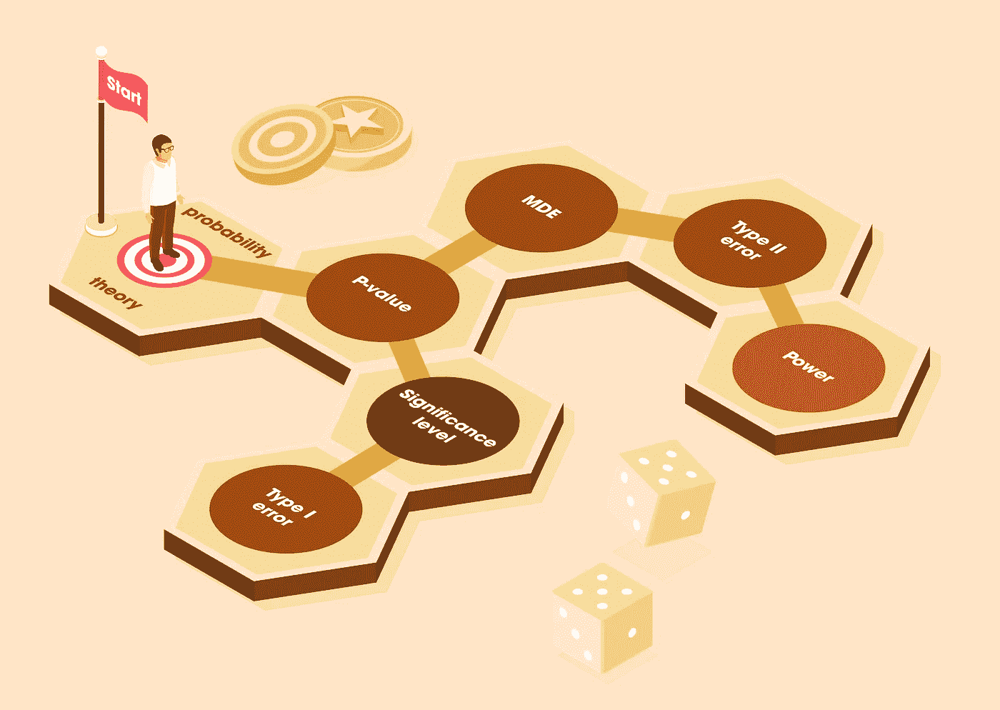
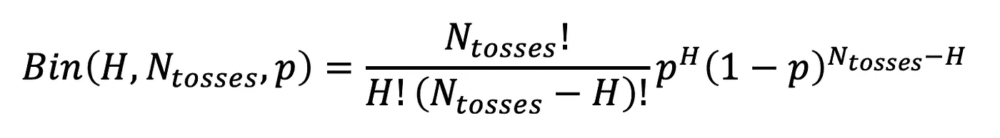
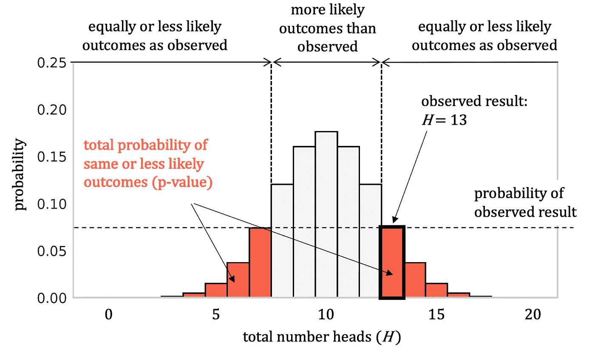
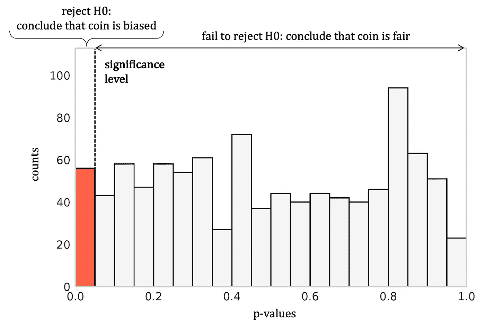
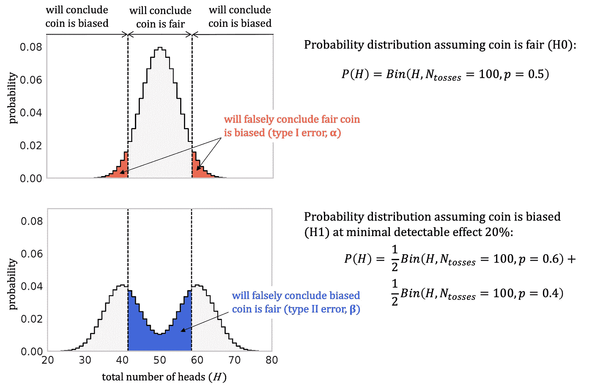
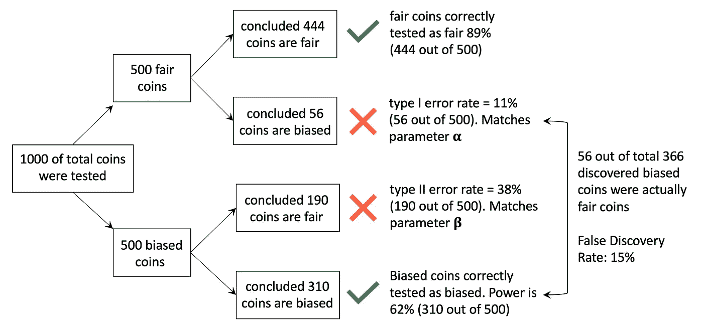
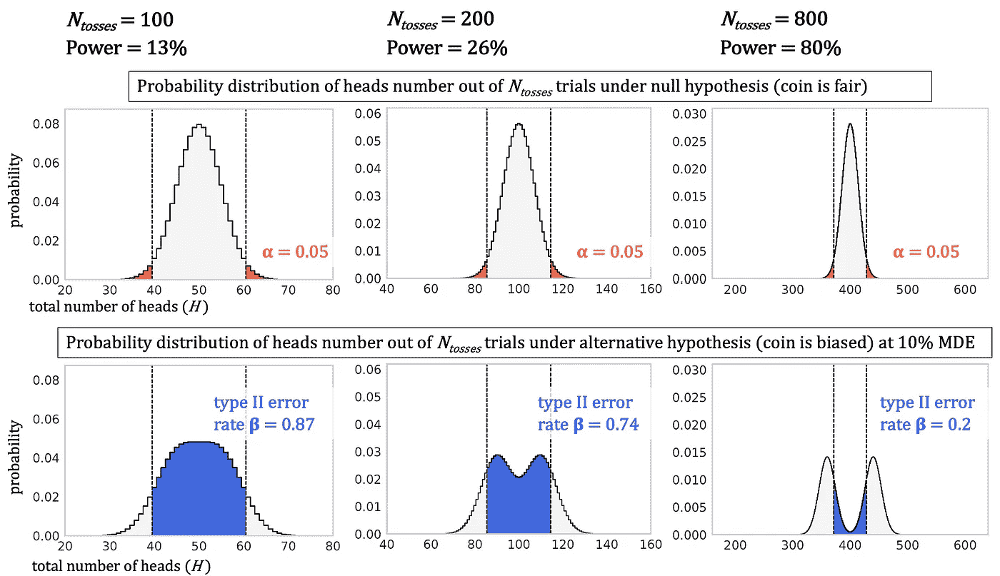
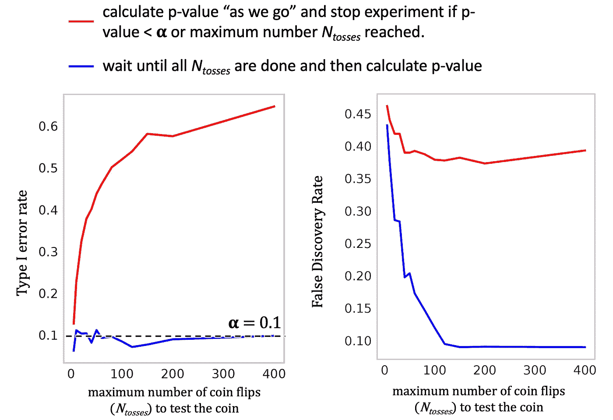
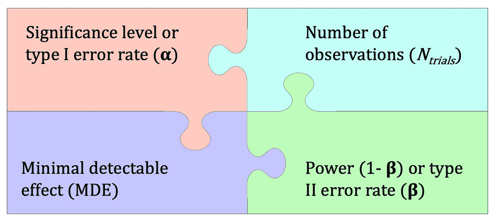

# 实验基础的设计:如果你建造了它们，它们就会出现

> 原文：<https://towardsdatascience.com/design-of-experiment-basics-if-you-build-them-they-will-come-cc6a227a0543?source=collection_archive---------22----------------------->

## [入门](https://towardsdatascience.com/tagged/getting-started)

## 用 Python 蒙特卡罗模拟从基本概率论解释实验概念的设计

*作者图片*

网上已经有成千上万的来源解释 p 值和与统计显著性检验相关的概念。为什么要再写一个？我一次又一次地看到统计测试被用作获取 p 值和应用“黄金法则”的“黑箱”:如果 p 值小于 0.05，那么结果是显著的。通常，这是盲目进行的，没有真正理解 p 值实际显示了什么，没有显示什么，以及如何正确设计和解释实验。我写这篇文章的目的不是提供一个解决具体问题的方法，而是描述与假设检验相关的基本概念以及我们如何得到它们。

我相信，任何概念只有在以下情况下才能被学习和理解:(1)这些概念与我们已经非常熟悉和非常了解的其他概念有着直观的联系(2)当我们在实践中尝试这些新概念时。

在这篇博文中，我将只使用基本的概率论来回顾统计显著性测试和实验设计的主要原则。我们将不使用任何统计测试，相反，我们将从概率基础一步一步地建立一个统计显著性测试过程:从基础到概念，如统计测试、p 值、显著性水平、最小可检测效应、I/II 型错误、测试的功效和实验基础的设计。

为了说明实践中的所有概念，我将在整篇文章中使用抛硬币的例子，并将蒙特卡洛模拟应用于一个问题:如何测试硬币是公平的还是有偏见的？这是顶级科技公司在面试中经常问的一个著名问题。它也足够出名，甚至有自己的[维基百科页面](https://en.wikipedia.org/wiki/Checking_whether_a_coin_is_fair)。抛硬币实验和二项分布是任何人都明白的安全起点。让我们开始吧。

## **简单硬币示例和 p 值**

假设我们有一枚硬币，正面概率 P(正面)= 0.5。假设我们翻转 20 次，得到 13 个正面和 7 个反面。我们应该断定硬币是有重量的还是有偏差的？有没有一种方法可以估计这种结果发生的可能性有多大？为了解决上面的问题，我们需要计算我们的结果的概率，即观察 20 次投掷中的 13 次正面。它由二项式分布给出(等式。1，也是我们在这篇文章中需要用到的唯一等式):

等式 1。在*中观察头数 *H* 的概率 n 在*次独立试验中，给定头数 P(头数)= *p* 的概率。

将这些数字代入等式，我们可以计算出我们观察到的结果的概率为*Bin*(*H*=*13*，*n toses*= 20， *p* = 0.5) = 0.074。仅仅是结果的概率不足以评估我们的结果有多不可能。例如，从 52 副牌中抽取任意一张特定随机牌的概率约为 0.019，但所有可能的结果都是同样可能的。除非我们考虑所有可能的结果及其相应的概率，否则我们无法回答某一特定观察的可能性有多大。

计算特定观察结果不太可能的一种方法是计算看到任何同样可能或不太可能的结果的总概率。回到我们的硬币例子，我们需要计算 20 次抛硬币的所有可能结果的概率(图 1)。接下来，我们计算获得相同或不太可能的结果的几率(图 1 中概率分布的红色区域)，得出 0.19:

图一。假设硬币是公平的，P(正面)= 0.5，20 次抛硬币的所有可能结果的概率分布。函数由等式表示。1 带参数 *Bin* ( *H* ，*n toses*= 20， *p* = 0.5)。红色区域对应于观察到同等或不太可能结果的总概率，称为 p 值。

我们刚刚计算的值叫做 *p 值*。更正式的定义:给定一个观察值(在我们的例子中是掷硬币系列的结果)，以及一个关于系统属性的基本假设(也称为零假设，在我们的例子中我们假设硬币是公平的)，p 值是看到相同或不太可能的观察值的总概率。例如，在一副牌的例子中，观察任何特定牌的 p 值是 1，假设该副牌被洗牌。

我们总结一下。仅使用基本的概率理论，我们刚刚推导出一个硬币的统计测试。这基本上是所有统计测试所做的事情:给定关于系统的观察和基本假设(假设没有影响)，提供 p 值——获得与实际观察到的结果同样可能或更不可能的结果的概率。

## 显著性水平，I 类误差

既然我们知道 p 值是什么，并且我们已经推导出硬币公平性的统计测试，让我们做一个计算实验。让我们想象一下，我们有 1000 枚公平硬币，我们将每枚硬币抛 1000 次。在完成一系列硬币投掷后，我们将使用上述方法计算每枚硬币的 p 值。接下来，我们将所有 1000 个获得的 p 值绘制成直方图:

图二。1000 枚金币的 p 值分布。计算出的 p 值形成均匀分布(在我们的硬币示例中，连续值完全均匀，接近均匀)。

从直方图中可以看出，当零假设为真时(所有测试的 1000 枚硬币实际上都是公平的)，实验的 p 值本质上是一个随机变量，它描述了观察结果的不相似性。在上面的例子中，当硬币是公平的 p 值导致接近均匀分布。

假设将来我们想测试一个未知硬币是否公平。我们可以为 p 值选择一个阈值，低于这个阈值，我们将拒绝硬币是公平的假设。但这样的阈值也有一个权衡:由于公平硬币的 p 值是均匀分布的，选择 0.05 作为阈值将导致 5%的机会得出公平硬币有偏差的结论(图 2，红色区域)。在我们有 1000 枚公平硬币的模拟示例中，我们会错误地得出 56 枚硬币有偏差的结论(大约占测试硬币总数的 5%)。

p 值的选定阈值称为*显著性水平*，通常表示为𝛂.现在应该清楚的是，𝛂对应于我们错误地拒绝零假设的频率，并得出结论，当我们获得的观察结果实际上是由于随机机会时，我们有影响。这种类型的误差称为*I 型误差*。

## 最小可检测效应(MDE)和 II 型误差

现在让我们考虑一个问题，我们有一袋硬币，但我们不知道哪些硬币是公平的 P(人头)= 0.5 或有偏见的 P(人头)≠ 0.5。我们如何从统计学的角度来处理这个问题呢？让我们设计一个实验来测试硬币的公平性。

首先，我们需要定义什么是有偏见的硬币。我们需要设置一个阈值，来衡量我们认为硬币有偏差的概率应该与 0.5 有多大的不同。为了便于说明，假设我们只考虑 P(正面)> 0.6 或 P(正面)< 0.4, in other words, if the heads probability differs from the fair coin by 20% or more (this value is called *最小可检测效应*或 *MDE* 的硬币有偏差。为了测试硬币，让我们将每枚硬币投掷 *Ntosses* = 100 次，并数出总数。我们可以在 20%的选定最小可检测水平下，为公平硬币和有偏差硬币绘制 100 次投掷中正面总数的预期分布图(图 3)。请注意，有两个铃铛，因为一个有偏向的硬币可以有两种偏向。

图 3。公平硬币(顶部)和有偏差硬币(底部)的 100 次投掷中正面总数的概率分布。红色填充区域对应于 I 类错误率；蓝色填充区域对应于第二类错误率。

接下来我们需要选择一个显著性水平，𝛂——称一枚公平的硬币有偏见的可接受几率是多少？为了说明的目的，在这个例子中，我们将𝛂 =0.1。现在，我们有了足够的信息来确定我们需要获得的 100 次投掷中正面总数的范围，以得出硬币是公平的结论，或者拒绝硬币是公平的无效假设并得出硬币是有偏差的结论。公平硬币概率分布的这些边界之外的区域应该等于 0.1(图 3，顶部图形的红色区域)，这给出了一个范围[42，58](包括边界)。如果投掷 100 次后，硬币的正面少于 42 或多于 58(换句话说，p 值小于𝛂),我们将拒绝零假设，并得出硬币有偏差的结论。

很简单吧？然而，我们能用这种方法正确识别所有真正有偏差的硬币吗？一枚有偏向的硬币经过 100 次试验后，最终正面总数在 42 到 58 之间的几率有多大？要回答这个问题，我们需要看看有偏差硬币的预期概率分布(图 3，下图)。42 和 58 之间的蓝色区域是 0.38，这意味着在 38%的情况下，一枚有偏见的硬币实际上会被称为公平的。这被称为*第二类误差*，其概率通常被表示为𝛃.让我们用一个实际的模拟来说明所有这些概念。

## 实验的功效，错误发现率

让我们从一袋 1000 枚硬币开始，其中 500 枚硬币是公平的，500 枚硬币是有偏差的(最低可检测水平为 20%)。假设我们不知道哪些硬币是公平的和有偏见的，我们想执行我们的统计测试来找出它。为了测试，现在让我们将每个硬币投掷 100 次，计算 p 值，将其与我们选择的显著性水平𝛂 = 0.1 进行比较，并决定该硬币是否有偏差。这种实验的结果如图 4 所示。

图 4。1000 枚硬币公平性测试的随机模拟结果。每枚硬币被翻转*n 次* = 100 次，将获得的 p 值与显著性水平𝛂 = 0.1 进行比较，以得出硬币是有偏差还是公平的结论。

只有在 62%的情况下(1- 𝛃),我们能够正确地得出结论，一个真正有偏见的硬币是有偏见的。这个值称为测试的*功率*。我们还可以注意到，在所有 310 + 56 = 366 个识别出的有偏见的硬币中，只有 310 个实际上是有偏见的，56 个实际上是公平的硬币。不正确发现的有偏向硬币的数量与总发现的有偏向硬币的数量之比称为*错误发现率*，在上面的例子中是 15%。如图 5 所示，如果我们获得更多的数据，我们可以提高测试的功效。

图 5。投掷硬币的次数如何影响统计测试的功效。在每种情况下，选择最小可检测效应 MDE = 10%,显著性水平为𝛂 =0.05。

非常重要的是要明白，得到统计上无关紧要的结果并不意味着我们没有效果，或者换句话说，它没有证明我们的零假设。我们的测试可能只是低功率和数据不足以拒绝零假设。

在 A/B 测试中经常看到的另一个常见错误是运行实验，直到 p 值变得低于显著性水平，而不是等待预先确定的观察次数(除非你知道你在做什么，并执行顺序或贝叶斯测试)。这种“随走随看”的方法极大地增加了 I 型错误率以及错误发现率。为了说明这一点，我们可以重复图 4 中的计算实验，其中我们需要测试 1000 枚硬币的偏差，但这次我们将检查“我们进行的”显著性，在每次翻转后计算 p 值。如果满足两个条件中的一个，我们就停止实验:p 值小于𝛂(并断定硬币有偏差)或达到最大翻转次数*n 次数*(断定硬币是公平的)。图 6(红色数据)显示了 I 型错误率和错误发现率与*t 损失*的函数关系。

图 6。与图 4 中的实验相同，但 p 值是在“进行中”计算的(红色数据)。选择显著性水平𝛂 = 0.1。

如果仅在收集预定数量的观察值后进行测试，I 型错误率保持不变，并且接近选定的显著性水平𝛂，与观察值长度无关(图 6，蓝线)。当我们“在进行中”计算 p 值时，这是非常不同的，当我们继续观察时，I 型错误率急剧增加。这个模拟演示了在 A/B 测试过程中得出结论时常见的陷阱。

**汇总在一起进行统计实验设计**

在实践中，我们经常从定义期望的显著性水平𝛂、最小可检测效应和功效(对我们来说不遗漏效应是多么重要)开始。例如，在 A/B 测试的设计过程中，每个实验通常从以下问题开始:

1)我们希望能够可靠地检测到的影响有多小(这将给我们最小的可检测影响)？

2)我们在生产中实施实际上没有效果的变更的可能性有多大？这是显著性水平𝛂或 I 型错误率。

3)我们检测不到实际有用的变化的可能性有多大？这给了我们第二类错误率𝛃.

图 7。对于任何假设检验实验，图上的四个值总是相互关联的。这意味着，对于一个给定的测试和关于被测系统的基本假设(零假设)，如果给定四个值中的任何三个值，您总是可以计算出第四个值。

有了这三个值，我们就可以计算测试所需的观察次数(图 7)。非常重要的是，我们需要在停止实验和做出结论之前收集所有需要的观察结果，否则我们可能会增加错误发现率(图 6)。或者，我们可以使用收集的数据(已知的观察值)、固定的显著性水平和功效，来计算在我们选定的功效下我们可以检测到的最小真实效应大小。任何统计检验的一个重要的普遍概念是，如果我们知道四个值中的三个:显著性水平、功效、观察次数和最小可检测效应，我们就可以计算第四个值。

## 结论

最后，我想再次强调，这篇文章不是任何特定统计测试或实际应用的秘诀。我的目标是描述与假设检验相关的基本概念，以及我们如何得到它们。本质上，这是我自学假设检验的方法。理解了基本原理之后，你可以阅读许多实用的指南，但是要有概念背后的直觉，而不是把它们当作“黑箱”。记住:

> "如果你需要统计数据来证明什么，那很可能不是真的."

(引自 wpi.edu)。

[*链接 Github*](https://github.com/tokedo/stat-dojo/tree/master/design_of_experiment_basics)

【领英:[*https://www.linkedin.com/in/anatoly-zaytsev/*](https://www.linkedin.com/in/anatoly-zaytsev/)

*推特:*[*https://twitter.com/zaytsev_anatoly*](https://twitter.com/zaytsev_anatoly)