# 设计优化:结合进化算法和张拉整体

> 原文：<https://towardsdatascience.com/design-optimization-combining-evolutionary-algorithms-and-tensegrity-e7ec0ac5e7fb?source=collection_archive---------27----------------------->

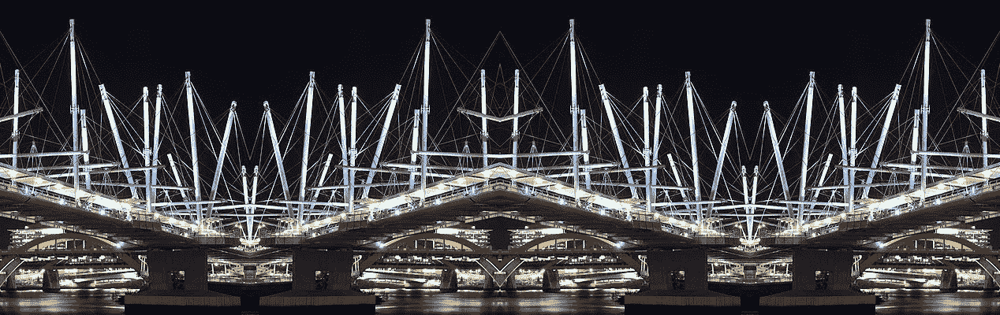

图片编辑自 Steve Collis 的照片 [Kurilpa 桥。](https://commons.wikimedia.org/wiki/File:Brisbane_(6868660143).jpg)

## [实践教程](https://towardsdatascience.com/tagged/hands-on-tutorials)

## 如何使用 Python 和物理引擎来寻找张拉整体结构的最佳设计

一切都始于几周前，当时我无意中发现了一个张拉整体表格的视频。一个看似不可能的结构，却完全真实可行。

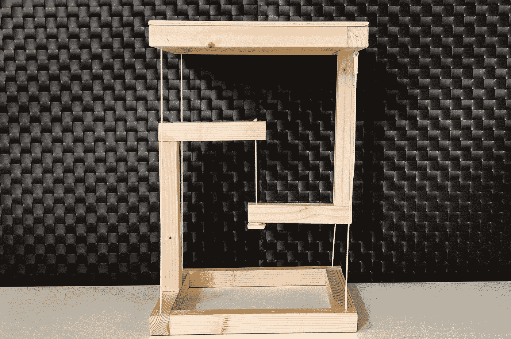

图片由作者提供。

在这里，结构的中央绳索支撑着所有的重量，而侧面的绳索作为悬挂绳索提供平衡。

这种原理被称为[**tense integrity**](https://en.wikipedia.org/wiki/Tensegrity)或 tensional integrity，基于张力和压缩的组合来产生机械稳定性。

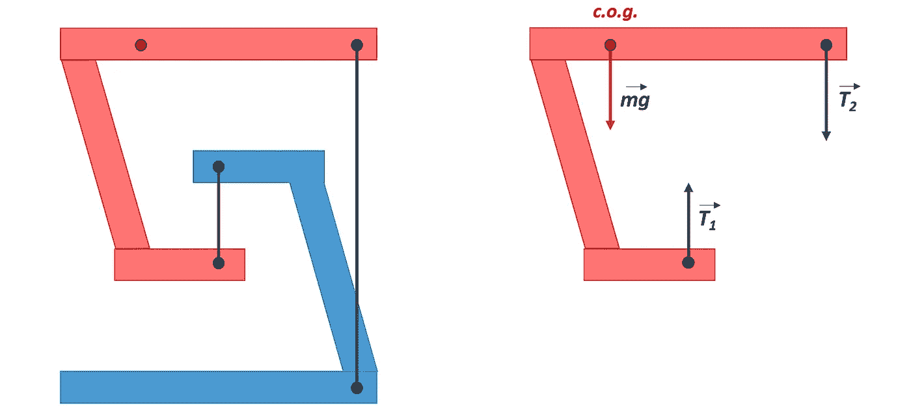

图片由作者提供。

这个术语是由巴克明斯特·富勒在 20 世纪 60 年代创造的，这个概念经常被应用在艺术装置中，但偶尔也会出现在建筑中。一个值得注意的例子是澳大利亚布里斯班的 Kurilpa 桥。

我很惊讶，并决定尝试建立一个自己的小张拉整体表。

当我开始思考创作过程时，我心中的工程师开始提出这样的问题:

*   可以使用的最小电缆数量是多少？
*   提高稳定性的最佳比例是多少？
*   我如何对不同的配置进行基准测试并找到最佳配置？

和往常一样，Python 是我寻找所有这些答案所需要的工具。然而，由于没有专门用来模拟张拉整体结构的库，我不得不从头开始。

我搜索了允许在 Python 中执行物理模拟的库，并选择了 PyChrono，这是一个可以模拟几乎任何东西的物理引擎库。

机电系统、有限元分析和流体固体相互作用只是可以用这个库建模的一些事情。

# **在 PyChrono 中构建张拉整体表**

第一步是使用 PyChrono 构建一个 tensegrity 表，从现在开始我称它为 tensortable。为了简单起见，我选择了一个长方体结构，将平行六面体连接在一起来构建刚性组件。

添加电缆有点困难，需要 pychrono.fea 模块。该模块使用有限元分析来模拟柔性部件，如电缆、电线、轮胎、气囊甚至生物力学组织。

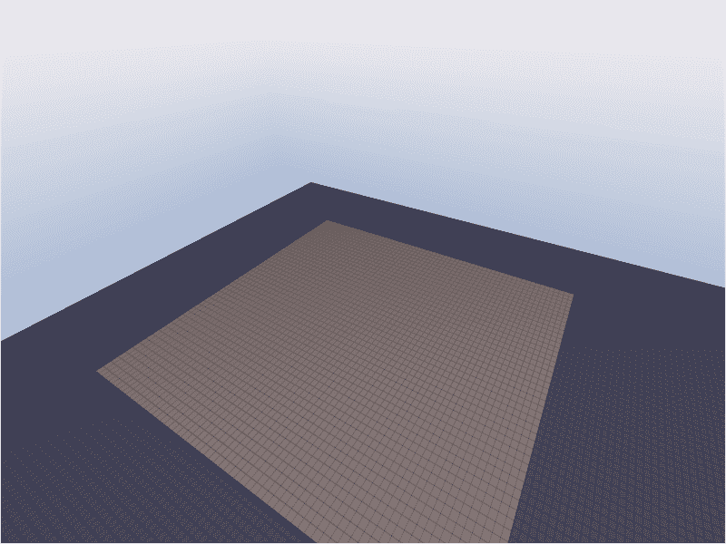

构建过程:每个组件必须按程序设计，指定位置和尺寸(图片由作者提供)。

tensortable 是以编程方式实现的。给定一些输入参数，一个函数生成每个块的位置和尺寸。这在以后会非常方便，因为它允许轻松地部署不同的配置。

可以配置的参数有:

*   **x_base** 和 **z_base** :基座平行六面体的宽度和深度。
*   **x_top** 和 **z_top** :顶部平行六面体的宽度和深度。
*   **y_pole** :垂直杆的高度。
*   **x_beam** :立柱后水平横梁的长度(第二根横梁为 x_base 和 x_beam 之差)

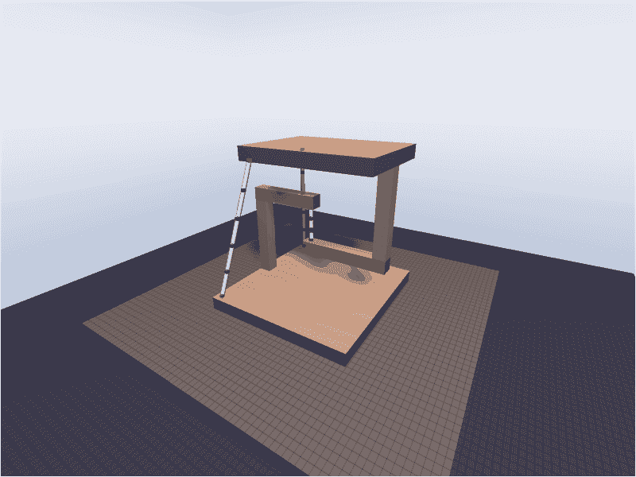

tensortable 的不同配置(图片由作者提供)。

# **创建稳定性测试**

唯一缺少的是评估这些十种分类的稳定性的方法。在模拟中加入地震是一种简单而有趣的方法。

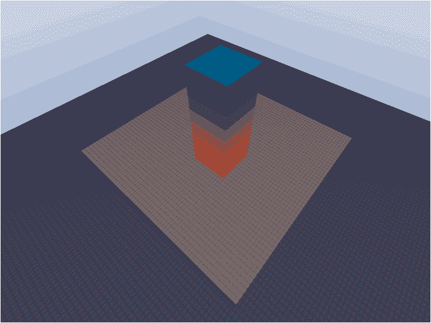

PyChrono 的一场地震和一些立方体(图片由作者提供)。

一个简单的地震可以用作用在地板上的正弦函数来模拟。这个正弦函数的参数是:

*   **频率**:我们每秒钟有多少次振荡。
*   **振幅**:振荡的振幅。
*   **方向**:x 轴、z 轴或两者的组合。

我们将使用这些参数来调整地震的强度。

## 测试不同的配置

到目前为止，已经有可能意识到物理引擎正在正确地工作。

图片由作者提供。

如果没有施加力，只有三根缆索的张力腿平台能够站立，但是一旦有小的摆动，平衡就失去了。

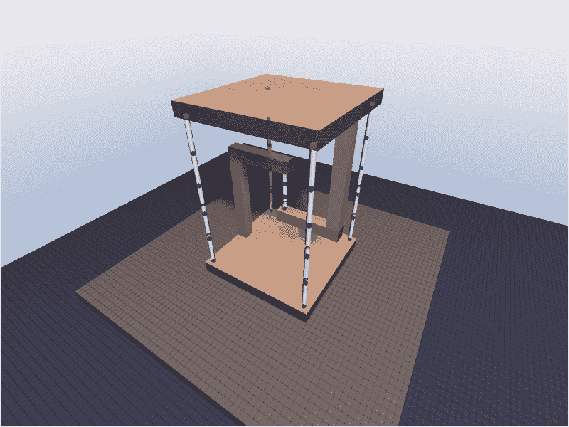

图片由作者提供。

相反，有了五根电缆，即使施加外力，它也能够站立。

# **寻找最佳设计**

此时，我本可以手动模拟十几种配置，找出最佳配置，然后就此收工。但是由于模拟器运行良好，我决定更进一步，创建一个**搜索算法**，它可以以智能和自主的方式找到最佳配置。

这似乎是使用**进化算法**将十种物品进化到最佳形状的绝佳时机。

## 进化算法简介

进化算法是一类受生物进化启发的优化算法。正如在物种的生物进化中一样，像选择、繁殖和突变这样的概念是这些算法的基石。

这个想法非常直观:十个可排序的群体将被测试稳定性，最好的将存活下来并被用作新世代的父母，然后这个过程被迭代。

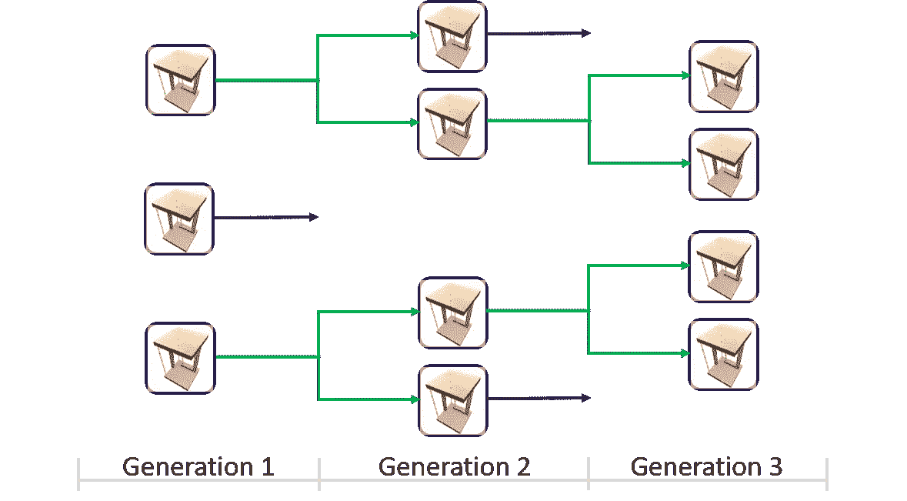

进化过程图:只有最优秀的个体才会把自己的特征传递给下一代。在进化算法中，并不强制父母双方都要生育后代。

实际上，进化算法的步骤如下:

*   **随机化:** 我们从**第 1 代**开始进化过程，这是一个由 100 个随机的十个可排序的群体。
*   **体能评估:**
    我们对人群进行体能测试，这个测试将评估每个个体的好坏。在这种情况下，测试将经受住一系列逐渐增强的地震。每个十个可排序表保持稳定的时间越长，其适合度得分就越高。
    首先，我们计算上半部分的实际位置和目标位置之间的偏差(在完全平衡的情况下，目标位置应该在哪里)。那么稳定性分数可以定义为:

*   **选择:**
    只有最优秀的十种被选择出来，把它们的特性传给后代。十个可排序的项目按体能分数排序，100 个中最好的 10 个被选中。这些个体会自动延续到下一代，除此之外，它们还会被用来产生后代。
*   **突变和重组** :
    突变和重组用于使种群向更好的配置进化。**突变**在于对双亲的参数应用一个变量。**重组**指将两个或两个以上亲本的参数组合起来，生成新的亲本。

    在这种情况下，只使用突变就足够了:每个父代将被用于创建 9 个新的 tensortables。将高斯随机样本添加到父母的参数中，获得孩子的参数:

每次更新后，所有参数都被限制在最小值和最大值之间，从而避免负面措施。

此时该过程可以迭代，简单地重复适应度评估、选择和变异的步骤。每一代都将仅仅基于上一代中最优秀的个体，逐渐进化到更好的稳定性。

我们现在可以让程序运行并收集结果了！

# 结果呢

在这里，我使用了有五根电缆的模型。它已经站得很好，但我想看看什么是最佳比例。

我们可以看到进化向十个短且基数大的可排序对象收敛，这在稳定性方面是完全有意义的。

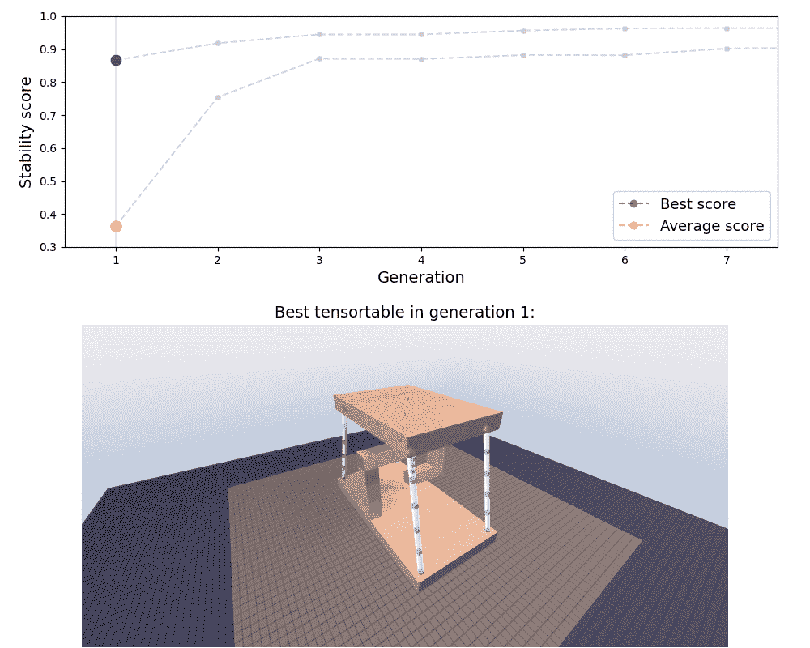

进化过程:最佳个体的得分和群体的平均值(图片由作者提供)。

收敛很快就实现了，这也是我们从这个问题的适度复杂性中所能期待的。

在这里，我们可以享受到在更强烈的地震面前，最终结构的稳定性增加，上半部分几乎不动。

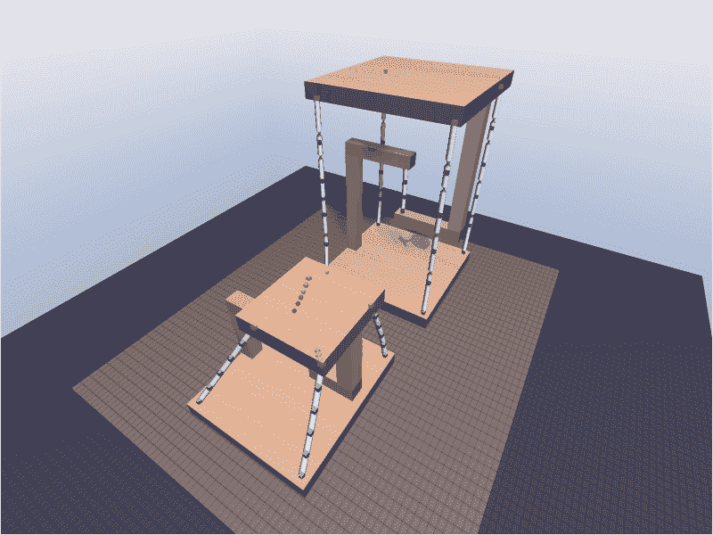

图片由作者提供。

所以现在我们有了它:一种能够以自主方式找到最佳配置的算法。

# 最后…

我也造了一个实体的。

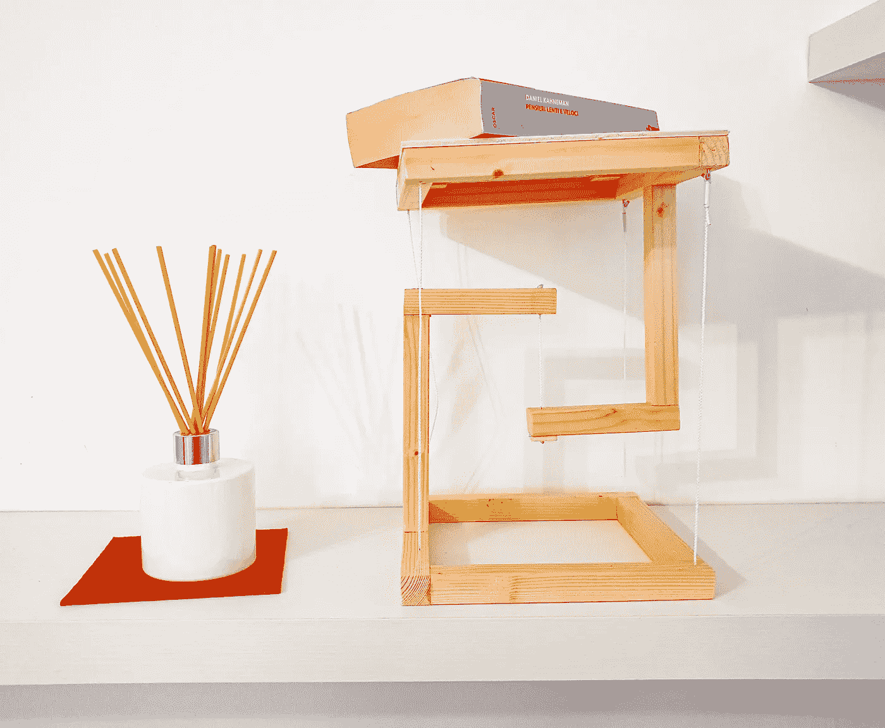

图片由作者提供。

一些木头，螺丝，一点耐心来校准电缆和结构是站起来的。具有讽刺意味的是，在完成所有这些工作后，我仍然选择了我脑海中的最初设计:对称的五根电缆。平衡感很好，但也很悦目。

最终，好的设计不仅仅是功能性的，还包括优雅和外观。

我相信数据科学也是如此。

我一直有意忽略数学和代码，但是如果你对技术方面感兴趣的话，不要担心，我会添加一个代码链接(只要我清理干净！).

*有问题吗？随时联系！*