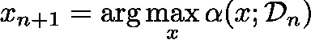
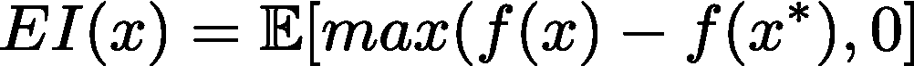
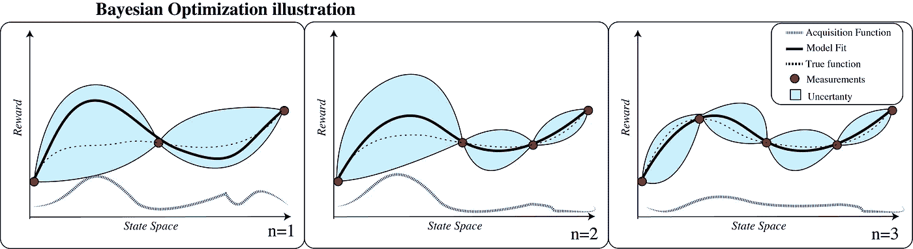
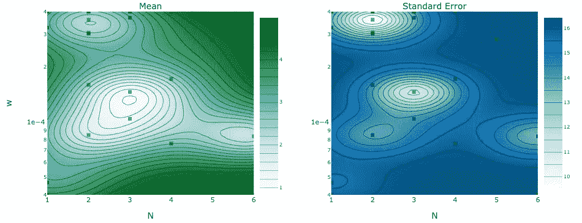
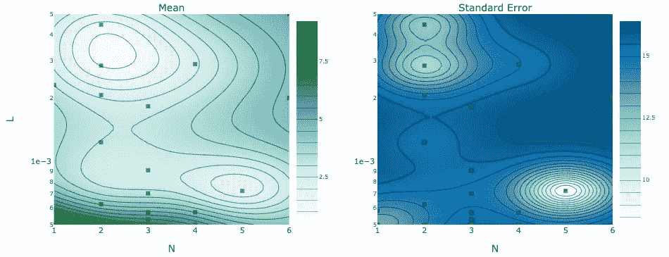
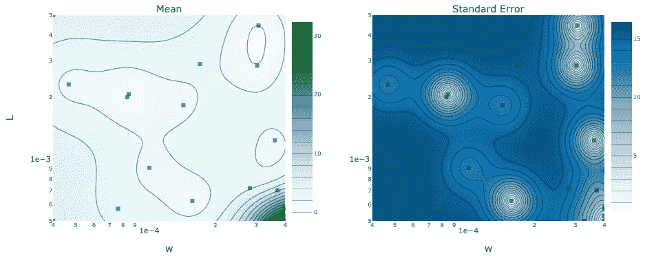
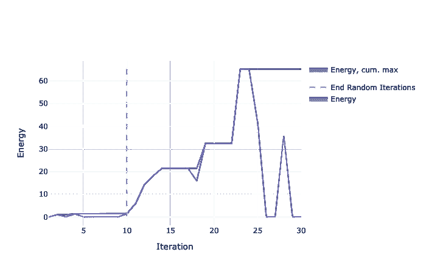

# 用 Python 中的 Ax 进行设计优化

> 原文：<https://towardsdatascience.com/design-optimization-with-ax-in-python-957b1fec776f?source=collection_archive---------10----------------------->

人类在联合优化非线性、高维函数方面很糟糕。这是事实。在机器学习的时代，计算机可以为我们做决定，有工具可以触及如此多的工程领域。在本教程中，我将重点介绍脸书的工具 [Ax](https://ax.dev/) ，它将使用贝叶斯优化来优化用户定义的高维非线性目标。Ax，**自适应实验平台**，是脸书的一个开源工具，用于优化复杂的非线性实验。这真的很尖锐，让我们开始吧。


来源—作者。

# 数学总结

该代码使用贝叶斯优化来迭代地探索状态空间，并将高斯过程拟合到底层模型(实验)。如果你只是想看代码结构，跳过这一部分。注意— *Ax 可以使用其他模型和方法，但是我只关注最适合我的问题的工具*。

## 高斯过程—建模

高斯过程(GP)是一种非线性近似工具。这是跨函数空间的回归。它所做的是获取一个特征向量(x)和一组结果 f(x ),并在两者之间拟合一个连续函数。利用这样的分布，预测是在对特征进行调节的情况下完成的。但是它的名字**高斯**过程是怎么来的呢？

> “高斯过程是高斯概率分布的推广”——卡尔·爱德华·拉斯姆森。

公式是回归问题的概率估计。不确定性估计仍然在这里—现在函数 *f(x)* 被一个 *GP(m(x)，k(x，x'))* 的**均值** (m(x)=E[f(x)])和**协方差** (k(x，x '))函数捕获。用于映射两个变量之间的协方差的函数(在高斯分布中，这只是一个数字)，是它正在建模的概率分布。美妙之处在于，通过智能选择插值函数，*您可以从有限采样中获得状态空间中所有潜在点的平滑近似值*。

推荐阅读—拉斯姆森，卡尔·爱德华。"机器学习中的高斯过程."*关于机器学习的暑期学校*。施普林格，柏林，海德堡，2003。

## 贝叶斯优化—学习

贝叶斯优化(BO)是一种优化非线性问题的工具。它会给你一组设计参数，让你在下一次迭代中尝试。



它是怎么做到的？有两个关键点:1)它迭代地训练一个 GP 模型，2)它使用一个**采集函数**对一组点采样的潜在增益进行建模。最常用的获取函数(抽样函数)是期望改善(EI)。



该函数基于预期比当前最佳值( *x** )提高最多的参数，对下一组参数( *x* )进行采样。最终发生的是，EI 将在高不确定性(潜在高回报)区域的勘探与回报接近最优的微调区域之间取得平衡。 *BO 将在每次迭代中训练一个新的模型，看看哪里有改进的潜力，评估模型(功能)，然后重新训练。*

推荐阅读——Shahriari，Bobak 等人的《把人带出循环:贝叶斯优化综述》IEEE 会议录 104.1(2015):148–175。



来自作者的 BO 的简单说明。

# Python 教程

本教程基于设计一个微机电系统(MEMs)跳跃机器人，我的代码可以在这里找到。这个项目有两个方面:

1.  根据一组约束方程优化设计——一个从第一原理导出的**分析模型**——可能与非线性交织在一起。在 sim.py 中找到，教程对此进行了解释。
2.  通过拟合真实世界中发生的事情的模型来改进**实验建模**和设计效率。真实世界的实验数据显示在 example.py. *中，可以对其进行改进，以给出实验数据符合分析模型的概率可能性。*

 [## natolambert/mems-bo

### 微机电系统设计的贝叶斯优化。在 GitHub 上创建一个帐户，为 natolambert/mems-bo 开发做出贡献。

github.com](https://github.com/natolambert/mems-bo) 

# 代码

现在我将介绍如何用 python 实现这种优化。请打开这个文件并跟随:[https://github.com/natolambert/mems-bo/blob/master/sim.py](https://github.com/natolambert/mems-bo/blob/master/sim.py)(*注意，代码可能比教程更新得更快，但核心元素仍然保留*)。

## 属国

我的例子利用了脸书的两个工具，python ≥3.7。

1.  Ax，*适应性实验平台*([https://ax.dev/](https://ax.dev/))。这将为我们处理所有的数学问题，优化一个复杂的函数并将结果可视化。
2.  Hydra，*一个优雅地配置复杂应用的框架*([https://hydra.cc/](https://hydra.cc/))。这将通过改变一个简单的配置文件来处理任何设计问题。

这是 python 文件头的样子——没有太多的依赖关系。

```
from ax import *
import numpy as np
import pandas as pd

from models import jumper

import os
import sys
import hydra
import logging

# A couple requirements for running Hydra 
sys.path.append(os.getcwd())
log = logging.getLogger(__name__)
```

## 定义优化问题

优化问题必须采取特定的形式，并且是每个新项目需要编写的唯一代码。我们需要的是一个**模型**，它接受一个*字典*的参数，并返回一个*字典*的度量，其中的项目是试验的平均值和标准误差度量。注意— *标准误差是可选的，只是很好地融入支持建模的不确定性估计*。下面是跳跃机器人的一个例子，它设置了 3 个设计参数 ***w，N，L****(*w*:弹簧宽度， *N* :弹簧折叠数， *L* :弹簧长度)，它返回 3 个指标: ***储能，****，以及**

```
**def jumper(parameters):
    rho = 2300
    E = 170e9
    T = 550e-6
    lamb = 13.75
    w = parameters["w"]
    x_max = 5e-3
    N = parameters["N"]
    L = parameters["L"]

    k = 8 * (E * w ** 3 * T) / (N * L ** 3)
    x = x_max
    x_cant = x / (4 * N)
    F_required = k * x
    strain = (3 / 2) * (x_cant) * w / (L / 4) ** 2
    U_stored = 0.5 * k * x ** 2

    return {"Energy": (U_stored, 0.0),
            "Strain": (strain, 0.0),
            "Force": (F_required, 0.0)}**
```

## **程序化地生成状态空间**

**这是我们利用九头蛇的地方。Hydra 将为我们加载这个 config.yaml，并从命令行将其与主要的实验配置交织在一起，因此我们可以轻松地更改我们的问题、搜索空间或约束。**

**优化问题由三部分定义:**

1.  ****状态空间:**状态空间可以在变量范围、固定设计变量或离散选择变量上定义。对数比例和数据类型工具通过投影到更均匀的空间来帮助模型拟合。**
2.  ****约束:** Ax 支持两种类型的约束——结果约束和参数约束。*结果约束*(如下所示)将结果限制在某个值之上或之下，在本例中，力和应变受到约束，因此物理设备可以运行而不会破碎。*可添加参数约束*以确保设计变量在相互关系内。**
3.  ****目标度量:**度量决定了模型中要优化的目标(最大或最小)。Ax 可以处理联合优化。**

**这里是 [jumper.yaml](https://github.com/natolambert/mems-bo/blob/master/conf/model/jumper.yaml) 。**

```
**problem:
  space:
    N:
      type: range
      bounds: [1,6]
      value_type: int
      log_scale: false
    L:
      type: range
      bounds: [5e-4, 1.9e-3]
      value_type: float
      log_scale: true
    w:
      type: range
      bounds: [4.0e-5, 4.0e-4]
      value_type: float
      log_scale: false
  constraints:
    Strain:
      type: LEQ
      value: 0.5e-2
    Force:
      type: LEQ
      value: 15.0e-3
  metric:
    name: Energy
    minimize: false**
```

**git 上有用于将配置转换成 Ax 对象的[函数](https://github.com/natolambert/mems-bo/blob/8e456fbdce524d1fccc0a7d0b5992c4bc48ce1c6/sim.py#L43)。Ax 的框架然后使用一个实验性的 API，该 API 将用于其余的代码——所有的优化过程都浓缩到这个对象中。**

```
**exp = SimpleExperiment(
    name="MEMS Optimization",
    search_space=SearchSpace(search_space),
    evaluation_function=jumper,
    objective_name="Energy",
    minimize=False,
    outcome_constraints=outcome_con,
)**
```

## **优化循环**

**这里有两个重要的参与者:**

1.  **SOBOL:这是一个用于准随机搜索的[搜索范例](https://en.wikipedia.org/wiki/Sobol_sequence),它比纯粹的随机搜索产生更均匀的覆盖范围。**
2.  **GPEI:这是贝叶斯优化器的高斯过程模型，内置了预期改善获取功能。**

**优化循环运行一个搜索阶段，以确保模型的均匀覆盖，然后 GPEI 将快速优化模型参数到最佳值。**

**进行搜索。**

```
**sobol = Models.SOBOL(exp.search_space)
num_search = cfg.bo.random
for i in range(num_search):
    exp.new_trial(generator_run=sobol.gen(1))
    exp.trials[len(exp.trials) - 1].run()**
```

**训练一个模特。**

```
**# data = exp.fetch_data()
gpei = Models.BOTORCH(experiment=exp, data=exp.eval())**
```

**迭代改进。**

```
**num_opt = cfg.bo.optimized
for i in range(num_opt):
    print(f"Running GP+EI optimization trial {i + 1}/{num_opt}...")
    # Reinitialize GP+EI model at each step with updated data.
    batch = exp.new_trial(generator_run=gpei.gen(1))
    gpei = Models.BOTORCH(experiment=exp, data=exp.eval())**
```

# **结果呢**

**高斯过程之上的贝叶斯优化产生了奇妙的、可解释的结果。在这里，我们将展示模型如何覆盖设计空间，以及优化器如何改进目标。**

## **设计空间**

**通过一个简单的函数，Ax 可以可视化多个变量中 GP 的*先验*。这给了我们一个可视化设计权衡的好方法。**

```
**plot_contour(model=gpei,
                    param_x="N",
                    param_y="w",
                    metric_name="Energy",
                    lower_is_better=cfg.metric.minimize)**
```

**下面我们将看到的是显示不同空间的 GP 均值和协方差的图。直观地说，平均值是目标的估计值(在这种情况下是**能量**)。标准误差是协方差估计值——不确定性估计值，它与预期改善的抽样有关。**

****

**春季褶皱宽度与褶皱数量模型景观。左边是预测储存能量的平均值，右边是模型的不确定性。**

********

**左:N 对 L 模型景观。右:左对右模型景观。**

**曲线显示，NvL 和 LvW 空间中有非常特定的区域可以创建功能性设备。这对应于物理约束。检查模型在探索过程中如何演变并向最终景观收敛也很有用，这可以通过将相同的绘图代码添加到学习循环中来完成。**

## **学习曲线**

**迭代解决问题最重要的部分是改进。如果工具除了随机抽样之外没有显示进展，那还有什么意义呢？有了 Ax，我们可以很容易地观察到学习进度随时间的变化，方法单一。**

```
**optimization_trace_single_method(
    y=objective_means.T, ylabel=cfg.metric.name,
    model_transitions=[cfg.bo.random], trace_color=(114, 110, 180),
)**
```

**下面是迭代与储存能量的关系图(通过机器人质量标准化以最大化跳跃高度)。垂直虚线的左边是随机 SOBOL 迭代，右边是 GPEI 迭代。很明显，系统正在学习，最终，在最优区域的预期改善如此之低，以至于回报下降(它正在探索状态空间的其他不确定区域。)**

****

# **结论**

**希望您能看到这个工具的威力，以及将它应用于各种问题是多么容易。Ax 框架非常强大，我已经在多个项目中使用它(学习机器人控制器是 MEMs 设计的另一个方面)。**

**有人可能会问，为什么我们不能用当今最流行的回归工具——神经网络来做这样的迭代更新呢？答案在于近似平滑度和数据覆盖范围。GPs 的强大之处在于，该模型在测量点之间拟合出平滑的近似值，从而在标记的训练集之外给出**惊人、稳定的预测。试图用神经网络来做这件事是非常危险的，因为神经网络**在训练分布**之外发散。这又是何时使用哪种机器学习模型的另一个例子。****

****当正确的工具应用于结构化问题时，机器学习效果最佳**——而不是当任意工具被扔向任何问题时。**

**更多？订阅我关于机器人、人工智能和社会的时事通讯！**

**[](https://robotic.substack.com/) [## 自动化大众化

### 一个关于机器人和人工智能的博客，让它们对每个人都有益，以及即将到来的自动化浪潮…

robotic.substack.com](https://robotic.substack.com/)**