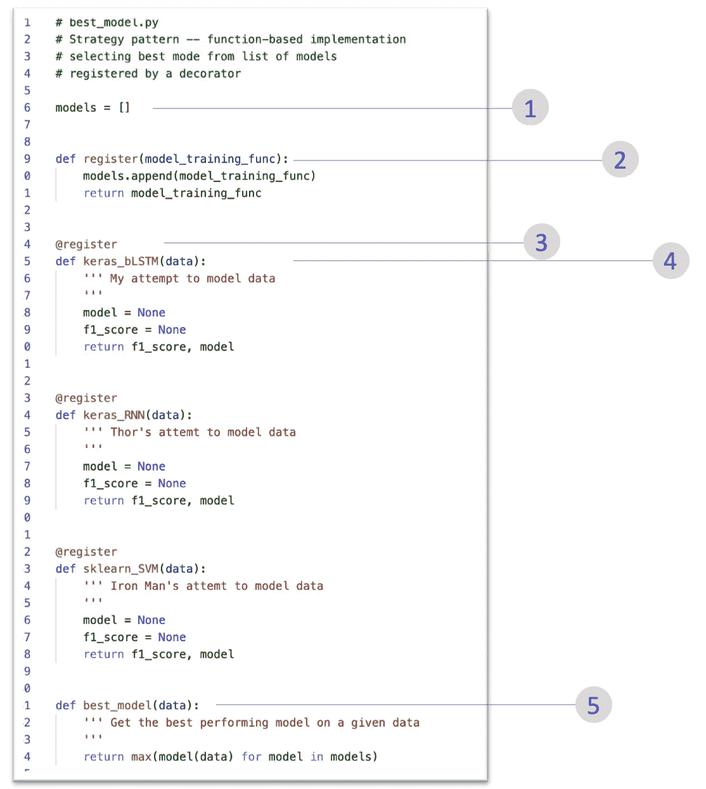

# 机器学习培训工作流程的设计模式

> 原文：<https://towardsdatascience.com/design-pattern-for-machine-learning-training-work-flow-1945da4d3b05?source=collection_archive---------40----------------------->

## 作为一名数据科学家，我做很多快速实验。在这篇文章中，我解释了如何使用高阶函数和装饰器来管理我的 Python 实验。


来自[爆发](https://burst.shopify.com/laptop?utm_campaign=photo_credit&utm_content=Free+Programmers+Reviewing+Code+On+Computer+Image%3A+Stunning+Photography&utm_medium=referral&utm_source=credit)的[莎拉·普弗卢格](https://burst.shopify.com/@sarahpflugphoto?utm_campaign=photo_credit&utm_content=Free+Programmers+Reviewing+Code+On+Computer+Image%3A+Stunning+Photography&utm_medium=referral&utm_source=credit)的照片

我相信我所有的读者都会在他们的数据集上尝试多种训练算法，以找到性能最佳的模型。我已经多次这样做了，在整个练习结束时，我的工作空间会是这样的—


经过几轮实验后，我的工作区

最终，我会忘记我在每个文件中做了什么，甚至为了记住最佳型号，我将不得不浏览每个笔记本文件来检查性能。当我邀请合作者参与这个项目时，系统变得更加复杂。我和我的合作者将有我们自己的训练代码，我们每个人都将用他们自己的代码创建一个 Python 文件/笔记本。这整个设置变成了一个令人头疼的维护问题。

我已经学会了通过实现一个叫做“[策略](https://www.tutorialspoint.com/python_design_patterns/python_design_patterns_strategy.htm)”的设计模式来降低复杂性。我一启动项目就设置了这种模式，并提高了项目代码的可维护性和可重用性。

在阐述策略之前，我需要引入高阶函数和装饰器的概念。如果您已经了解了这一点，请跳过接下来的两个部分。

# 高阶函数

Python 将函数视为一级对象。这个想法很深刻，很细致。在这篇文章中，我无法公正地对待这个复杂的话题。相反，我将敦促你们所有人向那些写了多篇关于“一流”文章的大师们学习。相反，我将展示两个将函数视为一级对象的例子。


在这个例子中，我们创建了一个函数来计算阶乘，Python 解释器在`0x103d6b430`注册了这个函数。第一类自然允许我-

1.  将阶乘赋值给一个名为`fact`的新变量，并使用该变量计算阶乘。而且，
2.  将`factorial`作为参数传递给函数`accumulate`。

函数`accumulate`是一个**高阶函数**，因为它将一个函数作为输入。高阶函数在数据科学(以及整个 Python)中很流行。我确信所有的数据科学家都使用过像`df.apply(np.mean)`这样的模式来构建他们的熊猫数据框架。`np.mean`是一个函数，由于`apply`将其作为输入，`apply`是一个高阶函数。

# 装修工

装饰器也是高阶函数，它接受另一个函数(称为装饰函数)作为参数，并返回或替换该函数。我将集中讨论一个最简单的装潢师的例子。

```
def decorator(func):
	'''do something'''
	return func@decorate
def my_function():
	'''Interesting code'''# The above is equivalent to - 
decorate(my_function)
```

装饰者利用 Python 中函数的**一级性质。**

# 战略设计模式

设计模式描述了一个具有**模式**的问题，然后提出了该问题的解决方案。在我的情况下，问题是在合作进行机器学习的快速实验时减少混乱。

引用维基百科-

> 在[计算机编程](https://en.wikipedia.org/wiki/Computer_programming)中，**策略模式**(也称为**策略模式**)是一种[行为](https://en.wikipedia.org/wiki/Behavioral_design_pattern) [软件设计模式](https://en.wikipedia.org/wiki/Design_pattern_(computer_science))，能够在运行时选择[算法](https://en.wikipedia.org/wiki/Algorithm)。代码不是直接实现单个算法，而是接收运行时指令，以决定使用哪一组算法。[【1】](https://en.wikipedia.org/wiki/Strategy_pattern#cite_note-1)

我使用的策略模式包括使用装饰器来跟踪和获取模型。实现如下图所示。



模型训练代码的脚手架

1.  我已经初始化了一个空列表来存储我感兴趣的所有模型。
2.  我创建了一个`register`装饰函数来注册我的模型。装饰器接受任何函数，并将该函数添加到列表中`models`
3.  我使用`@register`关键字来注册我的模型
4.  我将每个模型训练代码作为一个独立的函数来编写。但是它们都实现了标准的返回类型。在这个例子中是 F1 分数和训练模型。
5.  现在`best_model(data)`获取所有注册的模型，并返回性能最好的模型。

每当我的合作者添加一个新的模型训练函数时，她都会用关键字`@register`来修饰这个函数，新的模型就会被集成到我的训练运行中。

这种模式允许我们以灵活和简单的方式开发 ML 模型。该模式在运行时选择最佳模型。我可以添加一个新的模型训练代码，并且可以运行模型训练功能的全部或特定子集。要移除任何函数(模型训练代码),我可以只注释掉`@register`装饰器。

# 结论

随着许多人尝试不同的技巧，协作机器学习变得复杂和混乱，您的开发环境变成了陈旧代码和笔记本文件的复杂混乱。我推荐的模式可以帮助开发人员灵活地设计新代码，并允许维护人员保持代码库的整洁。该策略在开发人员中强制执行纪律，以编写标准的可重用代码。这个策略帮助我和我的团队缩短了代码开发时间，减少了代码中的错误。