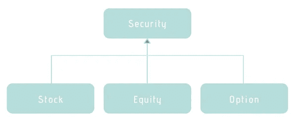
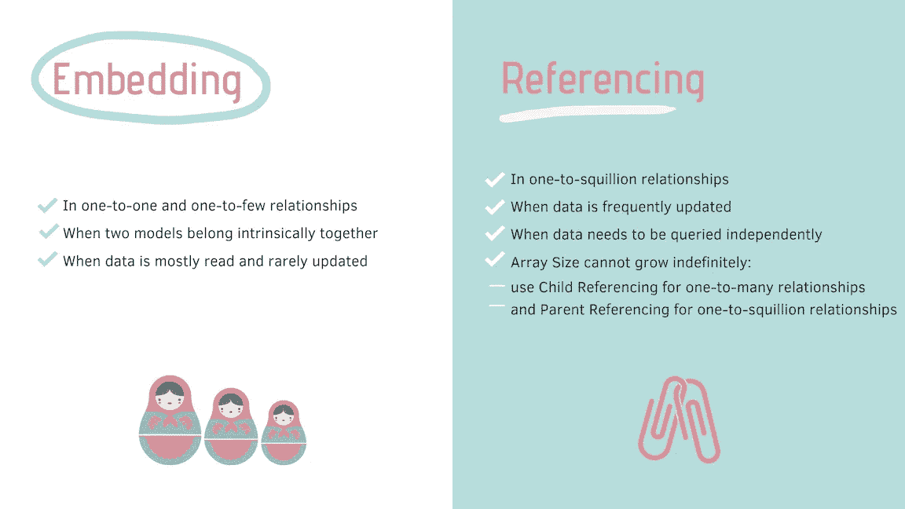

# MongoDB 的设计模式

> 原文：<https://towardsdatascience.com/design-patterns-for-mongodb-894767315905?source=collection_archive---------6----------------------->

## 每个全栈开发人员在构建 MongoDB 模式时需要做出的设计决策


自从计算出现以来，数据一直在增长，这对存储、处理和分析技术的需求产生了直接影响。在过去的十年中，开发人员已经从 SQL 数据库转移到 NoSQL 数据库，MongoDB 作为企业应用程序世界中的运营数据存储库，在受欢迎程度方面占据了主导地位。

如果你读过我最近的文章或者亲自了解我，你可能会意识到我是多么重视软件架构和模式。大多数人认为它们只适用于服务器端。我真的相信后端设计不应该是事后的想法，而是架构的关键部分。糟糕的设计选择明显影响了解决方案的可伸缩性和性能。

因此，今天我将向您介绍一些**实用的** MongoDB 设计模式，任何全栈开发人员在使用 MEAN 均值技术集合时都应该了解这些模式:

*   [多态模式](#8739)
*   [聚合数据模型](#464d)

```
❗️**Assumption:** Basic familiarity with MongoDB is necessary, so is some understanding of relational modelling (because we will refer to SQL as a contrasting approach).
```

# 宏伟的计划(或模式😄)的东西

通常，我们认为 MongoDB 是一个无模式数据库，但这并不完全正确！它确实有模式，但是它是动态的，也就是说，该模式不在相同集合的文档上实施，相反，它具有改变和变形的能力；这就是为什么它被称为多态模式。这意味着不同的数据集可以存储在一起，这是蓬勃发展的非结构化大数据的竞争优势。

## 遗传和多态性

特别是当涉及到面向对象编程(OOP)和继承时，MongoDB 的多态功能变得非常方便，因为开发人员可以将同一层次结构(父子)的不同类的实例序列化到同一集合中，然后将它们反序列化为对象。

这在关系数据库中不是很直接，因为表有固定的模式。例如，考虑一个交易系统:一个`Security`基类可以派生为`Stock`、`Equity`、`Option`等。



在 MongoDB 中，我们可以将派生类型存储在一个名为`Security`的集合中，并在每个文档上添加一个鉴别器(`_t`)，而在关系数据库中，我们有以下建模选择:

*   包含`Stock`、`Equity`、`Option`字段联合的单个表，产生一个**稀疏填充的**模式。
*   三个表，分别对应`Stock`、`Equity`、`Option`的具体实现，导致**冗余**(因为`Security`属性有重复的基础信息)，以及**检索所有类型证券的复杂查询**。
*   一个表用于`Security`的公共内容，三个表用于`Stock`、`Equity`、`Option`，它们将有一个`SecurityID`，并且将只包含各自的属性。这个选项解决了冗余问题，但是查询仍然会变得复杂。

如您所见，这里包含的代码比多态 MongoDb 集合中的多得多！

## 图式进化

生活中唯一不变的事情就是变化——这当然适用于数据库模式，当涉及到传统的关系数据库系统时，它经常会带来挑战和一些麻烦。一个表格模式的致命弱点是，对一个表的小改动会引起整个数据库的连锁反应，并且会影响到服务器端的应用程序代码。

典型的方法是停止应用程序，进行备份，运行复杂的**迁移**脚本以支持新模式，发布新版本的应用程序以支持新模式，然后重启应用程序。由于持续部署(CD)负责该版本的应用程序方面，需要**长时间停机**的最耗时任务被限制在数据库迁移上。一些在大表上执行的`ALTER`命令甚至需要几天才能完成…

然而，在 MongoDB 中，向后兼容性是现成的，所以开发人员在服务器端代码本身中考虑这些变化。一旦应用程序被更新以处理缺少字段的情况，我们就可以在后台迁移正在讨论的集合，同时应用程序还在运行(假设涉及不止一个节点)。当整个集合被迁移时，我们可以替换我们的应用程序代码来真正忘记旧字段。

数据库设计不是一成不变的，在遗留的表格数据库中，模式更改可能会令人烦恼(如果不是瘫痪的话)，所以 MongoDB 的多态特性确实非常强大。


# 嵌入还是不嵌入:这是个问题！

如果你有任何 OOP 经验，你一定在你的职业生涯中遇到过 Eric Evan 的经典著作[领域驱动设计](https://www.amazon.co.uk/Domain-Driven-Design-Tackling-Complexity-Software/dp/0321125215/)，它介绍了**集合模型**。聚合是我们作为一个单元进行交互的数据集合，通常比传统的行/记录具有更复杂的结构，即它可以包含嵌套列表、字典或其他复合类型。

仅在单个聚合的内容中支持原子性；换句话说，聚集形成了一个 [ACID 操作](https://en.wikipedia.org/wiki/ACID)的边界(阅读 MongoDB 手册中的[)。处理聚合间的关系比聚合内的关系更困难:**连接**在内核中不被直接支持，而是在应用程序代码中或者用有点复杂的](https://docs.mongodb.com/manual/core/write-operations-atomicity/)[聚合管道](https://docs.mongodb.com/manual/aggregation/)框架来管理。

本质上，在是否将**相关对象嵌入另一个**相关对象或者**通过 ID 引用**相关对象上有一个很好的平衡，并且作为建模中的大多数事情，没有关于如何做出这个决定的一站式解决方案。它在很大程度上是特定于上下文的，因为它取决于应用程序如何与数据交互。

在我们继续之前，我们需要了解嵌入的优势是什么:

```
🔴 The main reason for embedding documents is read performance which is connected to the very nature of the way **computer disks** are built: when looking for a particular record, they may take a while to locate it (high latency); but once they do, accessing any additional bytes happens fast (high bandwidth). So collocating related information makes sense as it can be retrieved in one go.🔴 Another aspect is that it reduces the **round trips** to the database that we had to program in order to query separate collections.
```

现在，让我们根据两个实体之间的关系类型，探讨一些在设计 MongoDB 模式时需要考虑的问题:

## 1:1

一对一关系是一种描述两个实体之间关系的基数类型，其中实体 A 中的一条记录与实体 b 中的一条记录相关联。它可以通过两种方式建模:将关系嵌入为子文档，或者链接到单独集合中的文档(没有强制外键约束，因此关系只存在于应用程序级架构中)。这完全取决于应用程序访问数据的方式、频率以及数据集的生命周期(例如，如果实体 A 被删除，实体 B 是否仍然存在？)

```
**Golden Rule #1:** If an object B needs to be accessed on its own  (i.e. outside the context of the parent object A) then use reference, otherwise embed.
```

## 1:N

一对多关系是指两个实体 A 和 B 之间的关系，其中一方可以有一个或多个到另一方的链接，而相反的是单边的。像 1:1 关系一样，它也可以通过利用嵌入或引用来建模。
以下是需要考虑的主要因素:

如果对象的嵌套数组将不受控制地增加，则不建议嵌入，因为:

*   每个文档不能超过 16MB。
*   需要为不断增长的文档分配新的空间，还需要更新索引，这会影响写入性能。

在这种情况下，引用是优选的，并且实体 A 和 B 被建模为独立的集合。然而，一个代价是我们需要执行第二次查询来获得实体 B 的细节，因此读取性能可能会受到影响。一个**应用级连接**来拯救我们:通过正确的**索引**(用于内存优化)和使用**投影**(用于减少网络带宽)，服务器端连接比推送到 DB 引擎的连接稍微贵一些。应该很少需要`$lookup`操作符。如果我们需要它很多，有一个模式气味！

另一种选择是使用预聚合集合(充当 [OLAP 立方体](https://en.wikipedia.org/wiki/OLAP_cube))来简化其中一些连接。

```
**Golden Rule # 2:** Arrays should not grow without bound.
- If there are less than a couple of hundred narrow documents on the B side, it is safe to embed them;
— If there are more than a couple of hundred documents on the B side, we don’t embed the whole document; we link them by having an array of B objectID references;
— If there are more than a few thousand documents on the B side, we use a parent-reference to the A-side in the B objects.
```

和

```
**Golden Rule # 3:** Application-level joins are common practice and not to be frowned upon; in these cases indexing selection makes or breaks the querying performance.
```

**❗️Denormalisation:** 使我们的文档非规范化的两个因素是:

*   更新将不再是原子性的；
*   高读写比(即经常被读取且很少被更新的字段是反规范化的良好候选)。

## 男:男

多对多关系是指两个实体 A 和 B 之间的关系，其中双方可以有一个或多个到另一方的链接。在关系数据库中，这些情况用连接表建模，然而在 MongoDB 中我们可以使用**双向嵌入**，所以我们查询 A 来搜索 B 对象的嵌入引用，然后用`$in`操作符查询 B 来找到这些返回的引用(反过来也是可能的)。反之亦然。

这里的复杂性来自于在 A 和 B 之间建立一个**平衡**，因为 16MB 的阈值也可能被打破。在这些情况下，建议使用单向嵌入。



# 推荐阅读

*   [NoSQL 蒸馏](https://www.amazon.co.uk/NoSQL-Distilled-Emerging-Polyglot-Persistence/dp/0321826620)
*   [MongoDB 大学:有模式的建筑](https://www.mongodb.com/blog/post/building-with-patterns-a-summary)
*   [MongoDB 反模式(MongoDb World 2019)](https://www.slideshare.net/mongodb/mongodb-world-2019-raiders-of-the-antipatterns-a-journey-towards-fixing-schema-mistakes-in-mongodb)
*   [领域驱动设计](https://dddcommunity.org)

# 收场白

所有这些的结果是，MongoDB 使我们能够设计我们的模式来满足我们的应用程序的需求，这样我们就可以充分利用它们。这种灵活性非常强大，但是这种力量需要根据我们在应用程序中使用的模式来加以利用。—我们需要记住，性能问题通常是由糟糕的模式设计引起的，因此，第一次就把它做好是至关重要的。

感谢阅读！

*我经常在媒体上写关于领导力、技术&的数据——如果你想阅读我未来的帖子，请*[*‘关注’我*](https://medium.com/@semika) *！*