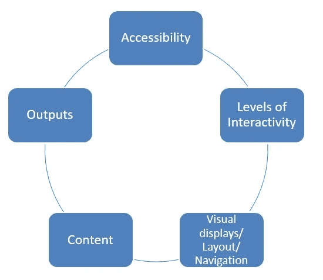

# 医疗环境中数据可视化的设计原则

> 原文：<https://towardsdatascience.com/design-principles-for-data-visualisation-in-a-healthcare-setting-ef9bf2954a58?source=collection_archive---------37----------------------->

## 向更广泛的受众展示医疗保健数据时，需要以用户为中心的迭代设计

医疗保健产生了大量的数据和数据分析的潜力。在进行任何分析或比较之前，充分理解数据以及如何使用数据是很重要的。作为由健康基金会资助的数据可视化项目的一部分，东北质量观察站制定了七个设计原则。

虽然项目的重点是将平面文件格式转换成交互式工具，但我们有大量的变化；包括数据来源和输出类型。在项目过程中，我们发现起草一些指导方针来帮助工具的开发是有益的。作为项目的一部分，在简短的文献回顾和与临床医生的互动之后，这些被进一步发展以产生七个设计原则:

1.  临床医生参与了整个过程的每一步
2.  用正确的临床问题引导
3.  使数据及时和相关
4.  用户没有学习曲线
5.  没有必要重新发明轮子
6.  数据是灵活的和可共享的
7.  适合这项工作的工具

**设计原则 1。临床医生全程参与**

*最终用户(临床医生)在设计阶段的参与对于获得适合他们的交互式数据可视化(DV)工具/仪表板的功能并确保可接受性至关重要。*

对于用于通知质量改进的 DV 工具/仪表板，它需要被最终用户(在这种情况下是临床医生)接受。如果用户参与设计阶段，可接受性会增加。让临床医生参与设计阶段可以探索他们或他们团队的成员将如何使用 DV 工具/仪表板，因此在功能上不基于开发团队的假设。由于相互竞争的优先事项和临床承诺，与临床医生的接触必须适应临床模式。

临床医生对数据可视化工具的要求和关键组件

这一原则是针对医疗保健项目制定的，但也适用于许多领域——最终用户应该参与设计流程的每一步，因为这将确保工具中的功能如预期的那样存在，并且工具的使用是有效的。设计一个不适合目的的工具是对资源的滥用，因此不经常使用。

**设计原则 2。以正确的临床问题开始**

*明确最终用户的主要临床问题，并据此设计 DV 工具/仪表板。*

当处理大型数据集时，有一种尝试和回答没有被问到的问题的诱惑。这可能导致数据过载，有可能导致关键信息丢失。仪表板或数据可视化工具应该“过滤噪音”,以便在所有信息中更容易找到关键的“信号”。

最终，如果必要，一个临床问题可以集中在一些后续问题上。当最终用户希望对其临床单位有一个总体了解时，他们会问一组不同的问题，而不是在浏览数据以找到关于质量不同方面的深入信息时。因此，理想情况下，家庭暴力工具/仪表板的设计应考虑到根据所提问题的不同详细程度；应该可以获得一个部门或医院如何运作的概况，以及回答对实际护理质量的不同方面的深入询问。

**设计原则 3。使数据及时相关**

*数据应尽可能更新(并考虑排除太旧而无法回答问题的数据)。*

如果数据“陈旧”，它可能会失去一些功能，变得无关紧要。关于护理质量的决定应该基于被认为有用的最新可用数据。排除基于临床医生认为太旧而无法提供有用见解的基础数据的指标可能是值得的。这是一种理想化的情况。本项目中使用的数据基于公开的国家审计。进行这些审计需要时间来收集、清理和分析数据，因此自然会有延迟。现有的最新数据可能在某种程度上已经过时。在临床设置中，可以收集实时数据，但是在这种情况下，很少有或没有机会进行数据清理或聚合，因此可能会妨碍临床单位或护理质量的比较。

**设计原则 4。用户没有学习曲线**

*确保 DV 工具/仪表板对最终用户来说一目了然，易于使用和导航。*

最终用户应该不需要很高的 IT 技能就能使用该工具或仪表盘。最终用户学习如何使用新工具的时间有限。为了最大限度地利用，这些工具及其导航需要一目了然，并且不需要 IT/计算方面的资格认证，以便能够在很短的准备时间内与数据进行交互。应该不需要传统的用户手册就能够与数据进行交互。为了帮助使用仪表板，在这个项目中，我们能够在可视化中加入详细的“如何做”部分。这些说明了该工具如何在不妨碍显示的情况下工作，并同样增强了 DV 工具/仪表板的易用性。使用浮动的“how to”也可以用来提供说明文字；解释数据显示了什么以及如何最好地解释它。

在 DV 工具中导航是直观的，这一点很重要。指标的顺序和流程应该对临床医生有意义。任何链接的目的地都应该是预期的。最终用户在设计阶段的参与应该有助于这个导航过程，给出一个用户如何接近产品的指示。重要的是，用户能够将他们的时间集中在数据和它所讲述的故事上，而不是试图浏览 DV 工具/仪表板。

**设计原则 5。没有必要重新发明轮子**

*了解公认的视觉设计原则。在需要解释的地方加入解释性的叙述，确保你避免“忙碌”的视觉效果和信息超载。*

布局和格式很重要——需要在视觉复杂性和信息实用性之间取得平衡。如果整个 DV 工具/仪表板不一致，那么用户可能会不知所措。同样，颜色需要在视觉上吸引人，适合色觉缺陷(CVD ),并且没有意想不到的含义；例如，使用红色和绿色，但不要在低俗的情况下使用。导航元素应该是一致的(相同的地方，看起来一样，清晰的标签)，它们应该看起来像是相关的或者是集合的一部分。一旦在一个 viz(vizualization)上设置了功能，用户希望所有其他 viz 都具有相同的功能和感觉。

仪表板/DV 工具的开发人员应了解 PARC 原则(接近、对齐、重复和对比)和格式塔原则；不管模式存在与否，寻找模式是人的天性。如果两个项目看起来相似，就会认为它们的功能相似。当创建显示多个指标和图表的仪表板时，人的本性决定了那些靠近的将是关联的指标。

当感觉需要解释性叙述时，这需要足够有帮助并提供答案，而不会使观想过于复杂而无法提供问题的简单答案。重要的是，任何仪表板上的可视化是清晰的，而不是杂乱的不必要的文本。

**设计原则 6。数据灵活且可共享**

*确保 DV 工具/仪表板能够提取输出内容，以纳入用户自己的报告和演示。*

数据召回的概念是早期设计原则([(设计原则 4)](#_top) 和[(设计原则 5)](#_top) )中提到的导航的基础。DV 工具/仪表板的一个关键特性是，工具首次使用时所做的任何选择都会保留在整个产品中。这改进了导航并确保可视化被正确解释。

为了最大限度地提高交互式仪表板和最终用户的工作效率，用户应该能够设置自己对软件中保存的数据的查询。然后可以定期共享或重新运行。能够保存查询确保了在下一个时间点被询问的问题没有变化，并且这将有助于验证结果和突出任何问题(例如，作为异常值)。

重要的是，数据和数据可视化可以共享，这也提供了一种提高护理质量的方法，其中数据可以突出任何问题或加强任何积极的改进。因此，重要的是，任何产品都必须能够提取输出内容，以包含在用户自己的报告和演示中。应该可以保存单个图表，并且图表的布局有利于提取(即任何解释文本都不会与图表重叠)。然后，图表应该以允许共享的格式保存，无论是通过电子邮件还是通过将它们插入不同的文档或演示文稿。

**设计原则 7。适合工作的工具**

*静态和交互式仪表板都很有用，因为可能仍然需要静态报告来提供护理质量的概述，并且可能需要交互式 DV 工具/仪表板来实现数据的“深度挖掘”。*

交互式数据可视化工具的产生并不意味着不再需要静态产品。两种类型的报告(静态的和交互式的)都有不同的作用，这对临床医生都有好处。虽然静态报告的内容有限，因为提问的问题是预先确定的，不能更改，但它们提供的内容实际上掌握在最终用户手中。由于可能在国民医疗服务体系(NHS)内运行的过时/受限的 IT 系统，一些临床医生似乎不愿意使用在线工具，并准备为了稳定性和可靠性而牺牲 DV 工具的交互性。

所使用的互动软件还应在输出方面提供稳定性和可靠性，但也应允许对数据提出的问题进行讨论和变化。假设底层计算机硬件和网络供应，为正确的工作选择正确的工具将是有益的；静态报告提供数据和高级分析的概述，以及允许进一步调查更具体问题的交互式工具。

**结论**

这些设计原则是作为一个项目的一部分制定的，该项目旨在调查交互式数据可视化是否有助于临床医生改善患者护理。虽然它们旨在与家庭暴力工具和仪表板相关，但总体原则可以推广到任何报告系统。类似地，设计原则可以应用于医疗保健之外的其他领域，在这些领域中，客户的参与将有利于测量结果的工具的设计。

采用这些设计原则可能会鼓励对产品的吸收；最终用户的指导和他们在设计阶段的参与可能会使产品更具吸引力，因为它更“切合目的”。最终，这些原则应该支持和加强一个有用的产品的设计，这个产品需要很少的交付时间，并且像预期的那样运行。