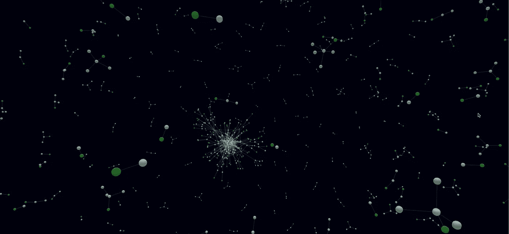
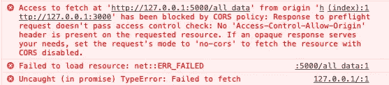

# 设计 3D 医疗保健网络图

> 原文：<https://towardsdatascience.com/designing-a-3d-healthcare-network-graph-291e4f75e9a5?source=collection_archive---------62----------------------->

## 使用 TigerGraph、Python 和 JavaScript 对医疗保健数据建模的一种很酷的方式



三维力导向网络图

# 介绍

正如我们所知，图形数据库已经彻底改变了世界。在过去的十年里，他们已经在大量的案例中证明了他们的有用性，从社交媒体网络到欺诈检测再到推荐引擎。图形数据库的真正优势是能够有效地表示信息片段之间的关系。这尤其适用于高度关联的数据，如医院记录。

在这篇博客中，我将介绍一个例子，说明我们如何将存储在图形数据库中的医疗保健数据以 3D 形式直观地展示出来。由于大量的连接，2D 网络图可能很快变得混乱和不可读；然而，这些问题可以通过改变我们的视角来解决。在 2D 选项失败的情况下，3D 图形提供了更容易看到的数据的扩展视图。

因为数据存储在图形数据库中，所以用图形可视化才有意义。这样，我们所要做的就是将数据库中已经存在的连接转换成可见的东西。

有了这样的背景，让我们开始制作我们的 3D 图形杰作吧！

*这个博客的完整代码可以在我的* [*Github*](https://github.com/akash-kaul/3d-network-graph-visualization) *上找到。*

# 设计图形数据库模式

我在这个项目中使用的图形数据库是建立在 TigerGraph 的基础上的，使用的是由一个叫做 Synthea 的整洁的开源程序生成的合成病人数据。如果你对 Synthea 不熟悉，可以看看我写的这个[短博客](/generating-synthetic-patient-data-b7901c3bd397?source=friends_link&sk=439d87db6fb28671063d1a29fad8262e)或者看看[他们的网站](https://synthetichealth.github.io/synthea/)。

**如果你有兴趣看看我用来设计这个医疗网络的过程，可以看看我的** [**上一篇博文**](/modeling-healthcare-data-with-graph-databases-3e3695bcae3c) **。**

否则，请随意设计您自己的图表或使用预制的图表。TigerGraph 有大量的教程和例子可以帮助你设计自己的图形。或者，你可以参考我写的一篇[文章](/linking-documents-in-a-semantic-graph-732ab511a01e?source=friends_link&sk=61ea0c500afbfe8babddf4d1c4e4c80f)，这篇文章将带你了解一般的图形设计过程。

从这一点开始，我提到的一切都可以用任何图形来完成。

# 访问图表

为了访问我们的图表，我们将使用由 Parker Erickson 创建的 [pyTigerGraph](https://parkererickson.github.io/pyTigerGraph/) Python 连接器。安装并导入软件包后，您可以使用以下代码连接到您的图形服务器:

连接到 TigerGraph

如果您没有令牌，您可以创建一个带有密码的令牌。

接下来，运行一个已安装的查询来从图表中获取数据。

运行 GSQL 查询

以下是查询。它会抓取所有患者以及与这些患者直接相关的所有边和顶点。

```
CREATE QUERY grab_All_3d_demo() FOR GRAPH MyGraph { 

 ListAccum<EDGE> @@edgeList;

 Seed = {Patient.*}; data = SELECT s FROM Seed:s -(ANY:e)-ANY:t ACCUM @@edgeList +=e;
 other = SELECT t FROM Seed:s -(ANY:e)-ANY:t;

 print data;
 print other;
 print @@edgeList;
}
```

# 格式化数据

当我们运行查询时，它会返回大量信息。我们可以尝试绘制所有进来的数据(本质上是绘制这些患者的大多数医疗保健接触点)，但我们的图表最终会看起来非常混乱。因此，我们将只获取数据的一部分。

我选择了这些病人，他们的地址，以及他们一生中的任何过敏反应或影像学研究。

解析传入数据

这段代码可能有些混乱，所以让我们仔细分析一下到底是怎么回事。

1.  首先，提取与 GSQL 查询中的 3 个 print 语句相对应的 3 个列表。
2.  接下来，创建两个名为*节点*和*链接*的列表。这些将包含我们的三维图形的顶点和边。
3.  现在，抓取代表患者、地址、过敏或成像研究的所有节点。对于每个节点，我们添加三个属性: *id* 、*描述*和*组*。 *id* 是图形用来建立连接的标识符。*描述*是当鼠标悬停在节点上时出现的文本，而*组*用于给节点着色。
4.  对于每个环节，我们也有三个属性:*源*、*目标*、*组*。*组*属性再次对应于着色。*源*和*目标*属性对应于该边的源和目标顶点的 id。
5.  最后，将这两个列表添加到 JSON 格式的字典中。这一步非常关键，因为我们的 JavaScript 函数无法识别其他格式的数据。

这样，数据现在就可以使用了！

# 用 Flask 传递数据

为了让我们的 JavaScript 函数实时接收来自 Python 的图形数据，我们需要设置一个服务器。我们将使用[烧瓶](https://flask.palletsprojects.com/en/1.1.x/)来完成。我们所要做的就是将我们已经创建的函数包装在 Flask web 服务器结构中。完整的 Python 代码现在看起来应该是这样的:

最终 python 代码

这个项目的 python 部分现在已经完成了！

# 创建图表

这个可视化的核心是 [3D 力图](https://github.com/vasturiano/3d-force-graph)包。这个包建立在 ThreeJS 和 WebGL 之上，使得生成力定向图变得非常简单。

像大多数 web 应用程序一样，这个网络图可视化是使用 HTML、JavaScript 和 CSS 构建的。让我们分别看一下这些组件。

## 超文本标记语言

这个项目的 HTML 非常简单。

网站的 HTML

**关键部件:**

—三维力图包

— CSS 样式表

— JavaScript 代码(*dataset-loader . js*)

## 半铸钢ˌ钢性铸铁(Cast Semi-Steel)

这里没什么特别的。

网站的 CSS 文件

## Java Script 语言

生成图表的 JavaScript 代码

让我们再次将这段代码分解成更小的步骤。

1.  使用 *fetch* 语句从我们的 Flask 服务器获取数据
2.  使用 3D-Force-Graph 软件包生成我们的图形
3.  指定图形属性(即按组着色，将悬停数据设置为“描述”)
4.  创建一个循环，使图形旋转。为什么？因为旋转图太牛逼了！

## CORS 问题

如果您试图按原样运行这段代码，很可能会遇到 CORS 错误。



CORS 误差

你可以在这里阅读关于 CORS 问题的文章。要解决这个问题，您需要指定允许数据流动的响应头。我用谷歌浏览器的 [Moesif Origin 和 CORS 转换器](https://chrome.google.com/webstore/detail/moesif-orign-cors-changer/digfbfaphojjndkpccljibejjbppifbc?hl=en-US)扩展解决了这个问题。如果您在本地运行该程序，这将非常有用。然而，如果您想要部署该图，您将需要在 [Flask](https://flask-cors.readthedocs.io/en/latest/) 和 [JavaScript](https://javascript.info/fetch-crossorigin) 上配置适当的设置。

# 有趣的东西

这是所有的代码。现在，我们剩下要做的就是运行服务器，欣赏它的辉煌。


# 结论

通过不多的代码，我们收集了存储在图形数据库中的大量数据，并创建了一个令人惊叹的 3D 可视化来显示这些数据。我们使用 TigerGraph 来存储医疗保健信息，使用 Python 来提取和处理我们的数据，使用 JavaScript 和 HTML 来创建 3D 视图。这个过程并不复杂，但会产生非常酷的结果。这篇博客中展示的方法也可以用在医疗行业之外。任何处理高度关联数据的领域都可以从图形中受益，利用图形数据库存储信息的能力和 3D 网络图显示信息的能力。

我希望你喜欢阅读这个博客，并学到一些新的东西！让我知道你的想法，并在 LinkedIn 上与我联系。

[](https://www.linkedin.com/in/akash-kaul-6a8063194/) [## 阿卡什·考尔-数据科学实习生-未来学家学院| LinkedIn

### 查看阿卡什·考尔在全球最大的职业社区 LinkedIn 上的个人资料。阿卡什有 5 个工作列在他们的…

www.linkedin.com](https://www.linkedin.com/in/akash-kaul-6a8063194/) [](https://github.com/akash-kaul/3d-network-graph-visualization.git) [## akash-kaul/3d 网络图可视化

### 在 GitHub 上创建一个帐户，为 akash-kaul/3d 网络图可视化开发做出贡献。

github.com](https://github.com/akash-kaul/3d-network-graph-visualization.git)