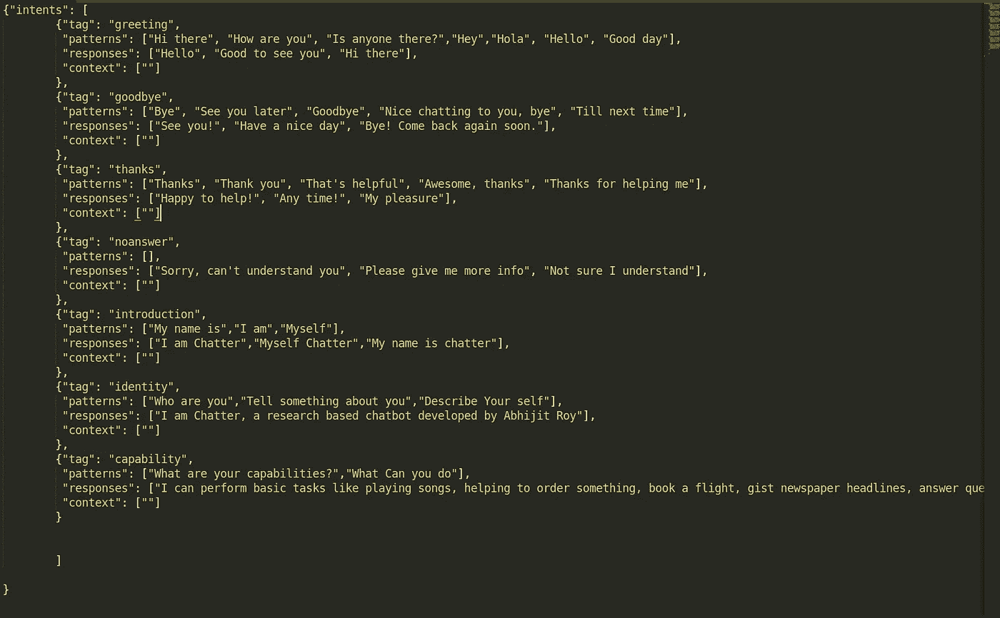

# 使用 Python 设计聊天机器人:一种改进的方法

> 原文：<https://towardsdatascience.com/designing-a-chatbot-using-python-a-modified-approach-96f09fd89c6d?source=collection_archive---------20----------------------->


[亚历山大·奈特](https://unsplash.com/@agkdesign?utm_source=unsplash&utm_medium=referral&utm_content=creditCopyText)在 [Unsplash](https://unsplash.com/s/photos/bot?utm_source=unsplash&utm_medium=referral&utm_content=creditCopyText) 上拍照

## 机器如何解释人类语言？

在当今时代，聊天机器人已经变得非常流行。高度发达的聊天机器人，如 Siri、Cortana 和 Alexa，已经让人们对其智能和能力感到惊讶。聊天机器人实际上被定义为:

> 聊天机器人可以像简单的程序一样简单，用一行响应回答简单的查询，也可以像数字助理一样复杂，在收集和处理信息的过程中学习和发展，以提供越来越高的个性化水平。

在很多文章中，我看到过一个基本的评论-回复模型。我的尝试是看看我们是否可以更进一步，在更广泛的基础上修改用户评论，并可能使用简单的 web 请求、自动化和抓取为聊天机器人提供其他功能。

在我们开始之前，我想让你知道一些事情，我们在看什么。我们不会看到像 Siri 这样超级智能的聊天机器人，因为它需要丰富的经验和专业知识。现在，如果我们认为，如果我们的聊天机器人可以帮助我们预订酒店，为我们播放歌曲，告诉我们天气预报，等等，这将是非常酷的。我们将尝试在我们的聊天机器人中使用一些基本的 python web 处理库来实现所有这些功能。我们将使用 NLTK 或 Python 的自然语言工具包库。那么，我们开始吧。

聊天机器人根据其设计主要有两种类型

1.  基于规则
2.  自学的

我们将使用两者的组合版本。通常，在基于规则的方法中，设置了一组基本规则，聊天机器人只能以受限的方式对这些规则进行操作。对于自学版本，神经网络用于训练聊天机器人根据一些交互训练集来回复用户。对于任务部分，我们将使用基于规则的方法，对于一般的交互，我们将使用自学的方法。我发现这种结合的方法比完全自学的方法更有效。

## NLTK 图书馆的工作

在进入应用程序之前，让我们看看 NLTK 是如何工作的，以及它是如何在自然语言处理中使用的。自然语言处理有 5 个主要组成部分。它们是:

*   词法和词汇分析
*   语法分析
*   语义分析
*   话语整合
*   语用分析

**词法和词法分析:**词法分析描绘了对单词结构的分析、识别和描述。它包括将文本分成段落、单词和句子。

**句法分析:**单词通常被认为是最小的句法单位。句法是指支配任何一种语言的句子结构的原则和规则。句法关注单词的正确顺序，这可能会影响其含义。

**语义分析:**该组件将单词的线性序列转换成结构。它显示了单词之间的联系。语义学只关注单词、短语和句子的字面意义。

**语篇整合:**指对语境的感知。任何一个句子的意思取决于这些句子。它还考虑了下面这句话的含义。

语用分析:语用分析研究整体的交际和社会内容及其对口译的影响。它意味着抽象或推导出语言在各种情况下的有意义的用法。

现在，让我们来谈谈用于实现这五个组件的方法或函数:

**标记化:**标记化是将大量文本分割成称为**标记**的较小部分的过程。它接受一个句子，并将其分解成最小的可提取单元或单词。

**词性标注:**在自然语言处理中是非常有用的工具。我们知道，各种词类，如动词、名词、形容词等等。现在，如果能标记出一个单词属于哪个词类，我们就很容易理解句子的上下文了。

**词汇化:**这个操作是 NLP 的另一个非常有用的工具。使用这种操作，具有相同含义但根据上下文或句子有一些变化的单词被带到它们的词根。这对模式匹配和基于规则的方法非常重要。

所有这些工具都是由 python 的 NLTK 库提供的。现在，让我们来看看自学习算法是如何工作的。

## 自学习算法的工作原理

我们使用单词包算法来训练我们的模型。我们有一个包含所有意图和输入模式的文件。看起来像是:



我们可以看到，这里有一个“标记”字段，它实际上描述了意图。意图通常是术语，是给定句子背后的实际主题或动机。例如，这里有像“介绍”、“感谢”、“问候”和“再见”这样的意图，它们基本上是动机。其次，我们有一个“模式”字段，它实际上描述了具有相应动机的句子的模式或类型。然后我们有 responses 字段，其中包含一些响应，如果检测到相应的动机，这些响应可能是机器人的响应。例如，对于“标记”或意图的“问候”模式，检测到的可以是“你好”，“你好”，相应的回应可以是“你好”，“你好”。

现在，我们从模式中一个接一个地挑选出所有独特的单词，将它们词条化，转换成小写，然后附加到它以创建一个单词列表。这个列表看起来会像这样:

> 【‘嗨’，‘那里’，‘怎么样’，‘是’，‘你’，…………………】。什么'，'能'，'做']

这将是我们模型训练的词汇包。现在，我们需要对列表进行一次性编码，以创建编码向量，然后将这些向量作为训练集拟合到模型中。

然后，我们有标签，也放在一个列表中。看起来是这样的:

> ['问候'，'再见'，'谢谢'……………………]

这也是一个创建列表的热编码，该列表将作为我们训练模型的目标数据。现在，我们该怎么做呢？

首先，我们获得过滤的单词列表包。在我们的例子中，单词列表的长度是 47。现在，我们创建一个大小为 47 的列表，并用 0 标记所有的索引。然后，我们将对应于输入句子中出现的单词的索引标记为 1。例如，输入句子是“你好”。那么列表就变成了:

> [1,1,0,0,0,…………….]

只有对应于“hi”和“there”的索引是 1，而所有其他的都是 0。这些编码的向量是从我们批处理中的所有输入语句中获得的。因此，如果批量大小为 n，我们有 n x 47 个列表，它是训练集的 X 值的输入维度。

同样，我们也设定了目标。我们有 7 个标签。因此，我们创建一个大小为 1 的列表。对应于由输入语句表示的标签的标签索引是 1，而所有其他的都是 0。例如，在我们的训练数据集中，“你好”的标签是“问候”。因此，对应于问候标签的索引是 1，所有其他的索引是 0。因此，如果批量大小为 n，我们有 n x 7 个列表，它是 Y 值的输入维度或训练集的目标值。

所有意图模式中出现的每个句子构成了我们的总数据集。在这些数据集的基础上训练该模型。

**用途:**现在当用户输入一个句子或语句时，它也被标记化，词条化，转换成小写。然后，在对来自用户的数据进行预处理之后，我们使用我们的词汇表对用户数据进行编码，并形成 47 长度的编码向量。我们用这个向量来拟合我们的模型，这给了我们用户语句的预测标签。然后，我们从响应列表中找到对用户声明的随机响应。

## 应用

让我们直接进入代码:

```
from nltk.tokenize import word_tokenize
import nltk
from nltk.stem import  WordNetLemmatizer
import re
lem = WordNetLemmatizer()def filter_command(phrase):
 tokens=[]
 tok=word_tokenize(phrase)
 for t in tok:
  tokens.append(tok.lower())
 tags = nltk.pos_tag(tokens)work=[]
 work_f=[]
 subject=[]
 number=[]
 adj=[]
 query=[]
 name=0
 for tup in tags:
  if "VB" in tup[1]:
   work.append(tup[0])
  if "CD" in tup[1]:
   number.append(tup[0])
  if "JJ" in tup[1]:
   adj.append(tup[0])
  if "NN" in tup[1]:
   subject.append(tup[0])
  if "W" in tup[1] and "that" not in tup[0]:
   query.append(tup[0]) 
 for w in work:
  work_f.append(lem.lemmatize(w.lower()))
 if query:
  if "you" in tokens or "your" in tokens:
   task=0
  elif 'weather' not in tokens or 'news' not in tokens or 'headlines' not in tokens: 
   task=1
 elif 'play' in work_f or 'song' in subject or 'play' in subject:
  task=2
 elif 'book' in work_f or 'book' in tokens[0]:
  task=3
 elif 'weather' in subject:
  task=4
 elif 'news' in subject or 'headlines' in subject:
  task=5
 else:

  if '?' in tokens and 'you' not in tokens and 'your' not in tokens:
   task=1
  else:
   task=0 

 return task,work_f,subject,number,adj,query
```

这是我们的主库代码，它是我们基于规则的学习和自学之间的融合区域。用户发送一条消息，该消息被该代码接收，并且该代码对该消息进行分类。换句话说，它告诉我们该语句是分配了一些任务，还是只是一个普通的随意对话。

这里我们将首先标记语句，然后标记词性。现在，如果它是一个问题，就会有一个问号，或者有一个‘wh’术语。如果检测到这些特征，则该语句被分类为查询，并采取相应的动作。同样，如果我们想要天气或新闻，这些术语将作为语句的主题出现。如果语句不是已定义的查询或任务，则任务被赋值为 0，并由我们的自学者模型接管，该模型现在将尝试对语句进行分类。

```
from create_response import responseflag=0
while(flag==0):
        user_response = input()
        flag=response(user_response)
```

这是我们的呼叫模块。它在 while 循环中运行，直到响应函数将标志定义为 1。

```
import json
from preprocess_predicted import predict_c
from lib import filter_command
import random
from support import search_2,play,book,get_weather,get_news_update,scrapedef get_res(res):
 with open('intents.json') as file:
  intents=json.load(file)
 tag = res[0]['intent']
 all_tags = intents['intents']
 for tags in all_tags:
  if(tags['tag']== tag):
   result = random.choice(tags['responses'])
   break
 return result,tagdef response(phrase):
 flag_1=0
 task,work_f,subject,number,adj,query=filter_command(phrase)
 if task==0:
  res_1=predict_c(phrase)
  result,tag=get_res(res_1)
  if tag=="noanswer":
   results="Here are some google search results"
   search_2(subject,phrase)
  if tag=='goodbye':
   flag_1=1elif task==1:
  scrape(phrase)
  result="Here are some results"elif task==2:
  play(phrase,subject)
  result="Here you go"elif task==3:
  book(phrase)
  result="Here are some results"

 elif task==4:
  get_weather()
  result="Here are the results"elif task==5:
  get_news_update()
  result="Here are the results"else:
  result="Sorry, I don't think i understand"
 print(result)
 return flag_1
```

这是我们的驱动响应创建器代码。它从调用者那里接收用户语句。然后调用 filter_command()返回是否检测到任何分类任务。这里我们有 6 个任务(0-5)。0 表示未检测到任务。任何带有“？”的“wh”查询或语句由 scrape()代码段处理。类似地，任务 2 是播放 youtube 视频，任务 3 是预订机票或房间，任务 4 是天气新闻。最后，5 是新闻更新。0 调用自学习模型。

所有任务处理程序都在支持文件中定义。他们主要使用 Selenium automation 和 web scraping。让我展示其中的三个。

```
def play(message,subject):
    result=message
    ext="[https://www.youtube.com/results?search_query=](https://www.youtube.com/results?search_query=)"
    messg=result.replace(" ","+")
    msg=ext+messgdriver = webdriver.Chrome()
    wait = WebDriverWait(driver, 3)
    presence = EC.presence_of_element_located
    visible = EC.visibility_of_element_locateddriver.get(msg)
    wait.until(visible((By.ID, "video-title")))
    names=driver.find_elements_by_id("video-title")
    i=0
    for name in names:
        print(name.text)
        if len(subject)==2:
         s=subject[1]
        else:
         s=subject[0]
        if s not in name.text.lower():
            i+=1
            continue
        else:
            break#driver.quit()
    print(i)
    driver.find_elements_by_id("video-title")[i].click()
    url = driver.current_url
    time_prev= int(round(time.time()))
    #video=pafy.new(url)
    #print((driver.find_elements_by_xpath("//span[[@class](http://twitter.com/class)='ytp-time-duration']")[0]).text)
    s=driver.find_elements_by_xpath("//html/body/ytd-app/div/ytd-page-manager/ytd-search/div[1]/ytd-two-column-search-results-renderer/div/ytd-section-list-renderer/div[2]/ytd-item-section-renderer/div[3]/ytd-video-renderer[1]/div[1]/ytd-thumbnail/a/div[1]/ytd-thumbnail-overlay-time-status-renderer/span")[0].text
    #s="10:00"
    time_k=int(s.split(':')[0])*60+int(s.split(':')[1])
    boo=True
    while boo:
        time_now=int(round(time.time()))
        if time_now-time_prev==int(time_k+2):
            driver.quit()
            boo=False
```

这是 youtube 自动化。它搜索视频，并挑选视频标题。它在标题中搜索邮件的主题。这样做是为了避免广告视频出现在推荐视频列表的顶部。因此，我们需要注意在语句中提供正确的名称。另一个问题是“s”值。这应该使用 Xpath 来保留视频长度，以便我们可以在视频结束后关闭驱动程序。但是由于 Youtube 经常改变其源代码，这有时会产生错误。它可以通过 API 解决，但是我不喜欢使用它们。

下一个是新闻刮刀:

```
def get_news_update():
    url="[https://www.telegraphindia.com/](https://www.telegraphindia.com/)"
    news = requests.get(url)
    news_c = news.content
    soup = BeautifulSoup(news_c, 'html5lib')
    headline_1 = soup.find_all('h2', class_="fs-32 uk-text-1D noto-bold uk-margin-small-bottom ellipsis_data_2 firstWord")headline_2 = soup.find_all('h2',class_="fs-20 pd-top-5 noto-bold uk-text-1D uk-margin-small-bottom ellipsis_data_2")headlines=[]
    for i in headline_1:
        h=i.get_text()[1:]
        headlines.append(h)
    for i in headline_2:
        h=i.get_text()[1:]
        headlines.append(h)
    for i in headlines:
        l=i.split()
        new_string = " ".join(l)
        print(new_string)
```

这是头条新闻刮板代码。我们用《电讯报》作为我们新闻标题的来源。它有两种类型的标题，以两类为标志。我们把两者都刮了下来，在汤的帮助下，我们提取出了代码。

接下来，最后，让我们看看查询应答器代码。也是刮刀的一种。

```
def scrape(phrase):
    flag=0
    ext="[https://www.google.com/search?q=](https://www.google.com/search?q=)"
    links=search(phrase, num=5, stop=5, pause=2)
    msg=phrase.replace(" ","+")
    url=ext+msg
    i=0
    for link in links:
        i+=1
        if 'wikipedia' in link:
            flag=1
            l=link
            breakif flag==1:
        wiki = requests.get(l)wiki_c = wiki.content
        soup = BeautifulSoup(wiki_c, 'html.parser')
        data=soup.find_all('p')
        print("Source:wikipedia")print(data[0].get_text())print(data[1].get_text())
        print(data[2].get_text())
        print(data[3].get_text())

    else:
        print("wikipedia Source not available")
    print("Providing searanch results")
    webbrowser.open(url,new=1)
    time.sleep(3)
```

在这里，我们从 google 搜索中获得结果选项，如果维基百科页面在搜索结果中，我们抓取它以提供该页面的前 4 段。如果找不到维基链接，我们只需进行基本的谷歌搜索。

现在，让我们转到自学模型部分。

这里，首先是数据预处理部分:

```
import nltk
from nltk.stem import WordNetLemmatizer
lem = WordNetLemmatizer()
import json
import pickledef preprocess():
 words=[]
 words_f=[]
 tags=[]
 docs=[]
 ignore_words = ['?', '!',',','.']
 with open('intents.json') as file:
  intents=json.load(file)for i in intents["intents"]:
  for pattern in i['patterns']:
   w=nltk.word_tokenize(pattern)
   words.extend(w)docs.append((w, i['tag']))if i['tag'] not in tags:
    tags.append(i['tag'])for w in words:
  if w in ignore_words:
   continue
  else:
   w_1=lem.lemmatize(w.lower())
   words_f.append(w_1)
 words_f = sorted(list(set(words_f)))pickle.dump(words_f,open('words.pkl','wb'))
 pickle.dump(tags,open('tags.pkl','wb'))
 return words_f,tags,docs
```

此代码用于预处理。众所周知，在所有标签下检测到的 all_patterns 中的所有模式都被标记化了。将标记化后的单词放入一个列表中。所以，这些列表有重复的值。相应的标签也保存在“标签”列表中。文档列表正在以(tokenized_words，tag)格式保存元组。所以，它被保存为例如(['hi '，' there']，' greeting ')。

现在，word_f 列表是一个更纯粹的列表版本，没有重复的单词。

```
from preprocessing import preprocess
from nltk.stem import WordNetLemmatizer
lem = WordNetLemmatizer()
import numpy as np
import randomdef data_creator():
 words,tags,docs=preprocess()out_array=[0] * len(tags)
 train=[]for doc in docs:bag_of_words=[]
  patt=doc[0]
  patt_f=[]
  ## Accessing the first part of a tuple (word,tag)for pat in patt:
   p=lem.lemmatize(pat.lower())
   patt_f.append(p)for word in words:
   if word in patt_f:
    bag_of_words.append(1)else:
    bag_of_words.append(0)# Creating vector of wordsoutput_req=list(out_array)
  output_req[tags.index(doc[1])] = 1
  #print(len(bag_of_words))
  #print(len(output_req))
  train.append([bag_of_words, output_req])
 random.shuffle(train)
 train=np.array(train)
 X_train=list(train[:,0])
 Y_train=list(train[:,1]) 
 print("1")
 np.save('X_train.npy',X_train)
 np.save('Y_train.npy',Y_train)
```

这里，形成了单词或编码向量的包。这个片段在我们的文档中挑选单词标记化的部分来创建编码的向量，这些向量是我们形成的 X 训练集的一部分，并且它们相应的标签也被编码以形成我们训练集的 Y 训练或目标值。

```
from tensorflow.keras.models import Sequential
from tensorflow.keras.layers import Dense, Activation, Dropout
from tensorflow.keras.optimizers import Adam
import numpy as np
from training_data_creation import data_creator
def model_c():
 data_creator()
 X=np.load('X_train.npy')
 Y=np.load('Y_train.npy')
 model = Sequential()
 model.add(Dense(32, input_shape=(len(X[0]),), activation='relu'))
 model.add(Dropout(0.2))
 model.add(Dense(64,activation='relu'))
 model.add(Dropout(0.3))
 model.add(Dense(128, activation='relu'))
 model.add(Dropout(0.3))
 model.add(Dense(len(Y[0]), activation='softmax'))adam=Adam(lr=0.001)
 model.compile(loss='categorical_crossentropy', optimizer=adam, metrics=['accuracy'])
 return model,X,Y
```

我们的模型以及训练数据的训练(X)和目标(Y)集由函数返回。我们的模型有两个隐藏层。它使用分类交叉熵作为损失函数，并在最后一层激活 Softmax。我们在这里使用了“亚当”优化器。

```
import tensorflow as tf
from model import model_cdef train():
 callback=tf.keras.callbacks.ModelCheckpoint(filepath='chatbot_model.h5',
                                           monitor='loss',
                                           verbose=1,
                                           save_best_only=True,
                                           save_weights_only=False,
                                           mode='auto')
 model,X,Y=model_c()
 model.fit(X, Y, epochs=500, batch_size=16,callbacks=[callback])train()
```

我们的模型在 500 个历元时被训练，只保存最佳权重。

```
import nltk
from nltk.stem import WordNetLemmatizer
lem = WordNetLemmatizer()
import numpy as np
import pickle
import tensorflow as tf
import randomdef preprocess(phrase):
 words=nltk.word_tokenize(phrase)
 words_f=[]
 for word in words:
   w=lem.lemmatize(word.lower())
   words_f.append(w)
 #print("****************")
 #print(words_f)return words_fdef bag_of_words(phrase,words):
 obt_words=preprocess(phrase)bag_of_words=[0]*len(words)for o in obt_words:
  for w in words:
   #print(o)
   #print(w)
   if o==w:
    #print("A")
    bag_of_words[words.index(w)]=1b_n=np.array(bag_of_words)
 return b_ndef predict_c(phrase):
 model=tf.keras.models.load_model('chatbot_model.h5')
 words = []
 with (open("words.pkl", "rb")) as openfile:
  while True:
   try:
    words.append(pickle.load(openfile))
   except EOFError:
    break
 tags = []
 with (open("tags.pkl", "rb")) as openfile:
  while True:
   try:
    tags.append(pickle.load(openfile))
   except EOFError:
    break
 #print(words)
 #print(tags)
 #print(phrase)
 to_pred=bag_of_words(phrase,words[0])
 #print(to_pred)
 pred=model.predict(np.array([to_pred]))[0]
 threshold=0.25
 results = [[i,r] for i,r in enumerate(pred) if r>threshold]
 results.sort(key=lambda x: x[1], reverse=True)
 return_list = []
 for r in results:
  return_list.append({"intent": tags[0][r[0]], "prob": str(r[1])})
 return return_list
```

上述代码用于模型预测的新用户语句的预处理。它涉及到转换成小写和词汇化。然后，使用我们的词汇形成编码向量，并将其发送到模型进行预测。机器人响应取决于预测的标签。

这就是我们 Bot 运作的整体流程。

## 结果

短片展示了我们的机器人的使用和动作。我想我的设备中的 CUDA 存在一些版本问题。所以，我收到了一些警告，但我认为这没什么好担心的。

## 挑战

该领域存在一些缺点和挑战。例如，词性标注，在标注‘玩’字的同时，有时标注为名词，有时标注为动词。类似地，这个问题也存在于“书”的问题中，这里我已经处理了异常，但是在真实世界的大场景中，这些事情会很重要。如果我们使用自我学习模型，情况不会太糟。自学模型面临的挑战是，它们需要一个庞大的训练集，需要手动设计。所以，这就是为什么聊天机器人通常是为特定目的服务的，比如处理前台客户的投诉和互动，并记录问题。但是，目前它们正以非常快的速度发展。希望，不久我们将会看到更多进化的机器人。

## 结论

在这篇文章中，我们谈到了一种方法，一个基本的计划聊天机器人可以被赋予一些功能。我希望这有所帮助。

这里是 [Github 链接](https://github.com/abr-98/Chatbot_modified)。