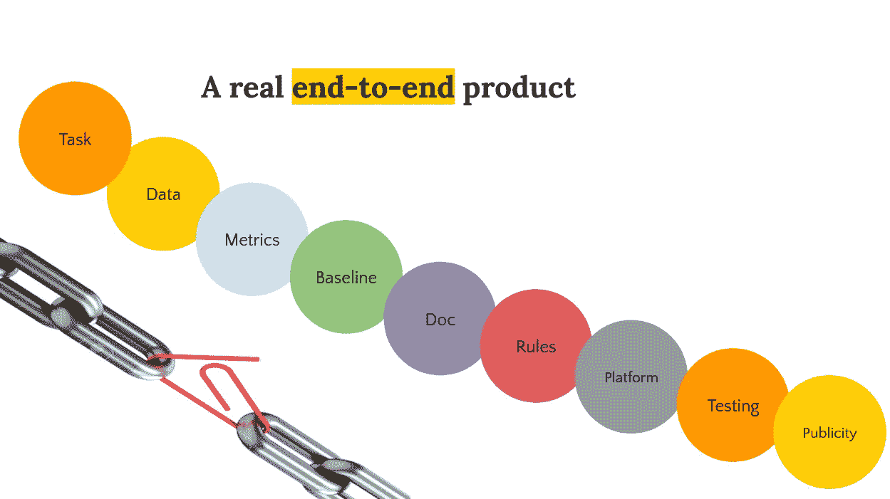
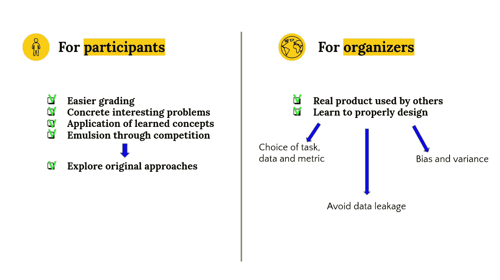
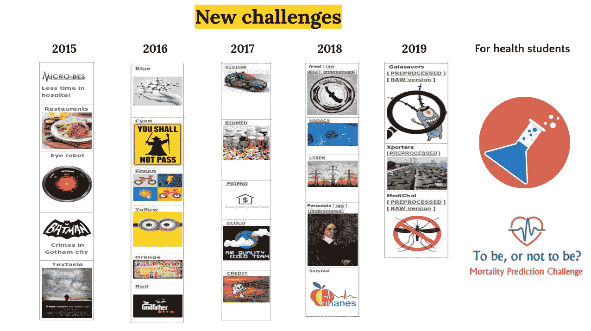

# 设计数据科学竞赛是一种很好的学习方式

> 原文：<https://towardsdatascience.com/designing-a-data-science-competition-is-an-excellent-way-to-learn-69e6fd582702?source=collection_archive---------51----------------------->

## [意见](https://towardsdatascience.com/tagged/opinion)

## 我们让学生们创造 ML 挑战，这就是他们所学到的

作者图片

在过去的几年里，作为国际合作的一部分，我们探索了让学生参与组织和参与挑战作为一种教学工具的好处。参与竞赛的设计和解决可以被视为学习适当的实验设计和分析以及更深入地理解机器学习的其他方面的动手手段。**南巴黎大学(法国巴黎)的研究生**参与**的班级项目，创建端到端的挑战**，从定义研究问题、收集或格式化数据、创建启动工具包，到实现和测试网站。数据的应用领域和类型极其多样:医学、生态学、市场营销、计算机视觉、推荐、文本处理等。由此产生的挑战然后**被用作本科生的课堂项目**，他们必须解决这些问题，无论是在南巴黎大学还是在伦斯勒理工学院(RPI，美国纽约)，以提供大规模的丰富学习体验。今年，学生们参与了由“AI for good”激发的挑战，并将创建可重复使用的模板来激励其他人为了人类的利益而创造挑战。

# 教学动机

在过去的几年里，挑战在教学中变得无处不在。例如，ka ggle“in class”有[数百场比赛](https://www.kaggle.com/competitions?sortBy=grouped&group=inClass&page=1&pageSize=20)。在教学中使用竞赛的好处包括激励学生和促进评分。然而，到目前为止，很少让学生参与竞赛的设计和实施。显然，这是一项更加困难的任务，最复杂的挑战可能需要几年的成熟和成熟研究人员的参与。然而，相对简单的竞赛，其难度水平可用于训练本科生，研究生可以很容易地设计和实施，作为课堂项目的一部分(通常是分类和回归问题，偶尔也解决推荐和强化学习问题)。

这使他们能够获得实验设计的实际操作，并通过定义油井任务和指标、收集和准备数据(确保有足够的样本且不存在偏差或数据泄漏)、准备基线方法，以及提出他们的挑战以吸引尽可能多的参与者来解决这些问题，来克服这些困难。

在这个过程中，学生还学习团队工作，满足严格的截止日期，并获得 Python 的编程技能，包括掌握 scikit-learn 和 Keras 等工具包，以及良好的编码实践，包括使用 Github 进行版本控制和使用 dockers。重点放在创建一个完全工作的端到端“产品”(一个挑战)，然后由真正的“客户”(本科生)使用。通过让研究生制作一个简短的广告视频，并在课堂上向本科生展示他们的挑战，本科生可以选择其中一个作为他们的项目，也强调了沟通的质量。

作者图片

自 2016 年以来，我们一直在开展这种类型的[教育项目。每年有 30 至 40 名研究生在数据科学硕士项目中提出挑战，约 100 名二年级本科生在 12 周的项目期内解决这些挑战。因此，我们已经通过这个项目培训了 500 多名学生。我们已经招募了几位校友作为更大研究挑战的共同组织者，这些挑战被选为 NeurIPS 竞赛计划的一部分，如](http://saclay.chalearn.org/) [TrackML 粒子物理挑战](https://sites.google.com/site/trackmlparticle/)和 [AutoDL 挑战](https://autodl.chalearn.org/)。

作者图片

# 社区影响

让研究生参与挑战的设计具有重要而深远的影响。随着当前人工智能研究和应用的快速增长，既有前所未有的机遇，也有对其潜在滥用的合理担忧。在这种情况下，提高学生对与研究设计和建模相关的良好数据科学方法的认识非常重要。认识到没有好的数据就没有好的数据科学，我们希望教育他们进行适当的数据收集和准备。我们的目标是灌输良好的实践，以减少因数据偏差或因缺乏数据导致的不可再现结果而导致的问题。我们还鼓励通过使用软件用真实的合成数据代替真实数据来保护数据的机密性或隐私。这有助于拓宽本科生接触具有商业价值或可能伤害个人的机密或私人数据的渠道。

在 [codalab.lri.fr](http://codalab.lri.fr) 和【codalab.lri.fr】的学生竞赛

今年，我们教育项目的一个新的补充方面是使用占位符数据(例如，如上所述的合成数据)，将已设计的挑战转化为简化的模板，并包括现成的入门解决方案。这种模板将展示各种各样的数据驱动的人工智能应用，以引发全球研究人员的想象力，而无需特定的人工智能专业知识。通过简单地克隆模板和替换数据，组织可以立即获得基线结果，并最终通过将挑战作为内部或外部竞赛来完善它们。为了促进这一进程，我们将免费提供我们的[开源挑战平台 Codalab](http://competitions.codalab.org) ，并将根据挑战组织者的优点和需求，在该平台上提供额外的计算资源。

除了便于其他讲师重复使用我们的挑战，传播我们的挑战模板也将有利于渴望将人工智能解决方案引入新领域的低预算企业家。最后，想要为“AI for good”做贡献的志愿者将有一个平台，通过克隆挑战模板来快速整合应用程序。我们相信这将是对 AI 民主化的重要贡献。

# 结论

教学生组织和参与机器学习竞赛，为他们成为数据科学家做好准备，同时帮助我们培养一个具有良好实践的挑战组织者社区，并传播挑战模板，这可以有助于传播 AI for all 和 AI for good。

# 承认

许多人参加了这个项目。伊莎贝尔·盖恩和克里斯汀·贝内特担任教师；迪维扬·卡兰塔恩和李生·孙·霍索亚为助教。我们非常感谢 Eric Carmichael 和 Tyler Thomas 开发和维护挑战平台 Codalab 以及教学工具 ChaLab 和 Chagrade，并感谢助教刘正英和巴尔萨扎·多农以及包括 Magali Richard、Guillaume Charpiat 和 Antoine Marot 在内的班级导师。该项目由 ChaLearn、Isabelle Guyon 的巴黎萨克莱大学“大数据”主席、欧盟 HADACA 项目(EIT Health)和联合卫生基金会(煽动项目，RPI，纽约)提供部分资助。

> a .帕瓦奥、d .卡兰塔恩、l .孙-霍索亚、k .贝内特和 I .盖永。实验设计与分析:教学中的挑战方法。 *CiML 工作坊，NeurIPS 2019。*