# 用 Python 设计要素选择管道

> 原文：<https://towardsdatascience.com/designing-a-feature-selection-pipeline-in-python-859fec4d1b12?source=collection_archive---------9----------------------->

## 用 PYTHON 进行机器学习

## 如此强大，以至于你的奶奶会试着用它来代替她那经验丰富的铸铁锅

汉斯·维维克在 Unsplash[上的照片](https://unsplash.com?utm_source=medium&utm_medium=referral)

**目的:**用 Python 设计开发特征选择流水线。

**材料和方法:**使用 Scikit-learn，我们为一个分类任务生成一个 [Madelon](http://archive.ics.uci.edu/ml/datasets/madelon) 样的数据集。我们的工作流程的主要组成部分可以总结如下:(1)生成数据集(2)创建训练集和测试集。(3)应用特征选择算法来减少特征的数量。

**硬件**:我们在配备英特尔酷睿 i7–8700 处理器(12 个 CPU，3.70 Ghz)和英伟达 GeForce RTX 2080 的工作站上训练和评估我们的模型。

**注意:**如果你是从零开始，我会建议你按照这篇[文章](https://medium.com/i-want-to-be-the-very-best/installing-keras-tensorflow-using-anaconda-for-machine-learning-44ab28ff39cb?source=post_page---------------------------)安装所有必要的库。最后，假设读者熟悉 Python、 [Pandas](https://pandas.pydata.org/?source=post_page---------------------------) 和 [Scikit-learn](https://scikit-learn.org/stable/) 。这篇文章的全部内容可以在[我的 GitHub](https://github.com/frank-ceballos/Designing-A-Robust-Feature-Selection-Pipeline-) 上找到。欢迎你来叉它。我不得不提到一些特征选择方法是从 Will Koehrsen 的文章中得到启发的。

**符号**:粗体文本将用于表示 Python 对象，例如列表、字典、元组、数据帧，或者将引用一个图形或脚本。`This notation will be used to represent classes and function parameters as well as Python packages.`

# 特征选择

*特征选择*是从更大的群体中识别特征的代表性子集的过程。用户可以选择手动选择功能，也可以应用多种自动方法中的一种。手动选择特征的困难在于它需要关于手边数据的专业知识。例如，在放射肿瘤学中，放射治疗计划(其中每个体素代表一个特征的 3D 图像)被简化为一系列手工制作的特征，并且被几十年的放射治疗研究和合作临床调查所支持。这些特征中的每一个都量化了放射治疗计划的具体特征，这些特征已经被证明与患者的临床结果相关。令人欣慰的是，用于特征选择的自动化方法已经被开发出来，并且可以很容易地用于减轻这项任务；然而，我们必须有保留地应用这些自动化方法，因为它们可能会导致错误的结论。根据我的经验，我认为应用特性选择方法的最佳方式是使用领域知识和自动化方法来确定一个有代表性的特性子集。

在机器学习的背景下，人们从特征选择中获得的优势是很多的。例如，找到最具描述性的特征可以降低模型的复杂性，使找到最佳解决方案变得更容易，最重要的是，它减少了训练模型所需的时间。此外，如果你理解了典型特征的含义，你将对你所面临的问题有更深的理解。在某些情况下，可以获得轻微的性能提升。必须注意的是，通过从系统中删除特性，您的模型的性能可能会稍微差一些(因为您试图用更少的信息进行预测)。

通常情况下，我们没有多余的时间来对我们的数据进行彻底的研究，以确定要制作什么功能以及如何使用它们。面对超过 1000 个特征的数据集，确定特征的代表性子集的任务似乎令人生畏，但幸运的是，冗余是我们的数据可以成为我们的朋友。通常，当面对具有+1000 个特征的数据集时，您会注意到很大一部分特征高度相关(冗余)，与结果无关，或者只是噪声。从开始的+1000 个特征中，您可能最终会有 10 个特征“充分地”代表了整个数据集。

在本文中，我们将讨论以下特征选择算法及其局限性:

*   一种过滤方法，可移除可变性很小的要素
*   移除高度相关要素的过滤方法
*   递归特征消除(RFE ),用于确定最大化模型性能所需的特征子集
*   确定与结果相关的特征子集的 Boruta 方法

# 安装必要的软件包

在深入本文之前，让我们安装必要的包。我们将假设读者已经安装了以下包的 Anaconda:`Numpy`、`Seaborn`、`Matplotlib`、`Pandas`和`Sklearn`。

你可能遗漏的唯一一个包是`BorutaPy`，所以让我们来处理它。打开您的终端(如果您在 Mac 上)或 Anaconda 提示符(如果您在 Windows 机器上)。激活您的环境并运行以下命令:

`conda install -c saravji boruta`

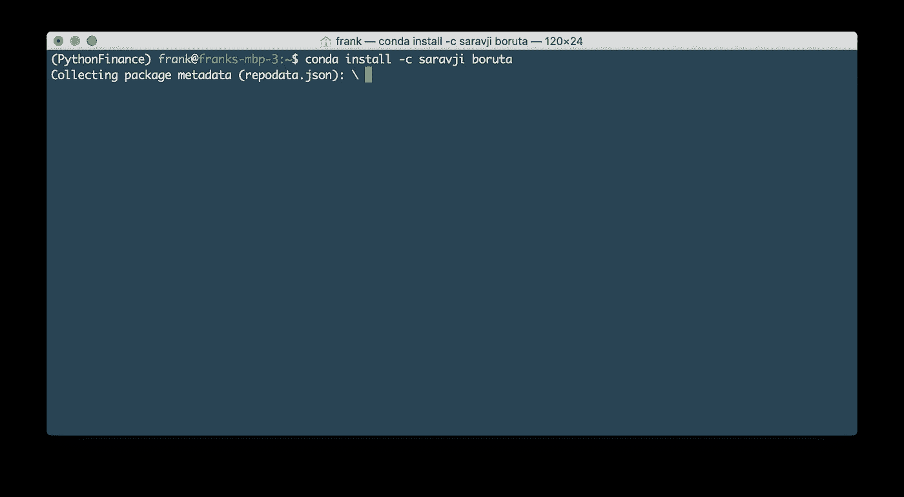

用 Mac 终端在名为 PythonFinance 的 Anaconda 环境中安装 BorutaPy。

你需要访问我的 GitHub [这里](https://github.com/frank-ceballos/Designing-A-Robust-Feature-Selection-Pipeline-)并下载工具文件夹。本文的全部内容都在名为 FeatureSelectionPipe.py 的文件中

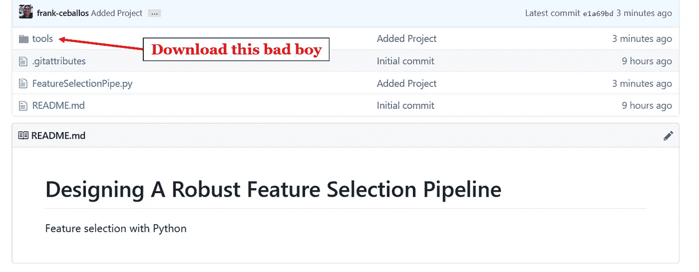

把 tools 文件夹放在你的工作目录下，你就设置好了。

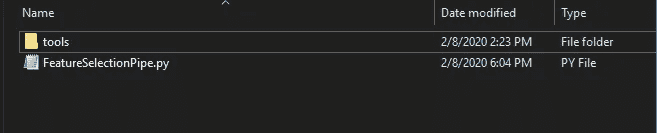

所以在我们开始之前，让我们导入所有的包。

**脚本 1** —导入所有必需的包。

# 数据

我们将创建多组合成特征，以探索不同特征选择算法的性能和有效性。首先，我们将生成一个类似 Madelon 的合成数据集。Madelon 数据集(我们不会使用)是一个人工数据集，它包含放置在边长为 1 的五维超立方体顶点上的 32 个簇。聚类被随机标记为 0 或 1 (2 类)。我们将生成的类似马德隆的数据集将包含 100 个特征，其中 10 个特征将提供信息，50 个将是冗余的(但提供信息)，25 个将重复，15 个将是无用的，因为它们将充满随机噪声。总共，我们将有 1000 个样品。为了给数据增加一点噪声，我们将随机翻转 5%的标签。第二组功能将包含 3 个关键的重要功能。通过自动特征选择算法来选择设计的关键重要特征应该是具有挑战性的。最后，最后一组特性只是将类似 Madelon 的特性和关键特性添加到一个更大的数据集中。

我们现在准备创建类似 Madelon 的数据。在**脚本 2a** 的第 4–9 行，我们定义了我们希望从每种类型中获得的特征数量(信息性的、冗余的、重复的、无用的)。之后，在第 12–16 行，我们创建列标签。从第 19–23 行开始，我们创建数据和标签。在第 27 行，我们将 numpy 数组转换成 pandas 数据帧。

**脚本 2a** —创建类似 Madelon 的数据集。

接下来，我们将创建我们至关重要的特性。这里，我们将假设经过几十年的理论、数值和经验研究，这三个特征已经被确定为对分类过程特别重要。为了更清楚地说明这一点，让我给你举个例子。在放射肿瘤学中，传递到器官的最大辐射可以与接受放射疗法治疗的患者所经历的毒性相关联。因此，为了确保对患者的安全治疗，考虑传送到每个器官的最大辐射量是至关重要的。为了便于说明，让我们假设在患者开始出现中毒症状之前，可以传递到膀胱的最大辐射可以是 100。所以我们的数据可能看起来像这样:

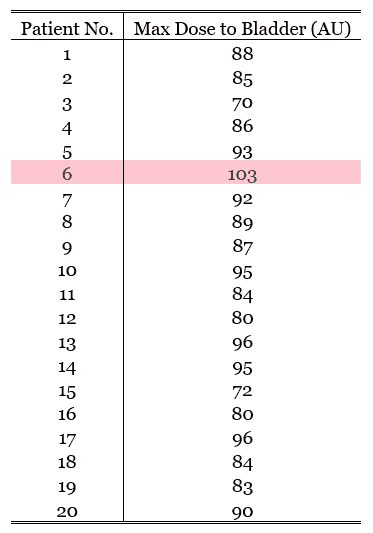

**表 1** —输送到膀胱的最大剂量。

因为医生知道对膀胱的大量辐射会导致并发症，所以产生的大多数辐射治疗计划将满足建立的最大辐射标准。然而，在**表 1** 中，6 号患者未能满足膀胱接受少于 100 次辐射的标准。换句话说，95%的数据符合标准，只有 5%不符合。因此，如果您要实现一种自动选择功能的方法，如果您不采取适当的预防措施，这种方法很可能无法识别膀胱的最大剂量至关重要。尽管如此，我们知道这样的特征是非常重要的，为了病人的安全，应该总是考虑到。因此，将极其重要的特征引入我们的数据集中以测试自动特征选择方法的效率的动机。

为了创建 3 个关键的重要特征，将从三个不同的高斯分布中提取，每个分布以不同的值为中心。这些特征将由我在 [StackOverFlow](https://stackoverflow.com/questions/36200913/generate-n-random-numbers-from-a-skew-normal-distribution-using-numpy) 中找到的以下辅助函数生成:

**脚本 2b** :生成关键重要特征的辅助函数。

在**脚本 2c** 的第 5–10 行，我们设置了关键特性分布的参数。然后在第 13–25 行，我们运行一个 for 循环，创建三个关键特性，然后存储在一个列表中(第 25 行)。我想指出的是，在第 15 行，我们修复了种子，这样我们就可以使用相同的发行版。

**脚本 2c** :创建三个关键特征。

在我们将这些关键特性添加到数据集**、**之前，我们需要定义 **y_critical** 目标。在**脚本 2d** 的第 5–7 行中，我们通过设置阈值来确定真假情况，从而为每个关键特性定义一个目标。选择这些阈值，使得每个关键特征包含 95%的阳性病例和 5%的阴性病例。最后，在第 10 行，我们通过乘以关键特性的目标来定义 **y_critical** 。

**脚本 2d** :创建每个关键特征的标签和 **y_critical** 标签。 **y_critical** 应该有 74 个阳性病例。

作为健全性检查，让我们可视化关键特性的分布。

**脚本 2e** :可视化关键特征。

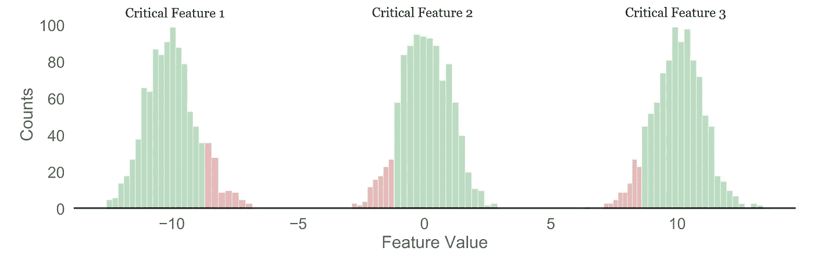

**图 1** —关键特征分布。绿色区域代表阳性类别，红色区域代表阴性类别。

从**图 1** 中，您会注意到有三种不同的高斯分布。最左边的分布代表第一关键特征，最中间的分布代表第二关键特征，最右边的分布代表第三关键特征。标记为绿色的区域表示每个要素中的阳性类别，标记为红色的区域表示阴性类别。

我们现在准备把所有东西放在一起。在**脚本 2f** 的第 12 行，我们连接了 **X_madelon** 和 **X_critical** 。然后在第 15–16 行，目标 **y_all** 被定义为 **y_madelon** 和 **y_critical** 的逐元素乘法。

**脚本 2f** :加入 **X_madelon** 和 **X_critica** l 创建 **X_all** 和创建 **y_all** 。

在我们继续之前，让我们回顾一下我们已经创建的一组功能:

**X_madelon:** 这是一组使用`make_classification()`类创建的合成特征。原则上，从该组中选择的最佳特征数量应该是信息特征(总共 10 个)。

**X_critical:** 关键特性一共 3 个。每个都具有不同平均值的高斯分布。每个关键特征包含 90 %的肯定案例和 10 %的错误案例。通过构造，这些特征可能很难通过自动化方法来选择；然而，对于一个对手头数据有领域知识的人来说，这些数据很容易被确定为对结果很重要。

**X_all:** 这是一组包含了 **X_madelon** 和 **X_critical** 特性的特性。该数据集的列将按如下顺序排列:

1.  **信息特征—第 1–10 列**:这些特征与结果高度相关，理想情况下应该是您选择的特征。
2.  **冗余特征—第 11–60 列:**这些特征通过线性组合具有不同随机权重的信息特征而形成。您可以将这些视为工程特性。
3.  **重复特征—第 61–85 列**:这些特征是从信息特征或冗余特征中随机抽取的。
4.  **无用特征—列 86–100:**这些特征充满了随机噪声。
5.  **关键重要特征—101–103 列**:这些特征具有高斯分布，我们将要求它们绝对需要包含在所选特征中。

在我们做任何其他事情之前，让我们分割我们的数据。对于每组功能，我们将使用 70/30 分割创建一个训练和测试集。

**脚本 2g** —将数据分割成 70 个训练/ 30 个测试分割。随机状态/种子被设置为 42。

# 探索性数据分析

在本节中，我们将可视化数据，以确认我们已经知道的内容。我们将从探索我们特征之间的相关性开始。在**脚本 3a** 中，我们首先计算[斯皮尔曼相关矩阵](https://en.wikipedia.org/wiki/Spearman%27s_rank_correlation_coefficient)，其值在-1 到 1 的范围内(第 5 行)。值 1 表示强正相关，值-1 表示强负相关。当相关值接近零时，这意味着特征之间不存在相关性。由于负相关和正相关只是相关，我们然后取相关矩阵的绝对值(第 5 行)并使用`seaborn`包创建热图(第 14 行)，参见**图 2** 。

**脚本 3a**—可视化 Spearman 相关矩阵。

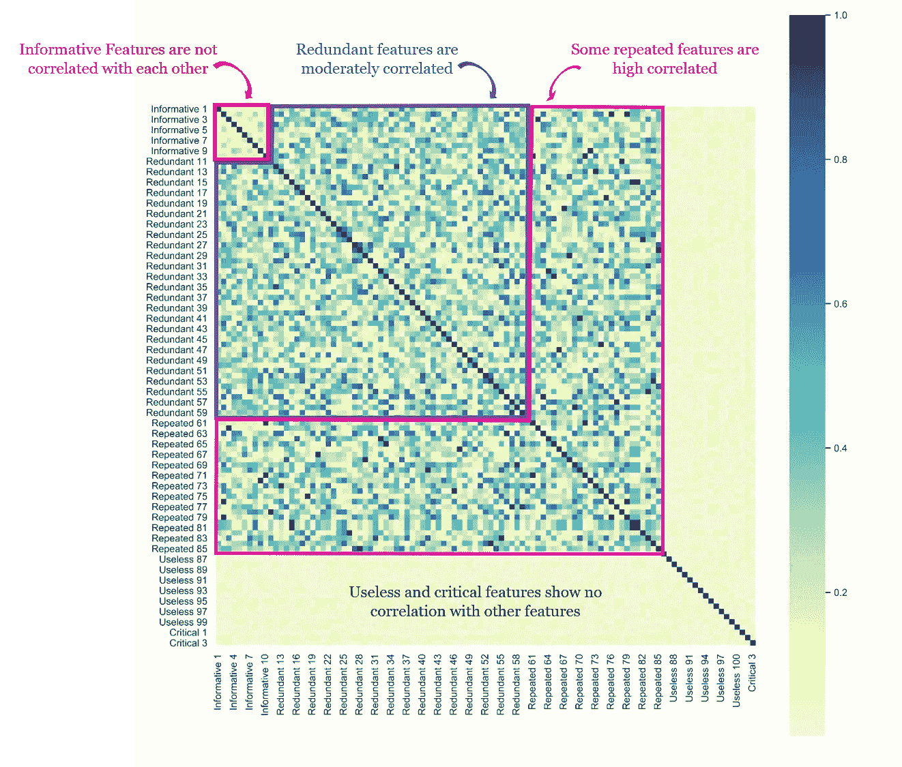

**图 2** —斯皮尔曼相关矩阵可视化为热图。注释是用 PowerPoint 添加的。

在**图 2** 中，浅色表示低相关性，深蓝色表示高相关性。请注意，信息特征之间的相关性很低(左上角)。冗余特征开始显示更高的相关性(热图在该区域变得更蓝)，就像我们预期的那样。此外，有些重复与我们预期的其他特征高度相关。最后，无用特征和关键特征与其他特征不相关。我们知道无用的特征充满了随机噪声，不应该与结果相关联。另一方面，关键特征与结果相关，尽管它们与其他特征没有相关性。

接下来，让我们使用箱线图来可视化每个特征的分布。箱线图显示了数据集的四分位数，并允许我们确定数据中的任何异常和异常值。在**脚本 3b** 中，我们首先设置图形样式，这样我们的图形(第 5–8 行)就不会有难看的灰色默认`seaborn`背景。然后，我们为特性 **X_all_** 系列创建一个方框图(第 14 行)。

**脚本 3b** —用箱线图可视化特征分布。

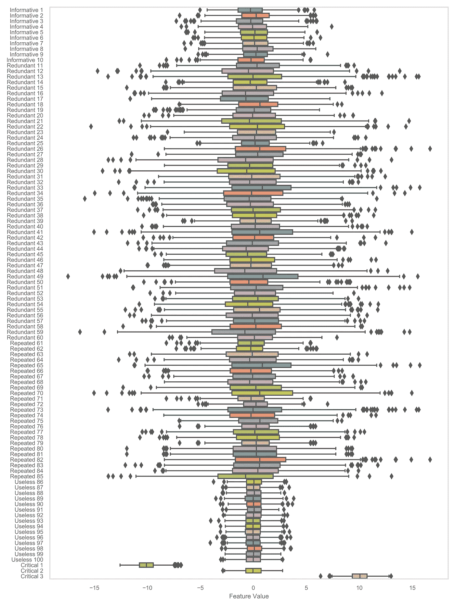

**图 3** —特征矩阵方框图。

在**图 3** 中，我们可以看到大多数特征都包含离群值。此外，所有类似马德隆的特征都以零为中心，并且大多数似乎具有高斯分布。关键特征以不同的平均值为中心，就像我们之前在**图 1** 中展示的那样。

# 特征选择

在本节中，我们将使用`FeatureSelector`，这是一个应用以下四种特征选择方法的工具:

1.  一种过滤方法，可移除具有给定比例重复值的要素。
2.  一种基于皮尔逊或斯皮尔曼系数移除相关要素的过滤方法。
3.  一种带有交叉验证的递归要素消除算法，用于对要素进行排序并确定最大化模型性能的要素。
4.  选择与结果相关的特征的 Boruta 方法。

该工具设计用于在给定的序列中应用不同的特征选择方法。例如，您可以首先移除相关要素，然后使用递归要素消除来进一步减少所选要素的数量。

**移除大部分常数值的特征**

有人可能会说，当你改变样本时，一个特性表现出的变化很小或者没有变化，对于一个模型来说是不太有用的。

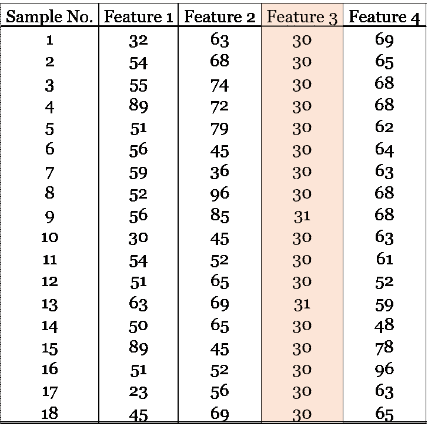

**表 2** —特征 3 显示可变性很小的样本数据集。

例如，如果您的数据看起来像右侧的表，则选择要素 1、要素 2、要素 4 并删除要素 3 是合理的。这是因为特征 3 的值在不同的样本之间变化不大。保留特性 3 会增加模型的复杂性，并且保留它很可能不会观察到任何预测性能。然而，最后一种说法需要经验验证。要建立阈值来标记包含大量常数值的要素，以便移除它们，您需要进行实验。仅仅因为一个特性在 90%的时间里包含相同的值，并不意味着它对一个模型没有用。

在**脚本 4a 中，**我们从导入特征选择工具开始。在第 7 行，我们定义了一个名为 **step1** 的字典，其中我们指定了要应用的特性选择方法及其参数。例如，要删除具有大部分常量值(95 %或更多)的特性，我们将键设置为`'Constant Features'`，将值设置为`{'frac_constant_values': 0.95}`。在第 10 行，我们将**步骤 1** 保存在一个名为**步骤**的列表中，然后我们启动一个`FeatureSelector`的实例(第 13 行)。`FeatureSelector`有一个`fit()`和`transform()`方法，很像 Sklearn transformer。`fit()`方法学习从训练集中选择哪些特征(第 16 行),而`transform()`方法将数据集减少到仅选择的特征(第 19 行)。`fit()`方法将以下内容作为输入:

*   X_all_train :熊猫数据帧
*   **y_all_train** :一个 numpy 数组
*   **步骤:**字典列表

`transform()`方法将以下内容作为输入:

*   一个熊猫的数据帧

**脚本 4a** —移除大部分常数值的特征。

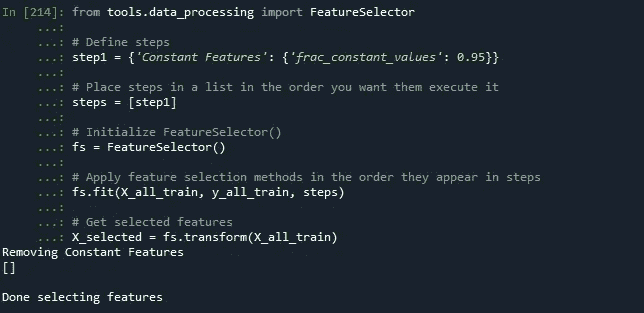

**图 4** —在 IPython 控制台中执行的脚本 4a。执行时间不到一秒钟。

`fit`的输出将被打印到被移除特征的控制台上。在这种情况下，您可以看到显示一个空列表，这表示在此步骤中没有删除任何功能。

**移除相关特征**

让我们假设，如果一组特征高度相关，我们可以随机选择其中一个，丢弃其余的，而不会丢失太多信息。为了衡量特征之间的相关性，我们将使用 [Spearman 的相关系数](https://en.wikipedia.org/wiki/Spearman%27s_rank_correlation_coefficient)。为了移除相关特征，我们将再次使用`FeatureSelector`。在**脚本 4b** 中，我们首先定义一个描述特征选择方法及其参数的字典。例如，在这种情况下，我们将键设置为`'Correlated Features'`，将值设置为`{'correlation_threshold': 0.95}`。该算法将对相关值大于或等于 0.95 的要素进行分组。然后，对于每组相关的特征，选择一个特征，其余的被丢弃。在第 8 行，我们将**步骤 1** 保存在一个列表中，然后初始化`FeatureSelector`的一个实例(第 11 行)。最后，我们拟合`FeatureSelector`，并转换我们的数据。

**脚本 4b** —移除高度相关的特征。

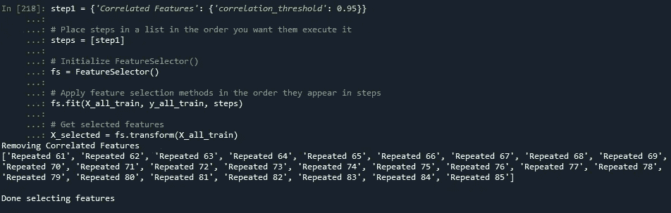

**图 5** —在 IPython 控制台中执行的脚本 4b。执行时间不到一秒钟。

注意`fit()`的输出显示所有的重复特征被移除。在我们继续之前，让我们通过检查`X_selected`中的特征类型来结束这一部分。

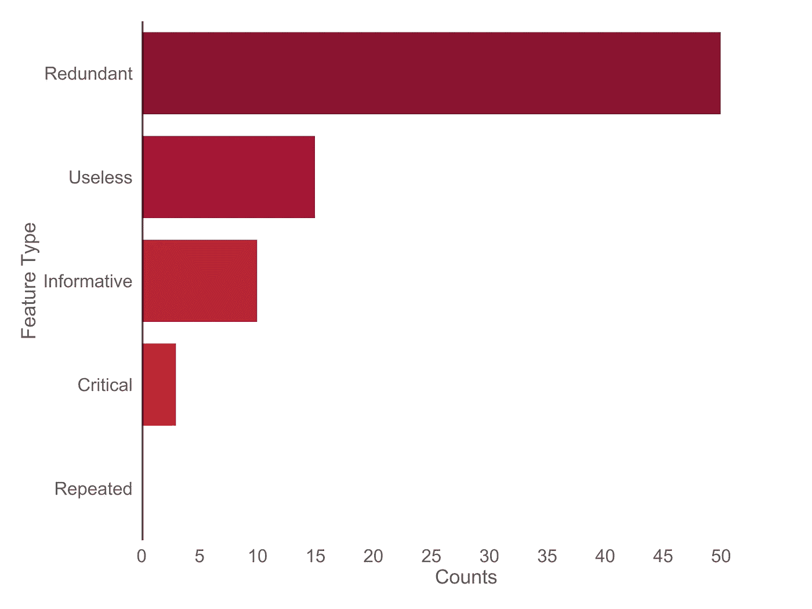

**图 6**——从 **X_all_train** 中去除高度相关特征后所选特征的条形图。

在图 6 的**中，请注意没有删除任何多余或无用的功能。换句话说，如果您仅从群组中移除相关特征，预计仍会有冗余和无用的特征。从积极的方面来看，我们看到 10 个信息性特征和 3 个关键性特征是所选特征的一部分。**

**确定相关特征**

我们已经表明，简单的特征选择方法可以快速执行，并可以从我们的队列中删除大部分特征；然而，其余的特征不一定与结果相关或者可能是多余的(见**图 6** )。为了克服这个限制，开发了 [BorutaPy](http://danielhomola.com/2015/05/08/borutapy-an-all-relevant-feature-selection-method/) 算法。简而言之，它使用基于树的模型的要素重要性属性来确定携带可用于预测的信息的要素。然而， [Terrence Parr](https://explained.ai/rf-importance/) 和其他人对基于树的模型的特征重要性属性的有效性提出了关注。

为了选择相关特征，我们首先定义一个基于树的 Sklearn 估计器(一个具有`feature_importances_`属性的[随机森林分类器](https://scikit-learn.org/stable/modules/generated/sklearn.ensemble.RandomForestClassifier.html)、[额外树分类器](https://scikit-learn.org/stable/modules/generated/sklearn.ensemble.ExtraTreesClassifier.html)、[梯度提升分类器](https://scikit-learn.org/stable/modules/generated/sklearn.ensemble.GradientBoostingClassifier.html))。在我们的例子中，我们将使用随机森林分类器，参见**脚本 4c** 中的第 5–7 行。接下来，在第 10–15 行，我们定义了一个名为 **step1** 的字典，带有一个键`'Relevant Features'`。`'Relevant Features'`的键值是一个字典，指定交叉验证结果的次数(第 10 行)和 BorutaPy 参数。对于每个训练文件夹，建立相关的特征。然后，在每个训练文件夹中被认为相关的特征被选择作为训练集中的相关特征。在第 15 行，我们修复了`random_state`，以便获得确定性的结果。至此，脚本的其余部分应该不言自明了。

**脚本 4c** —确定与结果相关的特征。

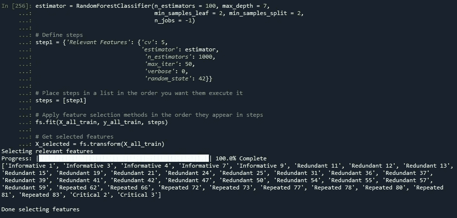

**图 7** —在 IPython 控制台中执行的脚本 4c。执行大约需要 5 分钟。

**脚本 4c** ，大约花了 5 分钟执行。如果你要增加`cv`、`n_estimators`或`max_iter`，期待时间的增加。此外，包含更多样本或特征的大型数据集将增加找出相关特征所需的时间。您在图 7 的**中看到的进度条将跟踪每次在训练文件夹中确定相关特征时的进度。所以，如果你一开始没有看到它填满，请耐心等待。**

我们准备检查所选特性的内容。

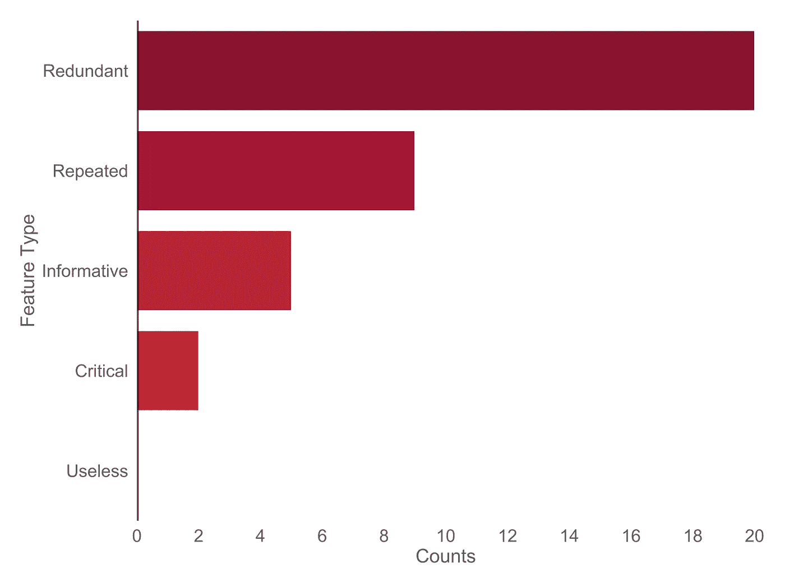

**图 8**——在 **X_all_train** 中确定相关特征后所选特征的条形图。在这种情况下，估计量是随机森林分类器。

在图 8 的**所示的条形图中，注意所有无用的功能都被删除了。这就是我们对 Boruta 算法的期望。尽管如此，我们仍然有 20 个冗余、9 个重复、5 个信息性和 2 个关键特征。这意味着我们的 Boruta 算法的实现不能去除所有冗余的特征，保留一些重复的特征，去除一半的信息特征，并丢弃一个关键特征。**图 8** 表明我们不能盲目相信自动化特征选择方法的结果。记住，我们要求所有三个关键特性都必须包含在我们选择的特性中。失去其中一个会导致致命的预言！此外，如果我们使用不同的估计器，例如额外的树分类器，所选择的特征将会不同(见**图 9** )。**

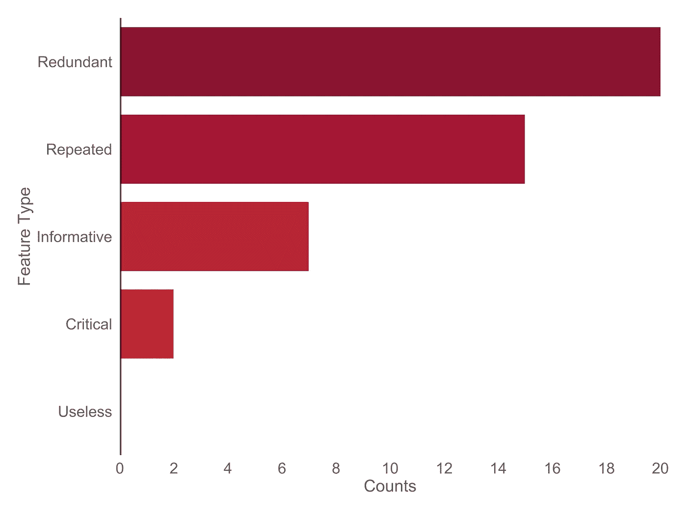

**图 9** —使用额外树分类器和 Boruta 算法确定相关特征后，所选特征的条形图。

当使用 Boruta 算法选择特征时，重要的是要记住被选择为相关的特征只对被检查的特定模型有意义。此外，当用于对特征进行排序的模型具有过度拟合的能力时，很可能特征的排序是误导的。为了演示过拟合随机森林的缺陷，我们训练了一个模型，并评估了它在训练集和测试集中的性能，参见**脚本 4d** 。

**脚本 4d** —训练一个过度适应的随机森林。

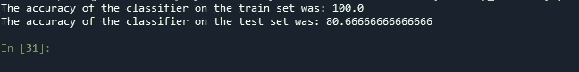

**脚本 4d** 的输出

这里我们可以观察到，训练集中随机森林的训练准确率为 100%。当评估测试集中的性能时，我们看到准确率下降到 80 %(显然我们过度拟合)。检查过拟合随机森林的特征重要性，发现许多无用特征(随机噪声)的等级高于有用和冗余特征，见**图 10** 。理想情况下，无用的功能应该排在最低的位置。

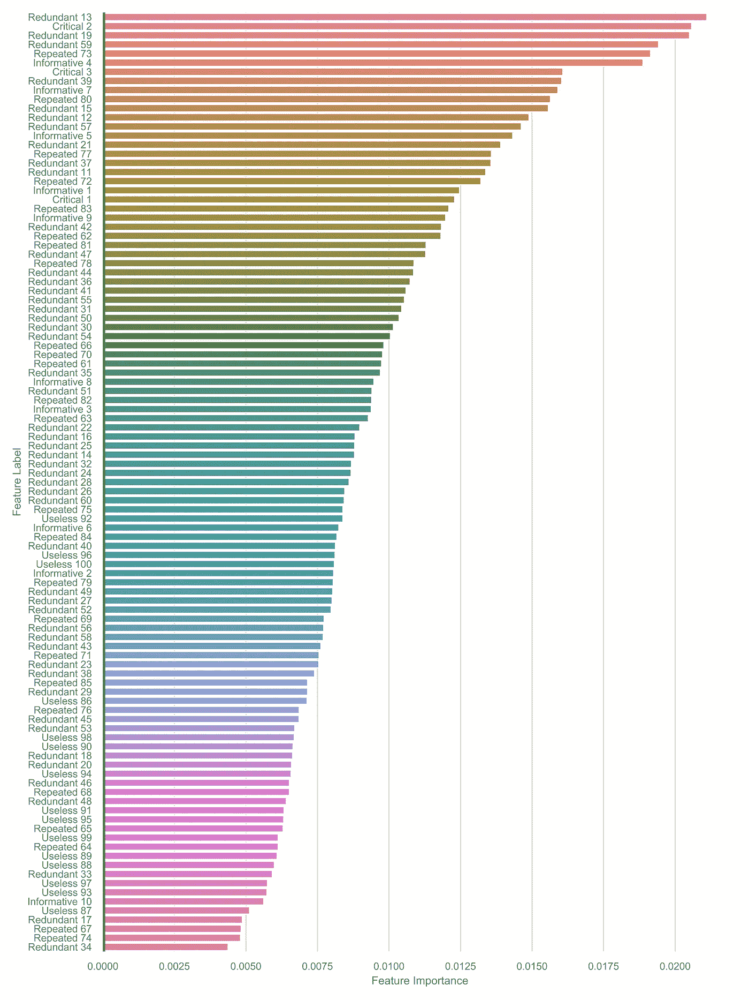

**图 10** —一个过度生长的随机森林的特征重要性。

鉴于过度拟合模型的排名特征不可靠，我建议首先调整您的模型，交叉验证结果，并评估其在训练和测试集中的性能，参见**脚本 4e** 。最小化过度拟合后，使用模型选择特征。

**脚本 4e** —调整分类器。要将 GridSearchCV 使用的折叠数更改为 10，请在第 19 行设置 cv = 10。同样，你也可以改变得分。执行大约需要 6 分钟。

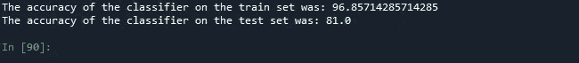

**脚本 4e 的输出**

结果表明，训练集的准确率为 96%，测试集的准确率为 81%。他妈的，我们还是太合适了！让我们检查一下调整后的随机森林是如何排列特性的，参见**图 11** 。

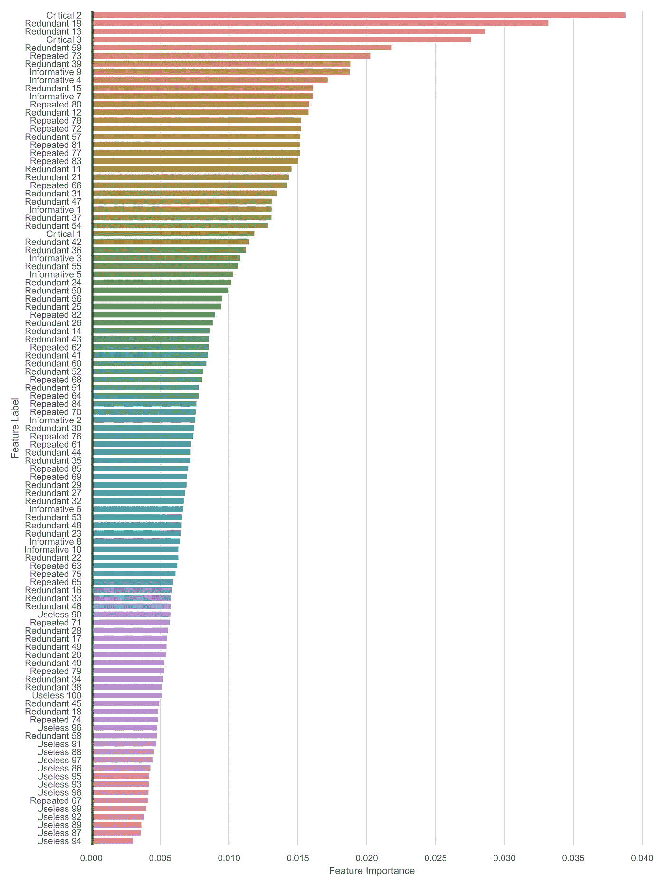

**图 11** —显示了调整后的随机森林的重要性。

有意思！我们得到了比预期好得多的结果。尽管调整后的随机森林过度拟合，但它在排列特性方面做得更好。例如，我们可以看到，关键的功能排名很高，而大多数无用的功能排名垫底。

要确定已调优随机森林的相关特性，请运行**脚本 4f** 。

**脚本 4f** —确定与优化随机森林的结果相关的功能。执行大约需要 5 分钟。

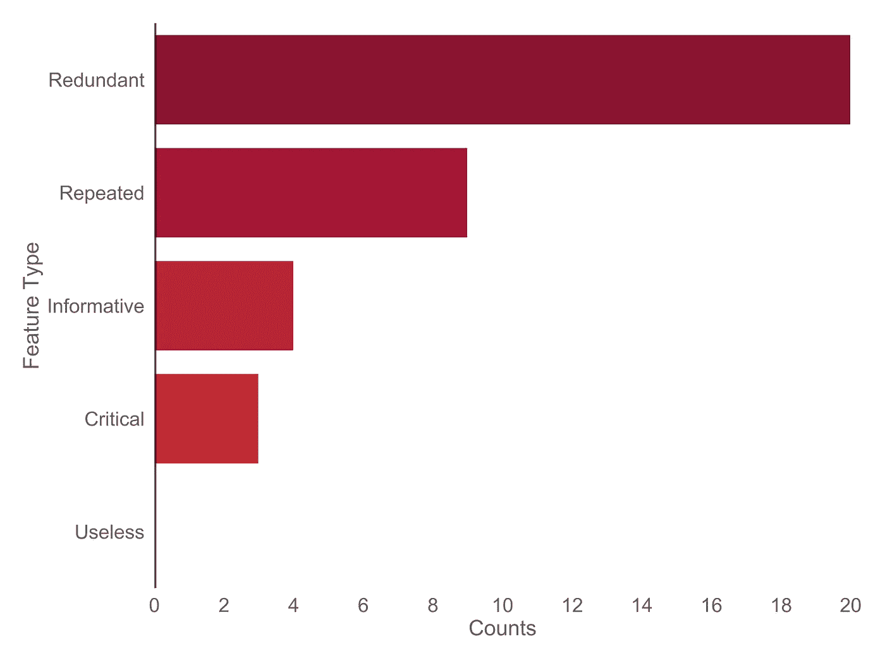

**图 12** —用调整随机森林的 Boruta 算法确定的相关特征的条形图。

在**图 12** 中，我们可以看到所选特征包含了对我们非常重要的三个关键特征。此外，请注意，与使用失调随机森林获得的结果相比，您可以更信任这些结果。

现在，我们将只使用选定的功能来训练一个随机森林，参见**脚本 4g** 。我们将随机森林的参数设置为之前在**脚本 4e** 中确定的参数。让我提一下，使用选择的特性来调整随机森林是一个好主意。记得当我们在**脚本 4e** 中调整随机森林时，我们使用了所有 103 个特性。现在选的特征大概有 35 个。然而，我们将跳过这一步，但你应该这样做。最后，我们将评估它在训练集和测试集中的性能。

**脚本 4g** —使用所选功能评估模型的性能。

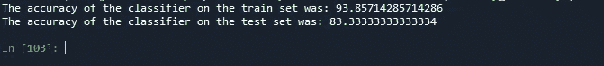

**脚本 4g** 的输出

在我们讨论结果之前，让我提醒你我们开始的内容。当训练具有所有特征的失调随机森林时，我们在训练集中获得了 100 %的准确度，在测试集中获得了 80 %的准确度。让我们称之为我们的基线。在“调优”随机森林(使特征排序更加可靠)，用 Boruta 算法选择特征，然后用选择的特征训练随机森林之后，我们在训练集中获得了 94%的准确率，在测试集中获得了 83%的准确率(见上面的**脚本 4g** 的输出)。我们可以从这些结果中得出几个结论:

*   调整你的模型以减少过度拟合。
*   经过优化的模型可以更准确地对功能进行排序。
*   应用特征选择方法有助于减少过度拟合并提高模型的性能。

尽管我们仍然有相当多的过度拟合，但我们已经在性能上取得了一些进展，我们减少了过度拟合，并且降低了模型的复杂性。我会说这是一场胜利，但还不够好。

**确定最大化模型性能的特征**

我们还可以通过应用递归特征消除(RFE)算法来选择特征。RFE 方法确定最大化模型性能所需的最小要素子集。然而，你冒着丢掉有意义的特性的风险——所以记住这一点。因此，如果您的任务是确定对结果重要的相关特征，那么使用 RFE 可能不合适。算法基本上是这样工作的。首先，训练一个可以使用数据集中所有可用要素对要素进行分级的模型。其次，衡量模型的性能。第三，对特征进行排序，并移除排序最低的特征。重复步骤 1 至步骤 3，直到所有功能都用尽。通过在跟踪模型性能的同时迭代移除特征，您可以确定实现最高性能所需的特征数量。

为了确定将最大化模型性能的特征，我们首先定义一个基于树的 Sklearn 估计器(一个[随机森林分类器](https://scikit-learn.org/stable/modules/generated/sklearn.ensemble.RandomForestClassifier.html)、[额外树分类器](https://scikit-learn.org/stable/modules/generated/sklearn.ensemble.ExtraTreesClassifier.html)、[梯度提升分类器](https://scikit-learn.org/stable/modules/generated/sklearn.ensemble.GradientBoostingClassifier.html))，具有`feature_importances_`或`coef_`属性。确保您的基本估计值不会过度拟合您的数据。在我们的例子中，我们将使用一个随机森林分类器，带有在**脚本 4e** 中找到的调整参数，参见**脚本 4h** 中的第 5–8 行。接下来，在第 11–15 行，我们定义了一个名为 **step1** 的字典，其中包含一个关键字`'RFECV Features'`。`'RFECV Features'`的键值是一个字典，指定交叉验证结果的次数(第 11 行)和其他 [RFECV](https://scikit-learn.org/stable/modules/generated/sklearn.feature_selection.RFECV.html) 参数。RFECV 对象是 RFE 方法的 Sklearn 实现，其中结果被交叉验证。至此，脚本的其余部分应该不言自明了。

**脚本 4h** —确定最大化分类器性能的特征。这将需要大约 5 分钟来运行。

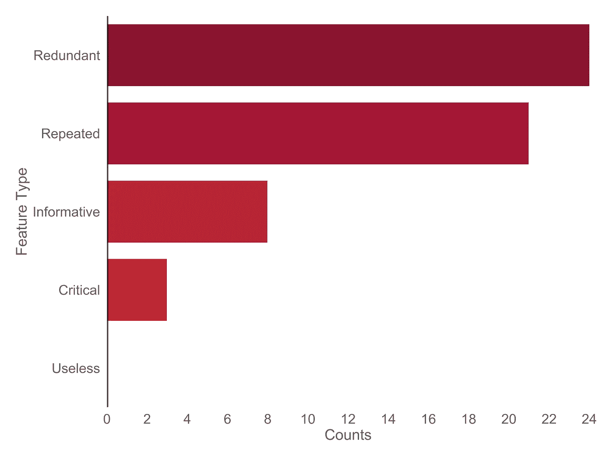

**图 13** —使用递归消除算法确定的最大化随机森林分类器性能的选定特征的条形图。结果是交叉验证的。

**图 13** 显示了由 Sklean RFECV 方法确定的选定特征。不幸的是，我们仍然有很多冗余和重复的功能。`FeatureSelector`类有一个`rfecv`属性，保存适合的 [RFECV Sklearn](https://scikit-learn.org/stable/modules/generated/sklearn.feature_selection.RFECV.html) 对象。通过检查拟合的 RFECV 对象的内容，可以更深入地了解 RFE 特征的结果。

**脚本 4f** —可视化 RFECV 的结果。所有这些代码都是为了做一个图形。呸！如果更改数据集或基本估计量，可能需要调整 xlim()、ylim()和 ax.axhline()。

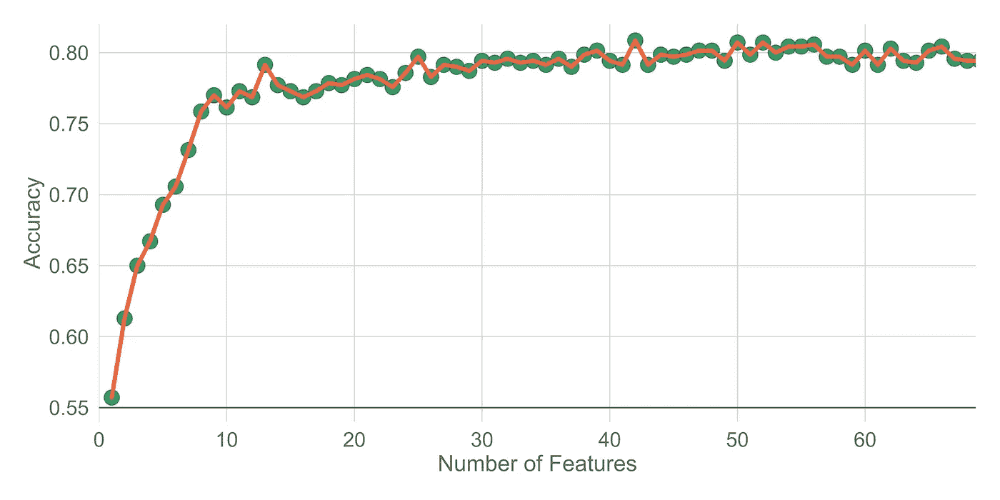

**图 14** —作为特征数量函数的精度。该模型的性能峰值约为 40 个特征。

在**图 14** 中，显示了模型的性能与多个特征的函数关系。如您所见，性能峰值约为 40 个特征，精度约为 0.80。由于所选特征的数量约为 50(见**图 13** )，我们可以得出结论，RFECV Sklearn 对象高估了我们最大化模型性能所需的最小特征数量。在我看来，如果你简单地选择排名前 13 位的特征，模型的准确率大约为 79%，你会更好。然而，RFECV Skelarn 对象确实为您提供了这些信息。如果你急于知道排名前 13 位的特性是什么，你将需要编写你自己版本的 RFE 算法。

# 构建特征选择管道

在上一节中，我们了解到我们需要谨慎和警惕自动特征选择方法的危险。通过应用它们，然后盲目地相信结果，你可能最终会犯下可怕的错误。此外，没有一个单一的特征选择算法产生了我们想要的结果——只选择了信息和关键的特征。

为了改进我们的特征选择，我们可以将特征选择算法作为一系列步骤来应用。例如，我们可以首先移除中度到高度相关的特征(第 11 行)，然后应用 RFE 方法，如**脚本 5a** 所示。

**脚本 5a** —特征选择管道。首先，移除中度到高度相关的特征。然后，确定最大化模型性能的特征。

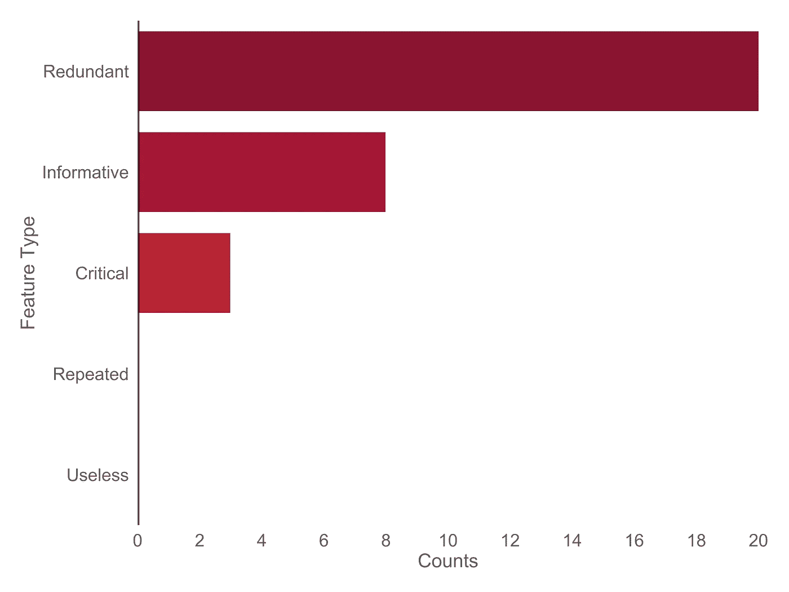

**图 15** —使用递归消除算法确定的最大化随机森林分类器性能的选定特征的条形图。这一次，我们首先移除中度到高度相关的特征，然后应用 RFE 方法。

这一次，在所选功能中，我们有 8 个信息性功能、所有 3 个关键功能和 20 个冗余功能。这些是迄今为止我们得到的最好的结果，但是让我们再深入研究一下。请记住，`FeatureSelector`对象将适配的 RFECV 对象保存在其`rfecv`属性中。

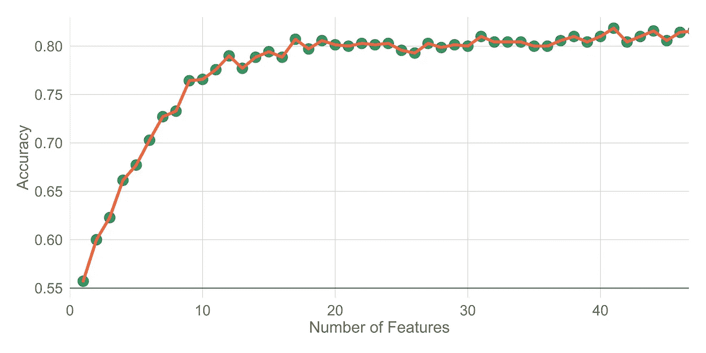

**图 16 —** 作为特征数量函数的精度。该模型的性能峰值约为 20 个特征。

因此，我们已经可以从性能曲线中看到，模型的性能在 20 个特性附近达到峰值。此外，我们可以得出结论，15 个特性将足以获得高性能。现在，我们使用**脚本 5b** 中的选定功能来评估模型的性能。

脚本 5b —具有选定特征的模型评估。

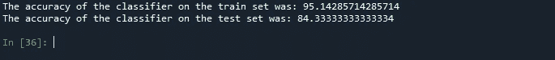

**脚本 5b** 的输出

从**脚本 5b** 的输出中，我们可以看到我们将训练集中的准确率提高到了 84%。我们缓慢但确实取得了进展。您可以使用**脚本 4e** 再次调优该模型，看看您是否能获得更多的性能增益。

# 结束语

那么，我们究竟如何设计一个特征选择管道，以产生所有的信息和关键特征，而没有多余或无用的特征呢？嗯，简单的回答是我不知道。如果你想解决这个问题，你可以把你的算法带到银行去。你应该问的问题是，“我真的需要确定最有用的特征，还是我想用最小的特征子集来训练模型？”如果你的答案是“确定最有用的特性”，那么这里介绍的方法将有助于你寻找最佳特性。然而，如果你只关心用较小的特征子集训练最好的可能模型，这里给出的特征选择算法将完成这项工作。

如果您想使用特征选择工具，请确保您的工作目录中有该工具，如下所示:

从 [my Github](https://github.com/frank-ceballos/Designing-A-Robust-Feature-Selection-Pipeline-) 下载功能选择工具。

在使用它选择特征之前，请确保满足以下条件:

*   加载数据并对所有分类变量进行编码。
*   注意任何缺失值或异常值。如果不这样做，您可能会得到一个严重的错误。
*   将特征矩阵 **X** 存储到 pandas DataFrame 对象中。目标变量 **y** 应该是一个 numpy 数组。

准备好数据后，您可以使用**脚本 6a** 来指导您的特性选择过程。您将需要试验来确定应用什么特征选择算法。在**脚本 6a** 中，我们首先调整我们的模型(第 5–29 行)，然后我们定义四种特征选择方法并应用它们(第 32–56 行)。然后，我们使用选定的特征来训练模型并评估其性能(第 59–75 行)。

**脚本 6a** —模型调整、特征选择、模型训练和评估。

在 [LinkedIn](https://www.linkedin.com/in/frank-ceballos/) 找到我。下次见！小心每天编码！

 [## 弗兰克·塞瓦洛斯

### 图表

www.frank-ceballos.com](https://www.frank-ceballos.com/)  [## Frank Ceballos -威斯康星医学院博士后| LinkedIn

### 我是威斯康星医学院的博士后研究员，在那里我分析高维复杂的临床数据…

www.linkedin.com](https://www.linkedin.com/in/frank-ceballos)  [## 弗兰克-塞瓦洛斯-概述

### 在 GitHub 上注册你自己的个人资料，这是托管代码、管理项目和构建软件的最佳地方…

github.com](https://github.com/frank-ceballos)