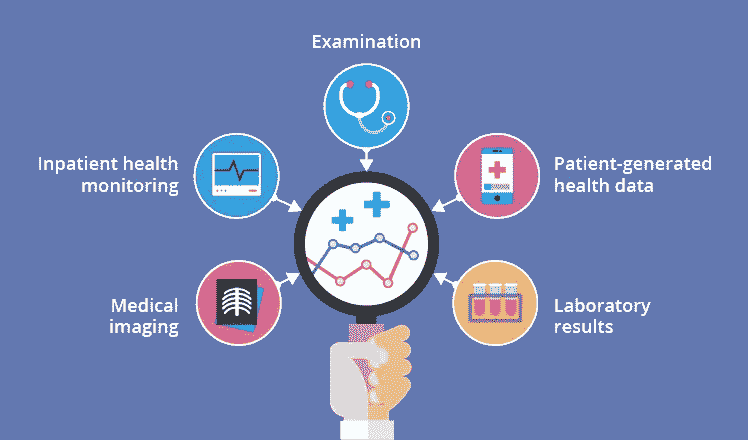
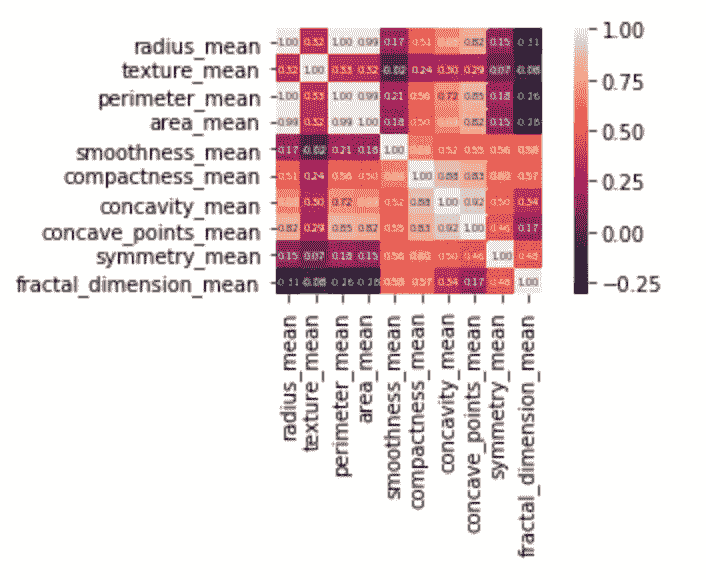
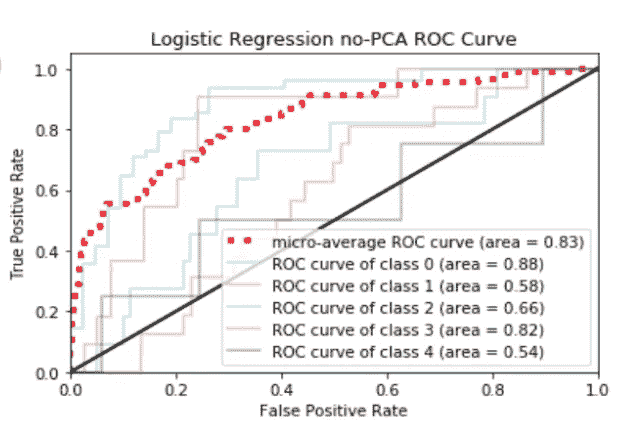

# 设计医疗保健机器学习工作流程

> 原文：<https://towardsdatascience.com/designing-a-healthcare-machine-learning-workflow-2f95852a8b80?source=collection_archive---------28----------------------->

图片来自[格鲍尔公司](https://www.gebauer.com/blog/medical-data-management-system)

## 只需 5 个步骤即可构建和运行机器学习项目

随着机器学习、云计算和机器人流程自动化等创新在医疗领域不断产生影响，结构化(即电子医疗记录)和非结构化(即医学图像、生物信号等)的需求不断增加。)公众可访问的医疗保健数据。由于工业界和学术界的许多个人和组织都在尝试创建学习模型，因此了解如何设计一个适合您正在处理的数据和问题类型的合适的机器学习工作流至关重要。这导致一个有组织的，有效的产品，产生预期的结果。

# 第一步:理解问题

在争论数据和构建模型之前，定义问题是很重要的。大多数缺乏经验的数据科学家希望快速获得数据，执行一些基本的 EDA，然后解决他们想要解决的问题。在行业和学术环境中，明确定义的问题和操作计划为项目的其余部分奠定了基础。为了知道你是否应该处理平衡的数据或者寻找异常值，拥有一些领域的专业知识是很重要的。

 [## 贝叶斯决策理论简介

### 机器学习的统计方法

towardsdatascience.com](/introduction-to-bayesian-decision-theory-1532376ef986) 

医疗保健领域的机器学习问题有三个主要类别:诊断、预测和建议。虽然机器学习中有许多类型的问题，但这三个问题包含了医疗保健中的大多数问题。

## 诊断

医疗保健 ML 中最常见的应用是诊断，也称为分类。这种受监督的学习方法能够在给定一组描述其症状的特征的情况下，确定患者是否患有特定疾病。这些特征可以以表格数据、医学图像、文本或信号的形式呈现。在某些情况下，目标是在两个类别之间进行诊断(即二元分类)；然而，有时需要考虑多个类别(即多类别分类)。

## 预言；预测；预告

另一种监督学习方法，预测寻求回答与数量、可能性和任何其他连续结果相关的问题。与如何进行诊断类似，预测会尝试拟合训练数据，以确定最佳可能答案。这一类别可以进一步扩展到生存分析、线性回归和时间序列预测等主题。

## 推荐

这一类别近年来越来越受欢迎。它利用组合学的力量向给定系统的用户推荐感兴趣的项目。健康推荐系统能够根据患者的症状和情况提出最佳的行动计划。建议的范围可以包括服用何种药物、去看医生或去哪家医院。这是一个非常强大的工具，但它没有与上述类别相同的评估标准。

图片由 [ScienceSoft](https://www.google.com/url?sa=i&url=https%3A%2F%2Fwww.scnsoft.com%2Fblog%2Fhealth-data-analytics-overview&psig=AOvVaw1GZL6JJS0KXpjIEa68s64I&ust=1586725789780000&source=images&cd=vfe&ved=0CA0QjhxqFwoTCOjB78uk4egCFQAAAAAdAAAAABAf)

# 第二步:收集数据

一旦问题确定下来，计划开始实施，就该讨论适当的数据了。医疗保健行业每天都会产生大量的数据。临床数据是大多数健康和医学研究的主要资源。它要么是在持续的患者护理过程中收集的，要么是正式临床试验计划的一部分。最常见的例子是电子健康记录(EHR)，它从多个来源收集有关患者健康的信息。EHR 包括测试结果、临床观察、诊断、当前健康问题、患者服用的药物、他们经历的程序。同样，文本和图像数据也开始在深度学习应用中发挥深远的作用。例子包括医学图像、手写处方和医生笔记。

由于医疗保健数据生态系统极其复杂和强大，无论您决定使用什么数据，都可能会有很高的存储要求。在你简单地从网站上下载一个随机的 CSV 文件之前，一定要检查你正在使用的文件的大小。聪明的方法是利用云。有许多公司提供廉价、用户友好的软件即服务(SaaS ),可以部署云数据库。现在，您所要做的就是从您正在使用的 IDE 中提取信息。

# 步骤 3:探索性数据分析(EDA)和预处理

## 数据清理

由于许多 EHR 系统仍然是手动创建和更新的，因此存在人为错误和数据质量问题。花时间清理您的数据将最终为您节省大量处理、培训、测试和评估问题的时间。正确的数据清理管道包括通过删除或修改不正确、不完整、不相关、重复或格式不正确的数据来为分析准备数据。许多初级数据科学家只是删除不干净的数据。相反，尝试操纵和扩充数据，以尽可能多地保存数据。

## 电子设计自动化(Electronic Design Automation)

在开始构建 ML 模型之前，创建信息可视化、统计测试和针对数据和手头问题的关系矩阵是很重要的。EDA 是了解关键特征的一个窗口，如类不平衡、特征分布和相关系数。虽然有些人认为这是浪费时间，但成功的工作流具有支持模型输出的可视化。

相关矩阵

## 特征抽出

既然您已经了解了要素之间以及要素与目标要素之间的关系，那么就应该选择能够最好地包含数据中的差异而又不会显著增加模型复杂性的要素。有许多方法可以选择最佳特性，但这超出了本文的范围。

# 步骤 4:构建和培训

决定采用哪种模式并不是一个容易的决定，它需要大量的试验和错误。每个模型都是独一无二的，需要在复杂性和效率之间取得平衡。根据没有免费的午餐定理，没有一个模型对所有可能的情况都是最好的，所以最好尽可能多的测试。

> “没有一种模式能适用于所有可能的情况”

即使某个模型适用于您以前的项目，也并不意味着相同的模型将是您当前项目的最佳选择。最重要的是，数据科学家首先是科学家。因此，尝试各种可能的方法是我们工作的一部分。一旦你对自己的选择有了信心，就该在测试集上运行它了。

## 监督学习

到目前为止，监督学习(SL)模型是最常见的类别，它使用带有精确标签的先验数据进行训练。因此，模型应该理解底层的类条件特征空间。一些常见的 SL 算法包括逻辑回归、K-最近邻、支持向量机和随机森林。

## 无监督学习

使用未标记的数据，无监督学习(UL)模型被迫寻找数据中的自然关联。这消除了对训练阶段的需要，而是使用数学过程来推导分组、不同的表示和层次。常见的 UL 算法包括 K 均值、降维、层次聚类和基于密度的聚类。

## 半监督学习

灰色区域与之前的类别相比，半监督学习(SSL)模型使用标记和未标记数据的混合来进行分类或预测。这是因为模型需要正确理解已标记数据的结构，以理解未标记数据。SSL 方法的一个常见应用是欺诈检测。由于欺诈很难发现，而且我们不知道谁是欺诈性的，因此模型需要了解非欺诈实体的复杂性，以便发现异常实体。

# 步骤 5:评估模型

根据您要解决的问题的类型，可以使用特定的评估指标来深入了解您的模型的运行情况以及可能需要调整的超参数。评估一个模型是一个整体的方法，并不仅仅基于高准确性。根据您在步骤 1 和 2 中定义的问题和执行的分析，可能还有其他更重要的指标。

## 分类指标

*   准确性:在我所有的预测中，有多少是正确的？
*   精确度:在我对某个类所做的所有预测中，有多少是正确的？
*   回忆:正确识别某一类的比例是多少？
*   受试者工作特征(ROC)曲线:显示不同分类阈值下模型性能的图。曲线下面积(AUC)代表模型整体性能。

具有 AUC 值的 ROC 曲线

## 回归度量

*   均方差(MSE):预测值和实际值之间的平方差
*   均方根误差(RMSE):MSE 的平方根
*   平均绝对误差(MAE):预测值和实际值之差的绝对值

## 排名指标

*   平均倒数排名(MRR):基于第一个相关项目位置的平均值
*   平均精度(MAP):对于每个相关项目，根据该项目的位置计算精度，然后对所有用户进行平均
*   标准化贴现累积收益(NDCG):假设一些项目比其他项目更相关，计算加权平均值。

# 结论

为医疗保健环境开发和实现机器学习不是一个快速的过程，但我希望这篇文章为您了解可能会遇到的障碍奠定了基础。请记住，即使您构建了模型并且运行良好，您仍然需要部署它。虽然部署机器学习系统在实践中非常简单，但医疗法规和控制要求您采取某些措施来确保标准化和质量保证。

# 相关文章

 [## 检测医疗欺诈(第一部分)——数据采集和预处理

### 了解医疗事故的特点以及需要什么技术来检测欺诈的医生

medium.com](https://medium.com/swlh/detecting-medical-fraud-part-1-data-acquisition-preprocessing-e8f3206b9bac)  [## 检测医疗欺诈(第 2 部分)—在 PyTorch 中构建自动编码器

### 学习如何使用神经网络发现腐败的医生

medium.com](https://medium.com/swlh/detecting-medical-fraud-part-2-building-an-autoencoder-in-pytorch-5ef64b7979ef)