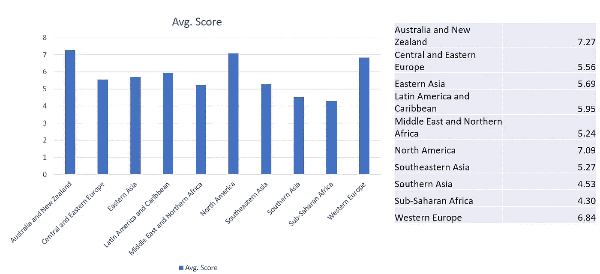
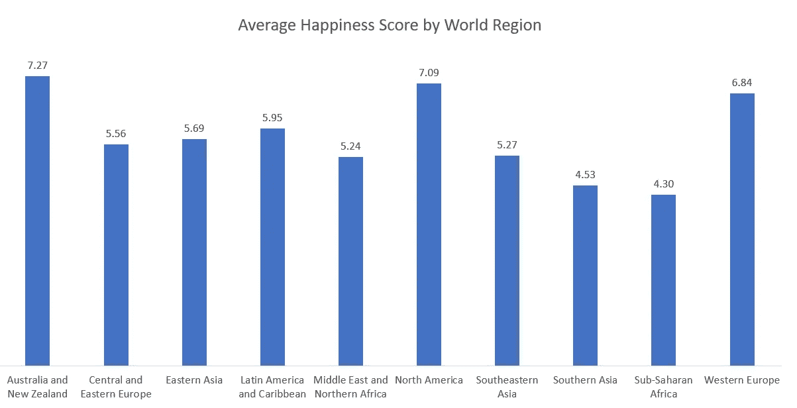

# 设计实用且引人注目的数据可视化

> 原文：<https://towardsdatascience.com/designing-a-practical-and-compelling-data-visualization-dbf2446ba083?source=collection_archive---------48----------------------->

## [现实世界中的数据科学](https://medium.com/towards-data-science/data-science-in-the-real-world/home)

## 你不需要成为 Tableau 或 PowerPoint 超级用户。

数据可视化是**向技术和非技术受众传达数据的最有力的方式**。这也是分析中最“理所当然”的部分。很少有分析师接受过数据可视化最佳实践的正式培训。

更糟糕的是，像 PowerPoint 和 Excel 这样的应用程序的默认选项设计得很差；当它们应该被视为一个起点时，它们被视为可接受的或首选的。

数据可视化的目的是让查看者快速和*轻松*地从数据中提取最重要的信息。我发现很难找到一个非教科书式的资源，专注于利用心理学和人类行为知识的数据可视化的实用的、以业务为中心的最佳实践。大部分内容都是平面设计或者是为口头表达而设计的。

然而，对于当今的分析专业人员来说，这种差距就是大多数演示文稿存在的地方——您的内容需要做的不仅仅是“看起来不错”,必须足够直观，能够在幻灯片或仪表板中独立存在，并且应该足够清晰，能够快速提取出正确的信息。

我最近完成了我的[商业分析硕士](https://business.wfu.edu/masters-in-business-analytics-online/)项目中的一门课程，重点是视觉影响。其目的是弥合上述差距。它是关于如何通过设计获得关注，并将其应用到商业展示中。

为了说明最佳实践，我将从默认的 PowerPoint 图表和表格开始，回答一个简单的问题:**2019 年世界上哪个地区最幸福？**

# **删除默认设置的所有内容**

你曾经(或通常)见过类似这样的幻灯片吗？

默认 PowerPoint 图表和表格

图表和表格包含了回答问题所需的所有信息，但什么也没有弹出。有一个平淡无奇的条形图，不伦不类的标题，和文本表格。为了回答哪个地区最幸福，我需要直观地比较澳大利亚、北美和西欧，然后参考右边的表格来比较数值。

让我们也考虑几个其他项目:

*   为什么我们需要一个标有每个数字的 y 轴？没有数字低于 4，我们在右边有数字值。
*   既然我们只有一组值，我们还需要默认添加的颜色图例吗？
*   倾斜区域值呢？对于第一次看图表的人来说，这是一个很高的认知负荷。
*   为什么值按字母顺序排列？
*   背景网格线是有帮助还是分散注意力？

几个简单的清理步骤解决了上述问题，并开始改进图表设计。

y 轴被移除，并且值被添加到每个条的顶部。通过在顶部添加标签，我们可以删除右边的表格，增加的空间允许我们加宽图表并删除倾斜的部分，而不减小字体大小。图例也被删除，图表标题也有所改进。总之，除了酒吧本身和国名，所有东西都被拿走了。

现在回答我们的问题更容易了，但并不容易。

# **减少认知负荷**

收集正确的数据和选择正确的图表是交流数据的关键步骤，但我们可以做得更多。我们将添加[预先注意](https://www.interaction-design.org/literature/article/preattentive-visual-properties-and-how-to-use-them-in-information-visualization)属性，这是我们可以对可视化进行的微妙改变，以使我们最重要的信息“流行”。我们还将调整图表，使其具有反映我们思维方式的更传统的顺序，即从左到右。

注意使用的预先注意的属性:颜色/阴影、粗体、文本大小

上图有几个重要的变化:

*   对于色觉缺陷的人来说，蓝色的默认颜色是具有挑战性的。包容性设计意味着我们应该假设至少有一个观众会受到影响。如果你公司的品牌指导方针允许的话，宁可选择非蓝色。
*   我们通过颜色的预先注意属性将注意力吸引到最高平均分上。就我个人而言，我觉得一种颜色在灰色值的映衬下会很流行。还要注意，除了澳大利亚以外，数据标签的颜色都是灰色的。
*   接下来，仍然在标签上，澳大利亚的数据标签的大小已经增加，以显示除了粗体以外的层次结构，以吸引对值的进一步注意。

> 查看图表的观众知道应该看哪里，即使他们还不知道正在回答的问题。

**把它带到终点线**

信息弹出，我们已经创建了一个逻辑顺序。最后，请记住，我们试图告诉某人 2019 年哪个地区最幸福。这不是一个盛大的信息发布会，所以当我们可以把信息和数据一起给他们时，我们为什么要依赖他们来回答这个问题呢？

我们可以给出一个信息性的标题，而不是描述性的图表标题。对于标题，这意味着数值代表平均幸福分数，所以我们可以删除图表标题。我还将除澳大利亚和新西兰之外的所有地区都变灰了，因为我们对哪个地区是第二、第三等等不感兴趣。

你可能会问，如果我们给出了答案，为什么还要包括其余的数据，这是公平的。它为澳大利亚的价值提供了背景，当信息呈现在观众面前时，观众往往会对答案感到更舒服，而不是认为你给出的答案是理所当然的。

我在底部添加了一个来源，因为我们并不总是知道谁会收到我们的数据，以及他们想用这些数据做什么；添加源减少了您以后可能会收到的额外问题。即使对于内部演示文稿和数据，从何处收集信息也可以帮助您的受众(也可以帮助您在将来的某个时候再次引用这些数据)。

# **把它放在一起**

之前和之后

这个例子既戏剧化又非常真实。看看你最近看过的演示文稿。它看起来更像顶部视觉还是底部？你会对你最近看过的视频做哪两项改进？

**我能给**的最重要的建议是删除默认添加到视觉效果中的每一条额外的信息和图表设计，并添加最少量的信息来传达你的信息。然后，使用颜色、大小、粗体、间距和其他预先注意的属性来增强你的信息。

仔细检查你创造的每一个视觉效果是需要努力的，但是看到它所产生的改进的讨论和你工作的改进的结果也是非常令人满意的。

*对数据可视化感兴趣？你有什么想法要分享吗？欢迎在 LinkedIn* *上与我联系，或者在 jordan@jordanbean.com 给我发邮件。*